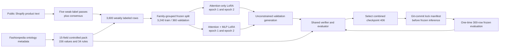

# Teaching Qwen2.5-1.5B to tag an apparel catalog with LoRA-SFT

**Status:** SFT experiment complete through checkpoint selection, pre-evaluation locking, and one-time frozen evaluation. This brief intentionally stops at SFT; later work is out of scope.

## The post in one sentence

On a frozen 300-product evaluation set, combined attention-plus-MLP LoRA raised Qwen2.5-1.5B's conditional macro-F1 from 0.197 to 0.641, made all 300 outputs parseable JSON, and reduced verifier-rule violations from 1,204 to 12.

## Executive summary

We trained two controlled LoRA variants of the same Qwen2.5-1.5B-Instruct model: attention-only and attention plus MLP. Product variants were kept in the same split, epoch count was chosen using only a 360-product validation set, and the winning checkpoint was cryptographically locked before it saw the frozen test set.

| decision or result | evidence |
|---|---:|
| selected arm | attention + MLP, rank 16 |
| selected checkpoint | `runs/sft-combined-2epoch/checkpoint-406` |
| trainable parameters | 18,464,768 (1.18% of the base model) |
| validation macro-F1 | 0.854, versus 0.751 attention-only |
| frozen macro-F1 | 0.641, 95% bootstrap CI 0.626–0.671 |
| zero-shot conditional macro-F1 | 0.197, 95% bootstrap CI 0.161–0.213 |
| paired macro-F1 improvement | +0.444 observed; 95% bootstrap CI +0.425–+0.496 |
| schema-valid outputs | 62.7% zero-shot → 100% SFT |
| fully vocabulary-valid outputs | 0% zero-shot → 88.7% SFT |
| rule violations | 1,204 zero-shot → 12 SFT |

The result is a strong controlled improvement, not a production-accuracy claim. Only 78 individual evaluation cells received explicit human review, so most frozen labels still reflect the weak-labeling model.

## Why this project exists

The project is a controlled catalog-tagging task for apparel listings. Given text from a product page—title, brand, category, description, and merchant tags—the model must emit one JSON object with 15 controlled fields, such as garment category, material, fit, pattern, closure, and occasion.

The broader project is built around one idea: the same verifier should serve training experiments and the production path.

1. During model development, it scores a generated answer mechanically.
2. In the production path, it acts as a QA gate before a catalog record is accepted.

That means “correct” is not a fuzzy prompt instruction. It has a concrete definition in code: valid JSON, expected keys and shapes, controlled vocabulary compliance, and declarative cross-field rules.

## What was completed before Week 2

Week 1 created the measuring instrument that makes a structured-output comparison meaningful.

- A pack-agnostic schema/verifier exists under `verifier/`.
- The apparel pack has 15 fields, 156 controlled values, and 34 cross-field rules (25 explicit, 9 derived from applicability metadata).
- The data contains 3,600 weakly labeled training rows, a frozen 300-row evaluation set, and a 100-row production-style probe set.
- The evaluation harness reports per-attribute metrics, macro-F1, schema validity, vocabulary validity, and rule violations.
- The evaluation set is checksummed and tagged `eval-v1`, so accidental edits fail the harness rather than silently changing the scoreboard.

One design choice matters especially: `null` and `"unknown"` are different.

- `null` means a field does not apply. A pair of pants has no neckline.
- `"unknown"` means the field could apply, but the listing does not provide enough evidence. A listing may omit the color.

This makes abstention a first-class model action. A model should not receive credit for pretending a missing fact is inapplicable.

### Data and ontology provenance

The product text came from public Shopify `/products.json` endpoints and was collected across multiple apparel retailers. The feed fetcher used round-robin per-store quotas, filtered to apparel using category aliases, and pruned tags that appeared on nearly every product from the same store. Direct measurement of the final 3,600-row training file found 49 brand strings, 297 merchant category strings, and 537 empty descriptions (14.9%), so titles, categories, and merchant tags sometimes carry the entire signal.

Weak labels were produced by `gpt-5.6-luna@prelabel-v1` using five prompt perturbations per product and consensus metadata. Fashionpedia supplied ontology metadata—not product images or Fashionpedia annotations. The checked-in ontology records its source URL and BSD-3-Clause API license; the 15-field retail vocabulary is a documented merge and extension of that ontology. Public merchant text remains subject to the originating sites' terms, so this corpus should be treated as an experimental research artifact rather than a redistributable benchmark.

## An actual SFT training example

For a listing titled “Organic Cotton Pull On Pant,” the model receives a compact system instruction plus text such as:

```text
Title: Organic Cotton Pull On Pant
Brand: NAADAM
Category: Woven Pants
Description: The Organic Cotton Pull On Pant is a warm-weather essential in
100% organic cotton ... the easy elastic waist makes every occasion feel effortless.
Tags: 100% cotton, Bottoms, elastic, full length, pant, summer, ...
```

Its target is one JSON record:

```json
{
  "closure": "pullover",
  "collar_type": null,
  "colour_primary": "unknown",
  "details": ["unknown"],
  "fit": "loose",
  "garment_category": "pants",
  "material": "cotton",
  "occasion": "casual",
  "sleeve_length": null
}
```

The real target contains all 15 fields. The verifier confirms that this exact output is structurally valid, uses only permitted vocabulary, and violates no rules.

This is supervised fine-tuning in its plainest form: show the model many examples of “catalog text in, controlled JSON out.” The objective is not to make a grand claim about intelligence. It is to teach a small model the format, vocabulary, and task behavior required by this catalog contract.

## A necessary warning about labels and evaluation

The training labels are weak labels from a frontier model, not ground truth. The correction import touched 126 flagged cells across 111 frozen-evaluation rows: 78 cells across 75 rows were reviewed by a human, while 48 cells were machine-adjudicated. Only the 78 human-reviewed cells are eligible for the reliability calculation. Row-level `human_corrected` is therefore a historical field name, not a claim that all 15 cells in each of those 111 rows received human inspection. Most of the 4,500 evaluation cells still equal the frontier model's original answer.

That creates two constraints on how results should be written:

- Absolute scores are not trustworthy claims of real-world accuracy. A “99%” agreement number would be partly tautological.
- Deltas between models scored against the same frozen set are still useful. The zero-shot and SFT comparison is meaningful under the shared evaluator even though the absolute accuracy has caveats.

The reliability file is deliberately marked `usable: false`: the reviewed sample is too small to support trustworthy per-attribute weighting. Its zero weights mean “insufficient evidence,” not that those fields are worthless.

## The SFT experiment: two LoRA arms

The experiment compared two ways of adapting the same Qwen2.5-1.5B-Instruct base model.

| Arm | LoRA targets | Rank | Purpose |
|---|---|---:|---|
| A | Attention projections: Q, K, V, output | 16 | Cheap baseline that adjusts how the model connects information across tokens. |
| B | Attention projections plus MLP projections: gate, up, down | 16 | More adaptable baseline that can change both information routing and internal transformations. |

Everything else stays constant: base model, training data, deterministic split, seed, batch configuration, learning rate, sequence budget, and maximum epochs. This is an ablation, not a scavenger hunt for the best-looking number.

The stronger arm became the locked SFT checkpoint reported in this brief.

## LoRA in plain language

Full fine-tuning changes every number in the original model. LoRA freezes the base model and adds small trainable adjustment paths beside selected layers.

For a typical 1,536-by-1,536 model layer, full fine-tuning would change about 2.36 million numbers. A rank-16 LoRA update instead learns two thin tables:

- 1,536 numbers wide down to 16;
- 16 numbers back up to 1,536.

Together, that is about 49,000 trainable numbers for that layer—about 2% of the full layer.

The 1,536 width is part of Qwen’s original architecture. It is the size of the internal representation carried by each token through much of the model. The rank 16 is our choice: it determines the size of LoRA’s narrow adjustment path.

The model computes both paths and adds them:

```text
original frozen layer output + small learned LoRA adjustment = layer output
```

Before training, the architecture calculation predicted about 18.5 million trainable parameters for combined rank-16 LoRA. The measured count was 18,464,768, so that prediction was accurate. The initial file-size estimate was not: it assumed two-byte bf16 saves, while PEFT actually wrote the adapter tensors as four-byte fp32 values. Measured adapter weight files were therefore 17.5 MB for attention-only and 73.9 MB for combined LoRA. Recording both the prediction and correction is more useful than silently rewriting the estimate after the run.

## Preventing product variants from leaking into validation

A naïve random split would make validation look better than it is. Retail feeds
often contain many versions of nearly the same product:

```text
Everyday Tote | Red (XL)
Everyday Tote | Black (M)
Everyday Tote | Navy (L)
```

If the red tote trains the model while the black tote tests it, the model has
already seen nearly the same title, description, category, and expected tags.
That measures recognition of a sibling product more than generalization.

The split therefore operates on product families, not individual rows. A family
key combines the normalized brand with a conservative base title:

- lowercase the title;
- remove punctuation and extra whitespace;
- remove variant text after spaced separators such as ` | `, ` / `, or ` - `;
- remove trailing parenthetical size text;
- compare titles only within the same normalized brand.

For example, all 57 color and size versions of Thursday Boots' `Everyday Tote`
become one family:

```text
Thursday Boots + everyday tote
```

Likewise, these American Giant products become one 22-row family:

```text
Women's Classic Cotton V-Neck Tee - Black
Women's Classic Cotton V-Neck Tee - Pearl Blue
Women's Classic Cotton V-Neck Tee - Pine Bark

→ American Giant + womens classic cotton v neck tee
```

A unique listing such as `NAADAM + Organic Cotton Pull On Pant` has no matching
variants and forms a one-row family.

The 3,600 rows break down as:

```text
1,764 one-product families       → 1,764 rows
  491 multi-product families     → 1,836 rows
---------------------------------------------
2,255 total product families     → 3,600 rows
```

Every family is assigned wholly to training or validation. The method is
deliberately conservative rather than broad fuzzy matching: two brands can both
sell a “Classic Tee” without those products being treated as the same family.

Grouping alone was not enough. The first deterministic family split put only
3.4% of bag rows and 7.1% of shoe rows into validation, so it was rejected before
training. The final split assigns whole families while targeting roughly 10% of
each garment category. It contains 3,240 training rows and 360 validation rows;
the major categories now land near the target—for example, shoes at 10.0%, bags
at 9.4%, dresses at 10.1%, and pants at 10.1%.

The frozen split manifest records the seed, grouping rule, source-data checksum,
category counts, and exact SKU assignments. Both LoRA arms must reuse it.

## How long did SFT train?

The answer was not “a magic number of steps.” We used a held-out validation slice from the weak training data to choose duration.

- 90% of the 3,600 weak rows train the model.
- 10% are held out as validation data through the frozen grouped-family split.
- The frozen 300-row evaluation set is not used to choose an epoch.
- Each arm was evaluated after one epoch and again after a continuous second epoch.

After each epoch, we inspected weak-validation loss and generated-output behavior: complete JSON, vocabulary/rule compliance, and whether outputs became more useful rather than merely repetitive. Both arms earned their second epoch under those criteria.

The two arms were compared only on the grouped validation set. Combined checkpoint 406 won that comparison, was recorded in a Git-committed selection manifest, and only that locked checkpoint was run once on the frozen 300-product set. The frozen set was never used to choose an arm or epoch.

The goal was not merely the lowest token loss. Generated JSON validity, controlled-vocabulary compliance, cross-field rules, coverage, and macro-F1 all participated in the checkpoint decision.

## Practical constraints that shape the experiment

The training machine is an RTX 3090 with 24 GB of VRAM and roughly 5.3 GB of free disk space.

- The selected Qwen2.5-1.5B-Instruct checkpoint is already cached on the machine.
- Measured training-data lengths: prompt p95 is 268 tokens, prompt maximum is 585, and target maximum is 118.
- The fully rendered prompt-plus-target maximum is 833 tokens, so SFT uses a 896-token ceiling; the earlier 768-token estimate would have clipped seven rows.
- Only two checkpoints per experiment arm should be retained. Adapter-only saves preserve the learned LoRA changes for evaluation without storing expensive optimizer state.

An optimizer is the training component that decides how each learned number should change after an error. Its saved state is not part of Qwen’s attention architecture; it is extra per-parameter bookkeeping. Omitting it means a run cannot resume with exactly the same training momentum, but the saved adapter still loads and evaluates normally. For this short two-epoch baseline, adapter checkpoints plus experiment metadata are the more useful trade-off.

## End-to-end flow



The companion [interactive epoch flow](sft-epoch-flow.html) traces the method and file calls inside one training epoch.

## Exact reproducibility configuration

The same compact system message was used for SFT and inference. It named all 15 keys, required one JSON object, defined `"unknown"` versus `null`, and prohibited extra prose. It deliberately did not list all 156 allowed values: learning the closed vocabulary was part of the task rather than free information repeated in every prompt.

```text
You label clothing products from their listing text.

Answer with a single JSON object, one key per field:
closure, collar_type, colour_primary, details, fit, garment_category,
garment_length, material, neckline, occasion, pattern, silhouette,
sleeve_length, sleeve_style, waistline.

Rules:
- "details" is a list; every other field is a single value.
- Use "unknown" when the text does not say. Never guess.
- Use null when the field cannot apply to this kind of product.
- Output only the JSON object, nothing else.
```

| setting | value |
|---|---|
| base model | `unsloth/Qwen2.5-1.5B-Instruct` |
| sequence length | 896 tokens |
| base precision | bf16; no 4-bit loading |
| LoRA rank / alpha / dropout / bias | 16 / 16 / 0 / none |
| attention targets | `q_proj`, `k_proj`, `v_proj`, `o_proj` |
| combined additions | `gate_proj`, `up_proj`, `down_proj` |
| gradient checkpointing | Unsloth mode |
| train / eval batch per device | 4 / 4 |
| gradient accumulation | 4; effective train batch 16 |
| optimizer | fused AdamW |
| learning rate | 0.0001 |
| warmup / schedule | 5% warmup, cosine decay |
| epochs / optimizer steps | 2 / 406 |
| loss | completion tokens only |
| sequence packing | disabled |
| precision | bf16 enabled, fp16 disabled |
| seed / data seed | 42 / 42 |
| checkpoint policy | save each epoch, keep two, model only |
| inference | greedy, unconstrained, batch 8 |
| inference limits | 640 input tokens, 170 new tokens |

The remote environment was an NVIDIA RTX 3090 with 24,576 MiB VRAM, driver 590.48.01, CUDA toolkit 13.0, and compute capability 8.6. Exact Python packages were: PyTorch 2.11.0 (`+cu130` build observed on the box), Transformers 4.57.6, TRL 0.24.0, PEFT 0.19.1, Unsloth 2026.7.5, Datasets 4.3.0, Accelerate 1.14.0, Safetensors 0.8.0, and W&B 0.28.1.

Code and small evidence artifacts were synchronized through a bare Git remote on
the GPU host. Commits—not ad hoc file copies—defined the code used for each run;
large adapters stayed under `runs/`, while manifests recorded their paths,
sizes, and SHA-256 hashes. ComfyUI remained installed on the same machine but
used only about 420–428 MiB while idle; training and generation loaded the model
sequentially, so the dual-use setup did not create a practical VRAM conflict.

Representative commands, run from `/workspace/tagging-rl`, were:

```bash
HF_HOME=/workspace/.hf_home PYTHONPATH=. /venv/rl/bin/python -m training.train_sft \
  --arm attention --epochs 2 --output-dir runs/sft-attention-2epoch --report-to wandb

HF_HOME=/workspace/.hf_home PYTHONPATH=. /venv/rl/bin/python -m training.train_sft \
  --arm combined --epochs 2 --output-dir runs/sft-combined-2epoch --report-to wandb

HF_HOME=/workspace/.hf_home PYTHONPATH=. /venv/rl/bin/python -m training.predict \
  --model unsloth/Qwen2.5-1.5B-Instruct \
  --adapter runs/sft-combined-2epoch/checkpoint-406 \
  --input data/eval_300/eval.jsonl \
  --output runs/sft-combined-2epoch/frozen-eval-300-predictions.jsonl \
  --batch-size 8 --max-input-length 640 --max-new-tokens 170 --local-files-only

PYTHONPATH=. /venv/rl/bin/python -m evalharness.report \
  --gold data/eval_300 \
  --pred runs/sft-combined-2epoch/frozen-eval-300-predictions.jsonl
```

### What the five-step attention-only smoke test actually proved

This was an integration test, not a quality experiment. Its purpose was to prove
that the model, grouped data split, LoRA setup, optimizer, validation pass, and
adapter save all work together before paying for a full epoch.

The smoke run used 64 rows from the frozen training split and 32 from validation.
The GPU processed four examples at a time and accumulated four micro-batches
before each optimizer update, giving an effective batch size of 16:

```text
5 optimizer steps × 16 examples = 80 example-visits
```

Because the smoke subset contains only 64 training rows, the fifth update begins
a second pass. The run therefore ended at 1.25 smoke-subset epochs. These small
subsets are not guaranteed to represent the full data distribution; they exist
to test the machinery.

#### Where 4,358,144 trainable parameters came from

Qwen has 28 transformer blocks. Attention-only rank-16 LoRA attaches to four
projections in every block:

| projection | LoRA parameters per block |
|---|---:|
| Q | 49,152 |
| K | 28,672 |
| V | 28,672 |
| attention output | 49,152 |
| **total** | **155,648** |

Across all blocks:

```text
155,648 × 28 = 4,358,144 trainable LoRA parameters
```

The loaded model, including its adapters, contained 1,548,072,448 parameters:

```text
4,358,144 / 1,548,072,448 × 100 = 0.2815%
```

So the run changed only 0.28% of the model; the other 99.72% remained frozen.
Unsloth independently printed both counts when it constructed the model.

#### What “five optimizer steps completed” means

The trainer reached 100%, ran validation, exited successfully, and saved the
adapter. Its progress matched the expected effective batch size:

```text
step 1 → 0.25 smoke-subset epoch
step 2 → 0.50
step 3 → 0.75
step 4 → 1.00
step 5 → 1.25
```

This confirms that micro-batching and gradient accumulation behaved as intended.

#### Why the gradients looked healthy

The gradient norm measures the combined strength of the proposed updates to the
trainable parameters.

| step | gradient norm |
|---:|---:|
| 1 | 0.541 |
| 2 | 0.574 |
| 3 | 0.592 |
| 4 | 0.606 |
| 5 | 0.568 |

All five were nonzero, so a learning signal reached LoRA. They were finite—no
`NaN` or infinity—and stayed in a narrow 0.54–0.61 range below the default
clipping threshold of 1.0. In this context, “healthy” means no dead, exploding,
or numerically broken gradients appeared in the short run. Five steps cannot
prove that gradients would remain healthy for a full epoch; the later complete
runs supplied that evidence.

#### How to read the training and validation losses

The five training losses were:

```text
0.4419, 0.5103, 0.4988, 0.4640, 0.4749
```

The trainer reported their average as `0.477982`. Loss here measures how
surprised Qwen was by each correct next JSON token, calculated only on assistant
answer tokens—not the system or product prompt.

The values should not descend smoothly because each update contains different
products, and five updates are too few to establish a trend.

After step five, the trainer evaluated 32 validation rows in eight batches of
four and reported `eval_loss = 0.460474`. That confirms the validation pipeline
works; it does not prove generalization. There was only one measurement, the
sample was tiny, and predictable JSON punctuation and field names can lower
token loss without making the tags correct. The full run subsequently evaluated
all 360 validation rows after each epoch.

#### GPU memory: what was and was not measured

The run completed without an out-of-memory error, CUDA crash, or numerical
failure, and GPU use returned to ComfyUI's 428 MiB idle footprint afterward.
That proves this configuration fits on the RTX 3090 for the smoke test.

Peak VRAM was not recorded for this first smoke test, so it would be inaccurate
to claim exact smoke-test headroom. The later full runs did log peak allocated
and reserved GPU memory.

#### Why the adapter was 17.5 MB instead of the estimated 9 MB

The saved adapter weight file was exactly 17,462,432 bytes. The measured size
follows directly from the trainable parameter count:

```text
4,358,144 parameters × 4 bytes per fp32 number ≈ 17.43 MB
```

The small remainder is file metadata. The earlier ~9 MB estimate assumed the
adapter would be stored in bf16 at two bytes per number. PEFT saved these adapter
tensors in fp32, doubling that estimate.

The complete adapter directory occupied about 32 MiB because it also contained
the tokenizer:

```text
adapter weights        17.5 MB
tokenizer.json         11.4 MB
vocab.json              2.8 MB
merges.txt              1.7 MB
small configuration files
```

Disk tools mix decimal MB and binary MiB, so the displayed directory total does
not add up identically to the decimal file sizes. The machine still reported
5.3 GB free before and after the smoke run; a 32 MB artifact is too small to
change that rounded display.

#### W&B status

The smoke deliberately used local logging with `report_to=none`. Separately, the
W0 run log shows that this machine loaded W&B credentials, authenticated, created
a run, and synchronized it successfully. Both full attention-only runs later
confirmed the same path: W&B authenticated from `/root/.netrc` and synchronized
their metrics without exposing credentials in the repository.

### Attention-only SFT: epoch 1

The first full attention-only epoch ran against Git commit `8a781e6`. It used all
3,240 training rows, evaluated all 360 held-out weak-validation rows, and made
203 optimizer updates. With four products on the GPU at once and four
micro-batches accumulated per update, each update represented 16 products.

Training completed in 269 seconds—about four minutes and 29 seconds—without an
out-of-memory or CUDA error. Peak allocated GPU memory was 4.75 GiB and peak
reserved memory was 4.79 GiB. The disk had 5.17 GiB free afterward. W&B synced
the run as `vmmfmi7y`.

The average training loss across the epoch was `0.12625`. The logged loss fell
from `0.5245` at the first update to roughly `0.06` near the end. Gradient norms
remained finite and nonzero; sampled logs ranged from about `0.19` to `0.61`,
with no numerical failure. The all-row validation loss was `0.06236`.

Those token losses are useful health signals, but they do not by themselves
prove that the generated tags are correct. We therefore loaded the saved LoRA
adapter and generated answers for the exact 360 validation SKUs named by the
checksum-bound split manifest. Sampling was disabled.

The generated-output results were:

| measure | epoch-1 result |
|---|---:|
| attempted products | 360 |
| parseable, schema-valid records | 358 / 360 (99.4%) |
| completely vocabulary-valid records | 243 / 358 (67.9%) |
| rule violations | 25 |
| coverage | 96.5% |
| macro-F1 | 0.650 |
| selective macro-F1 | 0.679 |

This is weak-validation performance, not the final frozen 300-row evaluation.
It is for choosing training duration and the LoRA arm; reporting it as final
test performance would leak model-selection decisions into the test set.

The most important gap after one epoch is no longer JSON syntax. Only two
outputs failed to parse. The larger issue is controlled vocabulary: the model
occasionally emitted plausible human terms that the catalog contract does not
allow. Examples included:

```text
garment_length: "full"   (not in the permitted garment-length list)
material:       "woven"  (not in the permitted material list)
pattern:        "patchwork" (not in the permitted pattern list)
```

The most common invalid-value fields were material (23 records), details (20),
garment length (17), neckline (17), and pattern (15). A single record can fail
more than one field, so those counts should not be added to get a row count.

The two syntax failures were also informative. One answer began with stray
vocabulary-like prose before eventually producing JSON; another emitted the
bare token `unknown` without JSON quotes. Epoch 1 has therefore learned the
output shape extremely well, but has not fully learned that every value must
come from a closed list.

The per-attribute macro-F1 range exposed where correctness remains uneven.
`fit` was strongest at 0.898, followed by `neckline` at 0.838 and
`garment_category` at 0.777. `closure` was weakest at 0.470, followed by
`sleeve_style` at 0.486, `occasion` at 0.516, and `waistline` at 0.523. These
weak labels are not fully human-trusted, so the numbers are best used as
comparative diagnostics rather than absolute truth.

The evidence supports testing epoch 2: vocabulary compliance still has
substantial room to improve, the first epoch remained numerically stable, and
the run is cheap enough to continue. We should still keep the epoch-1 adapter
and generated predictions. Epoch 2 earns selection only if generated-output
metrics improve rather than merely producing a lower token loss.

### Why “continue to epoch 2” required a fresh two-epoch run

The one-epoch adapter was saved with `save_only_model=True`. That preserved the
LoRA weights for inference, but not AdamW's internal moving averages or enough
state to resume the optimizer exactly. Loading that adapter and training for one
more epoch would reset the optimizer and learning-rate schedule. It would be a
new training phase, not a faithful continuation.

There was a second subtlety. The cosine learning-rate schedule is calculated
from the total planned number of updates. In the one-epoch run it was designed
to reach zero at step 203. In a two-epoch run, step 203 is only the midpoint, so
the learning rate is still above zero. Comparing the original one-epoch adapter
directly with the end of a two-epoch run would mix together two effects:

1. seeing the data for a second time; and
2. following a different learning-rate schedule during the first pass.

We therefore launched a clean two-epoch experiment from the same Qwen base
model, frozen split, LoRA configuration, and seed. It ran continuously for 406
optimizer updates and saved checkpoints at both step 203 and step 406. Comparing
those two checkpoints isolates what the second pass added within one optimizer
and one schedule.

The new run used its own output directory,
`runs/sft-attention-2epoch`, so it did not overwrite the original epoch-1
artifacts.

### Attention-only SFT: continuous two-epoch run

The continuous run used the same 4,358,144 attention-only LoRA parameters,
representing 0.28% of Qwen's 1.548 billion parameters. The data and effective
batch size were unchanged:

```text
training products                 3,240
validation products                 360
products loaded on GPU at once        4
gradient accumulation                 4
effective batch size                  16
optimizer updates per epoch          203
total optimizer updates              406
```

Training took 530 seconds—about eight minutes and 50 seconds. The trainer itself
reported 528 seconds, 12.27 samples per second, and 0.768 optimizer steps per
second. Peak allocated GPU memory was 4.75 GiB and peak reserved memory was
4.79 GiB, essentially identical to the one-epoch run. No CUDA out-of-memory,
`NaN`, infinity, or training crash occurred. The box still had 5.08 GiB free
after saving two epoch checkpoints and the final adapter.

The aggregate training loss over both passes was `0.08482`. Near the start it
was `0.5245`; near the end of the second pass, logged ten-step losses were
roughly `0.036–0.041`. Gradient norms remained finite and nonzero. During the
second pass, representative logged values ranged from about `0.19` to `0.45`,
so a usable learning signal continued reaching LoRA even as the cosine learning
rate approached zero.

Validation token loss improved at the epoch boundary:

| checkpoint | validation loss |
|---|---:|
| step 203, after pass 1 | 0.05013 |
| step 406, after pass 2 | 0.04202 |

The run synchronized to W&B as
[`iwsrgsn2`](https://wandb.ai/rushabhsp95-vastraa/tagging-rl/runs/iwsrgsn2).
Its display name remained `sft-attention`; the unique run ID is the unambiguous
reference.

### The fair epoch-1 versus epoch-2 generation test

Loss was not the selection criterion by itself. We separately loaded
`checkpoint-203` and `checkpoint-406`, then generated unconstrained answers for
the same 360 held-out SKUs. Both generations used the same system prompt, input
length, 170-token output ceiling, batch size of eight, greedy decoding with
sampling disabled, and checksum-verified validation manifest.

| generated-output measure | step 203 | step 406 | change |
|---|---:|---:|---:|
| schema-valid records | 359/360 (99.7%) | 359/360 (99.7%) | unchanged |
| fully vocabulary-valid records | 280/359 (78.0%) | 323/359 (90.0%) | +43 records |
| rule violations | 19 | 15 | -4 |
| coverage | 95.2% | 97.1% | +1.9 points |
| macro-F1 | 0.708 | 0.751 | +0.043 |
| selective macro-F1 | 0.728 | 0.777 | +0.049 |

This is the load-bearing comparison. The second pass did not merely lower token
loss: it produced more useful answers, obeyed the closed vocabulary much more
often, broke fewer cross-field rules, and raised both headline and selective
macro-F1. Schema validity was already nearly saturated, so remaining flat at
99.7% is expected rather than a failure.

The original standalone one-epoch run scored 0.650 macro-F1 and 67.9%
vocabulary validity. The two-epoch final scored 0.751 and 90.0%, respectively.
That larger difference is useful operational evidence, but it is not the clean
measure of the second epoch because the runs used different cosine horizons.
The step-203 versus step-406 comparison above is the defensible duration
ablation.

### Where the second epoch helped

Twelve of the 15 attribute macro-F1 scores improved between the same-run
checkpoints. The largest changes were:

| attribute | step 203 | step 406 | change |
|---|---:|---:|---:|
| closure | 0.285 | 0.549 | +0.264 |
| pattern | 0.757 | 0.919 | +0.162 |
| sleeve length | 0.793 | 0.870 | +0.077 |
| silhouette | 0.562 | 0.610 | +0.048 |
| fit | 0.876 | 0.904 | +0.028 |
| material | 0.804 | 0.827 | +0.022 |

`waistline` was unchanged at 0.518. `garment_category` moved slightly from
0.874 to 0.868, and `occasion` from 0.614 to 0.609. Those small regressions are
why we inspect per-field results rather than hiding everything behind one
average. They do not outweigh the broad improvements, especially the 12-point
gain in whole-record vocabulary validity.

At the final checkpoint, `neckline` was strongest at 0.988 macro-F1, followed
by `pattern` at 0.919, `fit` at 0.904, `sleeve_length` at 0.870, and
`garment_category` at 0.868. The weakest fields remained `waistline` at 0.518,
`closure` at 0.549, `details` at 0.596, `occasion` at 0.609, and `silhouette`
at 0.610.

These scores are against weak validation labels, not fully reviewed human
truth. They are suitable for comparing checkpoints trained and measured under
the same protocol, but not for claiming absolute production accuracy.

### What epoch 2 still did not solve

One SKU failed schema validation at both same-run checkpoints:
`shopify:naadam.co:6619044577376`. Instead of JSON, it emitted a long,
comma-separated vocabulary-like sequence beginning with terms such as
`xlarge`, `xl`, `yeezy`, and `zipped`, then repeated `unknown` until the output
limit. This looks like a stubborn generation loop or memorized vocabulary
fragment, not ordinary JSON punctuation damage.

Among the 36 parsed records that were not completely vocabulary-valid, the
remaining invalid-value fields were:

```text
neckline           8
closure            7
details            7
material           5
pattern            3
silhouette         3
garment_category   2
occasion           2
sleeve_style       1
```

A record may appear in more than one field count. Representative invented
values included:

```text
material:          "woven"
pattern:           "patchwork"
closure:           "snap"
neckline:          "open" or "asymmetric"
garment_category:  "scarf"
silhouette:        "popovers"
details:           ["gather"]
```

These are often understandable English descriptions, but they violate the
operational contract because downstream systems expect the exact controlled
vocabulary. That distinction—semantically plausible versus contract-valid—is
why schema validity alone is not a sufficient evaluation.

The final output also contained 15 rule violations:

```text
solid_is_not_multicolour             5
athletic_material_subset             2
dress_needs_length_and_neckline      2
auto applies-to violations           6
```

The model therefore learned the JSON shell and most individual labels before
fully learning every relationship among fields. The verifier makes that
remaining gap visible rather than allowing valid syntax to hide it.

### Epoch-duration decision

Epoch 2 is selected as the attention-only SFT checkpoint. It earned selection
on held-out generated-output behavior, not because “two is more than one” or
because training loss kept falling.

At this stage, this did **not** yet select attention-only LoRA as the final SFT
arm. The combined attention-plus-MLP arm still had to pass the same controlled
training and validation protocol. Only after comparing the two selected-duration
arms could one become the locked baseline.

## Combined attention-plus-MLP LoRA

The second arm kept every experimental choice fixed except where LoRA was
attached. Attention-only trained adapters on:

```text
q_proj, k_proj, v_proj, o_proj
```

Combined LoRA added the three MLP projections:

```text
gate_proj, up_proj, down_proj
```

This increased the trainable parameter count from 4,358,144 to 18,464,768. The
combined arm therefore trained 1.18% of the 1.56-billion-parameter model instead
of 0.28%. Rank, alpha, dropout, seed, dataset split, prompt, completion-only
loss, batch size, accumulation, optimizer, and learning-rate schedule stayed
the same. That isolation matters: if combined wins, the additional MLP adaptation
is the meaningful architectural difference.

### Combined LoRA smoke test

We did not jump directly into a full run. The combined adapter was more than
four times larger, so it first had to pass the same five-update smoke test on 64
training and 32 validation products.

Unsloth reported that it patched all 28 transformer layers with 28 QKV adapter
groups, 28 output-projection adapters, and 28 MLP adapter groups. The trainable
count was exactly 18,464,768, confirming that the requested MLP targets were not
silently skipped.

The five smoke updates produced:

| step | loss | gradient norm |
|---:|---:|---:|
| 1 | 0.4419 | 0.7660 |
| 2 | 0.5103 | 0.8165 |
| 3 | 0.4781 | 0.8129 |
| 4 | 0.4081 | 0.7604 |
| 5 | 0.3970 | 0.6035 |

All gradient norms were finite and nonzero. They were somewhat larger than the
attention-only smoke gradients but remained below the trainer's default
clipping threshold of 1.0. The aggregate training loss was `0.44707`, and the
32-row validation loss was `0.37642`. As with the earlier smoke run, those tiny
loss measurements were health checks rather than quality claims.

Peak allocated GPU memory was 4.50 GiB and peak reserved memory was 4.61 GiB.
The run completed without a CUDA, out-of-memory, or numerical error. The saved
combined adapter contained 73,911,112 bytes of weights, and its complete
directory occupied about 86 MiB after including tokenizer files. The machine
still had 4.99 GiB free.

The adapter size again follows directly from the parameter count:

```text
18,464,768 trainable values × 4 bytes per saved fp32 value
≈ 73.86 MB, plus safetensors metadata
```

The smoke test therefore passed every gate: correct modules, correct parameter
count, healthy gradients, successful validation, enough VRAM, a saved adapter,
and sufficient disk for a two-checkpoint full run.

### Full continuous combined run

We launched a fresh two-epoch run from the same Qwen base model rather than
continuing from the smoke adapter. The smoke subset had already repeated some
examples and existed only to test plumbing; using it as initialization would
contaminate the controlled comparison.

The full run wrote to `runs/sft-combined-2epoch`, preserving both the smoke
artifacts and the attention-only runs. Its configuration was:

```text
training products                 3,240
validation products                 360
effective batch size                  16
optimizer updates per epoch          203
total optimizer updates              406
trainable LoRA parameters      18,464,768
```

Training completed in 572.5 seconds—about nine minutes and 33 seconds. The
trainer reported 11.36 samples per second and 0.711 optimizer steps per second.
Peak allocated GPU memory was 4.90 GiB and peak reserved memory was 5.00 GiB.
The three saved copies—checkpoint 203, checkpoint 406, and the final adapter—used
about 258 MiB in total, leaving 4.74 GiB free.

The aggregate two-epoch training loss was `0.06355`. It began at `0.5245`, fell
to roughly `0.036` near the end of pass one, and stayed around `0.025–0.031`
during the later part of pass two. Gradient norms remained finite and nonzero
throughout. During pass two, representative values were roughly `0.14–0.30`,
so the LoRA parameters continued receiving a learning signal as the cosine
schedule approached zero.

Validation token loss improved at the epoch boundary:

| checkpoint | validation loss |
|---|---:|
| step 203, after pass 1 | 0.03617 |
| step 406, after pass 2 | 0.03207 |

The run synchronized to W&B as
[`s0ar902g`](https://wandb.ai/rushabhsp95-vastraa/tagging-rl/runs/s0ar902g).

### Did combined LoRA need its second epoch?

We repeated the fair generated-output test used for attention-only. Both
combined checkpoints generated unconstrained answers for the exact same 360
validation SKUs with greedy decoding and the same input and output limits.

| generated-output measure | step 203 | step 406 | change |
|---|---:|---:|---:|
| schema-valid records | 359/360 (99.7%) | 359/360 (99.7%) | unchanged |
| fully vocabulary-valid records | 332/359 (92.5%) | 339/359 (94.4%) | +7 records |
| rule violations | 15 | 10 | -5 |
| coverage | 97.0% | 97.7% | +0.7 points |
| macro-F1 | 0.814 | 0.854 | +0.040 |
| selective macro-F1 | 0.833 | 0.868 | +0.034 |

The second epoch earned selection. Its improvement was smaller than the second
attention-only pass because combined checkpoint 203 was already strong, but all
four operational quality measures moved in the desired direction: more valid
closed-vocabulary records, fewer rule violations, greater coverage, and higher
macro-F1.

The average hid a few local regressions. `fit`, `sleeve_length`, `pattern`, and
`details` macro-F1 fell slightly between combined checkpoints. The largest
decrease was sleeve length, from 0.943 to 0.897. Those were outweighed by large
gains in silhouette, garment length, occasion, and garment category. This is a
reminder that checkpoint selection is a multi-metric decision, not permission
to ignore individual fields.

## Selecting the SFT arm

With duration selected independently for each arm, we compared their step-406
checkpoints under the same validation protocol:

| measure | attention-only | attention + MLP | difference |
|---|---:|---:|---:|
| macro-F1 | 0.751 | 0.854 | +0.103 |
| selective macro-F1 | 0.777 | 0.868 | +0.090 |
| vocabulary validity | 90.0% | 94.4% | +4.4 points |
| schema validity | 99.7% | 99.7% | unchanged |
| rule violations | 15 | 10 | -5 |
| coverage | 97.1% | 97.7% | +0.6 points |
| trainable parameters | 4.36M | 18.46M | 4.24× |
| adapter weight file | 17.5 MB | 73.9 MB | 4.23× |
| training wall time | 530 s | 573 s | 8.0% slower |
| peak reserved VRAM | 4.79 GiB | 5.00 GiB | +0.20 GiB |

Combined LoRA improved all 15 attribute macro-F1 scores relative to the final
attention-only checkpoint, although the improvement for `fit` was tiny. The
largest gains appeared in silhouette, sleeve style, waistline, occasion, and
garment length. These are plausible beneficiaries of MLP adaptation: MLP blocks
help transform and store feature combinations after attention has gathered
relevant title and description tokens.

The trade-off is storage, not feasibility. Combined LoRA uses about four times
as many adapter parameters and produces a roughly four-times-larger weight file.
On this 24 GB RTX 3090, however, it required only about 0.20 GiB more peak
reserved VRAM and eight percent more training time. A 0.103 macro-F1 gain plus
better validity and rule compliance justified that modest runtime cost for this
experiment.

Combined checkpoint 406 therefore became the selected SFT baseline:

```text
runs/sft-combined-2epoch/checkpoint-406
```

`runs/sft-combined-2epoch/final-adapter` contains the same final trained weights,
but the numbered checkpoint is the precise auditable reference.

### Remaining combined-checkpoint failures

The selected checkpoint still had one schema failure. It was the same stubborn
SKU seen in attention-only evaluation, `shopify:naadam.co:6619044577376`. The
model emitted a short vocabulary-like preamble—`xlarge, xl, yeezy, zipped, zip,
zero waste`—before otherwise valid JSON. Because the literal output began with
prose, the whole attempt correctly failed schema validation.

Twenty of the 359 parsed records contained at least one value outside the
controlled vocabulary. The field-level invalid-value counts were:

```text
details             8
closure             6
neckline            5
garment_length      1
garment_category    1
pattern             1
```

A record can contribute to multiple counts. Examples included `strap` as a bag
closure, `gather` or `darted` as details, `asymmetric` or `cutout` as necklines,
`normal` as a garment length, and one out-of-vocabulary garment category. These
are semantically plausible but contract-invalid answers, so downstream enum
consumers must reject or repair them.

Ten cross-field rule violations remained: two athletic-material violations,
one pants-length violation, two solid-versus-multicolour contradictions, and
five applies-to violations. SFT has made the contract mostly reliable, but it
has not made the verifier redundant.

## Locking the checkpoint before final evaluation

Checkpoint selection must be written down before looking at the frozen test
score. Otherwise, it would be possible—even unintentionally—to test several
models and select whichever happened to look best on the supposedly untouched
set.

We created `runs/sft-selection.json` with status
`locked_before_frozen_eval`. The manifest records:

- the selected arm and exact remote checkpoint path;
- the base model and training-code Git commit;
- LoRA rank, alpha, dropout, target modules, and trainable count;
- the training split manifest and source checksums;
- the validation prediction checksum and selection metrics;
- the attention-only and combined checkpoint comparisons;
- the frozen evaluation identity with status `not_run_as_of_lock`.

The selected adapter weight file is 73,911,112 bytes with SHA-256:

```text
00ae54af4e380cff66695b36b244e3f1ff9aca85076b59a8eb6649d8c3a051af
```

At the moment the lock was committed, no selected-model inference had been run
against the frozen 300-row set. Its canonical checksum was recorded as:

```text
5e849d2bd0fbad7ef38fe3aba97e531a195c362eba1de26c8a2039f6ca245052
```

This sequence created a clean boundary: everything above the lock was model
development and validation; everything after it was final evaluation. The lock
manifest and this brief were committed together before any selected-model test
inference. The locked checkpoint was then evaluated exactly as declared below.

## One-time frozen SFT evaluation

The lock commit was `8bff4c6`. Before generating anything, we repeated every
identity check declared by that commit:

```text
selected adapter SHA-256   00ae54af...51af   MATCH
split manifest SHA-256     4d14d46f...9a3b   MATCH
frozen file SHA-256        2d4e3be8...829c   MATCH
frozen canonical SHA-256   5e849d2b...5052   MATCH
frozen rows                300               MATCH
destination prediction file                  ABSENT
```

The canonical freeze verifier returned `ok: true`. The GPU was idle apart from
ComfyUI's 420 MiB process, and 4.8 GiB of disk remained. Only after those checks
passed did we cross the evaluation boundary.

The exact locked checkpoint generated one answer for each frozen SKU:

```text
runs/sft-combined-2epoch/checkpoint-406
    ↓ greedy, unconstrained generation
runs/sft-combined-2epoch/frozen-eval-300-predictions.jsonl
```

Generation used the same system prompt and inference runner as validation,
`do_sample=False`, batch size eight, a 640-token input limit, and a 170-token
completion ceiling. The output file's SHA-256 is:

```text
cae3dbd18937a8aa1d0da75dbd32a8593e5295e5f03ca76fa55a8e988fe6ba4b
```

Before scoring, the file passed four integrity checks: exactly 300 records,
exactly 300 unique SKU IDs, exact set equality with the frozen gold SKUs, and a
raw string on every prediction record. This guards against flattering a model
with a partial run, duplicated easy products, or silently pre-parsed output.

### Official SFT result

The frozen harness reverified the checksum before reporting:

| measure | locked combined SFT |
|---|---:|
| attempted products | 300 |
| schema-valid records | 300/300 (100%) |
| fully vocabulary-valid records | 266/300 (88.7%) |
| records valid across schema, vocabulary, and rules | 256/300 (85.3%) |
| rule violations | 12 across 11 records |
| missing predictions | 0 |
| coverage | 94.3% |
| macro-F1 | 0.6411 |
| selective macro-F1 | 0.7170 |

No completion hit the generation ceiling. The longest answer was 117 tokens,
the 95th percentile was 114, and the configured cap was 170. The perfect schema
score is therefore real generated behavior rather than a side effect of
constrained decoding or post-processing, and no malformed output was hidden by
truncation.

The frozen macro-F1 was lower than the weak-validation score of 0.854. We should
not explain that gap away as one known cause: it may combine differences in
label quality, product composition, class support, and ordinary validation
optimism. The purpose of the frozen boundary is precisely to reveal performance
that model selection did not get to optimize against.

### Like-for-like zero-shot comparison

We did not call the base model again. We re-scored the already saved 300-row
zero-shot prediction artifact with the same current harness and frozen checksum.

| measure | zero-shot Qwen | locked SFT | change |
|---|---:|---:|---:|
| macro-F1 | 0.1969 | 0.6411 | +0.4443 |
| selective macro-F1 | 0.2047 | 0.7170 | +0.5122 |
| schema validity | 62.7% | 100.0% | +37.3 points |
| vocabulary validity | 0.0% | 88.7% | +88.7 points |
| coverage | 88.1% | 94.3% | +6.2 points |
| rule violations | 1,204 | 12 | -1,192 |
| missing/unparseable outputs | 104 | 0 | -104 |

SFT produced a 3.26-times larger conditional macro-F1 and, more importantly,
turned the model into a reliable participant in the structured-output protocol.
The base model failed to produce a scorable record for 104 products and had no
fully vocabulary-valid parsed record. The SFT model produced scorable JSON for
all 300.

The word “conditional” matters. The harness does not replace zero-shot's 104
unparseable attempts with all-wrong records; its macro-F1 is calculated over the
196 parsed survivors. SFT's F1 covers all 300. Quoting only the two F1 values
would therefore understate the importance of schema validity and make the
denominators easy to misunderstand. The validity, coverage, and missing-output
counts belong beside the headline score.

### Uncertainty, not just point estimates

We ran a paired nonparametric row bootstrap over the saved predictions: 5,000
replicates, 300 sampled rows per replicate, seed `20260801`, and percentile 95%
intervals. Each replicate sampled the same row identities for both models, so
the delta preserves the pairing between zero-shot and SFT behavior.

| statistic | observed | 95% bootstrap interval |
|---|---:|---:|
| locked SFT macro-F1 | 0.641 | 0.626–0.671 |
| zero-shot conditional macro-F1 | 0.197 | 0.161–0.213 |
| paired SFT minus zero-shot macro-F1 | +0.444 | +0.425–+0.496 |

The bootstrap confirms that the measured gain is not being driven by a handful
of products. It does not remove the label-quality limitation, and zero-shot's
interval remains conditional on its 196 parsed survivors. The bootstrap means
differ slightly from the full-sample point estimates because macro-F1 is a
nonlinear average over attributes and classes.

### Per-attribute frozen results

Every attribute macro-F1 improved over zero-shot:

| attribute | zero-shot | SFT |
|---|---:|---:|
| garment category | 0.285 | 0.835 |
| silhouette | 0.151 | 0.410 |
| fit | 0.139 | 0.950 |
| garment length | 0.290 | 0.773 |
| sleeve length | 0.054 | 0.566 |
| sleeve style | 0.382 | 0.521 |
| neckline | 0.244 | 0.647 |
| collar type | 0.153 | 0.749 |
| waistline | 0.128 | 0.444 |
| closure | 0.100 | 0.405 |
| pattern | 0.227 | 0.565 |
| details | 0.086 | 0.463 |
| material | 0.241 | 0.833 |
| colour primary | 0.406 | 0.775 |
| occasion | 0.067 | 0.680 |

`fit` was strongest at 0.950, followed by garment category at 0.835 and
material at 0.833. Closure, silhouette, waistline, details, and sleeve style
remained below 0.53. Those are useful targets for error analysis and eventually
reward shaping, but thin class support means small per-class counts can move
macro-F1 sharply.

### What remained broken after SFT

All 300 outputs were parseable JSON, but 34 records invented at least one value
outside the controlled vocabulary. The most frequent fields were:

```text
silhouette          7
neckline            5
colour_primary      5
details             4
material            4
sleeve_style        3
collar_type         3
closure             2
occasion            2
five other fields   1 each
```

Representative invalid values included:

```text
silhouette:      "trapeze"
closure:        "strap"
material:       "cotton_silk"
colour_primary: "gold"
details:        ["gather"]
neckline:       "supraprise", "supraplex", or "cowling"
```

Some are reasonable fashion terms that are simply outside this contract;
others are malformed near-words. Both must be rejected operationally because a
downstream enum consumer cannot infer what the model meant.

The 12 rule violations were:

```text
pants_length_subset            3
slits_need_a_hem               2
bodycon_is_tight               2
solid_is_not_multicolour       2
applies_to:neckline            1
turtleneck_has_no_collar       1
lapels_are_tailored_only       1
```

Raw rule counts need denominators because one record may violate several rules.
Zero-shot produced 1,204 violations across its 196 parsed records: 6.14 per
parsed record, or 4.01 per attempted product. SFT produced 12 across 300 parsed
records: 0.04 per parsed or attempted product. That is a 99.35% reduction in
violations per parsed record, while still leaving 11 individual SFT records with
at least one contradiction.

### Concrete before-and-after generations

One clean recovery was Thursday Boots' **“Penny Platform | Leopard.”** The copy
explicitly mentions black patent leather, leopard-print calf hair, a lined
leather interior, and a platform outsole.

The literal zero-shot answer began inventing free-form labels and then ended
mid-object at the 170-token cap:

```json
{
  "closure": "Moccasin",
  "collar_type": "Unknown",
  "colour_primary": "Black",
  "details": ["Soft Patent Leather", "Leopard Print", "Calf Hair Detailing",
    "Metal Horsebit Detail", "Gold Finish", "Hand-Stitched",
    "Supple Glove Leather Interior", "Comfortable Shock-Absorbing Insoles",
    "Long Lasting", "2\" Platform"],
  "fit": "Unknown",
  "garment_category": "Shoes",
  "garment_length": "Unknown",
  "material": "Black Soft Patent Leather, Calf Hair",
  "neckline": "Unknown",
  "occasion": "Casual",
  "pattern": "Leopard"
```

The locked SFT model produced the complete gold record exactly:

```json
{
  "closure": null,
  "collar_type": null,
  "colour_primary": "black",
  "details": ["lined"],
  "fit": null,
  "garment_category": "shoe",
  "garment_length": null,
  "material": "leather",
  "neckline": null,
  "occasion": "unknown",
  "pattern": "animal",
  "silhouette": null,
  "sleeve_length": null,
  "sleeve_style": null,
  "waistline": null
}
```

This example shows that SFT learned more than braces. It mapped merchant phrases
to the contract (`Shoes` → `shoe`, `Leopard` → `animal`), compressed free-form
details to an allowed value, used `null` for inapplicable garment fields, and
abstained on occasion instead of guessing.

A useful remaining failure was Everlane's **“Maxi Dress in Silk Georgette |
Floral/Black.”** The listing states `surplice neckline`, gathered detailing,
silk, maxi length, and wedding/event use. The gold record was:

```json
{"closure":"wrap","collar_type":"none","colour_primary":"black","details":["gathered"],"fit":"unknown","garment_category":"dress","garment_length":"maxi","material":"silk","neckline":"wrap","occasion":"formal","pattern":"floral","silhouette":"unknown","sleeve_length":null,"sleeve_style":null,"waistline":"normal"}
```

The SFT output was structurally perfect but not vocabulary-valid:

```json
{"closure":"unknown","collar_type":"none","colour_primary":"black","details":["gather"],"fit":"unknown","garment_category":"dress","garment_length":"maxi","material":"silk","neckline":"supraprise","occasion":"casual","pattern":"floral","silhouette":"unknown","sleeve_length":null,"sleeve_style":null,"waistline":"unknown"}
```

It got the broad product identity, color, length, material, and pattern right,
but invented `"gather"` and the near-word `"supraprise"`, missed the wrap
closure, and mislabeled the occasion. This is why 100% JSON validity cannot be
reported as task completion.

### Reliability boundary

The reliability audit is still `usable: false`. Only 78 attribute cells were
human-reviewed, too few to establish trustworthy per-attribute reward weights
or treat 0.6411 as a production-accuracy claim. The frozen labels are useful
for a consistent experiment, but they are not a fully audited ground truth.

The most defensible SFT claim is therefore comparative:

> Under the same frozen data, verifier, and unconstrained decoding protocol,
> combined LoRA SFT raised conditional macro-F1 from 0.197 to 0.641, eliminated
> all 104 unparseable outputs, raised whole-record vocabulary validity from zero
> to 88.7%, and reduced rule violations from 1,204 to 12.

The exact prediction artifact, metrics, and post-lock result were added back to
`runs/sft-selection.json`. The original checkpoint identity and pre-evaluation
selection evidence remain unchanged.

## Limitations

- **Weak gold labels:** only 78 individual attribute cells were explicitly human-reviewed. The experiment supports a controlled comparison, not a production-accuracy claim.
- **Conditional zero-shot F1:** the base model's F1 excludes 104 unparseable outputs. Schema validity and missing counts must remain beside that score.
- **One model size and one domain:** the result covers Qwen2.5-1.5B-Instruct on this apparel contract. It does not establish that combined LoRA always beats attention-only LoRA.
- **One split seed:** family grouping prevents obvious sibling leakage, but no repeated-seed training study was run. The bootstrap quantifies evaluation-row uncertainty, not training-run variance.
- **No constrained decoding:** this was deliberate so format learning could be measured, but a production deployment might choose grammar-constrained decoding and obtain a different quality/latency trade-off.
- **Cost measurement incomplete:** training wall time and GPU memory were instrumented; exact rental cost per run and frozen-inference wall time per SKU were not. Those numbers should not be reconstructed from memory.
- **Public-feed caveat:** merchant text was fetched from public endpoints, but redistribution and long-term reuse should be checked against each site's terms.

## Audit trail and artifacts

| artifact | purpose |
|---|---|
| `data/splits/sft-v1.json` | immutable family-grouped train/validation assignments and source checksum |
| `data/eval_300/eval.jsonl.frozen.json` | frozen-set checksum, row count, and correction metadata |
| `runs/sft-selection.json` | selected checkpoint, LoRA configuration, hashes, validation evidence, and post-lock result |
| `runs/sft-combined-2epoch/frozen-eval-300-predictions.jsonl` | all 300 literal generated strings |
| `runs/sft-combined-2epoch/frozen-eval-300-metrics.json` | headline, per-attribute, integrity, error, and bootstrap metrics |
| `training/train_sft.py` | commented Unsloth and TRL configuration |
| `training/predict.py` | raw, greedy, unconstrained inference path |
| `evalharness/metrics.py` | metric definitions and abstention handling |
| `verifier/` | schema, vocabulary, and cross-field-rule implementation |

The pre-evaluation lock was commit `8bff4c6`; the frozen result was recorded in
commit `4c3e986`. The selected adapter SHA-256 is
`00ae54af4e380cff66695b36b244e3f1ff9aca85076b59a8eb6649d8c3a051af`,
and the saved prediction file SHA-256 is
`cae3dbd18937a8aa1d0da75dbd32a8593e5295e5f03ca76fa55a8e988fe6ba4b`.

## Conclusion

The main outcome was not merely a higher F1 score. Two epochs of combined LoRA
turned a small general instruction model that frequently emitted malformed,
open-ended labels into one that produced parseable JSON for every frozen product
and obeyed the complete vocabulary and rule contract on 85.3% of records.

The experimental discipline matters just as much as the gain: variants were
grouped before splitting, both adapter arms shared all non-architectural choices,
duration was selected on validation generations rather than token loss alone,
and the winning checkpoint was locked before a one-time frozen evaluation. The
remaining errors—near-word vocabulary inventions, hard attributes such as
closure and silhouette, and 11 contradictory records—are visible because the
verifier tests semantics beyond JSON syntax.

The defensible claim is narrow and useful: under one frozen dataset, verifier,
and unconstrained decoding protocol, combined rank-16 LoRA substantially improved
Qwen2.5-1.5B's structured catalog tagging over both zero-shot inference and an
attention-only LoRA baseline. Future work is intentionally left for a separate
brief.

## References

- Hu et al., [“LoRA: Low-Rank Adaptation of Large Language Models”](https://arxiv.org/abs/2106.09685), 2021.
- Qwen Team, [“Qwen2.5 Technical Report”](https://arxiv.org/abs/2412.15115), 2024.
- Jia et al., [“Fashionpedia: Ontology, Segmentation, and an Attribute Localization Dataset”](https://arxiv.org/abs/2004.12276), ECCV 2020; [official API repository](https://github.com/KMnP/fashionpedia-api).
- Hugging Face, [TRL SFTTrainer documentation](https://huggingface.co/docs/trl/en/sft_trainer), including completion-only loss and PEFT adapter integration.
- Unsloth, [official repository](https://github.com/unslothai/unsloth).
