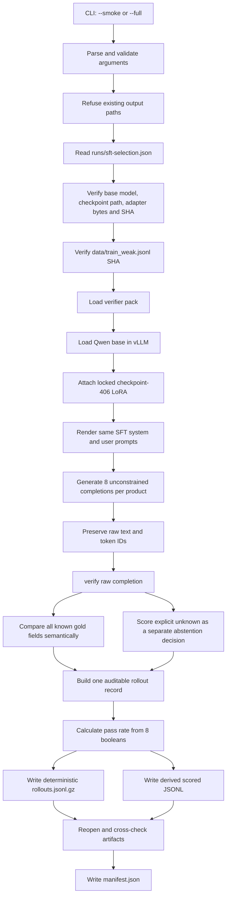

# From SFT to RL: technical blog tracker for difficulty scoring and GRPO

**Document type:** living technical tracker and future blog brief
**Started:** 2026-08-02
**Current scope:** locked SFT checkpoint → sampled difficulty measurement → GRPO prompt selection → first reward implementation → minimal smoke preflight → locked-model load gate → no-training trainer-construction gate → one-group rollout/reward gate → one-group gradient-only gate → optimizer-construction-only gate → one-real-update gate
**Current status:** the deterministic pool, reward contract, five-row smoke fixture and staged integration gates now reach one real trainer update; the first step used the intended nonzero learning rate, initialized complete 8-bit AdamW state and changed every LoRA tensor finitely while leaving the locked source checkpoint untouched, but multi-step stability and saved-checkpoint quality remain intentionally untested
**Update rule:** record measured results only after their artifact and checksum exist; keep planned settings clearly labeled as planned

---

## 1. Proposed post in one sentence

Before applying GRPO to a structured catalog tagger, we sampled eight answers from a locked SFT model for every training prompt and kept the prompts where the model sometimes succeeded and sometimes failed, creating the within-group reward variation that policy-gradient learning needs.

The difficulty sampling and pre-update GRPO gates have now happened. This
sentence remains provisional only because optimizer updates and the frozen
SFT-versus-GRPO evaluation have not happened yet.

## 2. Candidate titles

- From SFT to GRPO: finding the training examples that still teach a small model
- Why RL needs disagreement: building a difficulty filter for a catalog tagger
- Eight attempts per product: measuring where an SFT model is ready for RL
- Before GRPO, measure the reward variance
- Turning a verifier into an RL curriculum for structured extraction

## 3. Core technical thesis

GRPO compares multiple completions generated for the same prompt. If all eight completions receive the same reward, their group-relative advantages collapse toward zero and that prompt contributes little or no useful policy-gradient signal.

For this project, a product with pass rate `0.0` is currently too hard under the strict pass definition, while a product with pass rate `1.0` is already solved. The useful starting band is:

```text
0 < sft_pass_rate < 1
```

Examples with mixed outcomes let the optimizer compare better and worse answers produced by the same policy for the same product.

Important nuance for the final article: GRPO can use continuous and multi-component rewards, so binary pass-rate filtering is not a universal requirement. It is our curriculum-selection rule for this first controlled run. The eventual GRPO reward can still contain partial signals such as format validity, vocabulary compliance, rule compliance, and gold agreement.

---

## 4. Where this work begins

The preceding SFT experiment is complete and documented separately in `W2_BLOG_BRIEF.md`. This tracker should summarize only enough of that experiment to make the RL transition understandable.

### Locked baseline

| item | locked value |
|---|---|
| base model | `unsloth/Qwen2.5-1.5B-Instruct` |
| selected LoRA arm | attention + MLP |
| selected checkpoint | `runs/sft-combined-2epoch/checkpoint-406` |
| training epochs | 2 |
| optimizer steps | 406 |
| LoRA rank / alpha | 16 / 16 |
| trainable parameters | 18,464,768 |
| adapter weight file | `adapter_model.safetensors` |
| adapter bytes | 73,911,112 |
| adapter SHA-256 | `00ae54af4e380cff66695b36b244e3f1ff9aca85076b59a8eb6649d8c3a051af` |
| selection manifest | `runs/sft-selection.json` |
| selection-manifest SHA-256 | `e425635d323b3ffe9e7350fb61a2d9e1848345a95abab6b92032bf64d2718299` |

### Baseline evidence to carry into the next post

| metric | locked SFT | zero-shot comparison |
|---|---:|---:|
| frozen-eval products attempted | 300 | 300 |
| macro-F1 | 0.6411 | 0.1969, conditional on 196 parsed survivors |
| selective macro-F1 | 0.7170 | 0.2047 |
| coverage | 94.3% | 88.1% |
| schema validity | 100% | 62.7% |
| fully vocabulary-valid outputs | 88.7% | 0% |
| verifier-rule violations | 12 | 1,204 |
| missing predictions | 0 | 104 |

Bootstrap evidence from the frozen evaluation:

- SFT macro-F1 95% interval: `0.6258–0.6714`.
- Zero-shot conditional macro-F1 95% interval: `0.1609–0.2133`.
- Paired SFT-minus-zero-shot interval: `+0.4249–+0.4958`.
- Method: paired nonparametric row bootstrap, 5,000 replicates, seed `20260801`.

The absolute label scores remain provisional because only 78 individual evaluation cells received explicit human review. The like-for-like improvement, format validity, and verifier compliance are stronger claims than production accuracy.

### Data entering difficulty scoring

| item | value |
|---|---:|
| source | `data/train_weak.jsonl` |
| products | 3,600 |
| source SHA-256 | `1cbcbfba5ad379e7c66895d720a997edf913030ee1e76e4917101dfccb09530b` |
| rollouts per product | 8 |
| planned full completions | 28,800 |
| frozen test set used for difficulty scoring | no |

Difficulty is measured on the weakly labeled training pool, not the frozen 300-product test set. The frozen set remains reserved for model comparison after training.

---

## 5. The problem discovered before implementation

The dataset model already had this field:

```json
"difficulty": {
  "sft_pass_rate": null
}
```

`training.dataset.load_grpo_prompts()` could filter to `0 < sft_pass_rate < 1`, and deliberately raised an error while every value was null. Its error message referenced `training/score_difficulty.py`, but that script did not exist.

The larger gap was conceptual: the plan said to sample eight completions and record the fraction that were “correct,” but it did not define “correct.” Several interpretations were possible:

1. **Verifier-clean only.** This measures whether the output is structurally acceptable, but ignores whether the labels match the product.
2. **Every scorable label exactly correct.** Clear and non-arbitrary, but strict for a 15-field record.
3. **At least some percentage of fields correct.** More forgiving, but requires choosing an arbitrary threshold.
4. **A continuous reward threshold.** Potentially aligned with GRPO rewards, but makes the curriculum depend on an as-yet-unlocked reward scale.

We locked option 2, with verifier cleanliness added as a requirement.

---

## 6. Locked definition of a passing rollout

A sampled completion passes only if all of the following are true:

1. The raw response parses as one JSON object.
2. Its field names, shapes, and arities satisfy the schema.
3. Every committed value belongs to the controlled vocabulary.
4. It triggers no declarative cross-field verifier rules.
5. Every scorable gold field exactly matches.

Additional scoring rules:

- A gold field marked `unknown` is excluded because the listing provides no ground truth for it.
- `null` remains a scorable `not_applicable` answer.
- The multi-valued `details` field is compared as an order-insensitive set.
- A record with zero scorable gold fields cannot pass.
- Verifier normalization and output repair are disabled; raw output is graded exactly as generated.

### Why verifier validity alone is insufficient

The verifier answers, “Could this be a legal catalog record?” It does not answer, “Is this the correct record for this product?” A perfectly formatted answer with the wrong material is valid but incorrect. Difficulty scoring therefore combines verifier cleanliness with exact gold agreement.

### Sanity check against existing SFT predictions

Before spending GPU time, we applied the strict whole-record criterion to the 300 already-saved deterministic SFT predictions. This was not the difficulty run; it was a feasibility check.

| row-level scorable-label accuracy | products at or above threshold |
|---|---:|
| 50% | 296 / 300 |
| 60% | 285 / 300 |
| 70% | 252 / 300 |
| 75% | 239 / 300 |
| 80% | 200 / 300 |
| 90% | 109 / 300 |
| 100%, strict pass | 61 / 300 |

Observed row-accuracy quantiles:

| quantile | row accuracy |
|---|---:|
| minimum | 0.286 |
| p10 | 0.667 |
| p25 | 0.769 |
| median | 0.857 |
| p75 | 0.923 |
| p90 | 1.000 |
| maximum | 1.000 |

The 61/300 exact records showed that the definition was strict but not impossible. This check used deterministic evaluation outputs, while difficulty scoring will sample eight stochastic outputs per training product; their distributions should not be treated as directly comparable.

---

## 7. What `sft_pass_rate` means

For product `i`, let `pass(i,j)` be 1 when rollout `j` satisfies the locked pass definition and 0 otherwise. With eight rollouts:

```text
sft_pass_rate(i) = sum(pass(i, 0..7)) / 8
```

The only possible values are:

```text
0.000, 0.125, 0.250, 0.375, 0.500,
0.625, 0.750, 0.875, 1.000
```

Example: five passing answers and three failing answers produce `5 / 8 = 0.625`.

### Interpretation

| pass rate | interpretation for this run | initial GRPO selection |
|---:|---|---|
| 0.000 | all eight failed; possibly too hard or systematically broken | exclude |
| 0.125–0.875 | model produced both success and failure | retain |
| 1.000 | all eight passed; already solved under this sample | exclude |

Eight samples give a coarse estimate, not a stable psychological property of the product. Temperature, seed, prompt, checkpoint, and verifier version are part of the measurement.

---

## 8. Artifact design

The original `data/train_weak.jsonl` must remain unchanged. The run produces derived evidence instead.

### 8.1 Scored dataset

Planned full-run path:

```text
data/train_weak_sft_scored.jsonl
```

Each source row is preserved, with only this measured field populated:

```json
"difficulty": {
  "sft_pass_rate": 0.625
}
```

Safety properties:

- The writer refuses to use the source path as the output path.
- Source and pass-rate SKU sets must match exactly.
- Duplicate source SKUs are rejected.
- Rates outside `[0,1]` are rejected.
- Manifest construction later requires every rate to be a multiple of `1/8`.

### 8.2 Auditable rollout records

Planned full-run path:

```text
runs/sft-difficulty-k8/rollouts.jsonl.gz
```

There will be 28,800 records after a successful full run. Each record contains:

```json
{
  "sku_id": "shopify:example:123",
  "rollout_index": 3,
  "raw_output": "{...literal model text...}",
  "passed": false,
  "schema_valid": true,
  "vocab_valid": true,
  "rule_violations": [],
  "errors": [],
  "correct_labels": 11,
  "scorable_labels": 13,
  "incorrect_labels": ["material", "occasion"],
  "excluded_gold_unknown_labels": ["fit", "waistline"],
  "generation_seed": 20260802,
  "completion_tokens": 108
}
```

The exact incorrect-field list was added after review because “11 of 13 correct” did not fully explain why a rollout failed.

Writer guarantees:

- Every SKU must have indices `0–7` exactly once.
- Duplicate or incomplete groups fail.
- Records are sorted by SKU and rollout index.
- JSON keys and separators are canonical.
- Gzip uses timestamp `0` and no embedded output filename.
- Identical logical records therefore produce identical compressed bytes and SHA-256 hashes, independent of batching order or destination filename.

### 8.3 Run manifest

Planned full-run path:

```text
runs/sft-difficulty-k8/manifest.json
```

The manifest records:

- Base model and checkpoint path.
- Adapter filename, byte size, and SHA-256.
- Locked selection-manifest path and SHA-256.
- Source and scored-dataset paths, row counts, and SHA-256 hashes.
- Vocabulary and rule-pack hashes.
- System-prompt hash.
- Sampling settings and batch size.
- Rollout artifact path, record count, and hash.
- Exact scoring policy.
- Git commit and whether tracked files were dirty.
- Pass-rate histogram.
- Counts always failing, always passing, and retained for GRPO.

Manifest construction does not trust caller-supplied summaries. It reopens the scored dataset and compressed rollout file, then verifies:

1. Source, scored, pass-rate, and rollout SKU sets agree.
2. Every product has exactly eight rollout records.
3. The number of passing records reproduces the saved pass rate.
4. Every saved rate matches the in-memory result.
5. All files named in the manifest exist before they are hashed.

---

## 9. End-to-end code flow



### Main code locations

| file | role |
|---|---|
| `training/score_difficulty.py` | CLI, lock verification, generation, grading, artifact writing and manifest checks |
| `tests/test_score_difficulty.py` | deterministic scoring, artifact, CLI, fake-vLLM and end-to-end workflow tests |
| `training/dataset.py` | shared SFT/GRPO prompt shape and `load_grpo_prompts()` filter |
| `training/predict.py` | shared `prompt_messages()` renderer used by SFT prediction and difficulty generation |
| `labeling/records.py` | row schema, three-state labels and canonical JSONL I/O |
| `verifier/` | strict JSON/schema/vocabulary/rule grading |
| `packs/vastraa_taste_v1/` | controlled vocabulary and declarative rules |
| `runs/sft-selection.json` | immutable checkpoint-selection evidence |

### Important functions

| function | responsibility |
|---|---|
| `score_completion()` | verifier-clean plus exact scorable-label grading |
| `rescore_rollout_records()` | deterministically re-grades saved raw outputs without model generation |
| `summarize_rollout_metrics()` | reports known-gold semantic quality and abstention quality separately |
| `calculate_pass_rate()` | requires exactly eight booleans |
| `build_rollout_record()` | combines raw generation evidence with its grade |
| `generate_rollouts()` | renders, samples, validates indices and immediately grades |
| `write_rollout_records()` | canonical deterministic gzip artifact |
| `write_scored_dataset()` | safe derived JSONL without source overwrite |
| `verify_locked_inputs()` | checks selection state, model, adapter and source hashes |
| `build_difficulty_manifest()` | reopens and cross-checks all completed artifacts |
| `run_difficulty()` | guarded smoke/full orchestration |

---

## 10. Generation configuration

These are the implemented defaults used by the completed real smoke run.

| parameter | value | reason |
|---|---:|---|
| backend | vLLM 0.23.0 | efficient batched generation with PEFT LoRA support |
| completions per product | 8 | plan requirement and pass-rate resolution |
| temperature | 0.7 | enough stochastic variation to reveal mixed outcomes |
| top-p | 0.95 | preserve diversity while trimming the weakest probability tail |
| max new tokens | 170 | above measured completion maximum; same SFT completion budget |
| maximum model length | 896 | covers measured prompt plus completion budget |
| batch size | 32 products | starting throughput setting; smoke has only two products |
| seed | 20260802 | reproducibility identity for this difficulty run |
| dtype | bfloat16 | stable Ampere-native inference precision |
| GPU-memory utilization | 0.65 | reserve headroom on the dual-use RTX 3090 |
| LoRA rank cap | 16 | matches the selected checkpoint |
| structured output constraint | disabled | format validity must remain observable rather than forced |

The backend is loaded lazily. CLI parsing, `--help`, collision checks, checkpoint verification, and source verification happen before CUDA initialization where possible.

### Why generation is unconstrained

If JSON-schema decoding forced every answer into a legal shape, schema-validity reward would become unobservable. This experiment deliberately grades literal model output. Malformed JSON is evidence, not something silently repaired away.

### vLLM API verification

The server’s installed API was inspected before implementation:

- vLLM version: `0.23.0`.
- `LLM.generate()` accepts a sequence of prompts, one `SamplingParams`, and one `LoRARequest`.
- `SamplingParams(n=8, ...)` returns indexed alternatives for each prompt.
- `LoRARequest` accepts the adapter name, positive process-local ID, adapter directory, and base-model name.

The environment emits a warning that vLLM’s Transformers-v4 path is deprecated for a future vLLM release. It is currently a warning, not a run failure, and no dependency upgrade was performed before this controlled experiment.

---

## 11. CLI safety contract

The command requires an explicit mode.

### Smoke mode

```bash
HF_HOME=/workspace/.hf_home PYTHONPATH=. /venv/rl/bin/python \
  -m training.score_difficulty --smoke
```

Expected scope:

- First 2 products.
- 8 completions each.
- 16 total completions.
- Output directory: `runs/sft-difficulty-k8-smoke/`.

Expected smoke artifacts:

```text
runs/sft-difficulty-k8-smoke/source-smoke.jsonl
runs/sft-difficulty-k8-smoke/scored-smoke.jsonl
runs/sft-difficulty-k8-smoke/rollouts.jsonl.gz
runs/sft-difficulty-k8-smoke/manifest.json
```

### Full mode

```bash
HF_HOME=/workspace/.hf_home PYTHONPATH=. /venv/rl/bin/python \
  -m training.score_difficulty --full
```

Expected scope:

- All 3,600 products.
- 28,800 total completions.
- Rollout/manifest directory: `runs/sft-difficulty-k8/`.
- Derived dataset: `data/train_weak_sft_scored.jsonl`.

### Guardrails

- Omitting both `--smoke` and `--full` is an error.
- Supplying both modes is an error.
- `--limit` is allowed only with smoke mode.
- Temperature must be greater than zero.
- `top_p` must be in `(0,1]`.
- Batch size and token limit must be positive.
- GPU-memory utilization must be in `(0,1)`.
- Existing output paths cause failure unless `--overwrite` is explicit.
- Source overwrite is refused even when constructing a derived dataset.

---

## 12. Implementation and test history

### Implementation sequence

1. Located the missing `training/score_difficulty.py` reference.
2. Identified the undefined meaning of “correct.”
3. Locked strict verifier-clean whole-record correctness.
4. Tested the definition against saved frozen-eval predictions.
5. Defined immutable source, rollout, scored-data and manifest artifacts.
6. Wrote red tests before the scorer existed.
7. Implemented deterministic grading and safe dataset writing.
8. Added canonical compressed rollout records and cross-checking manifest builder.
9. Added field-level incorrect/excluded evidence after audit review.
10. Inspected the exact installed vLLM API remotely.
11. Implemented an injectable generation loop and fake backend tests.
12. Implemented guarded CLI orchestration and checkpoint provenance checks.
13. Ran a complete fake smoke workflow locally.
14. Committed and synchronized the code to the GPU server.
15. Ran remote non-GPU tests and a read-only hardware/data preflight.
16. Added separate known-gold semantic and explicit-abstention metrics.
17. Re-scored the preserved smoke outputs without loading the model or sampling again.

### Test milestones

| milestone | focused tests | full suite |
|---|---:|---:|
| deterministic scorer and derived writer | 6 | 191 |
| artifact builders | 10 | 195 |
| safe CLI parser | 13 | 198 |
| injectable generation loop | 15 | 200 |
| guarded end-to-end fake smoke | 16 | 201 |
| native vLLM sampler fallback | 17 | 202 |
| semantic plus abstention metrics | 19 | 204 |

Current verification:

- Local full suite after the abstention-metric addition: **204 passed**.
- Remote focused difficulty suite under `/venv/rl`: **19 passed**.
- Python compilation check: passed.
- Diff whitespace check: passed.
- Remote CLI `--help` without GPU import: passed.

### Code provenance

| item | value |
|---|---|
| initial implementation commit | `0ad922dabd7d8b852eac5c2541c0420181017567` |
| native-sampler corrective commit | `6a88a50d0eec3c2fc38274d0c146f20fb26e5ec9` |
| dual-metric scoring commit | `69f1af14e3bbf0de6aa23c426e1190605f392802` |
| commit subjects | `Add auditable SFT difficulty scoring`; `Fall back to native vLLM sampler`; `Add abstention metrics to difficulty scoring` |
| remote branch | `master` |
| GPU worktree at successful smoke | `6a88a50d0eec3c2fc38274d0c146f20fb26e5ec9` |

The commit contained only:

```text
training/score_difficulty.py
tests/test_score_difficulty.py
```

Existing local `.gitignore`, HTML and attention-run artifacts were not included. Existing remote checkpoints, caches and run artifacts were preserved during a fast-forward pull.

---

## 13. Remote environment and preflight

Preflight date: 2026-08-02.

### Installed stack

| package | version |
|---|---|
| PyTorch | `2.11.0+cu130` |
| Transformers | `4.57.6` |
| TRL | `0.24.0` |
| PEFT | `0.19.1` |
| Unsloth | `2026.7.5` |
| vLLM | `0.23.0` |

Relevant imports previously verified successfully:

```text
GRPOConfig
GRPOTrainer
vllm.LLM
PeftModel
FastLanguageModel
```

### Hardware and storage immediately before the planned smoke

| item | measured value |
|---|---:|
| GPU | NVIDIA GeForce RTX 3090 |
| total VRAM | 24,576 MiB |
| used VRAM | 428 MiB |
| free VRAM | 23,699 MiB |
| GPU utilization | 0% |
| temperature | 38°C |
| idle application allocation | approximately 420 MiB |
| filesystem size | 27 GB |
| filesystem used | 23 GB / 83% |
| filesystem free | 4.8 GB |
| checkpoint-406 directory | 86 MB |
| cached base model | 2.9 GB |

The model is already cached at the server’s Hugging Face cache, so the smoke should not trigger a multi-gigabyte model download.

### Lock verification immediately before smoke

- Selection state: `locked_before_frozen_eval`.
- Adapter SHA matched: `00ae54af4e380cff66695b36b244e3f1ff9aca85076b59a8eb6649d8c3a051af`.
- Source SHA matched: `1cbcbfba5ad379e7c66895d720a997edf913030ee1e76e4917101dfccb09530b`.
- Adapter config present.
- Adapter config rank: 16.
- Adapter config alpha: 16.
- Adapter base: `unsloth/Qwen2.5-1.5B-Instruct`.
- All four planned smoke output paths were clear.

No vLLM engine or Qwen weights were loaded during preflight.

---

## 14. Real run tracker

Everything below must be updated from generated artifacts, not terminal memory.

### 14.1 Two-product smoke run

**Status:** COMPLETED AND ACCEPTED
**Command:** completed after one instrumentation-only failure and one vLLM dependency failure
**Expected completions:** 16; observed 16

| measurement | result |
|---|---|
| start UTC | exact shell timestamp was not persisted; first successful-run log at 20:03:41 UTC |
| end UTC | approximately 20:05:10 UTC |
| wall time | 96 seconds end to end |
| peak GPU memory | 16,793 MiB used, sampled every 500 ms |
| disk free before | 4.8 GB |
| disk free after | 4.7 GB; first-run vLLM compile cache is 93 MB |
| products | 2 |
| rollout records | 16; 16 unique `(sku_id, rollout_index)` pairs |
| schema-valid rollouts | 16/16, 100% |
| vocabulary-valid rollouts | 14/16, 87.5% |
| rule-clean rollouts | 16/16, 100% |
| passing rollouts | 13/16, 81.25% |
| pass-rate values | 0.625 and 1.000 |
| GRPO-eligible smoke products | 1/2 |
| completion-token range | 107–109 |
| output-at-token-cap count | 0/16 |
| manifest SHA-256 | `145861947267ea50676d0db6f56b3b006f8df4ae6a3146660dab8653f1b77dd7` |
| rollout artifact SHA-256 | `479b64e4b53c8cf549152bbaeab36fb15cfefadd24e25cf5722cd3ffbdd7e4e8` |
| scored dataset SHA-256 | `3fb3972263e5929a72af266e316d6bf5a6ef007e378cb0c0276442d34a949623` |
| smoke source SHA-256 | `7453cc6a674d0e091c88f2a24f768d3a017636c678aacc425d524b954d5957a9` |

Smoke acceptance checklist:

- [x] Process exits with code 0.
- [x] Exactly 16 unique `(sku_id, rollout_index)` records exist.
- [x] Each product has indices 0–7.
- [x] Raw output is preserved.
- [x] Scored source has exactly two rows.
- [x] Pass rates equal passing count divided by eight.
- [x] Manifest rebuild checks pass.
- [x] Adapter and source hashes in manifest match the lock.
- [x] No output unexpectedly hits 170 tokens.
- [x] No CUDA out-of-memory error.
- [x] GPU memory returns after process exit: 428 MiB idle.
- [x] Disk remains sufficient for the full run: 4.7 GB free.

Smoke product findings:

1. **Organic Cotton Pull On Pant** — 5/8 passed, pass rate `0.625`.
   All three failures differed only on `closure`. Two were vocabulary failures:
   the model emitted `"pull"` and `"pull_over"` instead of the allowed
   `"pullover"`. One emitted the valid abstention `"unknown"`, which remained an
   exact-match failure because closure was scorable gold. All eight outputs were
   schema-valid and rule-clean.
2. **Bode Puffer Jacket** — 8/8 passed, pass rate `1.0`. All eight outputs were
   identical. Only two gold fields were scorable; the model got both right and
   abstained on most remaining fields. This is a useful reminder that a strict
   whole-record pass can still be easy when weak gold contains many unknowns.

The first product demonstrates the intended mixed group: same prompt and policy,
five accepted answers and three rejected answers. The second demonstrates why
all-pass groups are filtered out.

#### Pre-full-run audit: how much gold is actually scorable?

The all-pass puffer prompted a corpus-wide audit using the exact scoring policy:
`labeled` and `not_applicable` fields count as scorable, while gold `unknown`
fields do not. Across all 3,600 training products:

| statistic | scorable fields out of 15 |
|---|---:|
| mean | 8.48 |
| minimum | 1 |
| p10 | 4 |
| p25 | 6 |
| median | 8 |
| p75 | 11 |
| p90 | 13 |
| maximum | 15 |

Low-scorable tail:

| threshold | products | share |
|---:|---:|---:|
| at most 2 | 73 | 2.0% |
| at most 3 | 188 | 5.2% |
| at most 4 | 361 | 10.0% |
| at most 5 | 599 | 16.6% |

No product has zero scorable fields. Eight products have only one, and 65 have
two. The Bode Puffer Jacket is in that 2.0% tail: one substantive labeled field,
one `not_applicable` field, and 13 gold unknowns.

Scorable count is not identical to information richness because
`not_applicable` is correctly scorable. Separating the three gold states gives:

| gold state per product | mean | median | p10–p90 | range |
|---|---:|---:|---:|---:|
| substantive `labeled` | 5.41 | 5 | 2–8 | 1–13 |
| `not_applicable` | 3.08 | 1 | 1–9 | 0–11 |
| excluded `unknown` | 6.52 | 7 | 2–11 | 0–14 |

There are 387 products (10.8%) with at most two substantive labeled fields. This
means pass rate can reflect both model competence and weak-label completeness.
The low-scorable tail is not large enough to invalidate the planned full
difficulty measurement, but the eventual GRPO pool must be stratified by both
total scorable and substantive-labeled counts. We will generate all 3,600 rows
first rather than introducing a post-smoke threshold, then inspect whether
all-pass rates are concentrated in sparse-gold products before locking the GRPO
selection rule.

#### Separate semantic and abstention metrics

The sparse-gold audit exposed an ambiguity in a single F1 score. Gold
`unknown` means the weak labels do not tell us the correct category; it is not a
normal category that should be mixed into semantic macro-F1. However, whether
the model explicitly abstains is still behavior worth measuring. We therefore
locked two complementary views:

1. **Known-gold semantic quality:** macro-F1 and exact cell accuracy only where
   gold is scorable.
2. **Abstention quality:** treat gold `unknown` as the positive class and report
   precision, recall and F1 for the model's explicit `unknown` decision.

An exploratory **unknown-aware pass** is also reported. It requires the normal
strict semantic pass *and* explicit `unknown` on every gold-unknown field. It
does not replace `sft_pass_rate` and is not used to select GRPO prompts.

Commit `69f1af1` added field-level `correct_abstention_labels`,
`missed_abstention_labels`, `false_abstention_labels`, and
`unknown_aware_passed` to each rollout record. Old v1 records remain readable,
which allowed the 16 preserved raw outputs to be re-graded without another GPU
generation run.

The v2 artifacts were written to a new directory so the accepted v1 smoke was
not overwritten:

```text
runs/sft-difficulty-k8-smoke-v2/source-smoke.jsonl
runs/sft-difficulty-k8-smoke-v2/scored-smoke.jsonl
runs/sft-difficulty-k8-smoke-v2/rollouts.jsonl.gz
runs/sft-difficulty-k8-smoke-v2/manifest.json
```

The v2 manifest records `mode: smoke-rescore-v2`, code commit `69f1af1`, the
original v1 manifest and rollout hashes, `generation_reused: true`, and
`raw_outputs_unchanged: true`. An independent comparison confirmed the same 16
record identities and exactly the same raw strings; their canonical raw-output
set SHA-256 is
`bca12f34dea57fa101aea4e60ec816038d229de0362ede432770537e68b8eea8`.

Measured smoke results:

| metric | result |
|---|---:|
| ordinary strict passes | 13/16, 81.25% |
| known-gold semantic macro-F1 | 0.9744 |
| known-gold exact cell accuracy | 85/88, 96.59% |
| abstention true positives | 146 |
| abstention false positives | 1 |
| abstention false negatives | 6 |
| abstention true negatives | 87 |
| abstention micro precision | 0.9932 |
| abstention micro recall | 0.9605 |
| abstention micro-F1 | 0.9766 |
| supported-attribute abstention macro-F1 | 0.9777 |
| exploratory unknown-aware passes | 10/16, 62.5% |

The ordinary pass count and both per-product pass rates remained unchanged:
`0.625` for Organic Cotton Pull On Pant and `1.000` for Bode Puffer Jacket.
This proves that the new reporting did not silently change the GRPO difficulty
label. The six missed abstentions were all in `details`; the single false
abstention was `closure`, corresponding to the pant rollout that predicted
`unknown` where the known gold was `pullover`.

V2 artifact hashes:

| artifact | SHA-256 |
|---|---|
| manifest | `6ab9da9013d97967447900ba8b29f08ee9b79e7e5155823bc8412a2b4d71207f` |
| enriched rollout records | `8feb7c93c889e2558a290b42d600d7cd3f09ff40041e20cfd4a7a69d574ac764` |
| scored smoke dataset | `3fb3972263e5929a72af266e316d6bf5a6ef007e378cb0c0276442d34a949623` |
| smoke source | `7453cc6a674d0e091c88f2a24f768d3a017636c678aacc425d524b954d5957a9` |

This is a two-product diagnostic, not a population estimate. The metric values
validate the definitions and artifact pipeline; the full 3,600-product run is
needed before drawing conclusions about model behavior.

### 14.2 Full 3,600-product difficulty run

**Status:** COMPLETED AND ACCEPTED
**Prerequisites:** smoke accepted; final non-generating preflight passed on 2026-08-02

Final preflight was deliberately read-only with respect to model execution: it
parsed the real `--full` configuration and called the same locked-input verifier
used by the runner, but did not initialize vLLM or CUDA.

| preflight check | measured result |
|---|---|
| remote code | `69f1af14e3bbf0de6aa23c426e1190605f392802` on `master` |
| tracked worktree | clean |
| source scope | 3,600 unique run rows loaded by the production reader |
| rollout scope | 8 per product; 28,800 expected total |
| selection state | `locked_before_frozen_eval` |
| selection-manifest SHA-256 | `e425635d323b3ffe9e7350fb61a2d9e1848345a95abab6b92032bf64d2718299` |
| adapter SHA-256 | verified `00ae54af4e380cff66695b36b244e3f1ff9aca85076b59a8eb6649d8c3a051af` |
| source SHA-256 | verified `1cbcbfba5ad379e7c66895d720a997edf913030ee1e76e4917101dfccb09530b` |
| full output directory | `runs/sft-difficulty-k8/`; absent |
| scored output | `data/train_weak_sft_scored.jsonl`; absent |
| model cache | 2.9 GB, 9 resolved snapshot files, no `.incomplete` files |
| disk | 4.7 GB free |
| GPU | RTX 3090; 23,699 MiB free; 0% utilization; 38°C |
| idle service allocation | 420 MiB, consistent with the known dual-use service |
| logging destination | `runs/` exists and is writable; no prior full-run log or monitor CSV |
| monitoring tools | `date`, `tee`, `nvidia-smi`, `df`, and `timeout` available |

The launch must preserve stdout/stderr and periodic GPU/disk samples in new log
files beside—not inside—the immutable artifact directory. This keeps a failed
launch log from creating an output-path collision on a clean retry. No full-run
generation occurred during this preflight.

#### Full-run GPU and disk sizing

The accepted two-product smoke peaked at **16,793 MiB of total GPU memory**,
including the approximately 420 MiB idle service allocation. The full run
should have a similar peak because vLLM processes products in bounded batches:
VRAM depends primarily on model size, batch size, context length and KV-cache
allocation, not on whether the dataset contains two or 3,600 products.

| GPU sizing level | VRAM |
|---|---:|
| measured smoke peak | 16,793 MiB |
| practical minimum from this measurement | approximately 17 GB |
| recommended capacity with operational headroom | at least 20 GB |
| available RTX 3090 capacity | 24,576 MiB |
| headroom above measured peak | 7,783 MiB |

A 16 GB card would not fit the measured configuration unchanged. The 24 GB RTX
3090 has comfortable headroom for the locked batch size, token ceiling and
`gpu_memory_utilization=0.65` configuration.

Disk requirements have two distinct parts. The large reusable inputs already
exist on the server:

| existing item | measured size |
|---|---:|
| cached Qwen2.5-1.5B-Instruct model | 2.9 GB |
| complete checkpoint-406 adapter directory | 86 MB |
| vLLM compilation cache created by the smoke | 94 MB |

The full run does not write another model checkpoint or optimizer state. It
only writes rollout evidence, the scored dataset, a manifest and operational
logs. The v2 smoke rollout records contain 17,707 uncompressed bytes for 16
rollouts. Linear scaling to 28,800 rollouts gives approximately 31.9 MB
uncompressed before gzip. The 3,600-row source dataset is 7.89 MB, so its scored
copy should remain around 8–10 MB. Compression, content diversity and log
duration make an exact prediction inappropriate, but the expected incremental
storage is below 75 MB.

| disk sizing level | free space required |
|---|---:|
| expected incremental output | less than approximately 75 MB |
| conservative minimum reserve | 200 MB |
| comfortable operational reserve | 500 MB |
| measured free space before launch | 4.7 GB |

The server therefore has ample disk capacity for this inference-only run. This
estimate must be checked against actual artifact and log sizes after completion.

#### Reviewed full-run launcher

The full run is wrapped by `scripts/run_difficulty_full.sh`. Constructing the
launcher separately from executing it makes the operational contract reviewable
and prevents a long GPU job from being started by an incidental command.

Safe remote verification, which exits before creating logs or initializing the
model:

```bash
bash scripts/run_difficulty_full.sh --preflight-only
```

Actual launch command, intentionally not executed during this step:

```bash
bash scripts/run_difficulty_full.sh
```

The launcher performs the following sequence:

1. Resolves the repository root independently of the caller's current directory.
2. Requires `/venv/rl/bin/python` and the existing Hugging Face cache.
3. Proves reviewed scorer commit `69f1af1` is an ancestor of `HEAD` and that the
   scorer and its tests are unchanged from that review point.
4. Refuses staged or unstaged tracked changes.
5. Refuses any existing full output, scored dataset, run log or monitor CSV.
6. Writes UTC start/end timestamps, actual Git commit, exact Python command,
   initial/final GPU state, disk state and scorer exit code to the run log.
7. Samples GPU memory, utilization, temperature and available disk once per
   second into a separate CSV.
8. Stops only its own monitor process through signal/exit traps.
9. Reports peak sampled VRAM, minimum sampled disk and final artifact hashes.
10. Preserves the scorer's exit code and never deletes partial evidence.

Operational files are kept outside the immutable artifact directory:

```text
runs/sft-difficulty-k8-full.log
runs/sft-difficulty-k8-monitor.csv
```

The scorer alone owns `runs/sft-difficulty-k8/` and
`data/train_weak_sft_scored.jsonl`. If generation fails before artifact writing,
the external logs remain available while the intended artifact paths stay
clear. If writing fails partway through, the launcher reports what exists and
stops; cleanup requires a separate audited decision rather than automatic
deletion.

Shell syntax and whitespace validation passed locally. ShellCheck was not
installed, so no ShellCheck result is claimed. A first review caught and fixed
an overly strict `HEAD == 69f1af1` check: committing the launcher necessarily
advances `HEAD`, so the final guard locks the scorer file contents to that commit
while allowing a later launcher/documentation commit.

The launcher was committed as `78e97d7` (`Add guarded full difficulty
launcher`), pushed to the Vast.ai bare remote, and fast-forwarded into
`/workspace/tagging-rl`. Its remote SHA-256 is
`abf9a655af08e6de93d759bf32e3d1558351d81dfffd780d43ef4e3c4b91fa53`.
The real remote invocation

```bash
bash scripts/run_difficulty_full.sh --preflight-only
```

exited successfully and printed the expected current and reviewed commits. GPU
state was exactly 428 MiB used, 23,699 MiB free and 0% utilization both before
and after. A separate post-check found no active `training.score_difficulty`
process and confirmed that the output directory, scored dataset, run log and
monitor CSV were all still absent. The tracked remote checkout remained clean
and disk remained at 4.7 GB free. This proves the launcher's preflight-only path
does not initialize the model, start generation or contaminate run evidence.

| measurement | result |
|---|---|
| status | completed successfully; scorer exit code 0 |
| start/end UTC | 2026-08-02 21:38:20–21:46:09 |
| wall time | 7 minutes 49 seconds |
| code commit | `78e97d7ca5df73069f12c06212fbb46525c4dd85`; clean tracked worktree |
| products | 3,600 |
| rollout records | 28,800; all unique `(sku_id, rollout_index)` pairs |
| passed rollouts | 12,609, 43.78% |
| failed rollouts | 16,191, 56.22% |
| always failed, rate 0 | 1,116 products, 31.00% |
| retained, rate 0.125–0.875 | 1,702 products, 47.28% |
| always passed, rate 1 | 782 products, 21.72% |
| schema-valid rate | 28,800/28,800, 100% |
| vocabulary-valid rate | 28,476/28,800, 98.88% |
| rule-clean rate | 28,385/28,800, 98.56% |
| completion-token range | 99–120 |
| token-cap count | 0/28,800 at 170 tokens |
| peak sampled GPU memory | 17,575 MiB used; 6,552 MiB remained free |
| peak GPU utilization / temperature | 100% / 74°C |
| monitor samples | 436 at one-second cadence |
| scored dataset bytes / SHA | 7,889,667 / `ec68b0ccf3ba84a82cdb0799956d36f53c9113d3cb7c7fd5232ecd50412a975f` |
| rollout gzip bytes / SHA | 509,163 / `f17360b157287caaea8d0f8e907f0a4bf4fd107977452442e2e447628e95bf8b` |
| manifest bytes / SHA | 11,042 / `5c6fcc41bab65b36904cef256c56e747a19302b30b6da3c7208382e4dfdd3e5b` |
| run log bytes / SHA | 25,642 / `273a8657db00edb3f6d0f34eefdc660a49d28a13665daf41c651a2a2c02ca110` |
| monitor CSV bytes / SHA | 21,683 / `dc88883e3bb52c47280f24c1d2464a68125730206f66184a8d13975fd91b1bbc` |
| disk free after | 4.7 GB; minimum sampled 5,005,783,040 bytes |

Pass-rate histogram:

| pass rate | number of products | percent |
|---:|---:|---:|
| 0.000 | 1,116 | 31.00% |
| 0.125 | 395 | 10.97% |
| 0.250 | 266 | 7.39% |
| 0.375 | 186 | 5.17% |
| 0.500 | 189 | 5.25% |
| 0.625 | 171 | 4.75% |
| 0.750 | 208 | 5.78% |
| 0.875 | 287 | 7.97% |
| 1.000 | 782 | 21.72% |

The mixed-outcome pool is large enough for GRPO: 1,702 prompts survive the
predeclared `0 < sft_pass_rate < 1` filter. This is 47.28% of the weak-training
set, so the strict whole-record reward did not collapse into mostly uniform
groups.

#### Full semantic and abstention measurements

| metric | full-run result |
|---|---:|
| known-gold semantic macro-F1 | 0.7768 |
| known-gold exact cell accuracy | 219,180/244,360, 89.70% |
| abstention true positives | 176,612 |
| abstention false positives | 16,349 |
| abstention false negatives | 11,028 |
| abstention true negatives | 228,011 |
| abstention micro precision | 0.9153 |
| abstention micro recall | 0.9412 |
| abstention micro-F1 | 0.9281 |
| supported-attribute abstention macro-F1 | 0.9187 |
| exploratory unknown-aware passes | 8,860/28,800, 30.76% |

These values describe sampled predictions on the weak training labels and must
not be compared directly with the locked 300-row frozen evaluation. Their role
here is to characterize reward difficulty and abstention behavior before GRPO.
The normal strict pass remains the selection signal; unknown-aware pass remains
exploratory.

The most frequent known-gold errors were `closure` (4,183), `details` (3,695),
`occasion` (3,028), `collar_type` (2,948), `colour_primary` (2,161), and
`pattern` (2,078). The weakest abstention attributes were `details` (F1 0.7856),
`occasion` (0.8303), `collar_type` (0.8358), and `closure` (0.8859). This shows
that the same semantically ambiguous fields create both incorrect commitments
and incorrect abstentions.

#### Does sparse gold make products look artificially easy?

Yes, especially at the extreme low-scorable tail, but that tail contributes few
GRPO prompts.

| scorable fields | products | mean pass rate | always failed | mixed/retained | always passed | retained share |
|---:|---:|---:|---:|---:|---:|---:|
| 1–2 | 73 | 0.971 | 1 | 6 | 66 | 8.2% |
| 3–5 | 526 | 0.533 | 128 | 215 | 183 | 40.9% |
| 6–8 | 1,248 | 0.394 | 419 | 599 | 230 | 48.0% |
| 9–11 | 998 | 0.369 | 367 | 466 | 165 | 46.7% |
| 12–15 | 755 | 0.484 | 201 | 416 | 138 | 55.1% |

Outcome groups also differ in average gold density:

| outcome group | products | mean scorable fields | mean substantive labeled fields |
|---|---:|---:|---:|
| always failed | 1,116 | 8.73 | 6.04 |
| mixed/retained | 1,702 | 8.81 | 5.61 |
| always passed | 782 | 7.42 | 4.05 |

The Pearson correlation between scorable-field count and pass rate is only
`-0.099`, so scorable count alone does not explain difficulty across the full
dataset. However, 66 of the 73 rows with only one or two scorable fields are
always-pass, confirming the smoke-run concern at that extreme. Only six enter
the retained pool. The retained dataset must still carry scorable and
substantive-label counts in its audit manifest so this bias remains visible.

#### Independent artifact validation

The saved gzip was reopened independently after the runner exited. Validation
confirmed 28,800 nonempty raw outputs, 28,800 unique record keys, indices 0–7
for every SKU, 3,600 unique scored rows, exact agreement between raw pass counts
and saved `sft_pass_rate`, and exact agreement with the manifest histogram. The
unknown-aware count also independently reproduced 8,860. No scoring process
remained active, and GPU memory returned to the 428 MiB idle baseline.

The five full-run evidence files were then copied from Vast.ai to the same
relative paths in the local repository before any downstream GRPO work:

```text
runs/sft-difficulty-k8/manifest.json
runs/sft-difficulty-k8/rollouts.jsonl.gz
data/train_weak_sft_scored.jsonl
runs/sft-difficulty-k8-full.log
runs/sft-difficulty-k8-monitor.csv
```

Fresh local and remote SHA-256 calculations matched for every file, as did all
byte sizes. The local project environment reopened the copied gzip and scored
JSONL and independently reproduced 28,800 unique rollout keys, 3,600 complete
eight-rollout groups, all saved pass rates, the complete histogram, 436 monitor
samples, and the run log's exit-code-zero marker. The copied evidence is
included in the same scoped Git commit as this tracker, so the technical claims
and their backing artifacts travel together.

#### Retained-pool composition and family audit

Before treating the 1,702 mixed-outcome rows as a GRPO dataset, we audited
whether difficulty filtering accidentally collapsed category/store coverage or
overweighted near-duplicate products. The audit reuses the exact SFT family key
from `training.split_sft.group_key()`: normalized brand plus normalized title
before a conservative spaced variant separator. Store is parsed from the domain
inside `sku_id`; the generic row-level source is `shopify` for all 3,600 rows and
therefore cannot measure store diversity.

The reproducible builder is `training/audit_grpo_pool.py`, covered by two
dataset-locked regression tests. The full project suite passed with **207
tests**. It produced:

```text
runs/sft-difficulty-k8/retained-pool-audit.json
```

| artifact property | value |
|---|---|
| report version | `grpo-retained-pool-audit-v1` |
| bytes | 42,290 |
| SHA-256 | `3cce5b94adcc140ed6ff08f58243a6e90b201413cd3b284cabadf920fe12ef7e` |
| scored-data SHA verified | `ec68b0ccf3ba84a82cdb0799956d36f53c9113d3cb7c7fd5232ecd50412a975f` |
| difficulty-manifest SHA verified | `5c6fcc41bab65b36904cef256c56e747a19302b30b6da3c7208382e4dfdd3e5b` |
| retained SKU-set SHA-256 | `e8e318a46b8c11e9898e9bfdd6f8df2c821129002ac12279eae6dda7e8aab3e7` |

Rebuilding the report with its saved timestamp reproduced the complete JSON
structure exactly.

Category coverage is broadly preserved. The total-variation distance between
the full and retained category distributions is 5.77%. The largest supported
increases are shoes, from 14.94% to 17.27% (`+2.33` percentage points), and tops,
from 16.58% to 18.51% (`+1.92`). The largest decreases are dresses, from 6.89%
to 5.41% (`-1.48`), and jackets, from 8.03% to 6.64% (`-1.39`). Jumpsuits are the
only absent category, but the full pool contains only two jumpsuit rows. This is
a rare-support limitation, not evidence of broad category collapse.

All 14 stores remain represented. Store-distribution total variation is 8.47%,
larger than category shift and worth tracking during training:

| store | full rows | retained rows | retention rate | retained-share shift |
|---|---:|---:|---:|---:|
| Thursday Boots | 490 | 300 | 61.2% | +4.02 pp |
| Everlane | 382 | 212 | 55.5% | +1.84 pp |
| American Giant | 384 | 196 | 51.0% | +0.85 pp |
| Faherty | 419 | 192 | 45.8% | -0.36 pp |
| Taylor Stitch | 332 | 166 | 50.0% | +0.53 pp |
| Naadam | 274 | 148 | 54.0% | +1.08 pp |
| UNTUCKit | 236 | 114 | 48.3% | +0.14 pp |
| tentree | 212 | 90 | 42.5% | -0.60 pp |
| Marine Layer | 306 | 79 | 25.8% | -3.86 pp |
| Allbirds | 215 | 73 | 34.0% | -1.68 pp |
| Rothy's | 172 | 71 | 41.3% | -0.61 pp |
| Outdoor Voices | 102 | 41 | 40.2% | -0.42 pp |
| Ministry of Supply | 51 | 11 | 21.6% | -0.77 pp |
| Girlfriend Collective | 25 | 9 | 36.0% | -0.17 pp |

Seven nominal brand strings have no retained row, but together they account for
only 19 of 3,600 source rows. Brand-distribution total variation is 9.47%; most
of that reflects the same store and catalog-family effects rather than loss of a
large brand.

Family concentration is the main actionable finding:

| family measurement | result |
|---|---:|
| full families | 2,255 |
| full multi-product families | 491 |
| retained families | 1,150 |
| retained rows | 1,702 |
| duplicate rows beyond one per retained family | 552, 32.43% |
| retained rows originating in multi-product families | 921, 54.11% |
| represented multi-product families | 369 |
| fully retained multi-product families | 114 |
| partially retained multi-product families | 255 |
| largest retained family | 40 rows, 2.35% of the pool |
| top five families | 82 rows, 4.82% |
| top ten families | 125 rows, 7.34% |

The largest family is Thursday Boots Women's Bags’ **Everyday Tote**: 57 source
variants, of which 40 have mixed outcomes. Its source-family pass-rate histogram
spans one always-fail row, 40 mixed rows and 16 always-pass rows. That variation
shows the filter is not merely selecting the entire family, but row-uniform GRPO
sampling would still give this one product concept forty times the weight of a
singleton family.

Gold completeness improves slightly after filtering rather than degrading:

| gold-density measure | full 3,600 | retained 1,702 |
|---|---:|---:|
| mean scorable fields | 8.48 | 8.81 |
| mean substantive labeled fields | 5.41 | 5.61 |
| mean unknown fields | 6.52 | 6.19 |
| rows with at most two scorable fields | 73 | 6 |
| rows with at most two substantive fields | 387 | 97 |

**Audit conclusion:** the strict difficulty filter leaves enough category and
store diversity for GRPO, and sparse-gold rows do not dominate. The pool is not
distribution-neutral: Thursday Boots is overrepresented, Marine Layer is
underrepresented, and repeated product families create meaningful row weights.
We will not change the locked `0 < pass_rate < 1` eligibility rule; training
weight is handled separately by the sampling policy below.

##### What these findings mean

The retained pool is **usable for GRPO, but not perfectly balanced**.

1. **Category diversity survived filtering.** Shoes, tops, sweaters, dresses,
   bags and the other major garment categories remain represented. The modest
   5.77% category-distribution shift means difficulty filtering did not collapse
   the training pool into one dominant garment type.
2. **Store coverage survived, but store weights changed.** All 14 stores remain,
   yet Thursday Boots grows from 13.6% of the source to 17.6% of retained rows,
   while Marine Layer falls from 8.5% to 4.6%. The filter therefore creates a
   curriculum concentrated on catalogs where the locked SFT model produced more
   mixed outcomes.
3. **Sparse weak gold is not driving the retained pool.** Retained rows have
   slightly more scorable and substantive fields than the source average, and
   only six retained rows have at most two scorable fields. Most GRPO rewards
   will therefore be based on meaningful multi-field comparisons rather than
   trivially easy one- or two-field records.
4. **Near-duplicate weighting is the principal sampling risk.** A row-uniform
   loader would treat the 40 retained Everyday Tote variants as 40 separate
   votes while a singleton family gets one. This could spend disproportionate
   optimization effort on one product concept even though the formal membership
   rule is correct.
5. **The mixed pool is an intentional curriculum.** These are prompts near the
   current policy's decision boundary: neither always solved nor always failed
   under eight sampled attempts. That reward variance is useful for GRPO, but it
   also means the retained distribution is no longer the original catalog
   distribution.

The supported operational decision is to preserve all 1,702 rows as the locked
**eligible** pool while separately choosing a family-aware sampling policy. Pool
membership and training weight are different decisions: retaining a row keeps
the evidence complete; sampling controls how often it influences optimization.

##### Sampling-policy comparison and decision

We compared five policies without training. Deterministic caps order retained
rows inside each canonical family by SHA-256 of `42\0<sku_id>` and keep the first
`N`. This makes every proposed active set reproducible rather than dependent on
input order.

“Effective families” is the inverse Herfindahl index of family sampling
probability. It answers: *how many equally weighted families would create the
same concentration?* Higher is more balanced; the real maximum is 1,150.

| policy | active rows | largest family weight | top-10 family weight | effective families | category TVD vs full | store TVD vs full | difficulty TVD vs eligible |
|---|---:|---:|---:|---:|---:|---:|---:|
| row-uniform | 1,702, 100% | 2.350% | 7.344% | 513 | 5.77% | 8.47% | 0.00% |
| family cap 2 | 1,390, 81.7% | 0.144% | 1.439% | 1,033 | 4.99% | 9.15% | 2.12% |
| **family cap 4** | **1,565, 92.0%** | **0.256%** | **2.556%** | **855** | **5.53%** | **7.85%** | **1.20%** |
| family cap 8 | 1,657, 97.4% | 0.483% | 4.828% | 710 | 6.27% | 7.56% | 0.90% |
| family-uniform | 1,702, 100% | 0.087% | 0.870% | 1,150 | 7.62% | 16.24% | 2.04% |

Row-uniform is simplest and preserves every eligible row, but it has the worst
practical family concentration: only 513 effective families and 2.35% of all
updates assigned to Everyday Tote. Family-uniform removes that concentration
entirely, but it gives every family equal weight regardless of catalog/store
structure. In this dataset that nearly doubles store shift to 16.24%, requires a
custom weighted sampler, and makes “one epoch” less intuitive because rows no
longer have equal inclusion probability.

Cap two balances families strongly but removes 312 eligible rows and slightly
worsens store balance. Cap eight keeps nearly everything but leaves materially
more duplicate weighting. **Cap four is the selected first-run policy** because
it keeps all 1,150 families and 1,565 of 1,702 eligible rows, raises effective
family diversity from 513 to 855, cuts the largest family's weight by about 9×,
slightly improves category and store balance, and shifts the difficulty
histogram by only 1.20%. Its expected pass rate is 0.4624 versus 0.4666 under
row-uniform sampling.

The deterministic cap-four active SKU-set SHA-256 is
`77d926c88447e3cda5852f015629a4eae8bb9c7e32a00a67694abd985fb75c76`.
The 137 uncapped variants remain in the locked eligible evidence; they are not
deleted or reclassified, only excluded from the first run's active sampling
set. A later ablation can compare row-uniform or cap eight without rerunning
difficulty scoring.

##### What these findings do not prove

- They do not prove that Thursday Boots products are inherently harder or that
  Marine Layer products are inherently easier. The observed rates combine the
  locked model, weak-label quality, catalog wording, product mix and one decoding
  configuration.
- They do not prove that the retained pool matches real production traffic.
  Every source row is from Shopify catalogs, and no traffic weighting exists.
- They do not measure generalization. These are weak-training prompts already
  seen during SFT; the locked 300-row frozen evaluation remains the comparison
  set for model quality.
- They do not prove cap four is universally optimal. It is the best measured
  engineering compromise for this first run; only a controlled training
  ablation could establish whether another weighting improves frozen evaluation.
- They do not make exact pass rate an intrinsic property of a product. With
  eight rollouts, rates move in 0.125 increments and may shift under another
  random seed or decoding configuration.

Remaining post-run breakdowns:

- Retained composition and retention rates by garment category are complete;
  the full nine-bin histogram within each category remains optional follow-up.
- Retained composition by product family/store is complete; the sampling
  comparison selected deterministic family cap four for the first run.
- ~~Incorrect-label frequency across all failed rollouts.~~ Completed.
- Schema and vocabulary failures by field.
- Rule-violation histogram.
- ~~Completion-token distribution and cap hits.~~ Range and cap audit completed.
- Relationship between prompt length and pass rate.
- A few products from rates 0, 0.5 and 1 with all eight answers compared.
- Sensitivity check on a small subset using a second seed before treating the ranking as stable.

---

## 15. GRPO handoff tracker

The dataset handoff is complete and independently checked. Reward design and
training remain future work.

### Dataset handoff

The handoff deliberately separates three sets:

1. The 3,600-row scored source remains immutable.
2. The 1,702-row eligible set remains fully recorded as difficulty evidence.
3. The first GRPO run receives the deterministic 1,565-row cap-four active set.

`training/build_grpo_pool.py` constructs the active set with the same selector
used by the sampling-policy audit. It writes two new artifacts without modifying
the scored source or audit report:

```text
data/train_weak_grpo_cap4.jsonl
runs/sft-difficulty-k8/grpo-pool-cap4-manifest.json
```

| handoff artifact | bytes | SHA-256 |
|---|---:|---|
| cap-four active JSONL | 3,467,347 | `3e378187a8147923bae1e0753a750d6e252336e911fa8c91cd57a4a8ddc3a102` |
| selection manifest | 88,568 | `d166325a0c4ef3d78023ba492881fb3971e290b1b3606ee4ac8cd6aa733175e0` |

Selection identities:

| set | rows | SKU-set SHA-256 |
|---|---:|---|
| eligible mixed-outcome rows | 1,702 | `e8e318a46b8c11e9898e9bfdd6f8df2c821129002ac12279eae6dda7e8aab3e7` |
| active cap-four rows | 1,565 | `77d926c88447e3cda5852f015629a4eae8bb9c7e32a00a67694abd985fb75c76` |
| capped but still eligible rows | 137 | `23b0e276e463cb052da754bf2199ce872d31fcd42b3737b37243a30bfcb6047a` |

The manifest embeds all 1,565 active SKU IDs and all 137 capped SKU IDs in
source order. These lists are disjoint and their union exactly reproduces the
eligible SKU set. The output JSONL also preserves source order and every active
row is byte-for-structure identical to its row in
`data/train_weak_sft_scored.jsonl`; only row membership changes.

Active composition:

| measurement | result |
|---|---:|
| represented families | all 1,150 eligible families |
| maximum rows per family | 4 |
| families with 1 / 2 / 3 / 4 active rows | 910 / 125 / 55 / 60 |
| mean scorable fields | 8.70 |
| mean substantive labeled fields | 5.58 |
| rows with at most two scorable fields | 6 |
| pass-rate 0.125 / 0.250 / 0.375 | 379 / 240 / 168 |
| pass-rate 0.500 / 0.625 / 0.750 / 0.875 | 176 / 150 / 192 / 260 |

All 14 stores remain in the active dataset. The selection manifest records the
full category, store, source, family-size, pass-rate and gold-density counts so
downstream training can prove it consumed the intended pool.

The builder records the exact implementation-file SHA-256
`8c373bfe2d58bbf2b2ed3f82cb3445cc1a1feca26361e38d0567c1d182821ba0`.
It also records parent commit `6120ad6` and `tracked_worktree_dirty: true`
because the handoff code and this tracker were intentionally generated and
reviewed before their own commit. The implementation hash, tests, output hashes
and eventual scoped commit together provide the exact provenance; the dirty flag
is retained rather than rewritten after the fact.

Independent validation proved:

- all active rows satisfy `0 < sft_pass_rate < 1`;
- active and capped lists are disjoint and cover all eligible rows;
- every eligible family remains represented;
- no active family exceeds four rows;
- output membership, order and row contents match the manifest;
- the active SKU-set hash matches the prior policy audit;
- `load_grpo_prompts(pack, path=active_path,
  require_pass_rate_band=True)` returns exactly 1,565 examples;
- each loaded example contains system/user prompts, hidden gold JSON and SKU,
  but no SFT completion.

The builder refuses existing output paths unless `--overwrite` is explicit.
Six focused handoff/audit tests and the full **210-test** project suite pass.
No GRPO model, reward function or GPU training process was started in this step.

The handoff package was committed as `009c9df` and fast-forwarded into
`/workspace/tagging-rl` on Vast.ai. Fresh remote SHA-256 checks reproduced the
active dataset, selection manifest and audit-report hashes above. The six
focused audit/handoff tests passed under `/venv/rl` in 5.71 seconds, the tracked
remote worktree remained clean, and GPU state stayed at 428 MiB used, 23,699 MiB
free and 0% utilization. This validates the same handoff on the eventual
training environment without loading the model.

`load_grpo_prompts()` now has a proven handoff contract. It:

- reads the derived scored dataset;
- retains only rows where `0 < sft_pass_rate < 1` when required;
- returns prompt-only chat messages;
- carries gold JSON as a hidden dataset column for reward functions;
- carries SKU for auditing;
- never includes the SFT completion as the model’s answer.

### First-run reward-contract audit

Before implementing a trainer, we mapped the existing verifier and difficulty
scorer onto the exact reward callback used by the installed training stack. The
plain reward functions were then implemented and tested without importing TRL,
loading a model or using the GPU.

The proposed first unconstrained run uses three binary reward components:

1. **Format validity:** `1` when `verify(raw_output, pack).schema_valid` is true,
   otherwise `0`. This requires literal JSON with the schema's allowed keys and
   value shapes; the verifier does not repair prose, markdown fences or malformed
   JSON.
2. **Vocabulary/rule compliance:** `1` when
   `verify(raw_output, pack).ok` is true, otherwise `0`. `ok` requires schema
   validity, controlled-vocabulary validity and zero rule violations.
3. **Golden agreement:** `1` when
   `score_completion(raw_output, gold, pack).passed` is true, otherwise `0`.
   This requires verifier-clean output and exact agreement on every scorable
   known-gold field. Gold fields labeled `unknown` remain excluded because they
   do not provide a trustworthy answer key.

TRL will combine the raw components with `reward_weights=[1.0, 1.0, 2.0]`.
Keeping each callback binary makes its individual mean and standard deviation
easy to interpret in TRL/W&B logs; the separate weights make exact agreement
worth twice either validity component. The resulting ladder, confirmed with
real rows from the cap-four dataset, is:

| example completion | format | compliance | agreement ×2 | total |
|---|---:|---:|---:|---:|
| invalid prose | 0 | 0 | 0 | 0 |
| schema-valid JSON containing an out-of-vocabulary value | 1 | 0 | 0 | 1 |
| empty JSON object | 1 | 1 | 0 | 2 |
| verifier-clean but gold-wrong record | 1 | 1 | 0 | 2 |
| verifier-clean exact answer on all scorable known-gold fields | 1 | 1 | 2 | 4 |

#### Why the initial weights are `1:1:2`

These weights are a transparent starting hypothesis, not values derived by an
optimizer or proven optimal in an ablation. Format and compliance each receive
one point because they are necessary intermediate behaviors: first emit the
required structure, then stay inside the vocabulary and rules. Golden agreement
receives two points because semantic correctness is the real task objective; an
exact answer should gain as much semantic credit as format and compliance
combined.

Equal `1:1:1` weights were rejected for this first run because a fully correct
answer would total `3`, only one point above empty or verifier-clean but wrong
JSON at `2`. That gives the final semantic step the same value as either
prerequisite even though correctness is what the model will ultimately be
evaluated on. Conversely, an overwhelmingly large agreement weight was also
rejected. Whole-record exact agreement is binary and sparse; when a group has no
exact completion, format and compliance should still distinguish some outputs
and provide an intermediate learning signal.

TRL computes the weighted total and then turns reward differences within each
prompt's completion group into advantages. Because GRPO normalizes within the
group, multiplying every weight by the same constant would have little effect;
the important choice is the relative spacing. `1:1:2` produces the intended
ladder `0 → 1 → 2 → 4` without allowing semantic correctness to erase
the earlier signals. We will keep this ratio fixed for the first auditable run
and change it only in a separately tracked experiment after rollout evidence
reveals a concrete failure mode.

This table exposes an intentional weakness in the first contract: under the
current optional-field schema, `{}` is schema-valid, vocabulary-valid and
rule-clean, so it earns the same two points as a complete but semantically wrong
record. We are not hiding or prematurely fixing that loophole. W2's first GRPO
run is deliberately unconstrained so that empty-but-valid JSON, safe-tag
conservatism and other verifier gaming can be observed and preserved as
evidence. The later shaped run can make validity a gate and add per-attribute or
class-balanced credit after the actual failure modes are measured.

The installed TRL 0.24.0 callback flow is:

```text
cap-four dataset row
  └─ prompt + hidden gold JSON + SKU
       └─ TRL generates G completions and repeats hidden columns G times
            ├─ format reward(completions, ...)
            ├─ compliance reward(completions, ...)
            └─ agreement reward(completions, gold, ...)
                 └─ weighted sum → within-prompt group advantage
```

For this conversational dataset, each completion normally arrives as an
assistant message list such as
`[{"role": "assistant", "content": "..."}]`. Each callback must return one
numeric reward per completion. TRL also passes every non-prompt dataset column
as a same-length keyword argument, which is how the agreement callback receives
the repeated hidden `gold` values. `sku_id` is available for audit logging but
must not influence reward.

The environment audit also found a dependency-order constraint. Importing
`GRPOTrainer` directly fails because TRL 0.24.0 imports a vLLM symbol that is no
longer present in installed vLLM 0.23.0. Importing Unsloth first applies its
compatibility patches, after which `GRPOConfig` and `GRPOTrainer` import
successfully. The existing W0 proof-of-rig already documents and follows this
order:

```python
from unsloth import FastLanguageModel  # must precede transformers/trl imports
from trl import GRPOConfig, GRPOTrainer
```

No dependency was changed during this audit. The eventual training entry point
must preserve this ordering, and a CPU-level reward test should remain separate
from a minimal trainer-import/integration smoke on the Vast environment.

Implementation evidence:

- `training/rewards.py` contains the three plain callbacks, the ordered function
  tuple and the aligned `(1.0, 1.0, 2.0)` weight tuple. It imports no trainer,
  model, tokenizer, Torch, Unsloth or vLLM code.
- `tests/test_rewards.py` exercises the installed TRL conversational completion
  shape, plain-text completions, literal schema validity, combined vocabulary
  and rule compliance, exact known-gold agreement, gold-unknown exclusion,
  extra callback keyword arguments and default-pack loading.
- Malformed model text receives ordinary zero rewards. Malformed callback
  containers, misaligned gold batches and corrupt hidden-gold JSON raise loudly
  because they indicate integration or data corruption, not model quality.
- The **8 focused reward tests** pass; the **42-test** combined
  reward/scorer/dataset/handoff suite passes; the complete local suite passes
  with **218 tests**. These are CPU-only tests and do not claim trainer or GPU
  integration yet.

#### Remote reward and import integration probe

On 2026-08-04, commit
`8bca11354dd579b0a6a23e31e5853d1aa51c1337` was pushed to the Vast bare
remote and `/workspace/tagging-rl` was fast-forwarded to that exact commit.
Existing untracked checkpoints and run artifacts were preserved. The eight
focused reward tests then passed under the remote `/venv/rl` environment in
**0.67 seconds**. GPU state was unchanged at **428 MiB used, 23,699 MiB free and
0% utilization** before and after those CPU tests.

A separate no-training integration probe then imported the stack in the
required order and called all three committed functions with the keyword shape
TRL uses: conversational `completions`, `prompts`, `completion_ids`, hidden
`gold`, `sku_id` and `trainer_state`. It used the first real cap-four row,
`shopify:naadam.co:7696137453664`, rather than a synthetic record.

Measured environment and import result:

| check | observed result |
|---|---|
| Unsloth | `2026.7.5` |
| TRL | `0.24.0` |
| imported config class | `UnslothGRPOConfig` |
| imported trainer class | `UnslothGRPOTrainer` |
| reward function order | format, vocabulary/rule compliance, golden agreement |
| reward weights | `[1.0, 1.0, 2.0]` |
| exact-gold component outputs | `[1.0, 1.0, 1.0]` |
| exact-gold weighted total | `4.0` |
| empty-object component outputs | `[1.0, 1.0, 0.0]` |
| empty-object weighted total | `2.0` |

This reproduces the planned reward ladder through the actual installed import
path. Unsloth successfully patched TRL before the GRPO classes were imported.
The import still emitted the known Transformers-v4/vLLM deprecation warning;
no dependency was changed in response because the patched classes and callback
execution succeeded.

The probe did **not** instantiate `GRPOTrainer`, load Qwen or the SFT adapter,
create an optimizer, generate a rollout or execute a training step. GPU memory
remained **428 MiB**. Utilization was sampled at **12%** immediately after the
imports, then settled to **0%** on the follow-up reading; the settled reading
also recorded **53°C**. The remote tracked worktree remained clean at the exact
commit above. This is callback/import integration evidence, not GRPO smoke or
gradient evidence.

#### Planned minimal GRPO training smoke

**Status:** configuration design only. No trainer was instantiated and no model
was loaded while choosing these values.

The smoke has one narrow purpose: prove that the locked SFT adapter can continue
training through the real GRPO path with reward variance, finite nonzero
gradients, bounded memory and an auditable saved adapter. It is not long enough
to establish a quality trend or compare against the frozen evaluation.

##### Deterministic smoke prompts

The smoke will use exactly five prompts. With one GPU,
`per_device_train_batch_size=8`, `num_generations=8` and one generation step per
optimizer step, each optimizer step represents **one product and eight sampled
answers**. Five optimizer steps therefore produce **40 rollouts across five
products**, not 40 different products.

To maximize the chance of observing within-group reward differences without
cherry-picking individual raw outputs, the fixtures are selected mechanically:

1. Start from the committed 1,565-row cap-four active dataset.
2. Keep the 176 rows whose measured SFT pass rate is exactly `0.5`.
3. Sort by SHA-256 of `"42\0<sku_id>"`.
4. Keep only the first row from each canonical product family.
5. Take the first five rows.

The `0.5` band was measured from only eight earlier samples and is not treated
as permanent model confidence. It is useful here only because four passes and
four failures under the locked difficulty sampler indicate a practical policy
boundary. The one-row-per-family rule prevents near-duplicate variants from
occupying multiple smoke steps.

Planned fixtures, all from distinct canonical families:

| step order | SKU | store/brand | title | prior pass rate |
|---:|---|---|---|---:|
| 1 | `shopify:www.tentree.com:8106124673210` | tentree | Seaforestation Print T-Shirt | 0.5 |
| 2 | `shopify:fahertybrand.com:8164246683717` | Faherty | NY Knicks Sunwashed Regenerative Tee - Antilles Blue | 0.5 |
| 3 | `shopify:fahertybrand.com:7552625803333` | Faherty | Surf Ghana Short-Sleeve Flag Graphic Tee - White | 0.5 |
| 4 | `shopify:www.rothys.com:7543272243294` | Rothy's | The Wrap Sandal | 0.5 |
| 5 | `shopify:www.outdoorvoices.com:7686276677710` | Outdoor Voices | SuperForm Crop Top | 0.5 |

Dataset shuffling will be disabled for this five-row fixture so the step-to-SKU
mapping is reproducible. The later full run will return to the complete active
pool and seeded shuffling; smoke prompt selection must never be reported as a
representative training or evaluation sample.

##### Implemented fixture handoff

The deterministic fixture layer is now implemented independently of the
trainer. `training/build_grpo_smoke.py` verifies the parent cap-four dataset
against its committed selection manifest before applying the five-step policy.
It refuses duplicate SKUs, wrong parent hashes or row counts, invalid target
rates, insufficient distinct families and existing output paths unless
`--overwrite` is explicit.

The builder writes committed inputs for the future trainer rather than creating
the eventual `runs/grpo-first-smoke/` output directory:

| artifact | bytes | SHA-256 |
|---|---:|---|
| `data/train_weak_grpo_smoke_v1.jsonl` | 11,090 | `268373ceb08c53125976493340d972a47c90e10911e919002716590f75ca4084` |
| `data/splits/grpo-smoke-v1.json` | 5,619 | `e898510534d967b9a35367e0aba5a564e6cb564e2c326d45804d0319d528dd05` |
| `training/build_grpo_smoke.py` | 12,980 | `55e08782c123e623546ae53dd04d665730046dde55a7cd303d021e162c68882d` |

The separation matters: fixture files can be versioned and reviewed before the
GPU run, while the trainer can still require that its run-output directory does
not exist. At launch, their hashes will be copied into the run manifest rather
than regenerated or silently replaced.

The selection manifest records:

- parent active-data hash
  `3e378187a8147923bae1e0753a750d6e252336e911fa8c91cd57a4a8ddc3a102`;
- parent cap-four manifest hash
  `d166325a0c4ef3d78023ba492881fb3971e290b1b3606ee4ac8cd6aa733175e0`;
- 176 target-rate candidates across 160 canonical families;
- all five selected SKUs in optimizer-step order;
- ordered-SKU hash
  `99820aef9777190af82b999d587a260198e65ef9c420c0ca5d6befde06fe7af0`;
- each row's source position, selection hash, family key, store, brand, title,
  category and prior pass rate;
- output byte count/hash, category/store composition and gold density;
- six explicit invariants, all true.

The five fixtures span four stores and three categories: two `shirt_blouse`, two
`top` and one `shoe`. Their mean scorable-field count is 8.2, ranging from 5 to
10, and mean substantive labeled fields is 5.6. This composition is descriptive
smoke evidence, not a claim of representativeness.

Five focused CPU tests prove deterministic selection, exact expected SKUs,
family uniqueness, parent-handoff verification, locked artifact hashes, prompt
loader compatibility, output-collision refusal and invalid-request rejection.
An independent temporary rebuild reproduced the JSONL byte for byte and matched
the manifest's selection, policy, composition, invariants, inputs and
implementation hash. The complete local suite now passes with **223 tests**.
No TRL, Unsloth, model, trainer or GPU was used in this fixture step.

##### Model and adapter loading contract

| setting | planned smoke value | reason |
|---|---|---|
| starting model path | `runs/sft-combined-2epoch/checkpoint-406` | load the cryptographically locked SFT policy, not a fresh adapter |
| base model resolved by adapter | `unsloth/Qwen2.5-1.5B-Instruct` | recorded in `adapter_config.json` and already cached |
| local files only | `True` | prevent an accidental network download or model revision |
| precision | bf16 base, `load_in_4bit=False` | match SFT and fit the RTX 3090 without changing quantization |
| sequence ceiling | `896` | preserve the measured SFT ceiling; prompt plus completion budgets fit below it |
| LoRA rank / alpha | `16 / 16` | continue the selected adapter unchanged |
| LoRA modules | q/k/v/o plus gate/up/down projections | continue all 18,464,768 selected trainable parameters |
| gradient checkpointing | Unsloth mode | bound activation memory |
| fast inference / colocated vLLM | disabled | use the already-proven W0 Transformers-generation path for the first trainer smoke |

Unsloth's installed loader recognizes the checkpoint as PEFT, resolves its base
model and calls `PeftModel.from_pretrained(..., is_trainable=True)`. The smoke
must not call `get_peft_model()` again, because that would attach a new randomly
initialized LoRA instead of continuing the locked SFT adapter. Before training,
the entry point must assert the starting adapter SHA-256, rank, alpha, target
modules and exact **18,464,768** trainable-parameter count. It must verify again
afterward that the source checkpoint bytes were not modified.

##### Locked smoke `GRPOConfig`

| parameter | smoke value | reasoning |
|---|---:|---|
| `max_prompt_length` | `600` | measured maximum is 585 tokens; left truncation should be zero |
| `max_completion_length` | `170` | measured rollout maximum was 120; keeps 50 tokens of headroom |
| `num_generations` | `8` | matches difficulty scoring and gives one comparison group per prompt |
| `per_device_train_batch_size` | `8` | one prompt repeated into its eight completions on one GPU |
| `gradient_accumulation_steps` | `1` | one group per optimizer update; simplest gradient diagnosis |
| `max_grad_norm` | `1.0` | explicit trainer clipping ceiling; first real update remained below it |
| `steps_per_generation` | `1` | make the generation/update relationship explicit |
| `max_steps` | `5` | one update for each deterministic smoke prompt |
| `shuffle_dataset` | `False` | preserve the declared SKU-to-step mapping |
| `remove_unused_columns` | `False` | retain hidden `gold` and `sku_id` callback columns |
| `temperature` | `0.7` | match the difficulty run that selected these prompts |
| `top_p` | `0.95` | match the difficulty run |
| `repetition_penalty` | `1.0` | avoid introducing an unmeasured decoding intervention |
| `use_vllm` | `False` | isolate trainer/reward correctness before testing colocated acceleration |
| `learning_rate` | `5e-6` | conservative LoRA-RL rate already proven by the W0 rig |
| `warmup_ratio` | `0.0` | avoid making the first of only five smoke steps a zero-LR no-op; revisit warmup for a longer run |
| `lr_scheduler_type` | `cosine` | preserve the W0 recipe |
| `optim` | `adamw_8bit` | reduce optimizer memory; already exercised by W0 |
| `weight_decay` | `0.001` | make the observed Transformers default explicit for this smoke |
| `adam_beta1` / `adam_beta2` | `0.9 / 0.999` | lock the observed Adam moment coefficients |
| `adam_epsilon` | `1e-8` | lock the observed numerical-stability term |
| `beta` | `0.0` | avoid a reference-model path in the smallest smoke and match TRL's memory-saving default |
| `num_iterations` | `1` | one policy update per generated batch |
| `epsilon` | `0.2` | installed TRL default clipping range |
| `epsilon_high` | `0.28` | make Unsloth's DAPO upper-bound patch explicit rather than relying on an implicit override |
| `scale_rewards` | `"group"` | normalize advantages within each eight-completion group |
| `loss_type` | `"dapo"` | installed default avoids the original GRPO length bias |
| `mask_truncated_completions` | `True` | exclude any unexpected cap-hit completion from the policy loss |
| `reward_weights` | `[1.0, 1.0, 2.0]` | locked format/compliance/agreement contract |
| `bf16` / `fp16` | `True / False` | use the 3090's bf16 path without conflicting precision modes |
| `seed` / `data_seed` | `42 / 42` | deterministic model-side and data ordering where supported |
| `logging_steps` | `1` | capture every smoke update |
| `logging_first_step` | `True` | preserve the first observed gradient/reward state |
| `log_completions` | `True` | retain prompt/completion/reward evidence every step |
| `num_completions_to_print` | `8` | expose the complete comparison group during smoke debugging |
| `report_to` | `"none"` | keep the integration smoke local; reserve W&B for the real run |
| `save_strategy` | `"no"` | write no intermediate trainer checkpoint or optimizer state |
| `save_only_model` | `True` | defensive if save behavior changes; never retain smoke optimizer state |

The exact reward callbacks remain, in order,
`format_validity_reward`, `vocab_rule_compliance_reward` and
`golden_agreement_reward`. Decoding remains unconstrained: no JSON schema,
guided regex, output repair or markdown stripping is permitted.

The exact table above was instantiated as `UnslothGRPOConfig` under the remote
TRL 0.24.0 / Unsloth 2026.7.5 environment without constructing a trainer. TRL
computed `generation_batch_size=8` and accepted eight generations, batch eight,
one accumulation step and one step per generation. It normalized
`report_to="none"` to an empty reporter list. Unsloth announced that DAPO sets
`epsilon_high=0.28`; that value is therefore declared explicitly above. The
probe created no output directory, loaded no model and left GPU memory at 428
MiB. This validates configuration syntax and arithmetic only, not model memory
or a training step.

`beta=0.0` is a smoke simplification, not a claim that KL regularization is
unnecessary for the full experiment. It avoids introducing a reference-policy
memory/logic branch before basic updates are proven. The full-run value must be
locked separately after the smoke, and any change from zero must receive its
own memory preflight.

##### Output and disk contract

The smoke will refuse to overwrite an existing output directory. It will write
to a new path such as `runs/grpo-first-smoke/` and retain:

- the five-row smoke-source JSONL and deterministic selection manifest;
- all 40 raw completions with SKU, step, rollout index, three component rewards,
  weighted total, completion length and truncation status;
- trainer log history and a run manifest containing code/input/model hashes and
  every configuration value;
- stdout/stderr plus periodic GPU, temperature and disk samples;
- one final model-only adapter, saved outside the immutable SFT checkpoint.

There will be **no intermediate checkpoint** and **no optimizer state**. The
existing selected adapter directory is 86 MB; one similarly sized smoke adapter
plus text/JSON logs is small against the currently measured **4.7 GB free**.
The launcher should abort before model loading if free disk is below **3 GB**.
Full-run checkpoint frequency and retention will be locked only after this smoke
measures the actual GRPO adapter/output footprint.

##### Implemented CPU-only fail-closed preflight

`training/train_grpo.py` now implements only the read-only preflight boundary.
Calling it without `--preflight-only` exits with “training is intentionally
unavailable.” The module imports no Torch, Transformers, TRL, PEFT, Unsloth or
vLLM code, so all checks complete before any CUDA-capable library can initialize.
A structural AST test enforces that forbidden-import boundary.

| implementation artifact | bytes | SHA-256 |
|---|---:|---|
| `training/train_grpo.py` | 15,071 | `4e84320143902a112bf2572d599efb45b4ff89c388e8ecffbfdd4b35e22db279` |
| `tests/test_grpo_preflight.py` | 6,176 | `fda4e7db8d0c740419876fe5170890fa1b9b873293744647fd483407f9b75453` |

The preflight resolves and reports, without writing a run directory:

1. exact Git commit, clean tracked worktree and clean index; untracked remote
   checkpoints are allowed because they are expected run assets;
2. optional caller-supplied expected commit, which must equal `HEAD`;
3. locked fixture JSONL hash, fixture-manifest hash and six manifest invariants;
4. exactly five training rows in the declared SKU/optimizer-step order, all at
   prior pass rate 0.5, plus the ordered-SKU checksum;
5. locked SFT-selection-manifest hash and `locked_before_frozen_eval` status;
6. exact checkpoint path, base model, adapter byte count and SHA-256;
7. adapter-config rank 16, alpha 16, zero dropout, no bias and all seven combined
   attention-plus-MLP target modules;
8. locked expectation of 18,464,768 trainable LoRA parameters;
9. absence of the proposed `runs/grpo-first-smoke` output path; and
10. at least 3 GiB free on the nearest existing output filesystem.

The parameter-count wording is deliberately precise. A CPU preflight can prove
that the SFT lock expects 18,464,768 trainable parameters and that the adapter
configuration agrees. It cannot prove the loaded model's actual `requires_grad`
count without loading Qwen. The returned report therefore sets
`runtime_trainable_parameter_assertion_required: true`; the later model-load
stage must measure that count before constructing the trainer.

On success, the function returns a JSON-serializable report with Git, fixture,
SFT lock, adapter, disk and output evidence, while explicitly recording
`cuda_imports_performed: false`, `model_loaded: false` and
`trainer_constructed: false`. Output collision, dirty Git, unexpected commit,
fixture drift, adapter drift, LoRA-config drift or low disk each raises before
the function can report success.

Six focused tests use a tiny synthetic adapter to cover the successful report
and every fail-closed branch above. The first negative-test run produced two
passes and three failures because the test helper did not create a nested
temporary parent directory; changing the helper to `mkdir(parents=True)` fixed
the fixture, with no production-preflight change. The final focused result is
**6 passed**, the reward/fixture/preflight group is **19 passed**, and the full
CPU suite is **229 passed**. The real 73.9 MB locked adapter is available only
on Vast, so synthetic tests alone were not treated as the final preflight gate.

##### Real-adapter remote preflight

Commit `6b288cdf2b0584fd11d6a64c9b631d40574e9a69` was pushed to the Vast bare
remote and `/workspace/tagging-rl` was fast-forwarded to that exact commit. The
tracked worktree and index were clean. The following read-only command then ran
under `/venv/rl`:

```bash
python -m training.train_grpo \
  --preflight-only \
  --expected-commit 6b288cdf2b0584fd11d6a64c9b631d40574e9a69
```

The returned `grpo-smoke-preflight-v1` report had `status: passed` and reproduced:

| real remote check | observed value |
|---|---|
| Git commit | `6b288cdf2b0584fd11d6a64c9b631d40574e9a69` |
| tracked worktree / index dirty | `false / false` |
| fixture rows | `5` |
| fixture data SHA-256 | `268373ceb08c53125976493340d972a47c90e10911e919002716590f75ca4084` |
| fixture manifest SHA-256 | `e898510534d967b9a35367e0aba5a564e6cb564e2c326d45804d0319d528dd05` |
| ordered-SKU SHA-256 | `99820aef9777190af82b999d587a260198e65ef9c420c0ca5d6befde06fe7af0` |
| SFT selection-manifest SHA-256 | `e425635d323b3ffe9e7350fb61a2d9e1848345a95abab6b92032bf64d2718299` |
| adapter bytes | `73,911,112` |
| adapter SHA-256 | `00ae54af4e380cff66695b36b244e3f1ff9aca85076b59a8eb6649d8c3a051af` |
| LoRA rank / alpha | `16 / 16` |
| expected trainable parameters | `18,464,768`; runtime assertion still required |
| free disk / required minimum | `4,992,131,072 / 3,221,225,472` bytes |
| proposed output collision | none |
| output directory created | `false` |
| CUDA imports / model loaded / trainer constructed | `false / false / false` |

GPU state was **428 MiB used, 23,699 MiB free and 0% utilization** immediately
before and after. `runs/grpo-first-smoke` remained absent, the tracked worktree
remained clean and all existing untracked checkpoints were preserved. This is
the first preflight using the real 73.9 MB adapter, but it is still not a model
load, runtime trainable-parameter measurement or GRPO training smoke.

##### Real locked-model load gate

Commit `01fc14913ed5a05533798ece9e658f671e169e61` added a mutually exclusive
`--model-load-only` mode. It always reruns the complete CPU-visible preflight
before importing Unsloth or Torch. The mode loads the selected PEFT checkpoint
directly with `FastLanguageModel.from_pretrained()`; it never calls
`get_peft_model()`, so it cannot silently replace the selected SFT LoRA with a
new randomly initialized adapter. It then checks every runtime parameter and
exits before importing or constructing `GRPOTrainer`.

The pure trainability inspector rejects the model unless all of these are true:

- exactly `18,464,768` parameters have `requires_grad=True`;
- every trainable parameter name belongs to a LoRA matrix;
- the observed targets are exactly q/k/v/o and gate/up/down projections;
- a larger frozen base model is present; and
- the source adapter's SHA-256 remains unchanged after loading.

Three new CPU test cases cover the passing lock and failures for a one-parameter
count drift, a trainable original-model weight and target-module drift. The
focused preflight/model-gate file passes **8 tests**, and the complete local
suite passes **231 tests**. These tests validate the guard logic with fake
parameters; they do not substitute for the GPU load below.

The Vast worktree was fast-forwarded to that exact commit while preserving all
untracked checkpoints. Remote focused tests and the preflight passed first.
Only then was this command allowed to run under `/venv/rl`:

```bash
python -m training.train_grpo \
  --model-load-only \
  --expected-commit 01fc14913ed5a05533798ece9e658f671e169e61
```

Measured result:

| real runtime check | observed value |
|---|---:|
| gate status | passed |
| loaded model class | `PeftModelForCausalLM` |
| tokenizer class | `Qwen2TokenizerFast` |
| model load time | 4.607 seconds |
| total parameters exposed by loaded PEFT model | 1,562,179,072 |
| trainable parameters | 18,464,768 |
| trainable share | 1.182% |
| trainable tensors | 392 |
| trainable device | `cuda:0` |
| trainable dtype | `torch.float32` |
| observed LoRA targets | q/k/v/o plus gate/up/down |
| source adapter SHA-256 unchanged | yes |
| trainer / optimizer constructed | no / no |
| generations / training steps | 0 / 0 |
| GRPO output directory created | no |

The 392 tensors have a useful architectural explanation: Qwen has 28 decoder
layers, each layer has seven selected projection modules, and every LoRA module
has an A and a B matrix. Therefore `28 × 7 × 2 = 392`. The exact
18,464,768 count proves that the selected SFT adapter was made trainable rather
than loaded only for inference. The `1.182%` denominator is the loaded PEFT
model's full parameter count, including the adapter.

The base model was requested in bf16, but the actual trainable LoRA tensors were
float32. This is not evidence that the frozen base became float32; the gate
reports the dtype of trainable tensors specifically. Keeping small trainable
adapters in float32 gives their updates more numerical precision while the much
larger frozen base remains memory-efficient.

| CUDA memory reading | bytes | approximate GiB |
|---|---:|---:|
| Torch allocated after load | 3,190,780,416 | 2.97 |
| Torch peak allocated | 3,264,639,488 | 3.04 |
| Torch reserved after load | 3,202,351,104 | 2.98 |
| Torch peak reserved | 3,275,751,424 | 3.05 |
| Torch allocated after release | 12,713,984 | 0.012 |
| Torch reserved after release | 20,971,520 | 0.020 |

The external GPU reading was **428 MiB used and 23,699 MiB free** before the
command and returned to the same values after process exit. A settled follow-up
also showed **0% utilization** and **47°C**. Free disk remained
`4,990,865,408` bytes, the tracked worktree/index remained clean,
`runs/grpo-first-smoke` remained absent, and the adapter checksum remained
`00ae54af4e380cff66695b36b244e3f1ff9aca85076b59a8eb6649d8c3a051af`.

This result proves that the locked SFT policy fits, is attached correctly and
can expose exactly the intended LoRA weights for optimization. It does **not**
yet prove that eight-completion generation, reward callbacks, optimizer state,
backpropagation or a full GRPO update fit together. Those belong to the next
gates.

##### Real no-training GRPO trainer-construction gate

Commit `c4a07a277c132c3fb9269ac5d023ce1be5e7aad4` added a third mutually
exclusive mode, `--trainer-construction-only`. The normal entry point still has
no training mode. This gate reruns the entire preflight, loads and reasserts the
locked LoRA, builds the five-row conversational Hugging Face dataset, creates
the exact `GRPOConfig`, constructs `GRPOTrainer`, inspects the result and then
releases everything without calling `generate()` or `train()`.

The configuration is produced by one pure function rather than being repeated
between probes and the future training path. CPU tests lock all planned values,
including rewards `(1, 1, 2)`, eight generations, batch eight, accumulation one,
five maximum steps, disabled vLLM, `beta=0`, DAPO loss, bf16, and no checkpoint
saves. A second pure inspector verifies TRL's post-construction values and
allows only the documented normalization of `report_to="none"` into `[]`.

The focused file now passes **10 tests** and the complete local suite passes
**233 tests**. Before the GPU command, those same ten focused tests passed under
the remote `/venv/rl`. An initial preflight invocation used the abbreviated
commit `c4a07a2`; it was correctly rejected because the gate compares the exact
40-character commit identity. No CUDA-capable import occurred on that rejected
attempt. The corrected full-hash preflight then passed.

The real command was:

```bash
python -m training.train_grpo \
  --trainer-construction-only \
  --expected-commit c4a07a277c132c3fb9269ac5d023ce1be5e7aad4
```

Measured integration result:

| real trainer check | observed value |
|---|---:|
| gate status | passed |
| trainer class | `UnslothGRPOTrainer` |
| config class | `UnslothGRPOConfig` |
| model class inside trainer | `PeftModelForCausalLM` |
| construction time, including model load | 4.985 seconds |
| trainer dataset rows | 5 |
| columns retained by trainer | `prompt`, `gold`, `sku_id` |
| deterministic SKU order retained | yes |
| reward order retained | format, compliance, golden agreement |
| runtime reward weights | `[1.0, 1.0, 2.0]` |
| computed generation batch size | 8 |
| prompt groups per generation batch | 1 |
| trainable parameters before / after trainer | 18,464,768 / 18,464,768 |
| optimizer constructed | no |
| LR scheduler constructed | no |
| reference model constructed | no |
| global step | 0 |
| generations / training steps | 0 / 0 |

The hidden-column check matters because the agreement reward cannot score a
completion without its trusted `gold`, and rollout audit records cannot be tied
back to a product without `sku_id`. `remove_unused_columns=False` worked in the
actual trainer: neither column was stripped during construction.

The batch arithmetic also survived the installed TRL/Unsloth normalization:
`generation_batch_size=8`, divided by `num_generations=8`, gives exactly **one
product comparison group per generation batch**. With five locked products and
five planned updates, this preserves the intended one-product-per-step smoke
interpretation.

`beta=0` produced no reference model, exactly as intended for the smallest
memory-safe integration smoke. The optimizer and LR scheduler also remained
`None`; TRL creates those lazily only when training starts. Therefore this gate
tests trainer wiring without yet spending optimizer memory or changing a
weight. The LoRA count and source adapter checksum were unchanged before and
after trainer construction.

CUDA memory after trainer construction was identical to the earlier model-only
gate: **3,190,780,416 bytes (2.97 GiB) allocated**, with a **3,264,639,488-byte
(3.04 GiB) peak**. In this environment, constructing the trainer itself added
no measurable persistent CUDA allocation beyond loading the policy. This does
not estimate optimizer, generated-token activation or backward-pass memory.

The gate used a temporary output directory
`/tmp/grpo-trainer-construction-up5k2o58` so trainer logging setup could not
claim the reserved real-run path. The temporary directory was removed,
`runs/grpo-first-smoke` remained absent, and free disk finished at
`4,995,141,632` bytes. The external GPU reading settled back to **428 MiB used,
23,699 MiB free, 0% utilization and 49°C**. The tracked worktree/index remained
clean and the source adapter still matched
`00ae54af4e380cff66695b36b244e3f1ff9aca85076b59a8eb6649d8c3a051af`.

This gate proves the complete static integration boundary: locked policy +
ordered prompts + hidden reward data + three callbacks + aligned weights +
planned TRL configuration. It still does **not** prove generation, reward
variance, optimizer creation, gradients or parameter updates. The next gate
should cross only one of those boundaries at a time.

##### Real one-group rollout and reward gate

Commit `2e8b6792b0e9351e121f2824fac73abd24540944` added
`--rollout-only`. It reuses the exact trainer-construction path, takes the first
batch from the installed trainer's real `get_train_dataloader()`, and calls
`_prepare_inputs()` once. In the installed Unsloth trainer, that is the method
which invokes `_generate_and_score_completions()`, decodes model text, calls all
three rewards, applies `[1, 1, 2]`, computes group-normalized advantages and
returns prepared tensors. The gate never calls `compute_loss()`, `backward()`,
`optimizer.step()` or `trainer.train()`.

The installed repeat sampler was inspected before implementation. With
`shuffle_dataset=False`, `generation_batch_size=8` and `num_generations=8`, its
first batch is the first locked SKU repeated exactly eight times. Runtime
assertions confirmed that exact batch and verified that hidden `gold` remained
present before generation.

The gate also hashes the names, dtype, shape and raw bytes of every trainable
LoRA tensor immediately before and after rollout. This is stronger than merely
checking `global_step=0`: it can detect an accidental in-memory weight mutation
even if trainer state was not advanced.

Two pure CPU tests validate rollout-evidence alignment, raw-output retention,
component-to-weight ordering, exact weighted totals and rejection of NaN or
misaligned arrays. A later collision-safe report-file addition brings the
focused total to **13 tests** and the complete local suite to **236 tests**.
The remote focused suite also passed before either GPU rollout.

The first rollout ran at commit `2e8b679...` as terminal evidence. Commit
`617306cb7549b40d477c9d8688c11fb5e4fc2776` then added an optional
`--report-file` which is valid only for rollout mode, checks for collisions
before CUDA import, refuses overwrite and requires an existing parent. The
deterministic rollout was rerun to produce the versioned evidence artifact:

| artifact | bytes | SHA-256 |
|---|---:|---|
| `runs/grpo-rollout-gate-v1.json` | 81,578 | `84a01ab1840a430f0b5b066d48499b8b6d544c2feb224d8b459ff4ea9be5f8bc` |

The report artifact and this technical write-up were committed together as
`8933af544277de414ce23081b4da92b337702695`, pushed to the Vast bare remote and
fast-forwarded into `/workspace/tagging-rl`. The tracked remote copy was then
byte-compared with the original GPU-generated file before the latter was kept
as the recoverable temporary backup
`/tmp/grpo-rollout-gate-v1-617306c.json`.

The ordered eight raw outputs inside that artifact have SHA-256
`029d63fd3391b1e35fa76668d1a6a2e4c8125dcf4ea61af044a8f44612408c4a`.
The persisted rerun reproduced the first run's reward totals, advantages and
completion-token sequence.

The product was the first declared smoke fixture,
`shopify:www.tentree.com:8106124673210`, the Seaforestation Print T-Shirt. Its
prior eight-sample SFT pass rate was `0.5`; this Transformers rollout produced
three exact known-gold passes out of eight (`0.375`). A one-completion difference
at this tiny sample size, and across the earlier vLLM versus current
Transformers generation paths, is not evidence of policy drift.

Measured reward result:

| component/result | observed count |
|---|---:|
| structurally valid JSON | 8 / 8 |
| vocabulary- and rule-compliant | 8 / 8 |
| exact agreement on every scorable gold field | 3 / 8 |
| weighted total `2.0` | 5 / 8 |
| weighted total `4.0` | 3 / 8 |
| nonzero normalized advantage | 8 / 8 |
| truncated and masked | 0 / 8 |

The exact weighted totals were:

```text
[2, 4, 2, 2, 4, 2, 4, 2]
```

The corresponding installed-TRL group-normalized advantages were:

```text
[-0.724499, 1.207498, -0.724499, -0.724499,
  1.207498, -0.724499, 1.207498, -0.724499]
```

This is the first direct evidence that the chosen prompt can produce a GRPO
learning signal. Format and compliance were constant at one for all eight
samples, so they contributed the same two-point baseline and did not determine
relative advantage in this group. Golden agreement was the discriminator: its
two-point weight raised the three exact outputs from total two to total four.
Those three received positive advantage; the other five received negative
advantage. GRPO therefore has a clear local preference signal without needing
an absolute hand-written score threshold.

This also illustrates why the components remain separately logged. Saying
“mean reward was 2.75” would hide the important fact that syntax and vocabulary
were already saturated and the useful variation came entirely from semantic
agreement. If future groups show all totals equal, their advantages will be
zero and they will contribute no gradient regardless of their absolute score.

The effective completion lengths were `[112, 113, 111, 111, 111, 110, 112,
111]` tokens. All ended normally below the 170-token cap, so
`mask_truncated_completions=True` discarded none. The prepared batch contained
prompt IDs/masks, completion IDs/masks, advantages, maximum left padding and
item count; aligned settings meant no old-policy or reference-policy log-prob
tensor was required.

The in-memory trainable-LoRA fingerprint was identical before and after:

```text
1c9f10100bfc250323ad43c0e8b1b170a909d842fb2579903200f95a786e711e
```

`global_step` stayed zero, no optimizer or scheduler existed, and the immutable
source adapter retained SHA-256
`00ae54af4e380cff66695b36b244e3f1ff9aca85076b59a8eb6649d8c3a051af`.
This proves generation and reward calculation did not change either the live
LoRA or its source checkpoint.

The persisted rollout itself took **5.318 seconds**; model load, trainer setup,
fingerprinting, rollout and reporting together took **10.532 seconds**. CUDA
memory moved as follows:

| CUDA reading | bytes | approximate GiB |
|---|---:|---:|
| allocated before rollout | 3,190,780,416 | 2.97 |
| allocated after rollout preparation | 3,402,417,664 | 3.17 |
| peak allocated | 4,250,522,112 | 3.96 |
| peak reserved | 4,318,035,968 | 4.02 |
| allocated after release | 13,762,560 | 0.013 |
| reserved after release | 23,068,672 | 0.021 |

The rollout increased peak allocation by about **0.918 GiB** over the earlier
model-only peak. That comfortably fits the RTX 3090, but it still excludes loss
activations, gradients, optimizer state and an update. The temporary trainer
directory was removed, `runs/grpo-first-smoke` remained absent, free disk before
the persisted run was `4,989,554,688` bytes, and the settled external GPU state
returned to **428 MiB used, 23,699 MiB free and 0% utilization**.

The next narrow boundary was a **gradient-only gate**: reuse one prepared
eight-completion group, compute the policy loss and call backward, inspect
finite/nonzero LoRA gradients and memory, but do not create or step an optimizer.

##### Real one-group loss and gradient-only gate

Commit `de16b440a4fb943b9e5de10daa3784387f22844f` added
`--gradient-only`. This mode deliberately reuses the same real trainer and
prepared rollout path as `--rollout-only`, then crosses exactly two new
boundaries:

1. `trainer.compute_loss(...)` computes the installed Unsloth/TRL GRPO loss for
   the prepared eight-completion group.
2. `trainer.accelerator.backward(loss)` differentiates that loss through the
   policy into the trainable LoRA tensors.

It does **not** call `trainer.train()`, construct an optimizer or scheduler, call
`optimizer.step()`, save a checkpoint or advance `global_step`. This separation
is useful because it answers “can the reward signal reach every trainable LoRA
tensor?” before an optimizer is allowed to change anything.

The implementation fails closed unless the runtime trainable footprint is
exactly **392 LoRA tensors and 18,464,768 elements**, every tensor has a
gradient, every gradient is finite, and at least one tensor and element are
nonzero. It records aggregate and per-target-module norms, hashes the live LoRA
weights immediately before and after backward, checks that optimization state
is still absent, then clears all gradients and verifies that no gradient remains
attached. CPU-only tests cover the passing contract plus missing-gradient,
nonfinite-gradient and all-zero-gradient failures. The focused suite passed
**14 tests** locally and remotely; the full local repository passed **237
tests**.

The exact GPU command was:

```bash
/venv/rl/bin/python -m training.train_grpo \
  --gradient-only \
  --report-file runs/grpo-gradient-gate-v1.json \
  --expected-commit de16b440a4fb943b9e5de10daa3784387f22844f
```

Preflight on the same commit found `4,994,162,688` free bytes, a clean tracked
worktree/index, an absent reserved output directory and the expected locked
adapter SHA. The run produced this immutable evidence file:

| artifact | bytes | SHA-256 |
|---|---:|---|
| `runs/grpo-gradient-gate-v1.json` | 86,805 | `f6a19ce530e350bb73db4553ef5e3424822a04133ebc34ee21c6ad49bae67252` |

The ordered raw-output SHA is again
`029d63fd3391b1e35fa76668d1a6a2e4c8125dcf4ea61af044a8f44612408c4a`.
Therefore this gate reused exactly the rollout observed by the earlier
rollout-only artifact: reward totals `[2, 4, 2, 2, 4, 2, 4, 2]`, three positive
advantages, five negative advantages, no truncation and useful within-group
variance. Holding the sampled texts fixed makes the new evidence specifically
about loss and backward behavior, rather than a lucky change in generation.

Measured backward result:

| measurement | observed value |
|---|---:|
| scalar GRPO loss | `-0.0062339865` |
| forward + backward time | 88.854 seconds |
| trainable LoRA tensors | 392 |
| tensors with gradients | 392 |
| tensors with a nonzero gradient | 392 |
| trainable/gradient elements | 18,464,768 |
| nonzero gradient elements | 18,464,227 |
| exactly zero gradient elements | 541 |
| NaN or infinite gradient elements | 0 |
| global LoRA gradient L2 norm | 0.489256 |
| largest absolute gradient element | 0.0230713 |
| mean absolute gradient element | 0.0000397039 |
| gradient dtype | float32 |
| optimizer / scheduler constructed | no / no |
| optimizer step performed | no |
| `global_step` | 0 |
| gradients remaining after cleanup | 0 |

All **392 of 392** tensors had some nonzero signal. Only 541 of 18,464,768
individual elements were exactly zero—about **0.0029%**—so approximately
**99.9971%** of LoRA gradient elements were nonzero. More importantly, there
were no missing, NaN or infinite gradients. The reward differences therefore
survived the complete path from decoded outputs, through component rewards and
group-relative advantages, through the policy loss, and into every configured
attention and MLP LoRA target.

The scalar loss being slightly negative is not a failure. A policy-gradient
loss is an optimization objective, not an error percentage like supervised
cross-entropy, and its absolute value can sit near zero after positive and
negative group advantages balance. At this gate the decisive evidence is the
finite nonzero gradient norm, not whether the loss is positive or large.

Per-target gradient norms were:

| LoRA target | tensors with nonzero gradient | elements | L2 norm | max absolute element |
|---|---:|---:|---:|---:|
| `gate_proj` | 56 / 56 | 4,702,208 | 0.352358 | 0.0209961 |
| `up_proj` | 56 / 56 | 4,702,208 | 0.257834 | 0.0230713 |
| `down_proj` | 56 / 56 | 4,702,208 | 0.149495 | 0.0016098 |
| `o_proj` | 56 / 56 | 1,376,256 | 0.099865 | 0.0013809 |
| `v_proj` | 56 / 56 | 802,816 | 0.093296 | 0.0043640 |
| `q_proj` | 56 / 56 | 1,376,256 | 0.072514 | 0.0025177 |
| `k_proj` | 56 / 56 | 802,816 | 0.049525 | 0.0043335 |

`gate_proj` and `up_proj` had the largest aggregate norms in this one group,
but that does not prove they are the most important modules: module groups have
different element counts, and one prompt is not a stable importance estimate.
The defensible inference is narrower—all seven intended target families and all
28 model layers participated in backward.

CUDA memory around backward was:

| CUDA reading | bytes | approximate GiB |
|---|---:|---:|
| allocated before backward | 3,402,417,664 | 3.17 |
| allocated after backward | 3,294,333,952 | 3.07 |
| peak allocated during loss/backward | 3,788,344,832 | 3.53 |
| peak reserved during loss/backward | 4,357,881,856 | 4.06 |
| allocated after gradient clear | 3,212,697,088 | 2.99 |
| allocated after full model/trainer release | 33,189,888 | 0.031 |
| reserved after full release | 69,206,016 | 0.064 |

The backward-specific peak allocation was lower than the earlier generation
peak because Unsloth reported smart gradient offloading and the peak counter was
reset after rollout preparation. These are phase-local measurements, so they
should not be added together. The highest peak allocated anywhere in this
combined gate remained the rollout's **4,250,522,112 bytes (3.96 GiB)**, while
the highest reserved value was the backward phase's **4,357,881,856 bytes (4.06
GiB)**. This still excludes optimizer state and an optimizer update, which are
the next material memory boundary.

The live LoRA fingerprint remained byte-identical across backward:

```text
1c9f10100bfc250323ad43c0e8b1b170a909d842fb2579903200f95a786e711e
```

The source adapter retained SHA-256
`00ae54af4e380cff66695b36b244e3f1ff9aca85076b59a8eb6649d8c3a051af`,
`runs/grpo-first-smoke` remained absent, and settled external GPU use returned
to the **428 MiB** idle ComfyUI process at 0% utilization. After writing the
artifact, disk had `4,818,882,560` bytes free. Thus backward generated
temporary gradient state, the audit measured it, cleanup erased it, and no
persistent model state changed.

This gate proves that the locked policy, real sampled completions, rewards and
installed GRPO loss form a differentiable learning path with bounded memory. It
does **not** prove that AdamW can be constructed within the remaining memory,
that an update changes the adapter in the intended direction, that five steps
are stable, or that GRPO improves frozen-evaluation quality. Those claims remain
behind later gates.

##### Real 8-bit AdamW construction-only gate

The next isolated boundary was optimizer construction: connect the component
that will eventually turn gradients into weight changes, but do not generate a
rollout, compute a loss, backpropagate, initialize per-parameter moment state or
call `optimizer.step()`.

Commit `9693dc023249dafd4703974649649ae02bb2a42d` added
`--optimizer-construction-only`. The gate calls the installed trainer's real
`create_optimizer()` method and fails unless the result:

- is bitsandbytes `AdamW` configured for 8-bit, non-paged state;
- references every one of the 392 trainable LoRA tensors exactly once;
- references all 18,464,768 trainable elements and no frozen parameter;
- has no attached gradients or initialized parameter state;
- leaves `global_step` at zero and creates no LR scheduler; and
- leaves the in-memory LoRA fingerprint byte-identical.

The first real construction probe passed those scope checks and revealed a
valuable audit gap. Learning rate and optimizer name were explicit, but weight
decay, Adam betas and epsilon still came from installed-library defaults. The
probe observed `0.001`, `(0.9, 0.999)` and `1e-8`. Commit
`93a560d69a680b0c6780f028faba6f63f42f327f` then made those same values explicit
in `grpo_smoke_config_kwargs()` and added fail-closed runtime assertions. This
did not deliberately change behavior; it changed hidden defaults into a
versioned contract. The original probe remains recoverable on the GPU box as
`/tmp/grpo-optimizer-construction-v1-9693dc0.json`.

The publishable rerun used:

```bash
/venv/rl/bin/python -m training.train_grpo \
  --optimizer-construction-only \
  --report-file runs/grpo-optimizer-construction-v1.json \
  --expected-commit 93a560d69a680b0c6780f028faba6f63f42f327f
```

The final artifact is:

| artifact | bytes | SHA-256 |
|---|---:|---|
| `runs/grpo-optimizer-construction-v1.json` | 76,373 | `bf602f55be70f93dc06b25fc90e22e712b7b172f6b698913ff21d710bccf9f05` |

Focused tests passed **15/15** locally and remotely, and the complete local
suite passed **238 tests**. Preflight on the final commit found
`4,813,078,528` free bytes, a clean tracked worktree/index, an absent reserved
training output and the expected source-adapter checksum.

Measured optimizer wiring:

| property | observed value |
|---|---:|
| implementation | `bitsandbytes.optim.adamw.AdamW` |
| optimizer precision | 8-bit |
| paged optimizer | no |
| learning rate | `5e-6` |
| weight decay | `0.001` |
| Adam betas | `(0.9, 0.999)` |
| Adam epsilon | `1e-8` |
| parameter groups | 2 |
| referenced trainable tensors | 392 |
| unique referenced tensors | 392 |
| referenced elements | 18,464,768 |
| missing / duplicate / frozen references | 0 / 0 / 0 |
| attached gradients | 0 |
| optimizer state entries / tensors / bytes | 0 / 0 / 0 |
| optimizer initialized flag | false |
| scheduler constructed | no |
| optimizer step / global step | no / 0 |

Transformers created its standard decay and no-decay groups. All 392 LoRA
matrix tensors were in the nonempty `weight_decay=0.001` group; the no-decay
group existed but contained zero tensors. This is internally consistent for
the current trainable scope because no bias or normalization parameter is
trainable. It is a smoke-run choice, not evidence that `0.001` is the best
weight decay for a longer experiment.

Optimizer construction took **0.0337 seconds**. CUDA allocation was exactly
`3,190,780,416` bytes immediately before and after construction, with the same
`3,190,780,416`-byte phase peak; reserved CUDA memory likewise stayed at
`3,202,351,104` bytes. The only newly measured optimizer-owned tensors were two
shared float32 quantization lookup maps on CPU, 1,024 bytes each, or **2,048
bytes total**.

The reason this looks almost free is important: bitsandbytes AdamW is lazy. At
construction it stores references to the LoRA parameters and basic settings.
Its `state1` and `state2` moment buffers are created only when the first update
is attempted. Therefore **zero CUDA growth here does not mean optimizer state
will cost zero memory during training**.

From the installed bitsandbytes state layout, a rough lower-bound estimate for
18,464,768 fully 8-bit LoRA elements is two one-byte moment buffers plus two
float32 block scales per 256 elements:

```text
2 × 18,464,768 bytes for moments
+ 2 × (18,464,768 / 256) × 4 bytes for scales
= 37,506,560 bytes, about 35.77 MiB
```

That estimate excludes allocator rounding, metadata, temporary update buffers
and any additional trainer allocations. The first real update—not this
construction gate—must provide the authoritative peak.

The live LoRA fingerprint stayed unchanged:

```text
1c9f10100bfc250323ad43c0e8b1b170a909d842fb2579903200f95a786e711e
```

The source adapter also retained SHA-256
`00ae54af4e380cff66695b36b244e3f1ff9aca85076b59a8eb6649d8c3a051af`.
The optimizer was detached and released, its one temporary global embedding
override was removed, the temporary trainer directory disappeared, and
`runs/grpo-first-smoke` remained absent. Final external GPU use returned to the
**428 MiB** idle ComfyUI process at 0% utilization; disk had `4,812,922,880`
bytes free after the evidence file was written.

This proves the configured optimizer points at exactly the intended LoRA and
that merely creating it is safe. It does **not** yet prove moment-state
allocation, scheduler behavior, gradient clipping, a weight update, update
magnitude or post-update model quality. Those begin at the one-real-update
boundary.

##### One real trainer update, then stop

Before implementing the first update, an installed-scheduler probe exposed a
five-step-smoke bug. With `warmup_ratio=0.1`, Transformers computes one warmup
step and initializes the first learning rate to zero:

```text
planned steps:                    5
ceil(5 × 0.1) warmup steps:       1
learning rate used at step 1:     0.0
```

That would create optimizer state and increment `global_step`, but would not
change a weight. In a five-step smoke it would waste 20% of the experiment and
contradict the acceptance requirement for five real updates. Commit
`ea87577bac7b5b12f9344ba5cf8d5ed21f2bd163` therefore locked smoke
`warmup_ratio=0.0`. This is not a claim that warmup is generally bad; warmup is
reasonable for a longer run. It is inappropriate when one warmup step is one
fifth of a tiny integration smoke.

Commit `feae967b2e3b351ef971f667317f3216dc1c1b9b` added
`--one-update-only`. It uses the real `trainer.train()` loop and unchanged
five-step schedule, but installs a callback that sets `should_training_stop`
immediately after `global_step` becomes one. This exercises the normal trainer
path—rollout, rewards, loss, backward, gradient clipping check, optimizer step,
scheduler step and logging—without manually imitating training-loop order.

The gate also locks `max_grad_norm=1.0`, copies the starting LoRA to CPU, and
fails unless:

- the callback is called exactly once at `global_step=1`;
- the first step uses learning rate `5e-6` and the cosine scheduler produces
  the expected next learning rate;
- all 392 LoRA tensors change, all deltas and resulting values are finite, and
  the live LoRA hash differs;
- bitsandbytes initializes step-one 8-bit state for exactly all 392 LoRA
  tensors and no frozen tensor;
- the rollout contains eight raw completions with nonzero reward variance; and
- the immutable source adapter retains its locked SHA-256.

The exact run was:

```bash
/venv/rl/bin/python -m training.train_grpo \
  --one-update-only \
  --report-file runs/grpo-one-update-gate-v1.json \
  --expected-commit feae967b2e3b351ef971f667317f3216dc1c1b9b
```

Its evidence artifact is:

| artifact | bytes | SHA-256 |
|---|---:|---|
| `runs/grpo-one-update-gate-v1.json` | 88,815 | `bed88d14c83771a634a26f5ff538d5f9a89d7caa5441823183439662e963d50d` |

The focused CPU suite passed **18 tests** locally and remotely; the complete
local suite passed **241 tests**. Preflight found `4,886,654,976` free bytes, a
clean tracked worktree/index, an absent reserved training output and the exact
source-adapter checksum.

The trainer reported five planned steps but the callback stopped it after the
first:

| trainer result | observed value |
|---|---:|
| completed global steps | 1 / 5 |
| epoch fraction | 0.2 |
| callback step-end calls | `[1]` |
| trainer runtime | 17.966 seconds |
| audited update section | 19.981 seconds |
| model load + trainer + update + audits | 27.903 seconds |
| train loss | `-0.006234` |
| gradient norm before clipping | `0.489256` |
| configured max gradient norm | `1.0` |
| learning rate used | `5e-6` |
| next cosine-scheduled learning rate | `4.5225425e-6` |

Because `0.489256 < 1.0`, gradient clipping did not need to shrink this step's
gradient. This gradient norm should not be confused with the logged GRPO
`clip_ratio/*` metrics, which measure policy-ratio clipping; those were also
zero, but describe a different mechanism.

The exact same deterministic first-prompt rollout reappeared. Its ordered raw
outputs again hash to
`029d63fd3391b1e35fa76668d1a6a2e4c8125dcf4ea61af044a8f44612408c4a`,
with totals:

```text
[2, 4, 2, 2, 4, 2, 4, 2]
```

Format and compliance remained 8/8, golden agreement remained 3/8, all eight
advantages were nonzero, mean reward was `2.75`, reward standard deviation was
`1.0351`, mean completion length was `111.375` tokens and no completion was
clipped. Reusing identical sampled text isolates this gate's new evidence to the
optimizer/scheduler/update path rather than generation luck.

The live LoRA fingerprint changed from:

```text
before: 1c9f10100bfc250323ad43c0e8b1b170a909d842fb2579903200f95a786e711e
after:  be665ea319128f176c5f546d4ceeff2d4bd0f187f13ff325233dcf1699a5342b
```

Measured parameter movement:

| update measurement | observed value |
|---|---:|
| LoRA tensors changed | 392 / 392 |
| elements changed | 18,464,225 / 18,464,768 |
| unchanged elements | 543 |
| nonfinite resulting values / deltas | 0 / 0 |
| global update L2 norm | `0.0213529` |
| starting LoRA L2 norm | `33.49877` |
| relative update L2 | `0.0006374` = 0.06374% |
| largest absolute element change | `5.00027e-6` |
| mean absolute element change | `4.96642e-6` |

All seven target families changed in all 56 of their tensors. Their delta L2
norms ranged from `0.004412` for `v_proj` to `0.010820` for `up_proj`. The
near-`5e-6` element changes are consistent with Adam's normalized first update
at a `5e-6` learning rate. The small 0.06374% relative L2 movement is reassuring
for an integration step, but it does not prove the direction improves quality.

The optimizer-state estimate from the construction gate was exact. After step
one, every LoRA tensor had state at optimizer step one:

| optimizer-state measurement | observed value |
|---|---:|
| parameter state entries | 392 |
| `state1` elements / dtype | 18,464,768 / uint8 |
| `state2` elements / dtype | 18,464,768 / uint8 |
| first / second block scales | 72,128 / 72,128 float32 values |
| unique state tensors | 1,570 |
| unique state storage | 37,508,608 bytes = 35.77 MiB |
| missing / foreign state entries | 0 / 0 |
| nonfinite state elements | 0 |

The 1,570 unique tensors are 392 first moments, 392 second moments, 392 first
scale arrays, 392 second scale arrays and two shared quantization maps. This is
why 8-bit AdamW state is much smaller than two full float32 moment copies.

CUDA memory remained bounded:

| CUDA reading | bytes | approximate GiB |
|---|---:|---:|
| allocated before update | 3,190,780,416 | 2.97 |
| allocated after update/state initialization | 3,250,374,144 | 3.03 |
| peak allocated during full step | 4,250,522,112 | 3.96 |
| peak reserved during full step | 4,318,035,968 | 4.02 |
| allocated after complete release | 33,189,888 | 0.031 |
| reserved after complete release | 69,206,016 | 0.064 |

Persistent allocation rose by about **56.83 MiB** after the update. The
measured optimizer state accounts for 35.77 MiB; allocator and other retained
training objects account for the remainder. Peak allocation did not exceed the
earlier rollout gate's 3.96 GiB because the new state fit within the already
observed generation/backward memory envelope.

No updated checkpoint was intentionally saved at this gate. The changed model
existed only in memory and was released after auditing, while the locked source
adapter retained SHA-256
`00ae54af4e380cff66695b36b244e3f1ff9aca85076b59a8eb6649d8c3a051af`.
The temporary trainer directory was removed, `runs/grpo-first-smoke` remained
absent, disk ended at `4,886,253,568` free bytes, and external GPU use settled
at **264 MiB and 0% utilization**.

This gate proves one real update is numerically active, correctly scoped and
memory-safe. It does **not** prove that later prompts remain stable, that a
five-step adapter can be saved/reloaded, or that model quality improves. Those
are the remaining purposes of the full five-step smoke and frozen evaluation.

##### Five-step output persistence contract (implemented, not yet run)

Commit `6da88ff` added a fail-closed persistence layer before connecting the
full five-step trainer. This was deliberately tested without launching CUDA or
performing another update. The purpose is to make a successful smoke
recoverable and auditable while preventing a partial run, optimizer checkpoint
or full-model save from being mistaken for the final LoRA result.

The completed output is allowed to contain exactly:

```text
runs/grpo-first-smoke/
├── adapter/           # final LoRA adapter plus tokenizer files
├── manifest.json      # locks code, inputs, config, runtime and hashes
├── rollouts.jsonl     # all 5 × 8 raw completions and reward details
└── trainer-log.json   # one complete scalar record for each update
```

Publication uses a same-parent temporary directory named
`.grpo-first-smoke.staging-*`. The code first refuses an existing final output,
then validates the entire temporary bundle, and only then renames the directory
to `runs/grpo-first-smoke`. Because staging and final output share a filesystem,
the rename is atomic: readers see either no final run or the completed run, not
a half-written final directory. A failed validation leaves the staging
directory visible for diagnosis and does not publish it as completed evidence.

The validator locks the following conditions:

- exactly five ordered SKU groups and 40 total rollout records;
- rollout indices `0..7` per step, nonempty raw output, all three reward
  components, a correctly recomputed `1:1:2` weighted total, finite advantage,
  `1..170` effective completion tokens and no truncation/masking;
- at least one reward-varying group and at least one nonzero advantage;
- exactly five complete trainer step logs, finite required GRPO metrics,
  positive gradient norms, zero completion clipping and the expected no-warmup
  cosine learning rates;
- the exact smoke configuration: batch/generation size eight, one accumulation
  step, learning rate `5e-6`, zero warmup, max gradient norm `1.0`, 8-bit AdamW,
  beta zero, no vLLM trainer backend and no intermediate saves;
- exactly 392 trainable LoRA tensors and 18,464,768 trainable parameters, five
  optimizer steps, 40 rollout records, a changed live LoRA fingerprint and an
  unchanged source adapter;
- a clean tracked Git/index state plus full code, source-adapter, fixture and
  selection hashes;
- positive CUDA peak allocation, reserved peak no smaller than allocated peak,
  and at least 3 GiB free disk after the run.

The saved adapter has an exact allowlist matching the locked PEFT/tokenizer
layout. Its `adapter_model.safetensors` must remain exactly 73,911,112 bytes,
retain rank 16 and all seven combined attention/MLP targets, and differ in
SHA-256 from the starting adapter. Optimizer/scheduler/RNG/trainer state,
intermediate `checkpoint-*` directories and full-model weight names are
forbidden. The complete bundle is capped at 256 MiB, which prevents an
accidental full checkpoint from consuming the machine's limited disk.

Seven focused CPU tests cover the valid bundle and deliberately broken cases:
misordered or truncated rollouts, wrong learning-rate schedules, missing log
metrics, optimizer-state leakage, unchanged or wrong-sized adapter weights,
configuration drift, less than the 3 GiB disk floor, an existing final output,
an unrelated staging directory and an incomplete staging root. They passed
locally and on Vast with `CUDA_VISIBLE_DEVICES=""`; the full local repository
suite passed **248 tests**. No training output was created and no GPU smoke was
run in this step.

Commit `a33fce3` connected the final save/publish boundary to
`training/train_grpo.py`, still without exposing a full-smoke CLI or running the
GPU. The handoff now:

1. refuses an existing final output or an unrelated/nonempty staging directory
   before `save_pretrained()` is called;
2. re-hashes the locked source adapter immediately before saving;
3. calls the live model with `safe_serialization=True` and saves the tokenizer
   beside the LoRA;
4. re-hashes the source adapter after the save to detect accidental mutation;
5. measures free disk after the adapter has consumed space, rather than relying
   only on the earlier preflight reading;
6. maps the preflight hashes, exact trainer configuration, trainable scope,
   global/optimizer-step counts, LoRA before/after fingerprints and measured
   CUDA peaks into the publisher context; and
7. invokes the fail-closed validator and atomic directory publication.

New fake-model/tokenizer integration tests prove the successful handoff and
also prove that source mutation, a post-save disk reading one byte below 3 GiB,
or an unbound staging path leaves the final output absent. The combined
preflight/persistence/handoff suite passed **29 CPU-only tests** locally and on
Vast with CUDA hidden. The complete local repository suite passed **252
tests**.

This remains implementation evidence, not evidence that the five-step smoke
passes. Installed-TRL inspection showed why another boundary is required:
`GRPOTrainer._logs` uses deques capped at the generation batch size and retains
only the latest eight completions. Reading it after five updates would silently
lose the first 32 rollouts. The next gate must therefore capture and freeze each
eight-completion group when it is generated, assign it to the correct ordered
step/SKU, and test all five groups before enabling training.

Commit `b96cd93` implemented that generation-time capture boundary. A narrow
`GRPOTrainer` subclass wrapper calls the installed trainer's real
`_generate_and_score_completions()` first, copies its just-produced evidence to
ordinary CPU-owned Python values, and then returns the original prepared tensor
dictionary unchanged so normal loss/backward behavior is not altered.

For every group, the collector fails unless:

- the run is single-process, matching the one-RTX-3090 smoke contract;
- `global_step + 1` is exactly the next step from one through five;
- all eight input rows repeat the SKU predeclared for that step;
- completion text, three component-reward arrays, reward weights and advantages
  are aligned and finite; and
- the prepared completion mask has eight binary rows from which effective token
  counts and truncation/masking status can be copied.

Each record receives its step number before the next optimizer step can replace
TRL's deque. Returned evidence is deep-copied so a downstream caller cannot
mutate the collector's internal audit trail. Finalization requires exactly five
groups and 40 ordered records, then runs the same strict rollout validator used
by atomic publication. A truncated/masked completion is retained as failure
evidence but prevents finalization from passing.

CPU fakes reproduced TRL's latest-eight behavior across five steps. After the
fake trainer retained only step-five completions, the collector still held
step-one record 0, step-four record 31 and step-five record 39 in exact order.
Negative tests covered a duplicate step, wrong SKU, multi-process execution,
missing collector, caller mutation and a truncated completion. The combined
collector/preflight/persistence/handoff suite passed **34 tests** locally and on
Vast with CUDA hidden; the complete local suite passed **257 tests**. No model
was loaded and no optimizer step was run.

Installed TRL source inspection also confirmed the timing assumption behind the
mapping. With the locked `steps_per_generation=1` and `num_iterations=1`,
generation occurs before every optimizer update. Therefore generation while
`global_step=0` belongs to update one, through generation while
`global_step=4` belonging to update five. Any duplicate or skipped mapping now
aborts immediately.

The next gate is orchestration: instantiate this capturing trainer for the
full-smoke-only path, require five completed updates and finalized rollout
evidence, then pass those records and trainer logs through the already tested
save/publish handoff. That path should receive CPU-level control-flow tests
before its CLI is allowed to spend GPU time.

Commit `5753784` implemented and CPU-tested that orchestration boundary. It
accepts an already constructed capturing trainer but remains unreachable from
the command line, so this commit cannot launch the GPU smoke.

The orchestrator now executes the following fail-closed sequence:

1. Refuse an existing final output, a missing collector, collector/SKU-order
   drift, a nonzero starting step, pre-existing optimizer/scheduler state or a
   missing model.
2. Recheck the exact trainable scope and fingerprint the starting live LoRA.
3. Record CUDA state, call the trainer's normal `train()` method once, and
   record CUDA state immediately afterward.
4. Require both trainer state and returned `TrainOutput` to report exactly five
   completed optimizer steps, with optimizer and scheduler now present.
5. Finalize exactly 40 captured rollout records and validate all five complete
   trainer logs before any output directory is created.
6. Recheck trainable tensor/parameter counts and names, prove all 18,464,768
   live LoRA values are finite, and require the final LoRA fingerprint to differ
   from the starting fingerprint.
7. Generalize the existing real bitsandbytes state audit from step one to an
   explicitly required step five, still requiring complete 8-bit state for all
   392 LoRA tensors and no frozen/foreign state.
8. Sample CUDA again after fingerprint/value/optimizer audits and use this
   later peak in the manifest, so audit-time temporary allocations are not
   omitted.
9. Only after every in-memory check passes, create staging and invoke the
   previously tested source-rehash, post-save-disk and atomic-publish handoff.

The end-to-end CPU fake followed the same call shape: five generation groups,
five optimizer steps, five scheduled trainer logs, finite changed LoRA state,
step-five optimizer evidence, adapter/tokenizer save and final atomic
publication. Negative tests proved that a four-step result, only four captured
groups, an unchanged LoRA fingerprint or nonfinite LoRA values all fail before
`save_pretrained()` and before a final or staging output is created. The
generalized optimizer validator also retains the existing one-update behavior
while accepting only `[5]` for the future full smoke.

The combined focused suite passed **40 CPU-only tests** locally and on Vast;
the complete local suite passed **263 tests**. No Torch/TRL model was imported,
no CUDA context was initialized and no optimizer update occurred in this gate.

This proves orchestration logic and failure ordering, not compatibility with a
live `GRPOTrainer`. The next small gate is to construct the real capturing
trainer and connect it to this orchestrator inside a dedicated full-smoke
function while keeping that function unavailable from CLI dispatch. Only after
that construction path passes static/CPU checks should a separately reviewed
CLI flag and remote preflight make GPU execution possible.

Commit `f7cc285` connected that live construction path without exposing it to
CLI dispatch. The module still performs no Torch, TRL, Unsloth, vLLM or PEFT
import when imported. Only a direct call to the new private execution boundary
loads Unsloth first, followed by Torch, bitsandbytes and TRL in the required
patching order.

The dedicated full-smoke gate now:

1. Requires the preflight's exact five-SKU order and an absent final output.
2. Loads the locked adapter through the existing local-only, bf16,
   non-quantized policy loader.
3. Rechecks the 392-tensor/18,464,768-parameter trainable LoRA scope before
   trainer construction.
4. Loads the deterministic five-row pass-rate-0.5 dataset and requires exactly
   the `prompt`, hidden `gold` and hidden `sku_id` columns in manifest order.
5. Requires the three reward functions to retain their exact names and `1:1:2`
   weights before constructing anything expensive.
6. Builds the locked `GRPOConfig` in a disposable trainer-output directory,
   wraps the installed `GRPOTrainer` with the generation-time collector, and
   verifies that the trainer retained dataset order, reward order and weights.
7. Requires global step zero and no optimizer, scheduler or beta-zero reference
   model at the handoff boundary.
8. Re-hashes the source adapter after construction, then passes this exact live
   trainer to the already tested five-step orchestrator.
9. Accepts success only if orchestration reports a completed manifest and the
   final output directory actually exists.
10. Removes the disposable trainer directory, clears only bitsandbytes global
    optimizer overrides added after the gate began, releases model/trainer
    references and records post-release CUDA state.

The timing report now separates model-plus-trainer construction from total gate
time; it does not label training time as construction time. CPU dependency
injection proved the exact real call shape without importing the GPU stack. The
tests also rejected reversed dataset order, source-adapter mutation and renamed
reward functions, and confirmed that `--five-step-smoke` remains an unknown CLI
argument.

The combined construction/orchestration/persistence suite passed **44 CPU-only
tests** locally and on Vast with CUDA hidden. The complete local suite passed
**267 tests**. No real model was loaded, no CUDA context was initialized and no
optimizer update occurred in this gate.

The next gate is the final launch-control boundary: add a mutually exclusive
five-step CLI mode that can only run after the existing preflight, can only
write the reserved atomic bundle, and cannot also write a standalone gate
report. Its parser/dispatch and collision failures should be CPU-tested first;
the actual remote command should still wait for a separate explicit step.

Commit `61c3a48` added that launch-control boundary without launching it. The
new mutually exclusive `--five-step-smoke` mode is the only CLI route to the
full-smoke function and refuses to continue unless all of these conditions are
met before preflight:

- `--expected-commit` is present as an exact 40-character lowercase Git hash;
- output resolves exactly to the reserved
  `runs/grpo-first-smoke` directory;
- the requested preflight disk floor is at least 3 GiB; and
- `--report-file` is absent, because the only accepted evidence output is the
  atomic bundle itself.

The mode remains mutually exclusive with preflight-only, model-load,
trainer-construction, rollout, gradient, optimizer-construction and one-update
gates. After launch-argument validation, it calls the existing CPU preflight,
which still requires a clean tracked worktree/index, exact fixture/selection/
adapter hashes, matching expected commit, collision-free final output and
sufficient free disk. A non-passing preflight now explicitly blocks dispatch to
the GPU gate.

Only after the guarded full-smoke function returns successful publication does
the top-level report mark five training steps, 40 rollout records, initialized
optimizer/scheduler state, final-adapter save and atomic-bundle publication as
true. The full mode cannot produce the older standalone gate-report file, so a
successful run has one canonical evidence location rather than two potentially
divergent records.

CPU tests rejected a missing or uppercase commit, alternate output directory,
2.99 GiB disk floor, standalone report request, mixed mode flags and a failed
preflight. Mocked dispatch proved the order `launch validation → preflight →
five-step gate`, while preserving the no-heavy-import module contract. The
combined focused suite passed **46 tests** locally and on Vast with CUDA hidden;
the complete local suite passed **269 tests**.

No invocation of `--five-step-smoke` occurred in this gate. No model was loaded,
CUDA context initialized, rollout generated or optimizer update performed. The
next small step is a remote **preflight-only** launch-readiness audit at the
fully synced commit: confirm clean tracked Git state, exact source hashes,
reserved-output absence, current disk/GPU state and no stale staging directory.
That audit must still not call the new training flag.

##### Remote launch-readiness preflight (no training)

The first readiness audit ran on Vast at exact commit
`19ad6b2d728f6c618470357ddc32f46720c0b0ba` using only:

```bash
/venv/rl/bin/python -m training.train_grpo \
  --preflight-only \
  --expected-commit 19ad6b2d728f6c618470357ddc32f46720c0b0ba
```

It passed with these measured locks:

| readiness item | measured result |
|---|---|
| tracked worktree / index | clean / clean |
| fixture rows | 5 in exact manifest order |
| fixture data SHA-256 | `268373ceb08c53125976493340d972a47c90e10911e919002716590f75ca4084` |
| fixture manifest SHA-256 | `e898510534d967b9a35367e0aba5a564e6cb564e2c326d45804d0319d528dd05` |
| ordered-SKU SHA-256 | `99820aef9777190af82b999d587a260198e65ef9c420c0ca5d6befde06fe7af0` |
| SFT selection SHA-256 | `e425635d323b3ffe9e7350fb61a2d9e1848345a95abab6b92032bf64d2718299` |
| source adapter SHA-256 | `00ae54af4e380cff66695b36b244e3f1ff9aca85076b59a8eb6649d8c3a051af` |
| source adapter bytes | 73,911,112 |
| LoRA rank / alpha | 16 / 16 |
| LoRA targets | q/k/v/o plus gate/up/down projections |
| expected trainable parameters | 18,464,768 |
| reserved final output | absent and collision-free |
| stale `.grpo-first-smoke.staging-*` | absent |
| free disk | 4,882,526,208 bytes, about 4.55 GiB |
| required disk floor | 3,221,225,472 bytes = 3 GiB |
| RTX 3090 before preflight | 264 MiB, 0% utilization, 39°C |

The report explicitly recorded `cuda_imports_performed: false`,
`model_loaded: false` and `trainer_constructed: false`. A post-preflight audit
found no final or staging output, no tracked Git change, exactly the same free
disk byte count and the same 264 MiB / 0% / 39°C GPU reading. Thus preflight was
read-only with respect to the model, optimizer, GPU and reserved evidence path.

Historical untracked SFT checkpoints, difficulty artifacts and the compiled
Unsloth cache remained present and untouched. They do not make the tracked
worktree dirty and are expected inputs/history rather than stale full-smoke
output.

Recording this audit changes HEAD only through this tracker documentation. The
same preflight must be repeated against the resulting synchronized commit before
any launch; the training command itself also embeds this exact-commit preflight,
so a documentation commit cannot silently bypass the code-state lock.

After the documentation commit, the first repeat accidentally used a manually
guessed expansion of the abbreviated commit (`cc5af861068c...`) rather than the
value returned by `git rev-parse HEAD`. The commit guard rejected it before any
model import with `Git commit disagrees with expected smoke commit`. No output
or staging path was created. This is operational evidence for copying the full
hash from Git rather than typing or extrapolating it.

The retry used the exact local-and-remote HEAD
`cc5af8615216b2277dece7063edc8b7fa8ea50ad` and passed. After the tracker
checkout, free disk was `4,882,366,464` bytes; it remained exactly unchanged
after preflight. The reserved final/staging paths remained absent, tracked Git
remained clean, and the GPU again remained at 264 MiB, 0% utilization and 39°C.
No training flag was invoked. Any future launch must still supply its then-current
full commit, and its embedded preflight will recheck that value before CUDA.

##### Smoke acceptance gates

The smoke passes only if all of the following hold:

1. The code commit, active-dataset hash, smoke-selection hash and locked SFT
   adapter hash match before CUDA initialization.
2. Exactly five optimizer steps and 40 rollout records complete with exit code
   zero.
3. The trainable parameter count is exactly 18,464,768 and only LoRA parameters
   require gradients.
4. At least one of the five groups has nonzero weighted reward standard
   deviation, so at least one relative advantage is nonzero.
5. At least one finite, nonzero gradient norm is logged; loss, rewards,
   advantages and gradient norms contain no NaN or infinity.
6. Each step records all three reward-component means/standard deviations,
   weighted reward, reward standard deviation, zero-variance fraction,
   completion lengths and clipping ratio.
7. Every raw completion is recoverable and re-scores to its stored component
   rewards using the committed CPU reward functions.
8. No OOM occurs; measured peak allocated/reserved VRAM, final idle VRAM and GPU
   temperature are written to the manifest.
9. The starting checkpoint hash remains unchanged, while the saved smoke adapter
   differs from the starting adapter if any nonzero-gradient update occurred.
10. Disk remains above 3 GB and only the declared output paths are created.

Uniform rewards across all five groups, all-zero gradients, malformed hidden
gold, incomplete rollout logging, a cap-hit ratio above zero, parameter-count
drift, an OOM or a source-checkpoint hash change is a failed smoke. The response
is diagnosis and a new tracked smoke attempt, not continuation into a full run.

Even a passing smoke does **not** show that GRPO improves the tagger. It proves
only that the selected SFT policy, prompt pool, rewards and installed trainer can
perform real policy updates safely enough to justify designing the longer run.

### Transition to the first real GRPO training run

The guarded five-step integration smoke has now passed on the Vast.ai RTX 3090.
The successful detached run used exact code commit
`f79ce8cae1c96bf52605fd136f236cc2da82320f` and atomically published
`runs/grpo-first-smoke`. It completed exactly five optimizer steps and 40
rollouts, observed reward variance in all five groups, recorded 40 nonzero
advantages and five positive finite gradient norms, and saved a LoRA adapter
that differed from the starting SFT adapter while leaving that source adapter
unchanged. No completion was clipped or truncated. Peak Torch allocation was
`4,418,153,472` bytes, peak reserved memory was `4,529,848,320` bytes, and the
manifest recorded `4,767,158,272` free disk bytes after publication.

The published adapter contains a `73,911,112`-byte
`adapter_model.safetensors` with SHA-256
`80123000c098b0641748adf4b120eb895c5090021851c4cb7c5e718b2878b301`.
An independent Transformers + PEFT reload generated one deterministic answer
for the locked first smoke SKU in 15 seconds. The adapter hash was identical
before and after inference, the output passed format validity, vocabulary/rule
compliance and known-gold agreement, and its weighted reward was `4.0 / 4.0`.
GPU use returned to the 264 MiB idle baseline. The compact evidence record is
`runs/grpo-first-smoke-reload-verification.json`. This one-product gate proves
that the saved checkpoint is usable; it is not evidence of general quality or
of improvement over SFT.

The first SSH-attached launch was interrupted when the remote connection closed
while printing the large completion table. It exited through SSH with code 255,
and the trainer died with the session after only the first visible step. Atomic
publication correctly left no final or staging bundle. The exact locked command
was then relaunched detached with stdout/stderr redirected to `/tmp`; that run
completed and published successfully. Longer GRPO launches must therefore be
detached from SSH and monitored through bounded log summaries.

We chose to postpone copying the three small smoke-bundle evidence files from
the server and proceed toward the first real GRPO training run. The proposed
initial contract is:

| setting | proposed value | reason |
|---|---:|---|
| optimizer steps | 300 | the plan's minimum meaningful GRPO duration; five steps only tested plumbing |
| generations per prompt | 8 | preserve the tested group-relative reward geometry |
| total generated rollouts | 2,400 | `300 × 8` completions |
| prompt source | deterministic seeded order over the cap-four active pool | retain family-diverse training data and make prompt order reproducible |
| reward components | format, vocabulary/rules, known-gold agreement | reuse the smoke-tested verifier path |
| reward weights | `1:1:2` | preserve the predeclared first-run objective |
| learning rate | `5e-6` | reuse the numerically healthy smoke-tested rate |
| warmup | `0.1` / 30 steps | ramp into the longer run instead of applying the peak rate immediately |
| scheduler | cosine | retain the smoke-tested decay shape after warmup |
| seed / data seed | `42 / 42` | make parameter initialization effects and shuffled prompt order reproducible |
| prompt shuffling | enabled | avoid training only on the first 300 rows of the 1,565-row pool |
| scalar logging | every optimizer step | preserve the complete reward/loss/gradient curve locally |
| completion-table printing | disabled | prevent 2,400 literal completions from flooding the detached process log; raw rollouts remain separate artifacts |
| external reporting | disabled as a requirement | local artifacts determine correctness even if W&B is unavailable |
| checkpoint events | steps 100, 200 and 300 | expose an early, middle and final policy for comparison |
| checkpoint retention | `save_total_limit=2` | bound disk growth on the 4.8 GB-free server |
| checkpoint contents | model/adapter only | evaluation is required; exact optimizer-state resume is not the goal of this first run |
| launch disk floor | 3 GiB free | fail before CUDA if the server cannot safely retain bounded outputs |
| process lifetime | detached from SSH | prevent a network disconnect from terminating training |
| expected wall time | approximately 60–90 minutes | planning estimate from the prior 300-step W0 run and current smoke timings |

The intended comparison evaluates steps 100, 200 and 300 against the same
locked 300-product frozen set rather than assuming that the final checkpoint is
best. Because a retention limit of two can evict step 100 after step 300 is
saved, the implementation must evaluate or export step 100 before eviction and
retain its compact metrics/predictions. This is a required launch-contract test,
not an operational detail to improvise during training.

The pure configuration contract is now implemented in
`training.train_grpo.full_run_300_contract` without adding a launch flag. It
locks 300 updates, 2,400 expected rollouts, seeded shuffling, 30 warmup steps,
per-step scalar logging, bounded model-only checkpointing, local-artifact
correctness, the 3 GiB floor and detached execution. Five focused contract and
drift tests pass, the pre-existing smoke configuration tests still pass, and
the full local CPU suite passes **274 tests**. The returned status is deliberately
`locked_not_launchable`.

The CLI now recognizes `--full-run-300` only far enough to validate its launch
arguments. It requires a full lowercase 40-character commit, the exact locked
cap-four data, selection manifest and SFT adapter paths, the reserved
`runs/grpo-first-300` output, a disk-floor argument of at least 3 GiB, and no
standalone report file. Wrong paths, short/uppercase/non-hex commits, finite
values below 3 GiB, `NaN`, report-file use and simultaneous smoke/full modes all
fail in CPU-only tests. A valid command returns
`training_dispatch_enabled: false` and exits explicitly with “training dispatch
is intentionally unavailable” before preflight, CUDA or model imports.

The read-only full-run preflight is now implemented as
`run_full_run_300_preflight`, but the CLI does not invoke it yet. It locks the
cap-four pool to 1,565 rows, 3,467,347 bytes and SHA-256
`3e378187a8147923bae1e0753a750d6e252336e911fa8c91cd57a4a8ddc3a102`,
and locks its lineage manifest to SHA-256
`d166325a0c4ef3d78023ba492881fb3971e290b1b3606ee4ac8cd6aa733175e0`.
Validation checks all five manifest invariants, exact SKU order, the SKU-set
hash, unique nonempty IDs, train split, mixed pass rates, family cap four and
selection seed 42. The same preflight reuses the existing cryptographic SFT
adapter lock.

Git must be tracked-clean at the exact requested commit. Both the final output
and any `.grpo-first-300.staging-*` path must be absent. Free disk must meet the
3 GiB floor. GPU state is read through the external `nvidia-smi` process rather
than Torch: exactly one visible GPU must use at most 1,024 MiB and at most 5%
utilization. Ambiguous, malformed, negative or nonnumeric GPU observations fail
closed, as does any probe claiming it imported CUDA. A passing report explicitly
records no CUDA import, model, trainer or training dispatch and creates no output.

The CLI is now connected to this read-only preflight. A valid
`--full-run-300` invocation follows exactly one path: validate the immutable
arguments, run `run_full_run_300_preflight`, attach the launch-control evidence,
print one JSON report and return exit code zero. The report explicitly includes
`preflight_only: true`, `training_dispatch_enabled: false`, no CUDA import, no
model load and no trainer construction. Its stop reason states that model
loading and training remain intentionally unavailable. A preflight exception is
propagated before any success JSON is printed, and a test tripwire proves the
legacy smoke preflight cannot be called from this branch.

The focused full-run file now passes **30 tests**, including the real committed
pool, negative Git/hash/collision/disk/GPU cases, successful CLI report emission
and fail-before-report behavior. The full local suite passes **299 tests**. This
is still **not an implemented training mode**: exit code zero means only that
readiness checks passed. The next engineering step is to enforce the step-100
evidence/export lifecycle and final-adapter handoff before any training dispatch
is added.

The checkpoint and publication lifecycle is now locked in the separate CPU-only
module `training/grpo_full_run_artifacts.py` as
`grpo-full-run-300-lifecycle-v1`. Training will occur under a same-parent
`.grpo-first-300.staging-*` root rather than exposing a partial final run. The
trainer writes model-only checkpoints beneath `trainer/`; the completed staging
tree is validated and then renamed atomically to `runs/grpo-first-300`.

The required event sequence is:

1. save model-only checkpoint 100;
2. export and verify the durable step-100 milestone;
3. save model-only checkpoints 200 and 300;
4. confirm checkpoint 100 was evicted only after its export and that 200/300
   remain;
5. save and validate the final adapter at step 300;
6. validate the complete bundle; and
7. atomically publish the staging root.

The step-100 milestone must contain adapter weights/config, a manifest, all 800
raw rollouts through step 100 and exactly 100 trainer step logs. Its adapter hash
must differ from the starting SFT adapter before checkpoint 100 may disappear.
This preserves the policy needed for later frozen evaluation; it does **not**
claim that frozen evaluation runs during training.

The trainer retention set is exactly checkpoints 200 and 300. The final adapter
must differ from both the starting and step-100 adapters, match the locked PEFT
file allowlist, and contain neither optimizer nor full-model state. The final
bundle must contain 2,400 rollouts and 300 step logs, remain at or below 512 MiB,
leave at least 3 GiB free, and publish through a same-filesystem atomic rename.
Missing/late step-100 export, incorrect counts or paths, retention drift,
unchanged/unsafe adapter state, oversized output, low post-run disk and nonatomic
publication all fail in CPU tests.

The lifecycle version is embedded in the existing 300-step configuration
contract so later dispatch cannot select the trainer settings while omitting the
evidence protocol. The two focused full-run files pass **43 tests**, and the full
local suite passes **312 tests**. No callback, filesystem writer, model load or
training dispatch has been implemented yet; this step locks what those later
components must prove.

`FullRunCheckpointLifecycleWriter` now implements the checkpoint-time half of
that protocol with real CPU filesystem operations and no Torch/TRL imports. A
collision-safe helper creates the private same-parent run staging root only when
the final output and every stale staging path are absent. The writer then accepts
only checkpoints 100, 200 and 300 in order, requires each to contain regular
PEFT weights/config, and rejects optimizer, scheduler, RNG, trainer-state and
full-model filenames.

Immediately after checkpoint 100, the writer requires exactly 800 rollout
objects and 100 trainer-step logs. It copies only
`adapter_model.safetensors` and `adapter_config.json`, writes the rollout JSONL,
trainer-log JSON and milestone manifest into a private `.step-100.staging-*`
directory, re-hashes source and copies, checks the exact five-file inventory,
and atomically renames the completed milestone to `milestones/step-100`. The
source checkpoint must remain byte-identical during export and the exported
weights must differ from the starting SFT adapter.

After checkpoint 300, the writer refuses to record retention success unless
checkpoint 100 is absent, checkpoints 200/300 are present and the durable
step-100 milestone still exists. Its six-event snapshot then reports
`checkpoints_ready_for_final_handoff` while explicitly leaving
`final_adapter_saved` and `bundle_published` false. The filesystem tests prove
the happy path and fail closed on final/staging collisions, out-of-order saves,
forbidden optimizer state, 799 rollouts, 99 logs, checkpoint 100 surviving the
retention limit, or either retained checkpoint disappearing.

The three focused full-run files now pass **49 tests**, and the complete local
suite passes **318 tests**. This is a lifecycle writer designed for a future
Trainer callback, not the callback itself: no trainer, model, GPU, final adapter
or final bundle is touched. The next persistence step is the CPU-tested final
adapter/bundle handoff that consumes this six-event snapshot and completes the
remaining four lifecycle events.

The final-adapter and completed-bundle handoff is now implemented on the same
CPU-only writer. Before saving, it re-hashes the immutable SFT adapter and
requires the exact starting checksum. An injected future model/tokenizer saver
writes `final-adapter`; the existing strict PEFT validator then enforces the
ten-file adapter/tokenizer allowlist, exact LoRA configuration and weight
footprint, no optimizer/full-model state, and a final weight hash different from
both the starting SFT and step-100 adapters. The SFT source is re-hashed after
the save so an accidental in-place mutation fails closed.

The bundle handoff requires exactly 2,400 rollout objects, 300 trainer-step logs,
a passed preflight and the locked 300-step checkpoint settings. It rechecks that
the trainer directory contains only checkpoints 200/300, that the sole milestone
is step 100 and that the validated final adapter still exists. It writes and
hashes root rollout/log artifacts plus a manifest, rejects symlinks and unexpected
root entries, enforces the 512 MiB bundle cap and 3 GiB post-write floor, validates
all ten lifecycle events, and only then renames staging to
`runs/grpo-first-300`. A failed validation leaves the final path absent.

Inspection of the installed Transformers 4.57.6 implementation clarified one
checkpoint detail: `save_only_model=True` suppresses optimizer, scheduler, RNG
and trainer-state saves, but `_save()` still writes `training_args.bin` as small
configuration metadata. Intermediate-checkpoint validation therefore permits
that file while continuing to reject resumable state and full-model weights.
This is different from the final adapter, whose stricter ten-file allowlist
still excludes `training_args.bin`.

The happy-path filesystem test now completes all ten events and proves the
staging directory disappears as the completed final directory appears. Negative
tests cover source drift, a final adapter identical to SFT, 2,399 rollouts, 299
logs, oversized output, low disk and `save_total_limit` drift. The three focused
full-run files pass **54 tests**, and the complete local suite passes **323
tests**. This finishes the persistence machinery, but it is still called only by
CPU fakes. At that point, no Trainer callback, full rollout collector, model or
GPU dispatch was connected.

The 300-group evidence layer is now implemented without enabling model loading
or training dispatch. `FullRunRolloutCollector` wraps the future GRPO trainer at
the generation boundary and copies each eight-completion group immediately,
before TRL replaces its rolling `_logs` buffers with the next group. Unlike the
five-row smoke collector, it does not assume a predeclared prompt order because
the full run shuffles the pool. Instead, it records the observed SKU order,
requires one nonempty SKU repeated exactly eight times within each step, rejects
any SKU reused across the 300 steps, and binds every record to its contiguous
step and rollout index.

The completed collector must preserve exactly 300 groups and 2,400 raw outputs.
Its step-100 snapshot makes an independent deep copy of exactly 100 groups and
800 records for the checkpoint writer, so later generations or accidental
caller mutation cannot change the milestone evidence. Runtime checks also lock
single-process execution, the exact reward-function order, `1:1:2` weights,
aligned reward/advantage arrays and binary completion masks. A CPU fake proves
that all 2,400 outputs survive even though the simulated trainer's own `_logs`
contains only step 300 by the end.

Long-run rollout validation lives separately in
`training/grpo_full_run_evidence.py`, preserving the stricter smoke acceptance
rules unchanged. Each component reward must be finite and binary, each weighted
total must exactly recompute from the three components, and every advantage must
be finite. Completion-token counts must remain from 0 through the locked
170-token maximum. A zero count is valid only when explicitly marked as a
truncated-and-masked rollout. The validator reports the observed SKU-order
SHA-256, reward-variance versus zero-variance groups, nonzero advantages,
completion lengths and masked-truncation count. It permits individual
zero-variance groups or masked completions as measured training events, but the
entire evidence set fails if it contains no varying reward group or no nonzero
advantage. This avoids discarding a long run for one expected noisy event while
still refusing a run from which GRPO could not learn at all.

The scalar-log validator requires exactly one complete finite metric row for
every optimizer step. It checks loss, gradient norm, learning rate, aggregate
reward and standard deviation, zero-reward-variance fraction, completion
length/clipping, policy clip ratios, and the mean and standard deviation of all
three reward components. Binary reward means and all ratios must remain within
`[0, 1]`; standard deviations and gradient norms cannot be negative; completion
lengths cannot exceed 170. Occasional zero gradient, reward zero-variance or
clipping is recorded by step rather than automatically rejected, but at least
one positive gradient norm is required across the validated run.

The learning-rate audit reproduces the installed Transformers step alignment,
where a row logged as step `N` contains the scheduler value for internal step
`N - 1`. Therefore step 1 logs `0`, step 30 logs `29/30 × 5e-6`, step 31 reaches
the peak `5e-6`, and the remaining schedule follows cosine decay over the full
300-step horizon. A step-100 milestone is validated against the same 300-step
schedule rather than incorrectly treating 100 as the end of cosine decay.

The new focused evidence/collector tests cover complete preservation, immutable
step-100 snapshots, shuffled-SKU uniqueness, reward-name/weight drift,
multiprocess refusal, malformed totals, nonbinary or nonfinite rewards,
truncation-marker disagreement, missing/nonfinite/out-of-range trainer metrics,
learning-rate drift and complete absence of gradient or group-relative signal.
The evidence and original smoke-collector files pass **25 tests**, and the full
local CPU suite passes **343 tests** in 9.94 seconds. No GPU/model code ran. The
remaining boundary is a Trainer callback that hands the validated step-100 and
step-300 evidence to the already-tested lifecycle writer; only after that should
the guarded 300-step dispatch be enabled.

#### Reproducibility record for the full-run evidence layer

| implementation surface | responsibility |
|---|---|
| `training/train_grpo.py::FullRunRolloutCollector` | capture each generated group before TRL overwrites its latest-group buffers |
| `training/train_grpo.py::make_full_run_rollout_capturing_trainer_class` | inject capture at `_generate_and_score_completions` without changing the underlying trainer result |
| `training/grpo_full_run_evidence.py::validate_full_run_rollout_records` | verify the ordered 300 × 8 raw-rollout evidence and summarize usable versus zero-variance signal |
| `training/grpo_full_run_evidence.py::expected_full_run_learning_rates` | reconstruct the locked 30-step warmup and 270-step cosine schedule using Transformers' logged-step alignment |
| `training/grpo_full_run_evidence.py::validate_full_run_trainer_log_history` | require one finite scalar record per optimizer step and preserve clipping/zero-signal telemetry |
| `tests/test_grpo_full_run_evidence.py` | exercise the full collector and validators entirely on CPU |

The exact focused verification command was:

```bash
.venv/bin/pytest -q \
  tests/test_grpo_full_run_evidence.py \
  tests/test_grpo_rollout_collector.py
```

Result: **25 passed in 0.10 seconds**. The compile check was:

```bash
.venv/bin/python -m py_compile \
  training/grpo_full_run_evidence.py \
  training/train_grpo.py \
  tests/test_grpo_full_run_evidence.py
```

The exact regression command was `.venv/bin/pytest -q`; result: **343 passed in
9.94 seconds**. `git diff --check` also passed. These are local CPU verification
results, not measurements from the Vast.ai GPU and not evidence that the
300-step policy has trained successfully. The run remains deliberately
unlaunchable until the callback-to-lifecycle handoff is implemented and tested.

#### CPU-tested Trainer callback to checkpoint-writer handoff

The callback-to-lifecycle boundary is now implemented while the GPU launch path
remains disabled. `FullRunCheckpointHandoff` is a CPU-only coordinator; a small
factory later subclasses the installed Transformers `TrainerCallback` without
importing Transformers during ordinary tests. This separation lets the exact
event logic run against fake trainer state and real temporary files before it is
allowed near the model or GPU.

At training start, the callback fails unless all persistence settings still
match the locked run: `max_steps=300`, `save_steps=100`,
`save_total_limit=2`, `save_only_model=True`, and the trainer output path under
the private lifecycle staging directory. It also requires global step zero, an
empty rollout collector and no prior writer events. This prevents attaching the
evidence protocol halfway through a run or writing checkpoints outside the
atomic bundle.

Transformers invokes `on_save` after it has written the checkpoint and applied
checkpoint rotation. The callback uses that boundary as follows:

1. At step 100, validate the 100-group/800-rollout prefix and all 100 scalar
   logs before recording the save. Then atomically export the checkpoint-100
   adapter and its evidence milestone.
2. At step 200, validate the complete 200-group/1,600-rollout and 200-log
   prefixes before recording checkpoint 200.
3. At step 300, validate all 300 groups, 2,400 rollouts and 300 logs before
   recording checkpoint 300. Then require checkpoint 100 to be absent,
   checkpoints 200/300 to remain, and the durable step-100 milestone to remain.
4. At `on_train_end`, require global step 300 and all three checkpoint events,
   revalidate the complete evidence, and freeze deep-copied rollout/log records
   for final-adapter saving and atomic bundle publication.

Evidence validation deliberately occurs before each new writer event. A bad
learning rate, missing rollout group or malformed metric therefore cannot be
recorded as a successful checkpoint handoff. The final evidence accessor is
unavailable before successful training end and returns defensive copies, so a
later consumer cannot mutate the callback's retained audit trail.

The integration test simulates all 300 generation/update boundaries with a
trainer whose native `_logs` retains only the latest eight completions. It uses
real temporary checkpoint directories and the real lifecycle writer, exports
the 800-row step-100 milestone, simulates Transformers evicting checkpoint 100,
verifies retention at step 300, and produces exactly 2,400 final rollout rows,
300 scalar logs and six ordered lifecycle events. It also preserves and reports
one zero-variance group, one zero-gradient step and one masked/clipped rollout.

Negative tests reject trainer-argument/output-path drift, malformed learning
rates before writer mutation, an incomplete rollout prefix, an unexpected first
save at step 200, early training end, incorrect dependency types and a collector
configured for fewer than 300 steps. Exact callback test command and result:

```bash
.venv/bin/pytest -q tests/test_grpo_full_run_callback.py
# 10 passed in 0.26 seconds
```

The callback, evidence and checkpoint-writer focused set passes **41 tests in
0.43 seconds**. The complete local CPU suite now passes **353 tests in 10.40
seconds**; compilation and `git diff --check` also pass. This proves the
checkpoint/evidence orchestration with CPU fakes, not real training. The next
small boundary at that point was a guarded full-run orchestration function that
would construct the staging plan, collector, wrapped trainer and callback, then
perform final adapter save/publication after `trainer.train()` without exposing
it from the CLI until an end-to-end CPU fake passed.

#### CPU-tested end-to-end 300-step orchestration shell

`run_full_run_300_orchestration` now connects every previously isolated piece,
but it still has no CLI caller. All runtime classes—the GRPO trainer,
Transformers callback and GRPO config—are injected, allowing the complete path
to run against CPU fakes while preserving the same interfaces the GPU stack will
use.

Before creating staging state, the orchestration requires a passed preflight
whose final output path and source-adapter checksum match the supplied files. It
requires exactly 1,565 dataset rows with only `prompt`, `gold` and `sku_id`
columns, nonempty unique SKUs and an ordered-SKU SHA-256 identical to preflight.
The three reward callables must appear in the exact format, vocabulary/rules,
golden-agreement order and retain weights `1:1:2`. Model and tokenizer savers
must also be present before training can begin.

It then creates the collision-safe private staging root and lifecycle plan,
builds the complete 300-step configuration against `staging/trainer`, and checks
every normalized value after config construction. This includes generation and
batch geometry, seeds, seeded shuffling, optimizer settings, 30-step warmup,
cosine scheduling, generation controls, DAPO/GRPO settings, per-step scalar
logging, disabled completion-table printing, model-only saves every 100 steps
and retention limit two. The normalized generation batch must remain eight.

Next it creates the 300-group collector, wraps the injected GRPO trainer at its
generation method, constructs the trainer, verifies reward order/weights and
that no optimizer or scheduler exists yet, creates the checkpoint callback and
attaches it through `trainer.add_callback`. Only then does it invoke
`trainer.train()`.

After training returns, both the trainer state and returned result must report
exactly 300 optimizer steps. The callback must already have produced complete
validated evidence: 2,400 rollout rows, 300 scalar logs, checkpoint reports for
100/200/300 and six lifecycle events through retention verification. The
orchestration then saves the live model plus tokenizer into `final-adapter`,
reuses the strict adapter/source integrity validator, writes the full evidence
bundle and requires all ten lifecycle events before atomic staging-to-final
publication.

The happy-path CPU integration test performs all 300 simulated generation and
update boundaries. The fake trainer fires real callback interfaces, writes real
temporary model-only checkpoints, exports the real 800-row step-100 milestone,
evicts checkpoint 100 before the step-300 callback, retains checkpoints 200/300,
saves a strict ten-file final adapter and publishes a 2,400-row final bundle.
The final staging path disappears and the completed final path appears only
after all validation succeeds.

Failure behavior is intentionally asymmetric:

- Invalid preflight, reward weights, dataset length or SKU-order hash fails
  before a staging directory exists.
- A 299-step run or a trainer that omits save callbacks leaves the final output
  absent and does not call the model saver. Its private staging directory remains
  for diagnosis and prevents an accidental clean retry until reviewed.
- A final adapter byte-identical to the SFT source fails strict adapter
  validation and is never published, although its failed private staging tree is
  retained as evidence.

Exact orchestration test command and result:

```bash
.venv/bin/pytest -q tests/test_grpo_full_run_orchestration.py
# 8 passed in 0.41 seconds
```

The orchestration, callback, evidence and checkpoint-writer focused set passes
**49 tests in 0.86 seconds**. The complete local CPU suite passes **361 tests in
11.04 seconds**; compilation and `git diff --check` pass. No Torch, CUDA,
Unsloth, TRL model or Vast.ai GPU was used by this test. The implementation can
now prove a complete fake run, but `--full-run-300` still exits after read-only
preflight. The next small gate is constructing the real full-run model, dataset,
trainer and callback on Vast.ai without calling `trainer.train()`.

#### No-training real-runtime construction gate prepared locally

`run_full_run_300_construction_gate` now defines that next remote boundary. It
imports Unsloth before Torch/TRL, loads the locked SFT adapter as trainable LoRA,
loads the complete cap-four prompt file through the production dataset renderer,
and requires exactly 1,565 unique SKUs with the preflight-locked ordered-SKU
SHA-256. It then uses a temporary lifecycle root—not the reserved final run
path—to construct the full 300-step GRPO config, capturing trainer, 300-group
collector, checkpoint lifecycle writer and real Transformers callback.

The gate must observe global step zero, no optimizer, scheduler or beta-zero
reference model, no gradients, no generated rollouts and no lifecycle events.
It verifies the callback is actually present in the trainer callback handler,
that trainer construction preserved all hidden reward/audit columns and dataset
order, and that both the live LoRA fingerprint and source adapter checksum are
unchanged. It records CUDA memory before loading, after construction and after
release, then destroys the temporary output and releases model/trainer state.
There is no call to `trainer.train()`, no checkpoint save and no reserved-output
mutation.

Six CPU tests exercise the real-runtime interface through injected fakes. They
cover the complete construction/release path, dataset-order drift, a 1,564-row
dataset, accidental eager optimizer creation, source-adapter drift before heavy
imports and reward-weight drift. Together with orchestration and callback tests,
the focused command passes **24 tests in 0.82 seconds**. The complete local suite
passes **367 tests in 11.24 seconds**; compilation and `git diff --check` pass.
At this point the gate had not yet run on Vast.ai, so the implementation was
committed before collecting remote evidence.

#### Real Vast.ai full-run construction gate

The accumulated guarded full-run implementation, tests, tracker and compact
smoke-reload record were committed as
`39175487803f089a9d667e8a45fc9197939790b2` (`Build guarded full-run GRPO
orchestration`). The local repository's configured remote is named `vastai`, not
`origin`; the first push attempt therefore failed without changing remote state.
Pushing to `vastai` succeeded, and `/workspace/tagging-rl` fast-forwarded from
`f79ce8c` to the exact same commit. Pre-existing run directories remained
untracked and untouched; the tracked worktree and index were clean.

The real no-training construction gate then passed on the RTX 3090. It used:

- Unsloth `2026.7.5`;
- Torch `2.11.0+cu130`;
- Transformers `4.57.6`;
- vLLM `0.23.0` (imported by the installed stack but disabled in config);
- `UnslothGRPOTrainer` wrapped as
  `FullRunRolloutCapturingUnslothGRPOTrainer`; and
- the real callback subclass `FullRunCheckpointTrainerCallback`.

The gate loaded all **1,565** cap-four rows with columns `gold`, `prompt` and
`sku_id`. The observed ordered-SKU SHA-256 was
`d6e4df11792fdba9834f14cdf394a9ab282db3684c935c181d06f5bebd6cb4ef`.
The source data and pool-manifest hashes remained respectively
`3e378187a8147923bae1e0753a750d6e252336e911fa8c91cd57a4a8ddc3a102`
and `d166325a0c4ef3d78023ba492881fb3971e290b1b3606ee4ac8cd6aa733175e0`.
The SFT adapter remained locked to
`00ae54af4e380cff66695b36b244e3f1ff9aca85076b59a8eb6649d8c3a051af`.

Every normalized trainer setting matched the 300-step contract, including
generation batch eight, seeded shuffling, 30-step warmup, cosine scheduling,
`adamw_8bit`, DAPO loss, beta zero, three rewards weighted `1:1:2`, model-only
checkpointing every 100 steps and retention limit two. The collector, lifecycle
writer and callback were all attached successfully.

Runtime trainability matched the locked combined LoRA:

| measurement | result |
|---|---:|
| loaded model parameters | 1,562,179,072 |
| trainable LoRA parameters | 18,464,768 |
| trainable tensors | 392 |
| share of loaded parameters | 1.182% |
| trainable dtype/device | float32 / `cuda:0` |
| target modules | q, k, v, o, gate, up and down projections |

The live trainable-LoRA SHA-256 was
`1c9f10100bfc250323ad43c0e8b1b170a909d842fb2579903200f95a786e711e`
both before and after trainer/callback construction. Therefore construction
changed no trainable policy bytes. Global step, rollouts and lifecycle events
all remained zero; no gradients, optimizer, scheduler or reference model were
created; and `trainer.train()` was never called.

Construction itself took **5.157 seconds**. GPU memory evidence was:

| point | driver used | Torch allocated | Torch reserved |
|---|---:|---:|---:|
| before load | 629,669,888 B | 8,519,680 B | 20,971,520 B |
| after trainer/callback construction | 3,832,020,992 B | 3,190,780,416 B | 3,202,351,104 B |
| after release | 650,641,408 B | 12,713,984 B | 20,971,520 B |

Peak Torch allocation/reservation during the gate was 3,264,639,488 /
3,275,751,424 bytes. A separate post-process `nvidia-smi` check returned to the
264 MiB idle baseline at 0% utilization and 39°C. The temporary lifecycle root
was removed, no `/tmp/grpo-full-run-construction-*` path survived, and the
reserved `runs/grpo-first-300` output remained absent. Disk free after the gate
was 4,766,380,032 bytes.

The compact backing artifact is
`runs/grpo-full-run-construction-verification.json`. This proves that the exact
real model, full dataset, config, collector and checkpoint callback can coexist
within memory without mutating the policy or starting optimization. It does not
prove that generation, backward, checkpoint callbacks during training or the
300-step run will complete. The next small gate should exercise one real full-run
generation/update through this exact assembled path while preventing checkpoint
or final publication—or, if the already-passed five-step smoke is accepted as
sufficient update evidence, proceed to exposing the detached 300-step dispatch.

#### Real-runtime bridge prepared, still disconnected from CLI

`run_full_run_300_gate` now bridges production runtime loading into the tested
300-step orchestration, but `--full-run-300` remains unchanged and still exits
after read-only preflight. The bridge rechecks that training-data, adapter and
final-output paths exactly match preflight; verifies the immutable adapter hash;
imports the real Unsloth/TRL/Transformers stack; loads the SFT policy and full
production dataset; rechecks 1,565 rows, required columns, SKU uniqueness and
ordered-SKU SHA-256; and passes the real trainer, callback and config classes to
`run_full_run_300_orchestration`.

The bridge records CUDA state before policy load, after load, after orchestration
and after release. It also snapshots the existing bitsandbytes
`GlobalOptimManager` registration count and removes every registration added by
the run during `finally`, including when orchestration raises. Model, tokenizer
and dataset references are released and CUDA cache cleanup/synchronization is
guaranteed on both success and failure.

One publication-order gap was corrected while adding this bridge. The full
orchestration now fingerprints and audits the live trainable LoRA before
training, then—after 300 steps and complete callback evidence but **before**
calling either model saver—requires:

- unchanged trainable tensor/parameter counts and names;
- all trainable values finite; and
- a final live-LoRA SHA-256 different from its pre-training fingerprint.

Only after those checks may it save and validate the final adapter and publish
the bundle. CPU negative tests prove that a non-finite LoRA or unchanged live
LoRA leaves the final output absent and never calls the model saver. This moves
the failure boundary ahead of publication instead of discovering a bad policy
after an apparently completed bundle exists.

The six bridge tests verify exact class/dependency forwarding, model/dataset
lineage, positive LoRA change, source immutability, resource-report assembly,
bitsandbytes cleanup after success and synthetic failure, preflight/output/SKU
drift rejection and refusal of false orchestration success. Exact command:

```bash
.venv/bin/pytest -q tests/test_grpo_full_run_runtime_bridge.py
# 6 passed in 0.06 seconds
```

The bridge/orchestration/callback/checkpoint focused set passes **37 tests in
1.15 seconds**. The complete local CPU suite passes **375 tests in 11.66
seconds**; compile and diff checks pass. The runtime bridge itself has not been
invoked on Vast because doing so would intentionally start and publish the
300-step run. The remaining launch work is to persist the bridge's resource and
runtime summary inside the atomic bundle, add a detached process launcher and
monitor contract, then explicitly connect the preflight-only CLI branch.

#### Versioned training and resource summary inside the atomic bundle

The completed-bundle manifest now requires a
`grpo-full-run-summary-v1` record before publication. This removes dependence on
SSH output or a detached process log for the experiment's core health/resource
claims. The summary is validated while the run is still under its private
staging root and is embedded in `manifest.json`; an invalid summary prevents the
atomic rename.

The persisted training section contains exactly 300 optimizer steps, 2,400
rollout records, measured `trainer.train()` wall time and the trainer's returned
metrics. Every nested value must be strict JSON with finite numbers—`NaN`,
infinity, opaque Python objects and non-string dictionary keys fail before the
manifest is written.

The model-audit section records trainability before and after training, finite
post-training parameter evidence and live LoRA SHA-256 values before/after. Both
trainability snapshots must still contain 18,464,768 parameters across 392
tensors. The post-training audit must report zero non-finite parameters and the
two LoRA fingerprints must differ. These checks occur after callback evidence
is complete but before the model/tokenizer saver, so an unchanged or non-finite
live policy cannot become a published adapter.

The resource section persists runtime class/version metadata, the preflight disk
measurement and five CUDA snapshots:

1. before loading the policy;
2. after loading the policy;
3. immediately before `trainer.train()`;
4. immediately after `trainer.train()`; and
5. after the live model audit, before adapter saving/publication.

Each CUDA snapshot requires one device index/name/capacity plus driver free/used,
Torch allocated/reserved and peak allocated/reserved bytes. Free plus used must
equal device capacity; reserved cannot be below allocated; peak reserved cannot
be below peak allocated; peak allocation cannot be below current allocation;
and device identity/capacity must remain unchanged across all five snapshots.
The manifest also stores a compact validation result with maximum observed peak
allocation/reservation and the preflight disk value. Post-release CUDA state
cannot be embedded before atomic publication and remains part of the outer
bridge/process report.

CPU negative tests now reject zero or non-finite duration, wrong summary version,
identical LoRA hashes, failed parameter finiteness, inconsistent driver-memory
arithmetic, a changed GPU identity, disk below 3 GiB and non-JSON trainer
metrics. The focused writer/orchestration/bridge set passes **36 tests in 0.92
seconds**. The complete local CPU suite passes **384 tests in 11.47 seconds**;
compilation and `git diff --check` pass. The next launch boundary is a detached
process/monitor contract that preserves the outer bridge report, PID/exit state
and post-release GPU/disk measurements even if SSH disconnects.

#### CPU-only detached process control contract

`training/grpo_detached_control.py` now defines the evidence boundary around a
future detached worker without starting a process or exposing the production
runtime bridge through the CLI. Reserving `runs/grpo-first-300-control` creates
an immutable `launch.json` beside the still-absent final output. It locks the
expected 40-character Git commit, argument-list worker command, `shell=False`,
new-session behavior, redirected process log and the exact success/failure
evidence paths. Existing final, control or private staging paths fail closed.

The worker-side writer uses separate records with deliberately different
lifecycles:

| record | write behavior | purpose |
|---|---|---|
| `worker.json` | exclusive, once | bind the PID to a process-start token so PID reuse cannot impersonate the original worker |
| `progress.json` | atomic replacement | expose strictly increasing optimizer progress without readers observing a partial JSON write |
| `bridge-report.json` | exclusive, success only | preserve the production bridge's outer publication result |
| `exit.json` | exclusive, last | make process termination explicit; a missing exit record is never interpreted as success |
| `process.log` | reserved for redirected stdout/stderr | retain operational diagnostics independently of structured evidence |

Progress is not a loose heartbeat. Step `n` must report exactly `8n` rollout
records and `n` scalar-log records, up to step 300. Timestamps must follow launch
preparation, worker start and the previous progress update in order. A successful
exit requires all **300 optimizer steps, 2,400 rollouts and 300 scalar logs**, a
published `passed` bridge report and a completed final manifest whose embedded
run-summary validation passed. Exit code zero by itself is therefore
insufficient. Negative subprocess return codes, such as `-15` for a terminated
worker, remain valid auditable failures. On failure, no bridge report or final
output may exist, while a private staging directory may survive for diagnosis.

The monitor can distinguish `prepared`, live `running`,
`worker_missing_without_exit_record`, `failed` and `completed`. For a live
decision it requires both PID and process-start-token identity; checking only a
PID would be unsafe because an operating system can recycle that number. It also
revalidates evidence rather than trusting the writer: cross-file timestamp
order, exact progress arithmetic, worker/exit identity, terminal status, bridge
publication and the final manifest are checked again. Tests deliberately edit
otherwise valid-looking JSON—rollout counts, completed-step state, exit status,
bridge publication, timestamps and final-manifest validation—and prove the
monitor rejects the contradictions.

The detached contract passes **26 CPU-only tests in 0.06 seconds**. The combined
detached/evidence/checkpoint/callback/orchestration/runtime-bridge set passes
**92 tests in 1.19 seconds**. No subprocess, GPU model, trainer or GRPO update is
started by these tests. The next small boundary is an actual Linux worker and
launcher that implement this contract, first exercised with a harmless fake
command before any GPU dispatch.

This launcher is not required by GRPO's learning algorithm: calling the runtime
bridge directly would train the same policy. It is nevertheless the final
operational prerequisite for this remote experiment. The earlier W0 smoke took
roughly 74 minutes, so an SSH interruption during a comparable run must not kill
the worker or make a disconnected terminal look like success. We therefore
chose to spend one small gate on detached process survival, PID-reuse-safe
identity, explicit terminal evidence and retained logs before authorizing the
GPU run.

#### Linux launcher/worker implementation and harmless remote probe

`training/grpo_detached_runtime.py` now implements the control contract without
importing Torch or knowing how to invoke GRPO. The launcher freezes the working
directory and exact workload argument list in `launch.json`, opens a new
`process.log`, and starts the wrapper with `shell=False`, `stdin=DEVNULL`,
`stderr=STDOUT`, `start_new_session=True`, `close_fds=True` and unbuffered Python
output. It waits only for a bounded startup handshake. A worker that exits before
writing identity, reports a different PID, fails identity verification while
still alive or misses the timeout is rejected; a timeout process is terminated
instead of being left as an untracked orphan.

The wrapper checks that its workload is byte-for-byte the argument list frozen
at launch, records its own identity before spawning the child, and passes the
control/result paths through dedicated environment variables. Nonzero child
codes—including negative signal return codes—are preserved. Exit zero is not
accepted unless the child also produced the declared workload-result handoff;
that report must still satisfy the existing 300-step progress, bridge and final
manifest contract. A nominally successful child with missing evidence becomes
internal worker failure code 70 rather than false success.

Linux process identity is stronger than `kill(pid, 0)`. The token combines:

1. the machine boot ID from `/proc/sys/kernel/random/boot_id`; and
2. field 22, process start ticks, from `/proc/<pid>/stat`.

Thus the monitor rejects a recycled PID because the replacement process will
have a different start tick; it also rejects an old token after a machine reboot.
The parser handles process names containing spaces by locating the final closing
parenthesis before indexing the stat fields.

Nine new runtime tests cover Linux token parsing, missing/reused identities,
the exact `Popen` safety arguments, successful startup handshake, startup
timeout cleanup, exit before identity, workload-command drift, a real harmless
child returning 7, exit zero with missing evidence and a complete fake success
handoff. Together with the 26 control tests, **35 detached tests pass in 0.20
seconds**. The detached plus full-run evidence/checkpoint/callback/orchestration/
bridge set passes **101 tests in 1.34 seconds**.

After the Linux probe and tracker update, the complete local CPU suite passes
**419 tests in 12.27 seconds**; Python compilation and `git diff --check` also
pass.

The actual Linux path was then exercised outside the repository in a fresh
`/tmp/grpo-detached-probe.3iEwhE` directory on Vast.ai. The workload only slept
0.2 seconds and returned 7; it imported no GPU libraries. Launch PID **5009** was
verified live with token
`linux-proc-v1:72bdb1c3-61d9-4a08-adf1-258eebfc93ba:39061852`. Monitoring after
exit reported `failed`, preserved exit code 7, marked process identity absent,
kept progress null and proved both final output and bridge report absent. GPU
state remained at the established idle baseline: **264 MiB**, **0% utilization**
and **39°C**; the existing 256 MiB process was unchanged. The isolated temporary
directory was then removed and its absence verified.

This proves the real Linux detach/identity/failure path, not the GRPO workload.
The production CLI is still preflight-only. The next small boundary is a
production workload entry point that reruns preflight, invokes
`run_full_run_300_gate`, forwards per-step progress to this control plane and
writes the bridge-result handoff—still tested with injected fakes before the
one explicit GPU launch.

#### Production detached workload boundary, still CPU-tested only

`training/grpo_full_run_workload.py` now connects the already-tested pieces in
the only allowed order:

```text
active detached control
  -> exact commit/path/environment checks
  -> read-only 300-step preflight
  -> real-runtime bridge
  -> validated per-step progress
  -> atomic workload-result handoff
  -> detached wrapper records terminal success
```

The workload cannot run as an ordinary standalone training command. It requires
an existing `worker.json` with no `exit.json`, the launch-locked Git commit and
working directory, the reserved `runs/grpo-first-300` output and exact control/
result paths injected by the detached wrapper. It then calls the same locked
preflight with the cap-four data, pool manifest, selection manifest, combined
SFT checkpoint, 3 GiB disk floor and expected commit. A failed preflight, CUDA
import during preflight, commit drift or output drift prevents the runtime
bridge from being called.

Detached progress is emitted from the existing Transformers callback's
`on_log` event, not reconstructed after training. Before forwarding step `n`,
the callback now requires:

- the previous forwarded step to be exactly `n - 1`;
- exactly `n` rollout groups already captured;
- a valid scalar-log prefix containing exactly steps 1 through `n`; and
- the locked reward, learning-rate and finite-metric validations to pass.

Only then does it write `optimizer_step=n`, `rollout_records=8n` and
`scalar_logs=n`. This makes `progress.json` a validated training heartbeat
rather than a timer. Transformers also emits a final runtime-summary log at
global step 300; that non-step log is ignored only after all 300 heartbeats have
already been accepted. A non-step log earlier in the run fails closed, while a
duplicate optimizer-step log still violates consecutive ordering.

After the bridge atomically publishes the run bundle, the workload reopens
control evidence and requires the terminal `300 / 2,400 / 300` progress tuple.
It then writes `workload-result.json` using strict finite JSON, `fsync` and an
exclusive hard-link publication so an existing result cannot be overwritten.
The detached wrapper reads this handoff and independently applies the existing
bridge/final-manifest checks before it may write a zero-code completed
`exit.json`. Thus bridge success, complete progress, workload handoff and worker
success are separate evidence boundaries.

CPU fakes prove the complete successful sequence and then hand the result to the
real detached terminal validator. Negative tests cover command/environment/
repository drift, failed preflight, preflight CUDA/commit/output drift, bridge
failure, only 299 progress steps, non-finite JSON, an existing result file,
progress before its rollout group, duplicate progress and the extra final
Trainer summary log. The workload/callback/orchestration/bridge focused set
passes **41 tests in 1.82 seconds**. The complete local suite passes **434 tests
in 13.32 seconds**.

No Unsloth, Torch, model, GPU or GRPO update was invoked in this gate, and
`training.train_grpo --full-run-300` remains preflight-only. The remaining launch
boundary is operational rather than architectural: freeze the exact detached
production command at a committed clean revision, synchronize that revision to
Vast.ai, rerun the no-GPU preflight, and only then issue the one explicit GPU
dispatch.

#### First production dispatch: fail-closed at the step-100 handoff

The launch-readiness implementation and evidence were committed as
`10b10f88363a44251ecebee319a8bae14edb34ad` (`Prepare detached 300-step GRPO
launch`). The scoped commit contained 14 GRPO files and passed **434 local tests
in 13.57 seconds** after commit. Unrelated local `.gitignore`, blog, SFT README
and HTML changes were not committed. The commit was pushed to `master`, and the
Vast.ai checkout at `/workspace/tagging-rl` was fast-forwarded from `3917548` to
the identical full hash with a clean tracked worktree and index. Existing model
and run directories remained untracked and untouched.

The first no-GPU preflight attempt omitted `--output-dir`. Because the shared
parser defaults to the five-step smoke output, the full-run launch validator
stopped immediately with:

```text
--full-run-300 must use the locked output path:
/workspace/tagging-rl/runs/grpo-first-300
```

This was a safe argument-validation failure: it created no control, staging or
output directory and imported no CUDA stack. The corrected frozen preflight was:

```bash
cd /workspace/tagging-rl
/venv/rl/bin/python -m training.train_grpo \
  --full-run-300 \
  --repo-root /workspace/tagging-rl \
  --output-dir runs/grpo-first-300 \
  --expected-commit 10b10f88363a44251ecebee319a8bae14edb34ad
```

That preflight passed. It reverified 1,565 rows, ordered-SKU SHA-256
`d6e4df11792fdba9834f14cdf394a9ab282db3684c935c181d06f5bebd6cb4ef`,
data SHA-256 `3e378187a8147923bae1e0753a750d6e252336e911fa8c91cd57a4a8ddc3a102`,
pool-manifest SHA-256
`d166325a0c4ef3d78023ba492881fb3971e290b1b3606ee4ac8cd6aa733175e0`,
selection-manifest SHA-256
`e425635d323b3ffe9e7350fb61a2d9e1848345a95abab6b92032bf64d2718299`
and source-adapter SHA-256
`00ae54af4e380cff66695b36b244e3f1ff9aca85076b59a8eb6649d8c3a051af`.
Disk had 4,765,696,000 bytes free against the 3 GiB floor. The RTX 3090 was
idle at 264 MiB and 0% utilization; output and staging collisions were absent;
no model or trainer was constructed.

The exact production command was then dispatched:

```bash
cd /workspace/tagging-rl
/venv/rl/bin/python -m training.grpo_detached_runtime launch \
  --final-output-dir /workspace/tagging-rl/runs/grpo-first-300 \
  --expected-commit 10b10f88363a44251ecebee319a8bae14edb34ad \
  --repo-root /workspace/tagging-rl \
  --python-executable /venv/rl/bin/python \
  -- /venv/rl/bin/python -m training.grpo_full_run_workload \
  --control-dir /workspace/tagging-rl/runs/grpo-first-300-control \
  --repo-root /workspace/tagging-rl \
  --expected-commit 10b10f88363a44251ecebee319a8bae14edb34ad
```

The launcher verified detached worker PID **5254** with Linux token
`linux-proc-v1:72bdb1c3-61d9-4a08-adf1-258eebfc93ba:40649090`. Real training
loaded Qwen2.5-1.5B with 18,464,768 trainable LoRA parameters out of
1,562,179,072 total, used batch eight with no accumulation and began all 300
declared steps. At the initial health snapshot, the GPU child used 4,460 MiB;
total GPU usage was 4,727 MiB at 100% utilization, 67°C and about 270 W. Disk
remained essentially unchanged before the first checkpoint.

Progress remained exact through optimizer step **100**: 800 rollout records and
100 scalar logs. The loop reached step 100 in about **8 minutes 26 seconds**.
Logs showed finite losses and gradient norms; zero gradient appeared only on
some zero-reward-variance groups, while many other groups had nonzero reward
standard deviation and positive gradient norm. Completion lengths remained
below the 170-token cap in the inspected logs.

Transformers successfully wrote `checkpoint-100`, including a 73,911,112-byte
LoRA adapter with SHA-256
`e239205c97609b68e53d909220f8b616acae6a6d0ca1b22429ea76e26e2f6c29`.
The callback then failed before milestone export:

```text
ValueError: checkpoint-100 contains forbidden state: trainer_state.json
```

The detached wrapper preserved the child return code as exit **1**, marked the
run `failed`, removed GPU/model state and left the final output absent. GPU
returned to 264 MiB and 0% utilization. The private staging directory
`runs/.grpo-first-300.staging-6n62t52f` survived for diagnosis at 89,922,200
bytes; disk still had 4,644,454,400 bytes free. No `bridge-report.json`,
`workload-result.json`, completed manifest or step-100 milestone was published.

The failure evidence is independently hashable:

| artifact | bytes | SHA-256 |
|---|---:|---|
| `runs/grpo-first-300-control/launch.json` | 2,024 | `81cc8fc7e66a2b3a9ea770281255cec438231a9c772d69078404028b9c48b93e` |
| `runs/grpo-first-300-control/worker.json` | 291 | `d345b41ec7972516eb404d8f5857a76c1194bd75c4164349f4429fd35da481e7` |
| `runs/grpo-first-300-control/progress.json` | 196 | `cd163a504657c771ed5739ccc97093a75ba9f0c96ea3085c2859e83fa2742ce4` |
| `runs/grpo-first-300-control/exit.json` | 307 | `decb7cc54e2fcf3cbfabe5219d6f42b31e8d8e828cff4d41d5fc9d12c9c67366` |
| `runs/grpo-first-300-control/process.log` | 113,852 | `94424300fe4ae71bde775244f2706e838aa70f3150ada3beb1697003819f14dd` |
| `checkpoint-100/adapter_config.json` | 1,242 | `28b0f2df72e1fd85ede412d8ff81f10f84eb247da79af1939a0d1636e3cba9ba` |
| `checkpoint-100/adapter_model.safetensors` | 73,911,112 | `e239205c97609b68e53d909220f8b616acae6a6d0ca1b22429ea76e26e2f6c29` |
| `checkpoint-100/trainer_state.json` | 115,926 | `76b2bd7689b89b6dbae9c83f8f9fd6bd16340868f4f81e3ae876604a49e553a6` |

The source SFT adapter was re-hashed after failure and remained unchanged at
`00ae54af4e380cff66695b36b244e3f1ff9aca85076b59a8eb6649d8c3a051af`.

##### Root cause and test gap

This was an evidence-contract bug, not a model, CUDA, memory or optimizer
failure. In Transformers 4.57.6, `_save_checkpoint` skips optimizer, scheduler,
scaler and RNG files when `save_only_model=True`, but separately and
unconditionally writes `trainer_state.json` whenever `should_save` is true. The
real checkpoint correctly contained no `optimizer.pt`, `scheduler.pt` or
`rng_state.pth`. Its trainer state reported `global_step=100`, `max_steps=300`
and 100 log-history entries.

Our lifecycle tests modeled `training_args.bin` as the one extra metadata file
but omitted `trainer_state.json`; the production allowlist therefore rejected a
normal Transformers checkpoint. The validator failed before recording
`checkpoint_saved_100`, so the next atomic export never persisted the 800 raw
rollouts or 100-log milestone. The rollout records had existed in process memory
but were lost when the process exited. The 100 scalar logs survive inside
`trainer_state.json`, and the step-100 LoRA can be evaluated as a diagnostic
partial policy.

The run cannot be resumed as the same auditable experiment. `save_only_model`
correctly omitted optimizer moments, scheduler state and RNG state, so restarting
from the step-100 adapter would change optimizer history, prompt order and random
generation. The compliant path is to preserve this failed run, update the
checkpoint contract to allow and strictly validate `trainer_state.json` while
continuing to forbid resumable/full-model state, add a real-inventory regression
test, commit a new hash and restart the 300-step run from the locked SFT adapter.

##### Corrected checkpoint contract prepared locally

The minimal correction now treats `trainer_state.json` and `training_args.bin`
as allowed checkpoint metadata, not as resumable optimizer state. Unlike
`training_args.bin`, trainer state is mandatory and receives semantic validation
before a checkpoint event can be recorded. For checkpoint step `n`, the writer
now requires:

- a regular, non-symlink top-level `trainer_state.json` with no nested duplicate;
- finite valid JSON whose root is an object;
- `global_step=n`, `max_steps=300`, one epoch and train batch eight;
- `logging_steps=1` and `save_steps=100`;
- both local/world process-zero flags true;
- a finite epoch value inside `[0, 1]`; and
- exactly `n` loss-log entries ordered as steps `1..n`, with no extra summary
  entry at checkpoint time.

The trainer-state SHA-256, global step and log count are copied into each
`checkpoint_saved_{100,200,300}` lifecycle event and revalidated during final
bundle publication. This turns the previously surprising metadata into positive
audit evidence rather than merely ignoring it.

The forbidden-state check remains strict. It still rejects optimizer and
scheduler files, mixed-precision scaler state, both single- and distributed-name
RNG files (`rng_state.pth`, `rng_state_0.pth`, etc.), full-model safetensors and
PyTorch model shards. Therefore accepting `trainer_state.json` does not make the
model-only checkpoints exactly resumable or weaken the disk policy.

Seventeen new CPU cases reproduce the real Transformers checkpoint inventory,
accept and hash valid trainer metadata, and reject malformed JSON, wrong global/
maximum step, batch/log/save drift, missing or reordered step logs, non-finite
metadata, missing trainer state, optimizer, scheduler, scaler, RNG and full-model
files. The lifecycle fixtures also carry the new trainer-state event evidence.
The focused lifecycle/checkpoint/callback/orchestration set passes **73 tests in
1.87 seconds**; the complete local suite passes **451 tests in 13.10 seconds**.

This correction is local and uncommitted at this point. It has not been pushed
to Vast.ai or used to restart training. The failed `10b10f8` control directory,
step-100 checkpoint and staging evidence remain unchanged.

#### Corrected restart completed training but failed final publication

The checkpoint-contract correction was committed as
`961113a1efe629bab482c7c7a667adf1022af28c` (`Validate Transformers trainer
state in GRPO checkpoints`) after the complete local suite passed **451 tests**.
It was pushed to `master`, synchronized to Vast.ai and applied directly to the
preserved real step-100 checkpoint. The corrected validator accepted its
`global_step=100`, 100 ordered scalar logs and trainer-state SHA-256
`76b2bd7689b89b6dbae9c83f8f9fd6bd16340868f4f81e3ae876604a49e553a6`,
while independently confirming that optimizer, scheduler, scaler, RNG and full-
model state were absent.

The first failed attempt was moved without deletion to
`runs/grpo-first-300-failed-10b10f8-step100`. All checked control, adapter and
trainer-state hashes remained unchanged after the move. A fresh exact-commit
preflight then passed with 4,644,114,432 bytes free, an idle RTX 3090 at 264 MiB
and 0% utilization, the locked 1,565-row prompt pool and source-adapter SHA
unchanged, and no output/control/staging collision.

The corrected run launched at `2026-08-10T12:05:21.689578Z` under detached
worker PID 6133 and process token
`linux-proc-v1:72bdb1c3-61d9-4a08-adf1-258eebfc93ba:41153794`. At the first
read-only health check it had advanced to step 144 with exactly 1,152 rollouts
and 144 scalar logs. The corrected step-100 checkpoint callback had survived and
published its private milestone. Recent zero gradients occurred only for groups
whose eight completions all earned the same reward; groups with reward variance
had finite nonzero gradient norms. Completion lengths were roughly 100–115
tokens with zero clipping against the 170-token cap. A live sample showed 5,153
MiB GPU memory, 48% utilization, 73°C and 247.91 W, while disk remained above the
3 GiB floor.

Training subsequently reached **300/300 optimizer steps**, **2,400 in-process
rollout records** and **300 scalar logs**. TRL reported 1,372.4223 seconds of
training time (22 minutes 52 seconds), 1.749 samples/second, 0.219 steps/second
and aggregate train loss `3.393977085428768e-05`. The final step retained finite
loss and gradient norm, nonzero reward variance and zero completion clipping.
Checkpoint retention itself worked: checkpoint 100 was evicted after its durable
milestone export, and checkpoints 200 and 300 remained. The final adapter was
saved and its weights matched checkpoint 300.

Final publication nevertheless failed closed with exit code 1:

```text
RuntimeError: trainer checkpoint retention inventory drifted
```

The publication validator required the trainer output directory to contain
exactly `checkpoint-200` and `checkpoint-300`. The real trainer correctly
contained those two directories **plus a harmless root `README.md`**. That
1,991-byte metadata file has SHA-256
`386b73be8446d2184d24120e457e271e17597b8896bfce453689b658a968d049`.
This is another evidence-contract mismatch, not a training, model, gradient,
CUDA, optimizer or retention failure.

The failure matters because bundle publication validates the directory before
writing root `rollouts.jsonl` and `trainer-log.json`. When the process exited,
checkpoint 300 preserved all 300 scalar logs in `trainer_state.json`, but the
complete rollout buffer was lost. Only the step-100 milestone's first **800
rollout records** and 100 scalar logs are durable. The final adapter is useful
for diagnostic evaluation, but this attempt cannot satisfy the strict audit
contract and cannot be labeled the completed production run.

The compact forensic manifest
`runs/grpo-first-300-failure-step300-manifest.json` records the exact commit,
worker identity, timestamps, completion counts, error, disk/GPU state, control-
file hashes and deterministic tree hashes for the step-100 milestone,
checkpoints 200/300, final adapter and complete 344,605,094-byte staging tree.
Key preserved hashes are:

| artifact | SHA-256 |
|---|---|
| process log | `02f2162b6b40630c3167dd1a70e4d035ccfc699b745ad58765c600bac03d504f` |
| step-100 milestone tree | `b6d89e60b3870475f6e8da78fe758bfcfcc45e163c9170bffa52ceeaac20e184` |
| checkpoint-200 tree | `9316ba2f1e062f28a80ca8b82f34dcd28fd80d186023067a034b708beb339c0d` |
| checkpoint-300 tree | `72fa58a8d618e54b24a62aeae371d00434d85dacd351f9fb0ee1c00f1855d223` |
| checkpoint-300/final adapter weights | `741a189a23f948248a6c9067c401d66dde9187328748ea815441307241ab9d3c` |
| final-adapter tree | `571a4e224dec58a4c24ab6be7bca017aae0c57d2e4469b06247efdddfc1a1dd2` |
| complete staging tree | `5fbb47495e31a52dc3b553ae5dba51f262b41e016d2bd4045bd28ea949d9d137` |

At evidence capture, the source SFT adapter remained unchanged at
`00ae54af4e380cff66695b36b244e3f1ff9aca85076b59a8eb6649d8c3a051af`,
the final GRPO adapter differed from it, disk had 4,299,051,008 bytes free, and
the RTX 3090 had returned to 264 MiB and 0% utilization. The failed control and
staging directories remain untouched on Vast.ai. Before another dispatch, the
next correction must be driven by a CPU regression test reproducing the exact
three-entry trainer inventory and must validate the allowed root README rather
than simply ignoring arbitrary files.

##### Durable rolling evidence before a third dispatch

The README correction was first expressed as a failing CPU regression test with
the real trainer-root inventory: `README.md`, `checkpoint-200` and
`checkpoint-300`. It failed at the same publication line and with the same
`trainer checkpoint retention inventory drifted` message as production. The
narrow correction makes the README optional, but when present requires a
non-empty, non-symlink regular UTF-8 file no larger than 64 KiB and records its
size and SHA-256 in the final manifest. Arbitrary root files, directories,
symlinks, invalid UTF-8, NUL-containing text and oversized README files remain
fail-closed. The complete suite passed **459 tests**. Commit
`1ceb9b3309ec48fb9c3e8af1b254f5d3d36a7008` was pushed to Vast and the helper
accepted the preserved real 1,991-byte README with SHA-256
`386b73be8446d2184d24120e457e271e17597b8896bfce453689b658a968d049`
without modifying the three-entry directory.

The second completed training attempt also exposed a broader durability gap:
the full 2,400-record rollout list existed only in process memory until final
publication. Fixing the known README mismatch would not protect against a
different final-handoff bug. Before another paid GPU dispatch, lifecycle v2 now
makes every checkpoint boundary a durable evidence boundary:

| step | durable rollout records | durable scalar logs | adapter handling |
|---:|---:|---:|---|
| 100 | 800 | 100 | copy adapter/config because checkpoint 100 is later evicted |
| 200 | 1,600 | 200 | reference retained checkpoint 200; do not copy adapter |
| 300 | 2,400 | 300 | reference retained checkpoint 300; do not copy adapter |

Steps 200 and 300 each write `rollouts.jsonl`, `trainer-log.json` and
`manifest.json` into a same-parent temporary directory, hash the evidence and
the source checkpoint, verify that the checkpoint did not change during export,
and atomically rename the temporary directory into `milestones/step-{n}`. Their
manifests bind the cumulative evidence to both the checkpoint adapter SHA-256
and `trainer_state.json` SHA-256. They explicitly record that the checkpoint is
retained and that no adapter copy is required. This avoids adding two more
roughly 74 MB LoRA copies; based on the observed evidence sizes, the cumulative
JSON overhead should be only a few megabytes.

Retention reopens and re-hashes both rolling milestones before declaring
checkpoint 100 safely evicted. Final publication revalidates them again and
requires the root `rollouts.jsonl` and `trainer-log.json` hashes to byte-match
the durable step-300 snapshot. The lifecycle contract is bumped from
`grpo-full-run-300-lifecycle-v1` to `grpo-full-run-300-lifecycle-v2` and expands
from 10 to 12 completed events by adding `milestone_exported_200` and
`milestone_exported_300`.

The red/green CPU sequence proved the new method was initially absent, then
proved atomic inventories and exact 1,600/200 and 2,400/300 counts. Negative
tests reject bad counts, hashes, checkpoint bindings, symlinks, inventory drift
and accidental adapter copies. A simulated final-publication failure verifies
that all 2,400 step-300 rollouts and 300 logs remain byte-identical and readable
while the final output stays absent. Tampering with the durable rollout file is
detected before retention. The focused writer/callback/lifecycle/orchestration
set passes **90 tests** and the complete CPU suite passes **468 tests**. These
changes were committed and pushed as
`3c53209b7e5414a7ef7d526afd3c4510356cc1bd` (`Persist rolling GRPO evidence at
checkpoints`). No third GPU run had started.

##### Synchronized phase profiling before the fresh dispatch

Before spending another GPU run, commit
`866060bb52edca111adcccb367399206990ba332` (`Profile synchronized GRPO
training phases`) added lightweight timing around the production boundaries.
The goal is to answer a more useful question than total runtime: where does
each optimizer step spend its time?

The five named buckets are deliberately disjoint call boundaries:

| profile bucket | measured production call | meaning |
|---|---|---|
| generation | `trainer._generate` | sample the eight candidate completions |
| reward | `trainer._calculate_rewards` | run the three rewards and combine their outputs |
| forward/loss | `trainer.compute_loss` | score completions and construct the GRPO loss |
| backward | `trainer.accelerator.backward` | compute LoRA gradients from the loss |
| optimizer | trainer optimizer `step` | apply the gradient update to LoRA weights |

This locked run has `gradient_accumulation_steps=1`, so one optimizer step must
contain exactly one call to every bucket. The profiler fails closed if a phase
is missing, duplicated, occurs outside an active step or produces a non-finite
duration. This exact one-call invariant would have to change if gradient
accumulation were later increased.

CUDA work is asynchronous: a Python function can return while GPU kernels are
still running. Therefore the profiler calls `torch.cuda.synchronize()` before
and after each measured phase and at the start and end of every optimizer step,
then uses `time.perf_counter()`. There are exactly 12 synchronization calls per
step: two for each of five phases plus the two step boundaries. For 300 steps,
the expected total is 3,600 synchronization calls.

The resulting numbers are **synchronized wall-clock durations for the
instrumented run**. They are exact for those declared boundaries, but profiling
is not free: synchronization prevents some normal CPU/GPU overlap and can make
the run slightly slower. The manifest records this observer-effect warning so
the profile is not misrepresented as an overhead-free kernel trace.

Two residual buckets make the arithmetic auditable:

- `other_within_steps` is optimizer-step wall time outside the five wrapped
  calls, such as data movement and trainer bookkeeping;
- `outside_steps` is time inside `trainer.train()` but outside optimizer-step
  boundaries, such as startup, logging, checkpoint export and shutdown.

For every step, the five phases plus `other_within_steps` must equal that step's
wall time. Across the run, all step wall time plus `outside_steps` must equal
the authoritative `trainer.train()` wall time. The aggregate report also stores
per-phase call count, total, mean, minimum, median, p95, maximum and percentage
of total train time. Validators cross-check aggregate totals against all 300 raw
step records rather than trusting a summary assembled in memory.

Profiling evidence follows the same durability policy as rollouts and scalar
logs. A `phase-timings.json` prefix is written and SHA-256-bound in the
step-100, step-200 and step-300 milestone manifests. Final publication requires
the root timing file to byte-match the durable step-300 timing snapshot. Thus a
late publication failure should still leave the complete 300-step timing trace
in the private step-300 milestone. The final run summary embeds the reconciled
aggregate profile and its validation result.

CPU tests use a deterministic manual clock to prove exact bucket values,
callback/optimizer attachment, all reconciliation equations, missing-phase
failure, non-finite rejection, aggregate tamper rejection and durable timing-
file hash checks. The 300-step fake orchestration executes all five phases on
every simulated update and atomically publishes the timing artifact alongside
rollouts and trainer logs. The complete local suite passed **474 tests in 15.69
seconds**; compilation and `git diff --check` also passed. The exact remote
commit passed the same **474 tests in 28.52 seconds** under `/venv/rl`.

The real no-training Vast construction gate then passed with the installed
Unsloth/TRL stack. Both the phase profiler and checkpoint callback were attached
to `FullRunRolloutCapturingUnslothGRPOTrainer`; the profiler had zero recorded
steps because `trainer.train()` was never called. It created no optimizer,
generated no rollouts, changed no LoRA bytes and removed its temporary output.
Construction took **5.193 seconds**. Driver memory was 3,832,020,992 bytes after
construction and 650,641,408 bytes after in-process release; a separate
`nvidia-smi` check returned to **264 MiB used, 0% utilization**. The reserved
`runs/grpo-first-300` path and staging glob remained absent, the tracked remote
worktree remained clean, and disk free was **4,219,645,952 bytes**. This proves
the real methods are wrappable before training; the fresh 300-step run itself
has still not started.

##### First fully published 300-step GRPO production run

The exact-commit read-only preflight passed at
`19be0ed58b86dd6db1faef45b92da1a7dfd11677`. It revalidated the clean tracked
worktree, locked 1,565-row pool and ordered SKU hash, pool/selection manifests,
source SFT adapter, collision-free output/staging/control paths, idle RTX 3090
and 3 GiB disk floor. It observed **4,219,420,672 bytes free**, **264 MiB GPU
memory** and **0% utilization**, imported no CUDA stack and created no output.

The detached production command was then launched exactly once:

```bash
cd /workspace/tagging-rl
/venv/rl/bin/python -m training.grpo_detached_runtime launch \
  --final-output-dir /workspace/tagging-rl/runs/grpo-first-300 \
  --expected-commit 19be0ed58b86dd6db1faef45b92da1a7dfd11677 \
  --repo-root /workspace/tagging-rl \
  --python-executable /venv/rl/bin/python \
  -- /venv/rl/bin/python -m training.grpo_full_run_workload \
  --control-dir /workspace/tagging-rl/runs/grpo-first-300-control \
  --repo-root /workspace/tagging-rl \
  --expected-commit 19be0ed58b86dd6db1faef45b92da1a7dfd11677
```

The launcher recorded PID **8054** and Linux process token
`linux-proc-v1:72bdb1c3-61d9-4a08-adf1-258eebfc93ba:41744826`. Preparation was
recorded at `2026-08-10T13:43:51.959612Z`; terminal success was recorded at
`2026-08-10T14:07:23.192044Z`. The detached wall interval was therefore about
**1,411.23 seconds (23 minutes 31 seconds)**, including import, model load,
training, checkpoint/final-adapter writes, validation, atomic publication and
release. The worker exited **0**, and the control validator reports `completed`.
The workload and runtime bridge both report `passed` and `published=true`.

This is the first attempt that satisfies the complete production contract:

- **300/300 optimizer steps**;
- **2,400/2,400 rollout records**;
- **300/300 scalar logs and phase-timing records**;
- all **12 lifecycle-v2 events** completed in order;
- step-100 evidence exported before checkpoint-100 eviction;
- checkpoints 200 and 300 retained;
- final adapter validated as LoRA-only, with no optimizer or full-model state;
- root evidence byte-matched the durable step-300 snapshot; and
- the validated staging tree was atomically renamed to
  `runs/grpo-first-300`.

The completed bundle is **350,870,188 bytes**. Bundle validation observed
**3,867,807,744 bytes free**, still above the 3 GiB floor. A later read-only
check observed 3,866,611,712 bytes free. After process exit, `nvidia-smi`
returned to **264 MiB used and 0% utilization**.

###### Checkpoint and durable-evidence lineage

| step | rollouts | scalar logs | timing rows | adapter SHA-256 | trainer-state SHA-256 |
|---:|---:|---:|---:|---|---|
| 100 | 800 | 100 | 100 | `e239205c97609b68e53d909220f8b616acae6a6d0ca1b22429ea76e26e2f6c29` | `76b2bd7689b89b6dbae9c83f8f9fd6bd16340868f4f81e3ae876604a49e553a6` |
| 200 | 1,600 | 200 | 200 | `7e8f30783e399376718d29781556daaa2177f0477c239ef9a51b435acfcfa0a2` | `7eee4be28ec4d12d0fce71c897d0f210acfcf2061bf420b068e620cc85659d53` |
| 300 | 2,400 | 300 | 300 | `741a189a23f948248a6c9067c401d66dde9187328748ea815441307241ab9d3c` | `b00470f162d343a32f1d04d1db608a1140e0050d835daa4f98a375efcde0f8a6` |

The final-adapter weights independently hash to the exact checkpoint-300 hash,
`741a189a...d3c`. That hash also matches the final adapter from the preceding
`961113a` attempt, which completed the same seeded training but failed during
publication. This byte-for-byte reproduction is strong evidence that the
locked seed, pool order, trainer configuration and runtime produced the same
final adapter across those two full training executions. It does not by itself
prove general determinism on different hardware or dependency versions.

The live trainable-LoRA fingerprint changed from
`1c9f10100bfc250323ad43c0e8b1b170a909d842fb2579903200f95a786e711e`
to
`1f8e34152f4d02ec9fa394b5175f9bd30d0673837b4fdf611a9a165b7677b637`.
All **18,464,768** trainable values across **392** tensors remained finite, all
trainable parameters remained LoRA parameters on the seven locked projection
families, and the immutable source SFT adapter remained unchanged.

###### Full-run training-signal findings

The authoritative train wall time was **1,385.825 seconds**. TRL separately
reported runtime **1,383.861 seconds**, 1.734 samples/second, 0.217
steps/second and aggregate train loss `3.393977085428768e-05`. That tiny signed
policy loss is not an accuracy metric and must not be used to claim model
improvement.

All 300 logged metrics were finite. Of the 300 eight-completion groups:

- **202 groups (67.3%)** had reward variance and could supply a relative GRPO
  learning signal;
- **98 groups (32.7%)** had zero reward variance;
- the **98 zero-gradient steps were exactly those same 98 zero-variance
  steps**;
- groups with reward variance included finite positive gradient norms;
- **1,611 of 2,400** rollout advantages were nonzero;
- mean effective completion length was **108.86 tokens**; and
- no completion was truncated/masked and no scalar log reported clipping.

This exact alignment is important: observed zero gradients are explained by
GRPO's within-group normalization, not by a broken backward pass. However, it
also shows that roughly one third of the paid optimizer steps supplied no policy
gradient. A future curriculum or sampling design could try to reduce that
fraction, but changing it is future work and must not retroactively alter this
locked first-run result.

Across all 2,400 sampled training completions, descriptive component means were:

| reward component | mean |
|---|---:|
| format validity | 1.0000 |
| vocabulary/rule compliance | 0.9654 |
| golden agreement | 0.5850 |
| weighted total (`1:1:2`) | 3.1354 / 4.0 |

For transparency, weighted reward averaged 2.9625 in steps 1–100, 3.2113 in
steps 101–200 and 3.2325 in steps 201–300; golden agreement was respectively
0.5025, 0.6200 and 0.6325. These blocks contain different shuffled products, so
the upward descriptive pattern is **not a clean learning curve**. Frozen
same-product evaluation remains necessary before claiming quality improvement.

###### Exact synchronized runtime profile

All **3,600** expected CUDA synchronization boundaries occurred. Every phase
was called exactly once in each of 300 optimizer steps, all timing values were
finite, raw records reconciled to step wall time and the aggregate summary
passed validation.

| phase | total | mean/step | p50 | p95 | share of train time |
|---|---:|---:|---:|---:|---:|
| generation | 1,246.536 s | 4.1551 s | 4.1799 s | 4.4521 s | 89.949% |
| backward | 59.607 s | 0.1987 s | 0.1985 s | 0.2224 s | 4.301% |
| forward/loss | 51.135 s | 0.1705 s | 0.1069 s | 0.1160 s | 3.690% |
| optimizer | 6.771 s | 0.0226 s | 0.0224 s | 0.0228 s | 0.489% |
| reward calculation | 0.600 s | 0.0020 s | 0.0016 s | 0.0017 s | 0.043% |

The five named phases account for **1,364.650 seconds (98.472%)** of training
wall time. Another **11.779 seconds** occurred inside optimizer-step boundaries
outside those calls, and **9.396 seconds** occurred inside `trainer.train()` but
outside step boundaries. Total step wall time was 1,376.429 seconds; total
unattributed/residual time was 21.175 seconds. The intentionally synchronized
profile describes this instrumented run and may reduce normal asynchronous
CPU/GPU overlap.

The main systems inference is unambiguous: **generation dominates cost**.
Reward calculation consumed only 0.043% of train time, so optimizing the plain
CPU reward functions would have negligible end-to-end impact. Future speed work
should first target generation throughput, sequence length, batching or an
appropriately validated inference backend. Forward/backward/optimizer work
combined was under 8.5% of train time.

Torch peak allocation/reservation was **4,914,862,080 / 5,043,650,560 bytes**
(about 4.58 / 4.70 GiB). A live `nvidia-smi` sample during training observed
**5,153 MiB** driver memory. No OOM occurred, and the runtime bridge removed the
bitsandbytes global optimizer overrides before release.

###### Published evidence hashes

The independently reopened root files matched both the final manifest and the
durable step-300 files byte for byte:

| artifact | SHA-256 |
|---|---|
| completed manifest | `f266641137e6303ddb781eda72b436163954ddf66516a82241ed34b4ac872247` |
| root/step-300 rollouts | `71054e350c1e0c3f7fcb20963f95b9e9a2648cf22ad6e1bbb7fc8268407c4885` |
| root/step-300 trainer log | `e288b52b3c8be0508d53b83375945a25068c5c4d0db64177baa8dad0e395009f` |
| root/step-300 phase timings | `10e66e32529fd391f004cb9f9d5ba03f9761170b1aca29913a13fedd1473828e` |
| final adapter weights | `741a189a23f948248a6c9067c401d66dde9187328748ea815441307241ab9d3c` |
| detached process log | `b84f57ffe57f39b90f5cfe19062eb4f5e42742a2866d2d5350bcfb57e5e244c4` |
| bridge/workload result | `43bb525a80b62d1760486c470d84a5fe8165bb9bb11f63fb38ce2789d2bf3e88` |
| terminal exit evidence | `6d73870f91320a6bd9e5ab7cb6d82cfb2e6c65bbb05b75d0d6bbf0b1bbf238f2` |

The earlier inspection message claiming that root hashes did not match was a
local inspection-script keying error: filename keys were compared with manifest
field keys. The corrected independent comparison returned `true` for both
root-versus-manifest and root-versus-step-300. It was not an artifact or
publication failure.

###### Durable local archive and locked evaluation contract

Before frozen inference, the selected final adapter and compact audit evidence
were copied off the rented Vast.ai disk to the durable local path
`../tagging-rl-artifacts/grpo-first-300`. The archive contains the final adapter,
root manifest, all 2,400 rollout records, all 300 scalar logs, all 300 phase
timings, detached control evidence and the three milestone manifests. It does
**not** duplicate checkpoint-200 or checkpoint-300 directories. The files total
**93,967,532 bytes** and occupy **106,487,808 bytes** on the local filesystem.

Every transferred file was reopened and SHA-256 hashed locally. The important
hashes exactly matched the published Vast artifacts: final adapter
`741a189a...d3c`, root manifest `f2666411...2247`, rollouts
`71054e35...4885`, trainer log `e288b52b...009f`, phase timings
`10e66e32...28e`, process log `b84f57ff...44c4`, workload result
`43bb525a...e88` and exit evidence `6d73870f...38f2`. This turns the adapter and
evidence into a second durable copy rather than leaving the only copy on an
ephemeral rented server.

The machine-readable contract `runs/grpo-evaluation-lock.json` was then written
while both reserved GRPO output paths were absent locally and remotely. Its
status is `locked_not_evaluated`; no frozen inference or scoring was performed
during this step. It binds:

- training commit `19be0ed58b86dd6db1faef45b92da1a7dfd11677`, the completed-run
  manifest hash and the selected step-300 adapter hash;
- the unchanged 300-row frozen file's byte hash, canonical-content hash and
  freeze-manifest hash;
- Qwen2.5-1.5B-Instruct plus deterministic SFT-matched generation: batch eight,
  640 input tokens, 170 new tokens, bfloat16 and `do_sample=False`;
- the prediction code and verifier metric/parser/report hashes plus vocabulary
  and rule-pack hashes;
- the saved checkpoint-406 SFT predictions and metrics, including their file
  hashes and baseline values; and
- collision-free future GRPO prediction/report paths with overwrite forbidden.

The primary comparison remains macro-F1, but it cannot be read alone. The lock
requires selective macro-F1, coverage, schema validity, vocabulary validity,
rule violations and missing outputs, followed by a paired row bootstrap against
the saved SFT predictions. Intermediate GRPO checkpoints are explicitly barred
from post-hoc frozen-set selection. This makes the next GPU action a
predeclared measurement, not a search for whichever checkpoint or decoding
setting looks best after seeing the answer key.

###### Locked frozen generation, before scoring

The read-only Vast preflight passed immediately before generation. It verified
the evaluation lock, all ten final-adapter files, frozen file and freeze
manifest, saved SFT baseline, prediction/evaluator code, vocabulary and rules,
cached base model, output-path absence, disk and idle GPU without importing
Torch or CUDA. Evaluation ran from commit
`10525027f907e60074fa6edee72085dc440f5dde`; the trained adapter remained bound
to training commit `19be0ed58b86dd6db1faef45b92da1a7dfd11677`. This commit difference is
expected: `1052502` adds the tracker and evaluation lock while the individually
hashed prediction and evaluator files remain exactly those pinned by the lock.

The preflight observed **3,866,329,088 bytes free**, a cached
3,103,347,895-byte Qwen model directory and an idle RTX 3090 at **264 MiB / 0%**.
It did not load the model, create predictions or calculate a report.

Generation then used the single predeclared command from the lock: Qwen2.5-1.5B
plus final adapter `741a189a...d3c`, `do_sample=False`, batch size eight,
640-token input cap, 170-token completion cap, bfloat16 and local cached files.
It started at `2026-08-11T00:00:02Z`, generated all 300 rows in 38 batches and
completed cleanly at `00:04:07Z`: **245 seconds (4 minutes 5 seconds)**.
Transformers warned that temperature, top-p and top-k may be ignored. That is
expected rather than a decoding change because greedy generation has sampling
disabled.

Before any scoring, a structural-only validator established:

| generation invariant | result |
|---|---:|
| prediction rows | 300 |
| unique prediction SKUs | 300 |
| exact keys are `sku_id` and raw output | yes |
| every raw output is a string | yes |
| prediction and frozen-gold SKU sets equal | yes |
| prediction order equals frozen input order | yes |
| quality metrics computed | no |

The raw file is **140,346 bytes** with SHA-256
`f14f95ca0d5bde1bf8ece0927b2f02975fed89b1da1cf6da7ebc34ecd5a0573e`.
It was copied through a new temporary local directory, rehashed, and atomically
renamed to `runs/grpo-first-300-frozen-eval-300-predictions.jsonl`; remote and
local hashes match. The companion generation-only evidence file is
`runs/grpo-first-300-frozen-eval-300-generation.json`. The GPU returned to
264 MiB / 0%, the reserved score report still did not exist, and no prediction
was inspected or used to revise the adapter, checkpoint or decoding settings.

###### Locked point estimate archived before uncertainty analysis

The frozen evaluator ran once, CPU-only, from commit
`cd9b7baeaca7f8ed092c44e75574b1c549a89702`. Immediately beforehand it
rechecked the lock, prediction, frozen-data, evaluator, vocabulary and rule
hashes and confirmed that the reserved report did not exist. It started at
`2026-08-11T00:13:01Z` and completed at `00:13:02Z`. Freeze verification passed,
all 300 gold rows had predictions and none were missing.

| metric | locked SFT | GRPO | GRPO − SFT |
|---|---:|---:|---:|
| macro-F1 | 0.6411 | 0.6223 | −0.0188 |
| selective macro-F1 | 0.7170 | 0.6578 | −0.0591 |
| coverage | 94.30% | 96.77% | +2.47 pp |
| schema validity | 100.00% | 100.00% | 0.00 pp |
| vocabulary validity | 88.67% | 89.33% | +0.67 pp |
| rule violations | 12 | 28 | +16 |
| missing predictions | 0 | 0 | 0 |

This is a point estimate, not yet an uncertainty-qualified conclusion. The
descriptive behavior is a trade-off: GRPO abstained less and produced two more
fully vocabulary-valid rows, but macro-F1 fell by 1.88 points, selective
macro-F1 fell by 5.91 points and rule violations more than doubled. One plausible
mechanism is reward/metric mismatch: training rewarded whole-record golden
passes plus format/rule validity, while evaluation averages class-balanced F1
over 15 attributes. The training reward can improve on sampled training prompts
without maximizing frozen-set macro-F1. This remains an inference until paired
row analysis and error decomposition are complete.

The first publication wrapper exited 1 **after** the evaluator had completed
because its validator expected fields that the report does not expose:
`.freeze.ok`, `n_predicted` and array-valued `n_missing`. The actual schema uses
`freeze_ok`, omits `n_predicted` and stores `n_missing` as an integer. The locked
final path remained absent and the uniquely staged report was preserved. The
validator was corrected against the actual schema, and that same 4,226-byte
staged file—not a rerun—was atomically published. Its SHA-256 is
`478fec2c75ca1477772d45db44ce12beaa7e2410f7fb07d2ed860e63aed075f1`.
The local archive rehash matches the remote report. Full scoring provenance and
the incident record live in
`runs/grpo-first-300-frozen-eval-300-scoring.json`.

###### Paired row-bootstrap uncertainty

The previous SFT bootstrap implementation was not present in the repository;
only its result survived in the SFT metrics artifact. A small standard-library
implementation was therefore added at `evalharness/paired_bootstrap.py` with
focused tests in `tests/test_paired_bootstrap.py`. It fails closed unless the
gold, baseline and candidate SKU sets match exactly, samples the same frozen-row
indices for both models in every replicate, uses a local seeded RNG, computes
linear percentile intervals at sorted index `(n - 1) * p`, refuses to overwrite
an existing output and preserves a SHA-256 of the full replicate metric stream.

The locked command was:

```bash
uv run python -m evalharness.paired_bootstrap \
  --gold data/eval_300/eval.jsonl \
  --baseline runs/sft-combined-2epoch/frozen-eval-300-predictions.jsonl \
  --candidate runs/grpo-first-300-frozen-eval-300-predictions.jsonl \
  --baseline-label sft-combined-checkpoint-406 \
  --candidate-label grpo-first-300-final \
  --seed 20260801 --replicates 5000 --confidence 0.95 \
  --output runs/grpo-first-300-frozen-eval-300-bootstrap.json
```

Every replicate drew 300 products with replacement from the frozen set. A
product drawn multiple times was repeated for **both** models, preserving the
pairing by product difficulty. The SFT macro-F1 interval reproduced the earlier
archived interval to floating-point precision—`[0.6258483, 0.6713653]`—which is
independent evidence that the missing historical method was reconstructed
correctly.

| paired metric | point delta, GRPO − SFT | paired 95% percentile interval | bootstrap direction |
|---|---:|---:|---:|
| macro-F1 | −0.01883 | [−0.03117, −0.00581] | 99.78% below zero |
| selective macro-F1 | −0.05913 | [−0.07094, −0.03378] | 100% below zero |
| coverage | +0.02468 | [+0.01855, +0.03122] | 100% above zero |

The primary macro-F1 interval excludes zero, so under this declared row-sampling
procedure the first GRPO run produced a directional regression rather than an
indistinguishable tie. Selective macro-F1 also decreased, while the coverage
increase is equally clear. In plain terms, the GRPO model answered more fields
but its committed answers were worse often enough to reduce class-balanced
quality.

The standalone SFT and GRPO macro-F1 intervals overlap, but the **paired delta**
interval excludes zero. That is not contradictory. Standalone intervals include
variation from which products are sampled; pairing subtracts both models on the
same sampled products and cancels much of the shared product difficulty. The
paired interval is therefore the relevant comparison.

The fractions above/below zero are descriptive bootstrap frequencies, not a
formal p-value. More importantly, the bootstrap only measures sampling
uncertainty against these same 300 weak labels. It does not fix the known label
reliability limitation, estimate variation across GRPO training seeds or prove
that every future run with this recipe will regress.

The compact artifact hashes to
`f40d0fe8a27a6ca76b6fed2ed0edc268f196026b6c71a35101fb521d2583d251`;
its exact 5,000-replicate metric stream hashes to
`7c6364be2f38153f6b4d6661cb655fb92eff30d9341651f86d5bb9c518689c07`.
The focused bootstrap/evaluator suite passed 25 tests, and the full CPU suite
passed **478 tests**. The bootstrap ran locally on CPU; no additional GPU work or
model inference occurred.

###### Attribute, class and rule decomposition

To locate the regression rather than treating macro-F1 as a black box,
`evalharness/compare_predictions.py` now reopens the same hash-locked raw SFT and
GRPO predictions and decomposes the shared evaluator output. It requires exact
gold/baseline/candidate SKU-set equality, preserves per-class TP/FP/FN/support,
tracks per-attribute macro-F1, selective macro-F1, coverage and exact match, and
records rule additions/removals by SKU. Its output is collision-safe and
deterministic. Focused tests cover class deltas, rule transitions and incomplete
pairing rejection.

Eight of 15 attributes improved in headline macro-F1 and seven regressed, so the
result is not a universal quality collapse. The losses were simply much larger:
negative attribute deltas summed to −0.3691 while positive deltas offset only
+0.0867.

| attribute | SFT macro-F1 | GRPO macro-F1 | delta | coverage delta | selective-F1 delta |
|---|---:|---:|---:|---:|---:|
| collar type | 0.7490 | 0.5740 | **−0.1750** | +3.96 pp | −0.1998 |
| closure | 0.4045 | 0.3553 | −0.0492 | +5.15 pp | −0.0707 |
| neckline | 0.6471 | 0.6008 | −0.0463 | +3.85 pp | −0.0651 |
| pattern | 0.5651 | 0.5204 | −0.0448 | +7.84 pp | −0.1000 |
| garment length | 0.7731 | 0.7385 | −0.0346 | +2.48 pp | −0.0508 |
| material | 0.8329 | 0.8509 | +0.0180 | 0.00 pp | +0.0180 |
| waistline | 0.4441 | 0.4609 | +0.0168 | +3.19 pp | −0.2529 |
| details | 0.4632 | 0.4764 | +0.0132 | +5.13 pp | −0.0313 |

`collar_type` alone accounts for **47.4% of the total negative attribute-delta
magnitude**. If collar type were omitted, the mean of the other 14 attribute
deltas would still be negative, but only −0.00768 instead of −0.01883. Its
coverage reached 100%, yet exact match fell 4.46 points and selective macro-F1
fell 19.98 points. The rare-class changes show what the headline hides:

| collar class | gold support | SFT F1 | GRPO F1 | delta |
|---|---:|---:|---:|---:|
| polo | 6 | 1.000 | 0.500 | −0.500 |
| notched lapel | 7 | 0.250 | 0.000 | −0.250 |
| hooded | 8 | 0.889 | 0.667 | −0.222 |
| band | 8 | 0.364 | 0.182 | −0.182 |

Other largest class losses were `closure=lace_up` and `neckline=cowl`, each
−0.444 F1 with support seven, and `pattern=camouflage`, −0.350 with support
seven. Gains also existed: `silhouette=flare` rose 0.204, `occasion=work` rose
0.175, `details=gathered` rose 0.174 and `material=silk` rose 0.156. These small
supports are exactly why the blog must keep the aggregate paired interval beside
individual class anecdotes.

The rule regression was also distributed across more products, not caused by
one pathological row:

| rule state transition | products |
|---|---:|
| clean under both models | 271 |
| violating only under SFT | 3 |
| violating under both | 8 |
| violating only under GRPO | 18 |

SFT had 12 violations across 11 rows; GRPO had 28 across 26 rows. The largest
increases were `bodycon_is_tight` (+7) and `pants_length_subset` (+4), together
accounting for 11 of the 16 net additional violations. Applicability for collar
type and `solid_is_not_multicolour` each added two; only
`lapels_are_tailored_only` improved by one net violation.

The strongest supported inference is reward/evaluation misalignment rather than
a broken trainer. GRPO received useful nonzero gradients and improved some
attributes, but its binary whole-record rewards do not directly optimize
class-balanced per-attribute F1. Rule compliance is also one binary component in
a `1:1:2` reward, so a completion can gain golden-agreement reward while the
frozen evaluator detects a different rule failure. Because 96.5% of training
rollouts already received the vocabulary/rule point on average, that component
was comparatively sparse. This is a plausible mechanism, not causal proof; a
reward ablation or additional training seeds would be needed to establish cause.

The decomposition artifact is
`runs/grpo-first-300-frozen-eval-300-decomposition.json`, SHA-256
`973ef2d6ca8b739cf26fd66ae09f9e437115d63545932c7cd93514956b94d638`.
It preserves every class count and each SKU-level rule transition, allowing the
blog's examples to be traced without another model call. The final full CPU
suite passed **481 tests**.

This run proves successful optimization, evidence durability, bounded resource
use and reproducible publication. It does **not** yet prove that GRPO improved
catalog-tagging quality. The next scientific boundary is inference with the
published final adapter on the unchanged frozen 300-product evaluation, followed
by the predeclared SFT-versus-GRPO comparison.

### Questions to answer before the first GRPO run

- [x] What fraction survives? 1,702/3,600 eligible; 1,565 active after cap four.
- [x] Is the pool diverse? All major categories, all 14 stores and all 1,150
  eligible families are represented; measured skews are documented.
- [x] Are there enough mixed groups? Yes: 1,565 active prompts, each selected
  from the predeclared mixed-outcome band.
- [x] Should the first GRPO reward remain binary or use multiple reward
  components? Three separately logged binary components, weighted `1:1:2`, are
  proposed for the first unconstrained run.
- [x] How will gold-unknown fields be handled consistently in the reward
  function? Exclude them from golden agreement, retain the existing abstention
  telemetry and report the stricter unknown-aware metric separately.
- [x] What checkpoint frequency fits the remaining disk budget? The proposed
  300-step run saves model-only checkpoints at steps 100, 200 and 300 with
  `save_total_limit=2`. Step 100 must be evaluated or exported before eviction,
  and compact metrics/predictions from all three checkpoints must survive.
- [x] What is the smallest GRPO smoke that proves reward variance, nonzero
  gradients and stable memory? Five deterministic prompts, eight completions per
  prompt and five optimizer steps, with the ten acceptance gates above.
- [x] Which frozen metrics determine whether GRPO beats or harms SFT? The locked
  comparison below uses macro-F1 as the primary quality result plus selective
  macro-F1, coverage, schema/vocabulary validity, rule violations and missing
  predictions as safety and behavior constraints.

### Required GRPO comparison

The eventual comparison must use the same locked 300-product frozen evaluation and report at least:

| metric | SFT locked baseline | GRPO | delta |
|---|---:|---:|---:|
| macro-F1 | 0.6411 | pending | pending |
| selective macro-F1 | 0.7170 | pending | pending |
| coverage | 94.3% | pending | pending |
| schema validity | 100% | pending | pending |
| vocabulary validity | 88.7% | pending | pending |
| rule violations | 12 | pending | pending |
| missing predictions | 0 | pending | pending |

GRPO succeeds only if it improves the predeclared metrics, or if the experiment produces a technically defensible explanation for why it did not.

---

## 16. Risks, limitations and claims to avoid

### Strict pass definition

Whole-record correctness may classify a nearly perfect 14-of-15 answer as a failure. That is intentional for initial curriculum selection but should not be confused with the eventual shaped reward.

### Weak-label dependence

Difficulty is agreement with weak gold under a verifier, not direct human truth. Products with bad weak labels may appear artificially hard or teach the model the wrong target.

### Training-data difficulty is not evaluation

The SFT model has already trained on most of this pool. Pass rate measures residual uncertainty on training prompts; it is not a generalization metric. The frozen 300 remains the only locked model-comparison set.

### Eight samples are noisy

With `k=8`, rates move in 0.125 increments. A product measured at 0.875 under one seed might measure at 1.0 under another. Avoid presenting the exact rate as an intrinsic property.

### Selection changes the training distribution

Removing all-easy and all-hard rows creates a curriculum concentrated near the current policy boundary. This may improve learning efficiency while reducing coverage of rare categories. The retained distribution must be audited.

### Binary filtering versus continuous reward

The filter uses binary pass/fail. GRPO can still learn from partial or continuous rewards even when no completion is fully correct. If too few products survive, reward variance—not the arbitrary pass band—should drive redesign.

### Reproducibility is conditional

The manifest captures seed, prompt, hashes, backend settings and code commit. Exact token sampling may still depend on GPU kernels, library versions and scheduling. Reproducibility should mean the full configuration and observed distribution are recoverable, not that every bit is guaranteed across hardware stacks.

### Disk pressure

Only 4.8 GB was free at preflight. The compressed rollout evidence should be small relative to model checkpoints, but GRPO checkpoint retention must remain bounded. Never save unlimited optimizer checkpoints on this machine.

### Claims to avoid

- Do not call pass rate “model confidence.” It is sampled success frequency under one decoding configuration.
- Do not claim that `0.0` examples are impossible.
- Do not claim that `1.0` examples are universally solved.
- Do not call the weak labels human ground truth.
- Do not claim a GRPO gain until the locked frozen evaluation is complete.
- Do not compare a conditional metric on parsed survivors with an unconditional metric without the validity caveat.

---

## 17. Debugging and failure log

Keep failures here, including failed experiments. Do not erase them when fixed.

### Local Python mismatch during an exploratory calculation

The system `python3` was Python 3.7 and could not import `typing.Literal` as expected by the project. Project tests and calculations use `uv run` with the declared Python 3.12 environment. No project code was changed to accommodate the obsolete system interpreter.

### First unit-test fixture mistake

The initial “valid but wrong” test changed `colour_primary` on a row where the gold color was `unknown`. The scorer correctly ignored that field, so the rollout still passed. The test was fixed to change a known `material` label instead. This was useful evidence that gold-unknown exclusion worked.

### vLLM warning

Remote import prints a deprecation warning for the Transformers-v4 code path. Required imports and signatures still work. Dependencies were not upgraded immediately before the controlled run.

### Smoke launch attempt 1: missing timing utility

The first wrapper used `/usr/bin/time -v`, but that binary is absent from the
container. The shell exited with code 127 before Python started. GPU use, disk and
output paths were unchanged. The retry used shell epoch timestamps instead.

### Smoke launch attempt 2: missing optional FlashInfer package

The second launch reached vLLM engine initialization but failed before loading
weights or generating outputs. vLLM 0.23 attempted to import `flashinfer`, which
is not installed in `/venv/rl`, and raised `ModuleNotFoundError`. The process
exited 1 after 31 seconds; GPU memory returned to 428 MiB and no artifacts were
written.

Inspection of the installed vLLM source identified its supported fallback:
`VLLM_USE_FLASHINFER_SAMPLER=0`. Commit `6a88a50` now sets that variable before
importing vLLM only when `flashinfer` is absent, uses vLLM's native top-p sampler,
and records `sampler_backend: native` in the manifest. No package was installed,
and the sampling parameters remained temperature 0.7 and top-p 0.95.

### Successful smoke operational notes

- Engine initialization took 56.86 seconds, including 23.67 seconds of
  `torch.compile` and 19 seconds of CUDA graph capture.
- Model loading used 3.01 GiB and took about 1.9 seconds.
- vLLM allocated 10.89 GiB of KV cache and reported capacity far beyond this
  smoke workload.
- First-run compile artifacts occupied 93 MB under `/root/.cache/vllm`.
- Generation finished without OOM, and the engine shut down cleanly.
- The manifest records code commit `6a88a50`, a clean tracked worktree, locked
  adapter/source hashes, native sampler, unconstrained decoding and all sampling
  settings.

### Gradient-gate launch attempt: package entrypoint

The first gradient-gate command used
`/venv/rl/bin/python training/train_grpo.py`. It exited before model loading
with `ModuleNotFoundError: No module named 'training'` because executing the file
path puts `training/`, rather than the repository root, first on Python's module
search path while the entrypoint imports `training.dataset`. The pre-existing
documented project convention is module execution. The corrected command used
`/venv/rl/bin/python -m training.train_grpo` from the repository root. Before
retrying, collision checks confirmed that neither the report artifact nor the
reserved training output existed. The failed launch created no model, optimizer,
checkpoint or evidence file.

### Future smoke/full failures

Add timestamp, exact command, last progress line, traceback, GPU state, disk
state, artifacts left behind, diagnosis, and corrective commit for every future
failure.

---

## 18. Suggested final article structure

1. Start with the apparent temptation: “SFT is done, so run GRPO.”
2. Explain why group-relative learning needs reward differences within a prompt.
3. Introduce the locked SFT catalog tagger and its structured-output verifier.
4. Show the missing definition of “correct” and the alternatives considered.
5. Define strict pass/fail, including unknown versus null.
6. Show the eight-rollout pass-rate calculation with one real product.
7. Explain the three auditable artifacts and why raw outputs are preserved.
8. Walk through the vLLM + LoRA generation flow.
9. Present smoke findings and operational corrections.
10. Present the full pass-rate distribution and category/error analysis.
11. Show how the mixed-outcome band becomes the GRPO prompt pool.
12. Present GRPO versus locked SFT on the same frozen evaluation.
13. Close with what failed, what was noisy, and what should be changed next.

The strongest narrative is not “we used GRPO.” It is “we made the reward signal measurable, auditable and comparable before spending the training budget.”

---

## 19. Evidence checklist for publication

- [x] Locked SFT checkpoint and adapter checksum.
- [x] Locked source-data checksum.
- [x] Exact pass definition.
- [x] Feasibility check of strict correctness.
- [x] Artifact schemas.
- [x] Deterministic rollout compression.
- [x] Manifest cross-check logic.
- [x] Safe smoke/full CLI.
- [x] Unit and fake-integration tests.
- [x] Remote environment and preflight.
- [x] Real smoke artifacts and measurements.
- [x] Smoke output examples with failure explanations.
- [x] Separate known-gold semantic and abstention definitions.
- [x] Deterministic v2 re-score with raw-output lineage proof.
- [x] Full 28,800-rollout artifact with independent integrity checks.
- [x] Full pass-rate histogram.
- [x] Full semantic, abstention and unknown-aware measurements.
- [x] Scorable-density bias audit of the retained pool.
- [x] Retained-pool category/store/family and gold-density audit.
- [x] Row-uniform, family-cap and family-uniform sampling comparison.
- [x] Deterministic cap-four active dataset and complete SKU selection manifest.
- [ ] Second-seed sensitivity sample.
- [x] GRPO reward specification and CPU-only callback tests.
- [x] Remote reward callback and patched TRL import integration probe.
- [x] Deterministic five-row smoke fixture, manifest and rebuild proof.
- [x] CPU-only fail-closed GRPO preflight and synthetic negative tests.
- [x] Real-adapter GRPO preflight on the Vast training environment.
- [x] Real locked-adapter model load and runtime trainability assertions.
- [x] Real GRPO trainer construction with no optimizer, generation or training.
- [x] One real eight-completion rollout with rewards, variance and unchanged LoRA.
- [x] One-group real GRPO loss/backward evidence with complete finite gradients,
  unchanged LoRA weights and no optimizer.
- [x] Real 8-bit AdamW construction with exact LoRA scope, explicit
  hyperparameters, lazy-state proof and unchanged weights.
- [x] Real trainer-loop update at nonzero LR with complete 8-bit state, finite
  all-LoRA parameter deltas and unchanged source checkpoint.
- [x] Atomic five-step smoke bundle contract with exact adapter allowlist,
  collision checks, disk bounds and CPU-only negative tests.
- [x] CPU-tested live-adapter save and atomic-publisher handoff with source
  re-hashing and post-save disk measurement.
- [x] Generation-time collector preserving all five ordered rollout groups
  before TRL's latest-eight deque overwrites earlier evidence.
- [x] CPU-only end-to-end five-step orchestration with fail-before-save negative
  tests, finite-LoRA audit and exact step-five optimizer-state requirement.
- [x] Live Unsloth/TRL construction path connected to guarded orchestration but
  deliberately unavailable from CLI dispatch.
- [x] Mutually exclusive, commit-locked five-step CLI launch control with
  reserved output, 3 GiB floor, preflight-before-GPU dispatch and CPU tests.
- [x] Remote preflight-only readiness audit with exact hashes, output/staging
  absence, 4.55 GiB free disk and unchanged idle GPU state.
- [x] Five-step GRPO smoke with optimizer construction, real parameter updates,
  an atomic adapter bundle and an independent deterministic reload gate.
- [x] CPU-only 300-step configuration contract locking warmup, seeded shuffling,
  logging, reporting independence, checkpoint cadence/retention and disk floor;
  superseded full local suite at 298 passing tests.
- [x] Fail-closed `--full-run-300` argument validator with exact commit/path/disk
  locks, mutually exclusive mode parsing and explicit pre-dispatch refusal.
- [x] CPU-only read-only 300-step preflight for Git, pool/manifest/SFT hashes,
  row/order/policy checks, output/staging collisions, disk and idle GPU state.
- [x] Connect `--full-run-300` to the read-only preflight, emit explicit JSON
  readiness evidence and stop before model loading or training.
- [x] CPU-only lifecycle contract for step-100 evidence export, bounded
  checkpoint eviction, final-adapter validation and atomic run publication.
- [x] CPU-only checkpoint lifecycle writer with atomic step-100 export and real
  checkpoint-200/300 retention auditing.
- [x] CPU-only final-adapter validation and completed-bundle handoff producing
  all ten lifecycle events and atomic final publication.
- [x] Implement the 300-group rollout collector and per-step trainer-log
  validation needed by the real callback and bundle writer.
- [x] CPU-only Trainer callback handoff validating evidence before each
  checkpoint event, exporting step 100 and verifying step-300 retention.
- [x] CPU-only end-to-end 300-step orchestration shell constructing all runtime
  pieces, simulating 300 updates and atomically publishing the validated bundle.
- [x] CPU-tested no-training real-runtime construction gate with temporary
  lifecycle output, unchanged-LoRA proof and complete state release.
- [x] Run the no-training full-run construction gate against the real Vast.ai
  Unsloth/TRL stack at an exact clean Git commit.
- [x] CPU-tested production runtime bridge with pre-publication live-LoRA audit,
  source-lineage checks and bitsandbytes global-state cleanup.
- [x] Versioned manifest-embedded run summary for training metrics, LoRA health,
  runtime identity, five CUDA snapshots and preflight disk evidence.
- [x] CPU-only detached control-plane contract with PID/start-token identity,
  monotonic progress, terminal exit evidence and cross-file tamper checks.
- [x] Linux detached launcher/worker with exact-command lock, bounded startup
  handshake, real harmless Vast failure probe and unchanged idle GPU state.
- [x] CPU-tested production detached workload connecting locked preflight,
  runtime bridge, 300 validated progress handoffs and atomic result evidence.
- [x] First exact-commit production dispatch reached step 100 and failed closed
  on the documented `trainer_state.json` checkpoint-contract mismatch, with
  source/checkpoint/control hashes and private staging preserved.
- [x] CUDA-synchronized per-step profiling for generation, reward, forward/loss,
  backward and optimizer work, with reconciled residuals, durable timing
  prefixes, CPU tamper tests and a real no-training Unsloth attachment gate.
- [x] Exact-commit 300-step training dispatch with bounded checkpoint retention,
  2,400 rollouts, 300 scalar/timing records, all 12 lifecycle-v2 events and
  atomic final-bundle publication.
- [x] Full synchronized phase profile showing generation at 89.95% of training
  wall time, finite phase metrics and exact raw/aggregate reconciliation.
- [x] GRPO training-signal summary and measured resource use.
- [x] Durable local final-adapter/evidence archive with independent re-hashing.
- [x] Pre-inference GRPO evaluation lock binding the adapter, frozen set, SFT
  baseline, generation/evaluator settings and collision-free output paths.
- [x] Locked 300-row GRPO generation with complete SKU/shape validation, raw
  predictions committed before scoring and a generation-only evidence manifest.
- [x] Locked GRPO point-estimate report archived with exact hash, descriptive
  SFT deltas and the no-rerun publication-validator incident.
- [x] Locked frozen evaluation after GRPO.
- [x] Deterministic 5,000-replicate paired SFT-versus-GRPO uncertainty estimate,
  with exact input/stream hashes and a reproduced historical SFT interval.
- [x] Deterministic attribute/class/rule decomposition with exact input hashes,
  per-class counts and SKU-level rule transitions.
- [ ] Final limitations and reproducibility package.

---

## 20. Tracker update protocol

After every real run:

1. Record the exact command and commit before interpretation.
2. Link the manifest and quote its SHA-256.
3. Copy counts from artifacts, not scrolling terminal output.
4. Record wall time, peak VRAM and disk before/after if measured.
5. Add at least one successful and one failed raw rollout example.
6. Explain unexpected distributions before changing thresholds or rewards.
7. If configuration changes, create a new output directory and manifest; do not overwrite evidence from a completed run.
8. Label exploratory findings separately from locked comparisons.
9. Keep failed runs and corrective commits in the debugging log.
10. Update the opening thesis only after the final frozen evaluation supports it.

This file is the working evidence ledger. The polished blog should be shorter, but every important claim in it should be traceable back to a row, manifest, checksum, command, test, or frozen metric recorded here.
