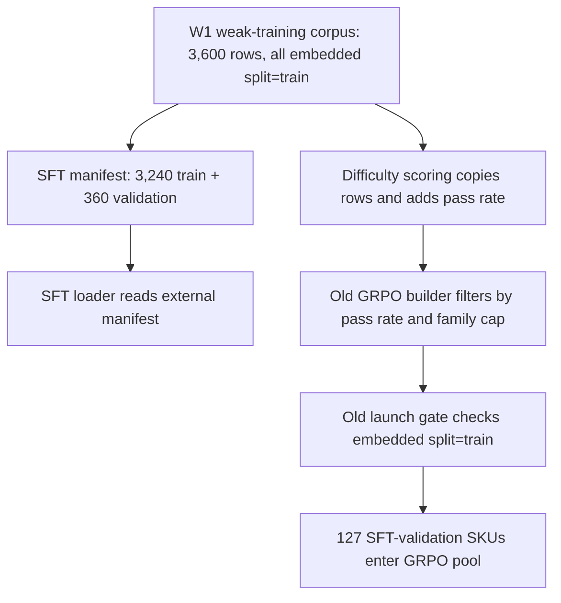

# GRPO Run 2 technical blog tracker

**Status:** active evidence ledger; update after every completed conceptual step
**Started:** 2026-08-11
**Last updated:** 2026-08-13
**Current boundary:** confirmation acquisition stopped at the fail-closed source-permission gate; no product endpoint was touched
**GPU used for this tracker so far:** none
**Execution plan:** [`W2_GRPO_RUN2_PLAN.md`](W2_GRPO_RUN2_PLAN.md)
**Reward payoff contract:** [`W2_GRPO_RUN2_REWARD_PAYOFFS.md`](W2_GRPO_RUN2_REWARD_PAYOFFS.md)
**Reward scale contract:** [`W2_GRPO_RUN2_REWARD_SCALES.md`](W2_GRPO_RUN2_REWARD_SCALES.md)
**Comparison contract:** [`W2_GRPO_RUN2_COMPARISON_CONTRACT.md`](W2_GRPO_RUN2_COMPARISON_CONTRACT.md)
**Gate G10 result contract:** [`W2_GRPO_RUN2_GATE_G10_RESULT_CONTRACT.md`](W2_GRPO_RUN2_GATE_G10_RESULT_CONTRACT.md)
**Gate G10 result artifact:** [`runs/grpo-run2-gate-g10-result.json`](runs/grpo-run2-gate-g10-result.json)
**D3 result contract:** [`W2_GRPO_RUN2_D3_RESULT_CONTRACT.md`](W2_GRPO_RUN2_D3_RESULT_CONTRACT.md)
**Corrected D3 aggregate:** [`runs/grpo-run2-d3-candidate-analysis.json`](runs/grpo-run2-d3-candidate-analysis.json)
**Diagnostic invalid aggregate:** [`runs/grpo-run2-d3-candidate-analysis-invalid-class-balanced-target.json`](runs/grpo-run2-d3-candidate-analysis-invalid-class-balanced-target.json)
**Independent D3 verification:** [`runs/grpo-run2-d3-independent-verification.json`](runs/grpo-run2-d3-independent-verification.json)
**Gates G1-G9:** [`runs/grpo-run2-d4-gates-g1-g9.json`](runs/grpo-run2-d4-gates-g1-g9.json)
**Universal gate merge:** [`runs/grpo-run2-d4-universal-gate-decision.json`](runs/grpo-run2-d4-universal-gate-decision.json)
**Offline reward selection:** [`runs/grpo-run2-d4-reward-selection.json`](runs/grpo-run2-d4-reward-selection.json)
**Run 2 data roles:** [`runs/grpo-run2-data-role-manifest.json`](runs/grpo-run2-data-role-manifest.json)
**Confirmation source audit:** [`runs/grpo-run2-confirmation-source-audit.json`](runs/grpo-run2-confirmation-source-audit.json)
**Confirmation acquisition contract:** [`W2_GRPO_RUN2_CONFIRMATION_CONTRACT.md`](W2_GRPO_RUN2_CONFIRMATION_CONTRACT.md) and [`runs/grpo-run2-confirmation-acquisition-contract.json`](runs/grpo-run2-confirmation-acquisition-contract.json)
**Confirmation terms audit:** [`runs/grpo-run2-confirmation-terms-audit.json`](runs/grpo-run2-confirmation-terms-audit.json)
**Confirmation readiness audit:** [`runs/grpo-run2-confirmation-readiness.json`](runs/grpo-run2-confirmation-readiness.json)
**Merchant permission protocol:** [`W2_GRPO_RUN2_PERMISSION_REQUEST.md`](W2_GRPO_RUN2_PERMISSION_REQUEST.md)
**Run 1 diagnosis:** [`W2_GRPO_RUN1_DIAGNOSIS.md`](W2_GRPO_RUN1_DIAGNOSIS.md)
**Earlier W2 tracker:** [`W2_GRPO_BLOG_TRACKER.md`](W2_GRPO_BLOG_TRACKER.md)

This file is the technical source brief for the next blog or series of blogs.
It preserves the chronology, evidence, mistakes, code paths, tests, artifact
hashes and bounded interpretations. The eventual article should be shorter and
more narrative, but every numerical or causal claim should trace back here.

## 1. Current story

The first GRPO run completed cleanly but regressed against the SFT baseline.
Before redesigning its reward, we audited the data boundary and found a second,
independent problem: the word `train` meant two different things in two stages
of the pipeline. Every row in the 3,600-row weak-training corpus carried an
embedded `split="train"`, but a later authoritative manifest divided that same
corpus into 3,240 SFT-training and 360 SFT-validation rows. SFT respected the
manifest; difficulty scoring and the original GRPO pool path preserved and
trusted the older embedded field. As a result, 127 SFT-validation products
entered the 1,565-row GRPO pool and 21 were used during Run 1. We built a
hash-pinned auditor, repaired the builder to enforce both SKU and product-family
boundaries, and created a new 1,438-row train-only pool without overwriting Run
1. A paired cell-transition audit then found modest, localized evidence for the
overcommitment hypothesis: among 70 SFT abstentions that GRPO turned into
answers, 39 became wrong and 31 became correct, with half of that eight-cell
excess coming from `collar_type`. Outside `collar_type`, the split was nearly
even. This does not prove the split defect or reward caused the regression; it
prevents the next experiment from mixing data-boundary and reward-design effects
and narrows what the dense reward must address. A training-only replay then
showed that the original reward varies in every selected starting-policy group
but remains coarse: 94.7% of active groups contain only two total-reward levels.
Across all authoritative training products, 48.5% of groups have zero variance.
The dense-reward gate must therefore measure ranking resolution on the active
pool, not demand an impossible reduction below its existing 0% zero-variance
baseline. Before implementing a replacement, we locked its ordinal behavior
and then its numeric scale without inspecting candidate rollout rewards:
correct, abstain and wrong map to `+1/0/-1`; multi-value `details` uses a
set-F1 curve; rare-class weights are clipped; rule costs are capped; and the
malformed floor remains below the worst valid score. All eight executable
proofs passed. We then implemented the shared strict semantic gate and proved
it against 17 adversarial CPU cases, including duplicate keys and all three
known verifier loopholes. Candidate U's gold-known scorer now applies the
centered field payoffs, excludes gold unknowns, and gives order-insensitive
set-F1 partial credit with a per-field audit ledger. We then composed the gate,
semantics and bounded rule cost into one auditable Candidate U result: malformed
gets `-1.25`; eligible output gets semantic score minus `0.05` per violation up
to the cap. Its thin TRL-compatible adapter now preserves batch alignment and
validates all trusted gold before mapping any completion. The complete CPU suite
has 564 passing tests. Candidate UA's separate gold-unknown component now
rewards honest abstention and penalizes unsupported scalar, null and multi-value
commitments without diluting the score with known fields. The full suite now has
573 passing tests. Those two populations are now combined using the locked
`58.1%/41.9%` training-cell shares, while no-unknown products keep their known
score unchanged. UA now composes that semantic score with the strict gate,
malformed floor and bounded rule cost; a direct fixture shows U scoring an
unsupported unknown commitment `1.0` while UA scores about `0.1621`. The full
suite now has 585 passing tests. U and UA now share one thin batch adapter and
differ only in their single-record scorer; the full suite has 589 passing tests.
Both are implementation-complete for offline replay. We then derived CB's
training-only class map from the corrected 1,438-row pool without inspecting
candidate outcomes: 116 attribute/class pairs span support 1 to 1,151; 24
weights hit the `0.5` floor, 20 hit the `2.0` ceiling and 72 remain unclipped.
Unknown supplies no class support, N/A is explicit, and multi-label `details`
creates one support count per gold label but remains one reward-bearing field.
The published map is hash-locked, independently revalidated and exposed as a
read-only lookup. CB reuses U's exact known-field utilities and changes only
their normalized weights, then reuses UA's exact unknown scorer and locked
`58.1%/41.9%` population mixture. A controlled example moves from UA
`0.5642211405` to CB `0.7017898864`; the unknown ledger is identical and the
delta equals the known population share times the weighted-known delta. The
full CPU suite reached 606 passing tests. CB now also composes raw completion
text, the strict gate, malformed floor, weighted unknown-aware semantics and
the shared bounded rule cost into one auditable single-record result. The full
suite reached 613 passing tests. CB now uses the same batch path through a
factory that hash-checks and prepares the class map once at adapter construction,
validates every gold record and required class weight before mapping, and
delegates all reward math to the single-record scorer. The real ordered batch
returns `[1.0, -1.25, 0.3717332036]`; the full suite reached 619 passing tests.
We then replayed the original reward and all three candidates over the same
11,504 training-only completions, preserving 1,438 groups of exactly eight in a
deterministic raw evidence artifact. The full suite now has 623 passing tests.
Before opening that artifact for aggregate analysis, we locked the exact
group-first comparison metrics, 10,000-replicate paired bootstrap, acceptance
gates and complexity-aware candidate hierarchy. We then proved the analyzer,
raw-replay adapter, field/class dominance summaries and product-segment
summaries on synthetic evidence only. Those layers preserve the product as the
statistical unit, reject denominator and ledger drift, and distinguish a
measured contribution share from a gate decision. A single streaming
orchestrator now hash-checks every input before decompression, adapts each group
once and publishes atomically only after complete validation. Its first
successful-path test exposed a missing import; retaining that red test documents
why end-to-end fixtures matter even when failure-path tests pass. Finally, a
production preflight verified the real manifest, compressed replay, comparison
contract and CB class map—including the 1,438-group/11,504-completion lineage
and locked bootstrap settings—without opening gzip or calculating any candidate
aggregate. The full CPU suite reached 655 passing tests. We then locked the
separate 3,240-product/25,920-completion Gate G10 replay contract and implemented
its file-I/O-free scope/iteration core. Eleven synthetic tests proved exact
manifest order, validation and family exclusion, complete k=8 groups, fixed
role and ordered hashes, plus delegation to the existing shared scorer. The
publication layer now stages deterministic gzip and manifest files before
linking either one, rejects collisions and active-replay aliases, and rolls back
the first link if the second fails. Seventeen synthetic tests pass, including
byte-identical builds in two temporary repositories, and the full suite now has
672 passing tests. A read-only production scope preflight then verified all
3,600 source products and 28,800 source rollouts, selected the exact 3,240
authoritative training products, excluded all 360 validation products and
reproduced both ordered hashes in 1.17 seconds. Candidate values remain stored
but unopened at the aggregate level: no real reward distribution, ranking,
acceptance gate or winner had been calculated. At that historical milestone no
full-training replay had been published, and no Run 2 GPU training or reward
winner selection had occurred.
The first real publication attempt then stopped safely at `details/gathered`:
CB's class weights were derived only from the active pool, while the full
diagnostic scope contains classes unseen there. A gold-only audit found 13 such
attribute/class pairs across 50 products and 53 class observations, with zero
affected active products. Both intended output files remain absent.
We then locked a diagnostic-only extension: each valid gold class with zero
active support receives the existing clipped maximum weight `2.0`; every base
weight remains unchanged. The 13-entry ledger hashes to `aeb089…7416`, five new
policy tests pass and the full suite now has 677 passing tests. The extension is
now mandatory in publication: the publisher proves the lookup equals the base
map plus exactly the ledger additions, scores with that derived lookup and
embeds the complete ledger and hash in the manifest. Mismatches fail before
scoring. The integration brought the focused file to 25 passing tests and the
full suite to 680. Updating the reward-scale prose intentionally changed its
hash; the deterministic comparison-contract test caught the stale provenance,
so only the stored byte count/hash were refreshed and the no-decompression
production preflight passed again. At that integration milestone, the real
retry remained deferred.
The explicit CPU retry then succeeded in 17.19 seconds, publishing 3,240 groups
and 25,920 completions. Independent streaming verification reproduced both
ordered hashes, found zero validation SKUs and showed that every one of the
1,438 overlapping active groups is content-identical to the earlier active
replay after removing only its scope-specific group position. No reward
distribution, Gate G10 value, ranking or winner was calculated.
The analysis preflight now accepts both replay scopes together. It pins the
published full manifest and records byte counts and SHA-256 identities,
recomputes the embedded 13-entry CB ledger hash, proves the full role/path is
distinct from the active replay and verifies the declared 1,438 + 1,802 scope
composition. The real production preflight passed without opening either gzip.
We then built Gate G10 in deliberately separated layers before reading any real
candidate outcome: exact 12-decimal tie arithmetic, a one-product ledger
adapter, a shared multi-product collector and a synthetic manifest-verified
streaming orchestrator. The locked 40% threshold means at most 1,296 of 3,240
products may be zero-variance, versus 1,571 for the original reward—a required
reduction of 275 product groups. Synthetic fixtures proved exact-boundary
behavior, shared U/UA/CB denominators, contiguous product order, unique SKUs,
hash reproduction and fail-closed corruption handling. The first end-to-end
gzip test also corrected a schema assumption: canonical JSON physically orders
candidate keys as `CB`, `U`, `UA`, so the adapter now validates candidate
membership and explicitly imposes analytical order instead of treating JSON
object order as meaningful. The related stack passes 62 focused tests and the
complete CPU suite passes 704 tests. The real full replay remains unopened by
the Gate path; no real Gate G10 value, candidate ranking or winner exists.
The production result boundary is now locked as a separate final layer. It
accepts only the verified production preflight plus a fully validated
3,240-product in-memory collection, recomputes candidate arithmetic and the
40% threshold, and publishes exclusively and atomically to one path without
overwriting. Fabricated pass/boundary/fail values exercise the contract but are
not model findings. The related stack passes 65 tests and the complete CPU
suite passes 713 tests. The real full replay is still unopened by Gate analysis,
so no production G10 result has been calculated or published.
The production launcher first exposed only a preflight path. A real invocation
revalidated all six pinned inputs and the 3,240-product lineage while gzip
opening was forcibly disabled, checked the locked result path before and after
hashing, and stopped with every calculation, ranking and publication flag
false. At that preflight-only milestone the result remained absent; the related
stack passed 71 tests and the complete CPU suite passed 719 tests.
It now has a separate, mutually exclusive `--execute` path implementing the
locked sequence through atomic publication. Synthetic replacements for the
production preflight and replay stream exercised that path end to end in a
temporary repository; lineage drift and a publication race failed closed.
Neither default invocation nor mixed flags are accepted. The production execute
flag had not yet been invoked at that implementation milestone, so real G10
values remained unknown. The related stack then passed 75 tests and the
complete CPU suite passed 723 tests.
The explicit real CPU execution then opened only the pinned full-training gzip
once and published the Gate G10 result in 2.32 seconds. U has 860/3,240
zero-variance products (26.54%), UA 439/3,240 (13.55%) and CB 438/3,240
(13.52%); all are below the inclusive 1,296-product/40% boundary. A separate
standard-library verification re-hashed the result and all six sources and
recomputed every count, share, histogram denominator, margin and pass decision
without decompressing either replay. The one-product UA/CB difference is not a
quality ranking. Active-pool D3 metrics, Gates G1-G9 and selection remain
unopened and unapplied.
Before opening the active replay, the one D3 output path and complete aggregate
schema are now locked. The contract reconciles source identities, 1,438-product
lineage, reward-shape denominators, seven directional targets, harmful-coverage
counts, whole-product bootstrap settings, field/class grain and three segment
partitions while keeping every gate/ranking flag false. A red test exposed
mutable expected-source dictionaries that could alias a tampered artifact; the
identities are now immutable. Eight focused, 44 related and 731 total tests
pass. The real active replay remains unopened and the D3 output remains absent.
The production D3 path was subsequently authorized and opened under a one-gzip
runtime guard. The first attempt failed safely because every raw group stored a
null difficulty field even though the selected pool retained valid k=8 rates.
All 1,438 rates were reconstructed exactly from the embedded rollout `passed`
booleans, and the adapter was repaired to verify rather than invent this value.
The first resulting aggregate then exposed a second issue during independent
verification: `class_balanced_known_utility` held CB's combined known-plus-
unknown semantic score instead of its predeclared weighted known-only score.
That artifact is preserved as diagnostic evidence and forbidden for selection.
The target was separated from CB reward reconstruction, the full suite reached
750 passing tests, and a corrected 1,438-product aggregate was published with
no gates, ranking or winner.

The corrected aggregate subsequently passed a separate standard-library
reconstruction. Applying the predeclared gates then removed U because only
49.37% of active groups had at least three reward levels, just below the 50%
minimum. UA and CB passed all ten universal gates. The complexity-aware rule
selected **UA**: CB added pairwise resolution and a small class-balanced
alignment gain, but the gain was `+0.01175` versus the required `+0.03`, and
CB's harmful-coverage delta was `+0.02252` with a 95% interval ending at
`+0.03904`, above the `+0.02` noninferiority allowance. This selects an offline
reward design; it does not show that GRPO will improve the model.

We then locked the 360-row authoritative SFT validation set as development
data, split into 204 difficult, 46 middle and 110 easy-retention products, with
zero SKU or normalized-family overlap against the 1,438-row Run 2 training
pool. None of the existing 4,000 labeled products can serve as untouched final
confirmation, so a new 400-product confirmation set is required. Its collection,
selection and labeling rules were frozen before acquisition. A pure metadata-only
selector now enforces those rules and passes 10 focused synthetic tests; the
complete repository suite passes 792 tests. No confirmation product has been
fetched or labeled, no confirmation model output exists and no GPU work has
been authorized.

### Latest evidence snapshot

| item | current evidence |
|---|---|
| Corrected active pool | 1,438 SFT-training-only products; zero authoritative validation SKU/family overlap |
| CB class artifact | `runs/grpo-run2-cb-class-weights.json`; 27,446 bytes; SHA-256 `7b53323a7f1c170fa68c6b1a0d1356c67fd827f70f466ba2972b857418f4ab37` |
| CB support distribution | 116 attribute/class pairs; support 1–1,151; 17 below 5 and 30 below 10 |
| CB cap activation | 24 minimum, 20 maximum, 72 unclipped; 44/116 or 37.9% touch a cap |
| Candidate implementation | U, UA and CB complete through the shared trainer batch path |
| Raw D3 replay | 1,438 groups × 8 = 11,504 unique completion keys; original + U/UA/CB ledgers |
| Raw replay artifact | 1,921,202 bytes; SHA-256 `30e3ea8681ca80de5737cc5928b8a755e8b14cd36f6c0a67e00385a8408be38a` |
| Comparison contract | exact group-first metrics, D4 gates, candidate hierarchy and paired-bootstrap settings locked before aggregate replay |
| Analysis stack | analyzer core, strict raw-replay adapter, dominance/segment summaries and atomic streaming orchestrator proven on synthetic data |
| Production preflight | active and full pairs hash-consistent; 1,438/11,504 active and 3,240/25,920 full lineages declared; both gzip files unopened |
| Full-scope preflight lock | full manifest `ad7f4b8b…c9a0`, records `9b4a1109…fcf9`, and CB ledger `aeb089a1…7416` independently pinned/recomputed |
| Dual-preflight/full-builder focused milestone | 36 passed in 1.30 seconds |
| Selection status | UA selected for offline reward design; Run 2 training/checkpoint contract not yet locked |
| GPU use | none |
| Full-training replay contract | 3,240 products, 25,920 completions, separate role/paths and ordered hashes locked before core implementation |
| Full-training builder | scope validation, shared scoring, deterministic pair staging/publication and rollback pass 17 synthetic tests |
| Full-training production preflight | 3,240 train + 360 excluded validation; 28,800 source rollouts; ordered hashes match; 1.17 seconds |
| First real publication attempt | safely aborted after 3.41 seconds at missing CB weight `details/gathered`; neither output exists |
| CB scope gap | 13 active-unseen attribute/class pairs; 53 observations; 50 full-training products; 0 active products |
| CB diagnostic extension | 13 classes at locked weight `2.0`; existing active weights unchanged; ledger SHA-256 `aeb089…7416` |
| Manifest integration | publisher requires audited extension; complete ledger embedded; lookup/ledger mismatch fails before scoring |
| Current comparison contract | 12,079 bytes; SHA-256 `8692291a…1142`; rules unchanged, scale-doc provenance refreshed |
| Full-training records | 4,168,170 bytes; 3,240 × 8 = 25,920 keys; SHA-256 `9b4a1109…fcf9` |
| Full-training manifest | 10,709 bytes; SHA-256 `ad7f4b8b…c9a0`; complete extension ledger embedded |
| Cross-scope identity | all 1,438 active groups reproduce exactly; full scope adds 1,802 non-active training products |
| Gate G10 core | exact group-first 40% test with 12-decimal ties; synthetic only; 5 focused tests passed |
| Gate G10 one-group adapter | validates SKU, ordered source keys, exact U/UA/CB set/identity/eligibility and finite final rewards; emits locked analytical order |
| Gate G10 collector | same ordered products for U/UA/CB; contiguous positions, unique SKUs and shared denominator proven synthetically |
| Synthetic Gate G10 orchestration | identity preflight → one full-gzip stream → manifest lineage match → shared collector; no publication |
| Production G10 result contract | exact schema, source identities, gate constants, candidate arithmetic, 3,240 per-group lineage entries and interpretation boundary validated |
| Locked G10 result path | `runs/grpo-run2-gate-g10-result.json`; exclusive atomic publication, never overwrite |
| Latest focused result-contract tests | 9 passed in 0.20 seconds |
| Production G10 launcher | mutually exclusive `--preflight-only` and explicit `--execute`; no default or mixed mode |
| Real launcher preflight | passed for 3,240 groups/25,920 completions with gzip opening patched to fail; result absent |
| Synthetic execution proof | preflight → one full stream → shared collection → lineage verification → contract build → exclusive publication in temp repo |
| Real Gate G10 execution | one guarded full-gzip open; 3,240 groups/25,920 completions; 2.32 seconds; no active replay decompression |
| Gate G10 result | `runs/grpo-run2-gate-g10-result.json`; 8,126 bytes; SHA-256 `6a602e629a58e6a7c006fb9a86ff7fcee5c1821ed7505f0b88fdfdc89b661e0d` |
| U Gate G10 | 860 zero-variance groups, 26.5432%, pass; margin 436 groups |
| UA Gate G10 | 439 zero-variance groups, 13.5494%, pass; margin 857 groups |
| CB Gate G10 | 438 zero-variance groups, 13.5185%, pass; margin 858 groups |
| Independent G10 verification | result/source hashes and all arithmetic reproduced without replay decompression; pass |
| D3 production result contract | exact source/lineage, product-group metrics, bootstrap, diagnostics and no-selection schema locked |
| Corrected D3 result | `runs/grpo-run2-d3-candidate-analysis.json`; 16,079,523 bytes; SHA-256 `5812b23c…c7fb` |
| Diagnostic invalid D3 result | `runs/grpo-run2-d3-candidate-analysis-invalid-class-balanced-target.json`; 16,147,495 bytes; SHA-256 `2fe0aa5a…44a2` |
| D3 contract red test | mutable expected-source dictionaries could alias artifact dictionaries; constants made immutable |
| D3 launcher integration | construction separated from publication; four-input production launcher fixes the sole output |
| Real D3 launcher preflight | 1,438 groups/11,504 completions and both ordered hashes verified with gzip opening patched to fail; result absent |
| Synthetic D3 execution proof | exact `build -> validate -> publish` order; invalid complete artifact never reaches publisher |
| D3 CLI authorization | mutually exclusive required `--preflight-only` or `--execute`; omitted and mixed modes rejected |
| Guarded preflight after authorization | real preflight passed with gzip opening and execution dispatch both patched to fail |
| First real D3 attempt | safely aborted on first group: all 1,438 embedded difficulty values were null; no output published |
| Difficulty reconstruction | all 1,438 embedded k=8 pass ledgers exactly matched the scored pool; bands 571 low, 452 middle, 415 high |
| First published D3 result | 49.678 seconds, one gzip open; later invalidated for mislabeled CB analytical target |
| Independent-verifier discovery | artifact used combined CB semantics for `class_balanced_known_utility`; 1,435 contributing groups vs correct 1,419 |
| Corrected D3 publication | 45.575 seconds, one gzip open; 1,438 products/11,504 completions; no gates/ranking/winner |
| Latest related D3 repair tests | 49 passed in 1.42 seconds |
| Latest focused Gate/replay/preflight tests | 75 passed in 1.85 seconds |
| Independent D3 verification | passed; all source identities, denominators, reward distributions, directional targets, bootstraps, segments and contribution summaries reproduced |
| G1-G9 result | UA and CB pass; U fails only G3 because 710/1,438 = 49.37% of groups reach at least three reward levels vs 50% required |
| Universal G1-G10 merge | UA and CB eligible; U excluded; active and full-training denominators remain separate |
| Offline reward selection | UA selected; CB fails its `+0.03` class-balanced gain requirement and harmful-coverage `+0.02` noninferiority allowance |
| Development data | 360 authoritative SFT-validation products: 204 difficult, 46 middle, 110 easy-retention; zero Run 2 training SKU/family overlap |
| Untouched local confirmation source | none; all 4,000 labeled products are allocated, frozen 300 is burned and only 65/100 probe rows are family-clean |
| Confirmation contract | acquire at least 800 family-clean candidates, deterministically select 400 across at least 8 stores, then label/review without changing membership |
| Confirmation selector | metadata-only, deterministic, maximum 4/family and 60/store, fail-closed on labels/predictions/difficulty; 10 focused tests pass |
| Latest full CPU suite | 792 passed in 70.26 seconds, exit code zero |
| Next boundary | re-probe approved Shopify domains and acquire at least 800 family-clean candidates; do not label during acquisition |

## 2. Candidate blog angles

Possible titles:

1. **Our RL Run Failed—Then the Data Audit Found a Second Experiment Hiding Inside It**
2. **When `train` Means Two Different Things: Repairing an RL Evaluation Boundary**
3. **Why Exact SKU Separation Was Not Enough for Our Product-Tagging RL Experiment**
4. **Before Tuning the Reward, Audit the Split**
5. **A Clean GPU Run Can Still Be a Dirty Experiment**
6. **Designing an RL Reward Without Looking at Which Candidate Wins**
7. **One Ablation at a Time: Separating Unknown Policy from Class Balancing**
8. **When a Reward Is Defined for Training but Not for Its Diagnostic Set**
9. **All Three Rewards Passed the Gate—So Why Could We Still Pick None?**
10. **More Reward Variation Is Not the Same as a Better Reward**
11. **Why the More Sophisticated RL Reward Lost to the Simpler One**
12. **Build the Test-Set Bouncer Before You Collect the Test Set**
13. **How We Froze an RL Confirmation Set Before Seeing Any Labels**

Potential series structure:

- Post A: Run 1’s clean execution and negative result.
- Post B: diagnosing sparse reward and overcommitment hypotheses.
- Post C: discovering and repairing the split boundary before Run 2.
- Post D: predeclaring dense payoffs, building U/UA/CB and freezing CB weights
  before candidate replay.
- Post E: widening only the diagnostic denominator, catching CB's zero-support
  boundary and extending it without changing active-pool rewards.
- Post F: predeclaring and executing Gate G10, where all three dense rewards
  pass variation but the experiment correctly refuses to rank them.
- Post G: active-pool directional/harm analysis and reward selection, if a
  candidate clears every remaining gate. UA cleared selection while CB failed
  its complexity-upgrade conditions.
- Post H: designing a fresh confirmation set after every local labeled row was
  already allocated, including the metadata-only selector and leakage controls.
- Post I: corrected control versus dense reward, if/when those runs complete.

## 3. Context carried forward from Run 1

Run 1 began from `runs/sft-combined-2epoch/checkpoint-406` and trained for 300
optimizer steps with one product and eight completions per step. Its three
binary rewards were weighted `1:1:2`: valid format, vocabulary/rule compliance,
and whole-record golden agreement. It used `beta=0`.

The locked legacy comparison found:

| metric | SFT | GRPO | delta |
|---|---:|---:|---:|
| macro-F1 | 0.6411 | 0.6223 | **-0.0188** |
| selective macro-F1 | 0.7170 | 0.6578 | **-0.0591** |
| coverage | 94.30% | 96.77% | **+2.47 pp** |
| rule violations | 12 | 28 | **+16** |

The reward-signal diagnosis also found:

- 98 of 300 groups had zero total within-group reward variance;
- format varied in 0 groups;
- compliance varied in 33 groups;
- whole-record agreement varied in 199 groups;
- total reward varied in 202 groups.

That reward diagnosis remains a hypothesis set, not a proven causal account.
The split repair described below is required before a clean reward ablation.

## 4. The data model that created the ambiguity

### 4.1 W1-level split

The original data workflow divided a broader labeled catalog into three roles:

- frozen evaluation;
- production-style probe;
- a 3,600-row weak-training corpus.

`labeling/splits.py` assigned every member of the third collection the embedded
value `split="train"`. At that stage the field was correct: it distinguished
the weak-training corpus from the W1 frozen and probe sets.

### 4.2 W2 SFT-level split

W2 later subdivided those same 3,600 rows for supervised fine-tuning:

- 3,240 SFT-training SKUs;
- 360 SFT-validation SKUs.

This assignment was stored externally in `data/splits/sft-v1.json`. It was
family-grouped and hash-bound to `data/train_weak.jsonl`. It deliberately did
not rewrite each source row’s older embedded field.

### 4.3 Where the integration broke

SFT correctly loaded the external manifest in `training/dataset.py`.
Difficulty scoring then copied all 3,600 rows and changed only
`difficulty.sft_pass_rate`, preserving `split="train"`. The original GRPO pool
builder selected mixed-difficulty products and applied family cap four, but
never consulted the SFT manifest. The launch preflight checked only the embedded
field, so it confirmed the wrong definition of training membership.



The root cause was therefore an integration/design error, not file corruption:
two valid split concepts shared one overloaded name, and the GRPO boundary
trusted the older representation.

## 5. Phase B1: read-only boundary audit

### 5.1 Why audit before repair

We first measured the problem without changing any source data, pool or
manifest. That preserved the exact Run 1 evidence and prevented a fix from
silently rewriting the failure we were trying to understand.

`training/audit_data_boundaries.py`:

- treats `data/splits/sft-v1.json` as authoritative;
- verifies its source checksum;
- verifies the historical cap-four manifest against its dataset;
- reconstructs the 300 unique Run 1 products from all 2,400 durable rollouts;
- compares SFT train, SFT validation, GRPO pool, Run 1 products, probe 100 and
  legacy frozen 300;
- reports both exact-SKU and normalized product-family overlap;
- records the member SKUs on both sides of every shared family;
- refuses duplicate IDs, missing family records, hash drift, malformed Run 1
  rollout structure and output collisions.

Audit artifact:

| property | value |
|---|---|
| path | `runs/grpo-run2-data-boundary-audit.json` |
| version | `grpo-data-boundary-audit-v1` |
| status | `issues_found` |
| bytes | 584,087 |
| SHA-256 | `95997f6b89d6c821b8e81b9a4f53acb05a29e6c90b422d8530275f7a82cac61f` |

The object rebuilt deterministically from the same hash-verified inputs.

### 5.2 Exact split conflict

| collection | total | authoritative SFT train | authoritative SFT validation |
|---|---:|---:|---:|
| historical GRPO pool | 1,565 | 1,438 | **127** |
| products actually used by Run 1 | 300 | 279 | **21** |

The 127 pool conflicts span 99 normalized families. The 21 Run 1 products span
20 validation families.

### 5.3 Exact SKU separation did not guarantee family separation

The probe and legacy frozen sets have zero exact-SKU overlap with the historical
GRPO pool, but normalized brand-plus-family-title matching found:

| comparison | shared families | training-side SKUs in shared families | other-side SKUs in shared families |
|---|---:|---:|---:|
| GRPO pool vs probe 100 | 37 | 82 | 39 |
| Run 1 products vs probe 100 | 15 | 16 | 16 |
| GRPO pool vs legacy frozen 300 | 33 | 65 | 45 |
| Run 1 products vs legacy frozen 300 | 10 | 12 | 14 |

Family overlap means that variants such as different colors or sizes of a
normalized product family can sit on opposite sides even when SKU IDs differ.
It does not prove memorization or label leakage by itself. It changes the
standard for future model-selection and confirmation sets: both SKU and family
overlap must be zero.

### 5.4 Audit tests

```bash
uv run python -m pytest tests/test_audit_data_boundaries.py -q
```

Result: **6 passed**. Tests cover deterministic output, SKU-versus-family
overlap, duplicate and unmapped IDs, source hash drift, pool hash drift, Run 1
rollout structure and collision-safe publication.

## 6. Phase B2: boundary repair

### 6.1 New authority rule

For GRPO, the external SFT manifest now decides whether a product is training
eligible. The embedded W1 field remains useful provenance but cannot authorize
GRPO membership.

The corrected builder path:

1. verifies the historical 3,600-row difficulty audit;
2. loads and hash-verifies the authoritative SFT manifest and source;
3. verifies complete, unique and disjoint train/validation SKU assignments;
4. rejects any train/validation normalized-family overlap;
5. filters to the 3,240 authoritative SFT-training rows;
6. recomputes mixed-difficulty eligibility;
7. reapplies deterministic family cap four;
8. records the SFT manifest path, hash and version in the new pool manifest;
9. records explicit zero-validation SKU/family invariants.

The CLI option is:

```bash
--sft-split-manifest data/splits/sft-v1.json
```

It is optional only so the historical Run 1 pool can still be reproduced. Run
2 must explicitly supply it.

### 6.2 Test-driven progression

The repair was developed in observable stages:

1. A red unit test showed the authoritative filter did not exist.
2. The filter was implemented and returned exactly 3,240 training rows.
3. A red integration test showed pool writing did not accept the manifest.
4. The writer was connected and produced the expected 1,438-row temporary pool.
5. CLI forwarding was tested without creating files.
6. A tampered source checksum was proven to fail before either output existed.
7. A SKU-disjoint but family-leaking synthetic manifest was initially accepted.
8. Family-level enforcement was added and that red test turned green.

Focused pool-builder result: **8 passed**.

### 6.3 Why the historical path remains

The old pool and manifest are part of Run 1 provenance. Reinterpreting or
overwriting them would destroy auditability. Calls without the new SFT-manifest
argument retain historical behavior; new Run 2 artifacts use a new manifest
version and new output paths.

## 7. Phase B3: corrected train-only pool

The exact build command was:

```bash
uv run python -m training.build_grpo_pool \
  --sft-split-manifest data/splits/sft-v1.json \
  --output-data data/train_weak_grpo_cap4_sft_train_v1.jsonl \
  --output-manifest runs/sft-difficulty-k8/grpo-pool-cap4-sft-train-v1-manifest.json
```

### 7.1 Selection funnel

| stage | rows | families where measured |
|---|---:|---:|
| authoritative SFT-training source | 3,240 | — |
| mixed-difficulty eligible | 1,565 | 1,051 |
| active after family cap four | 1,438 | 1,051 |
| eligible but capped | 127 | — |

The active set is exactly the historical 1,565-row pool minus its 127
authoritative SFT-validation SKUs.

### 7.2 Corrected composition

Category counts:

| category | rows |
|---|---:|
| shirt/blouse | 309 |
| shoe | 260 |
| top | 246 |
| sweater | 206 |
| jacket | 106 |
| dress | 86 |
| bag | 78 |
| pants | 43 |
| cardigan | 40 |
| shorts | 37 |
| skirt | 12 |
| vest | 11 |
| coat | 3 |
| other | 1 |

Store counts:

| store | rows |
|---|---:|
| Thursday Boots | 228 |
| Everlane | 180 |
| Faherty | 159 |
| American Giant | 149 |
| Taylor Stitch | 149 |
| NAADAM | 135 |
| UNTUCKit | 107 |
| tentree | 81 |
| Marine Layer | 72 |
| Allbirds | 62 |
| Rothy's | 62 |
| Outdoor Voices | 35 |
| Ministry of Supply | 11 |
| Girlfriend Collective | 8 |

### 7.3 Corrected artifacts

| artifact | rows/bytes | SHA-256 |
|---|---:|---|
| `data/train_weak_grpo_cap4_sft_train_v1.jsonl` | 1,438 rows / 3,191,282 bytes | `1ca64f668b0359c2e83850832d5db2ffaf5a5f621556ac4776cf9d5c3fb26a53` |
| `runs/sft-difficulty-k8/grpo-pool-cap4-sft-train-v1-manifest.json` | 82,235 bytes | `42ca7b3ad0b1a1e61539493a693b33ea56238f30004e6a25bcdb9bd24e19282a` |

Independent verification confirmed:

- manifest version `grpo-pool-cap4-sft-train-v1`;
- exact output hash and row order;
- exactly 1,438 rows;
- every active SKU belongs to authoritative SFT training;
- zero authoritative-validation SKU overlap;
- zero authoritative-validation family overlap;
- family cap four;
- 1,051 active families;
- all manifest invariants true;
- equality to the historical active pool minus validation SKUs.

The historical Run 1 pool remains 1,565 rows and still hashes to
`3e378187a8147923bae1e0753a750d6e252336e911fa8c91cd57a4a8ddc3a102`.

Full CPU regression result after B3: **498 passed in 16.78 seconds**.

## 8. Phase B4: independent Run 2 launch boundary

`training/grpo_run2_preflight.py` repeats the corrected-pool contract instead
of trusting the builder's own claims. Before any future model import or GPU
allocation, it independently verifies:

- the corrected dataset, corrected pool manifest and authoritative SFT split
  hashes;
- manifest version `grpo-pool-cap4-sft-train-v1`;
- 1,438 active rows across 1,051 normalized families;
- maximum family size four;
- complete, unique and disjoint 3,240/360 SFT train/validation assignments;
- zero active validation SKU overlap;
- zero active validation-family overlap;
- all builder invariants true.

The passing report records `cuda_imports_performed=false`; this is a CPU gate,
not a hidden launch path. Five focused tests cover the real lock, hard-coded
lock constants, wrong manifest version, a failed builder invariant and a
synthetic family leak reconstructed independently by preflight. The historical
Run 1 verifier was not modified.

## 9. Phase C: paired prediction-transition diagnosis

### 9.1 Question and measurement contract

Run 1 increased coverage while reducing macro-F1. H1 proposed one mechanism:
the reward made guessing more attractive than honest abstention. Aggregate
coverage cannot tell whether newly committed answers were right or wrong, so
`evalharness/transition_analysis.py` pairs the SFT and GRPO output for every
gold-known cell and labels each prediction `abstain`, `correct` or `wrong`.

The analyzer deliberately reuses the evaluation harness semantics:

- gold `unknown` cells are excluded because no answer is scorable;
- `not_applicable` is a real, scorable class;
- model `unknown` is abstention;
- multi-value `details` answers are order-insensitive sets;
- missing predicted fields default to abstention, matching the evaluator;
- parsed but out-of-vocabulary answers remain wrong rather than disappearing.

The exhaustive 3-by-3 state matrix is supplemented with
`unchanged_wrong` versus `wrong_to_different_wrong`. Without that distinction,
calling every wrong-to-wrong cell "unchanged" would hide answer churn.

This analysis uses the exposed legacy frozen 300 for **diagnosis only**. The
artifact explicitly prohibits reward, checkpoint, beta and confirmatory
selection from these results.

### 9.2 Implementation, artifact and tests

The analyzer fails closed on duplicate gold or prediction SKUs, incomplete SKU
pairing, non-raw prediction inputs, unparseable output, a broken frozen-set
seal, and output-path collisions. It records every cell behind the aggregates,
per-attribute summaries, a separate `details` summary, canonical predicted
class and answer frequencies, common-answer concentration, and deterministic
SKU examples for each observed transition.

Artifact:

| property | value |
|---|---|
| path | `runs/grpo-first-300-frozen-eval-300-transitions.json` |
| version | `paired-cell-transition-analysis-v1` |
| role | `diagnosis_only_disclosed_legacy_frozen_set` |
| bytes | 2,496,015 |
| SHA-256 | `a842a766b6fdcbcbf6539cad707845c69b03a93676315a22ab5f7761f29ad19d` |

Locked inputs:

| input | SHA-256 |
|---|---|
| frozen gold | `2d4e3be8d30a15ae8b7e06a8eb20c39b1c0890b25be62888961fc607acca829c` |
| SFT checkpoint-406 predictions | `cae3dbd18937a8aa1d0da75dbd32a8593e5295e5f03ca76fa55a8e988fe6ba4b` |
| GRPO Run 1 predictions | `f14f95ca0d5bde1bf8ece0927b2f02975fed89b1da1cf6da7ebc34ecd5a0573e` |
| vocabulary | `f98eba2177343867ce7f010b0ef4ec8d745b1154219a7137d29ad1807925c17d` |
| rules | `2d5e186fb5157bd1f371aa2009a02052457d49b94e7c3ef0343ec43632157c56` |

Four focused CPU tests pass. They cover all nine state transitions, unchanged
versus changed wrong answers, gold-unknown exclusion, multi-value ordering,
H1 direction, incomplete pairing and duplicate prediction IDs. A second build
matched the published artifact byte-for-byte. The complete CPU suite passes:
**507 passed in 19.89 seconds**.

### 9.3 Overall paired findings

There are 2,755 gold-known attribute cells in the 300 products.

| prediction state | SFT | GRPO | delta |
|---|---:|---:|---:|
| abstain | 157 | 89 | **-68** |
| correct | 2,310 | 2,329 | **+19** |
| wrong | 288 | 337 | **+49** |

The complete paired matrix is:

| SFT -> GRPO | cells | share of gold-known cells |
|---|---:|---:|
| abstain -> abstain | 87 | 3.16% |
| abstain -> correct | 31 | 1.13% |
| abstain -> wrong | 39 | 1.42% |
| correct -> abstain | 2 | 0.07% |
| correct -> correct | 2,265 | 82.21% |
| correct -> wrong | 43 | 1.56% |
| wrong -> abstain | 0 | 0.00% |
| wrong -> correct | 33 | 1.20% |
| wrong -> wrong | 255 | 9.26% |

Of the 70 baseline abstentions that became committed answers, 39 were wrong
and 31 were correct: 55.7% harmful versus 44.3% helpful, an excess of eight
harmful exits. Separately, 43 previously correct cells became wrong while 33
wrong cells became correct. These movements explain how correct cells still
rose by 19 while wrong cells rose by 49: most of the 68-cell abstention drop
became additional coverage, but the added answers were slightly worse than a
50/50 split and there was also correct/wrong churn.

Cell-level exact accuracy therefore rose from 83.85% to 84.54% (+0.69 pp) even
though attribute-macro-F1 fell by 1.88 points. That is not a contradiction:
exact accuracy weights every cell equally, while macro-F1 gives rare classes a
voice comparable to frequent classes. The regression is distributional, not a
claim that GRPO got fewer cells right in total.

### 9.4 The mechanism is concentrated, not universal

`collar_type` accounts for four of the overall eight-cell harmful-minus-helpful
abstention-exit gap:

| scope | abstain -> correct | abstain -> wrong | correct -> wrong | wrong -> correct |
|---|---:|---:|---:|---:|
| `collar_type` | 2 | 6 | 14 | 3 |
| all other attributes | 29 | 33 | 29 | 30 |

For `collar_type`, abstentions fell from eight to zero, correct cells fell from
170 to 161, and wrong cells rose from 24 to 41. Outside `collar_type`, the
abstention exits were close—33 wrong versus 29 correct—and direct
correct-to-wrong versus wrong-to-correct churn was essentially balanced, 29
versus 30.

The multi-value `details` field is a useful counterexample. All 12 SFT
abstentions became answers, but nine became correct and only three became
wrong. Its correct count rose by ten. The same policy change can therefore
produce helpful commitment on one attribute and harmful commitment on another;
a single record-level penalty cannot see that difference clearly.

Other attributes with more harmful than helpful abstention exits include
`closure` (7 versus 0), `pattern` (5 versus 3), `sleeve_length` (5 versus 2),
`occasion` (3 versus 0), `silhouette` (3 versus 0), and `garment_length` (2
versus 1). `neckline`, `sleeve_style`, `colour_primary`, and `details` moved in
the helpful direction. These are descriptive exploratory slices, not 15
independent hypothesis tests.

### 9.5 Common-answer concentration

The data do not support a broad claim that GRPO flooded every field with one
majority answer. Across committed class emissions, the overall top class was
`<not_applicable>` and its share moved only from 26.83% to 27.12% (+0.29 pp).
Outside `collar_type`, that share was effectively flat, 25.46% to 25.41%.

Concentration did rise in specific fields:

- `pattern: solid`, 28.57% -> 34.34% (+5.77 pp);
- `collar_type: <not_applicable>`, 43.81% -> 48.02% (+4.21 pp);
- `details: none`, 60.36% -> 62.82% (+2.46 pp).

That supports a localized common-answer-shift claim for those attributes, not
a model-wide majority-class-flooding claim. For `details`, each exact answer
set counts once in answer-frequency tables, while each emitted detail label
counts once in class-frequency tables; the artifact stores both denominators.

### 9.6 Interpretation and limits

The transition evidence **modestly strengthens but sharply narrows H1**. GRPO
did convert more abstentions into wrong answers than correct answers, but the
margin was only eight cells, and half came from `collar_type`. Outside that
field, harmful and helpful abstention exits were nearly balanced. The stronger
localized problem is `collar_type` answer churn and increased
`not_applicable` concentration.

H1 is therefore not a complete explanation for the macro-F1 regression. The
model got 19 more cells exactly right overall while losing macro-F1, which
points toward *where* correctness moved across attributes and classes—not only
whether the model answered. Phase D should still reward field-level correctness
and abstention, but it must also inspect class-level signal instead of optimizing
raw correct-cell counts.

This result supports designing a field-level reward that distinguishes correct,
abstain and wrong on every scorable attribute. It does not justify tailoring
the reward specifically to these exposed attributes or choosing a candidate by
its performance on this set. Candidate rewards must be compared next on the
same authoritative training-only rollout groups.

Claims that remain disallowed:

- H1 is not proven causal; there is no corrected-pool control in this analysis.
- The eight-cell excess is not treated as statistically independent evidence:
  cells share products and attributes, and no cell-level p-value is reported.
- The frozen 300 cannot select Run 2 after being inspected.
- There is no evidence of universal majority-class flooding.
- Attribute slices are exploratory and were not corrected for multiple
  comparisons.

## 10. Phase D1: training-only original-reward baseline

### 10.1 Why the replay has two scopes

The difficulty artifact contains eight sampled SFT completions for each of all
3,600 weak-training products. The authoritative manifest assigns 3,240 of
those products to SFT training and 360 to validation. The corrected Run 2 pool
is a further 1,438-product subset of authoritative training, selected for mixed
strict-pass outcomes and capped at four variants per normalized family.

Those scopes answer different questions:

- **Run 2 active pool, primary:** What signal exists on the exact product
  distribution Run 2 would sample?
- **Authoritative SFT train, secondary:** What does the same reward do across
  all training-only products, including starting-policy always-fail, mixed and
  always-pass groups?

Reporting only the 3,240 products would blur the actual training distribution.
Reporting only the 1,438 active products would hide why the difficulty filter
exists. The artifact reports both and excludes all 360 validation SKUs.

### 10.2 Replay contract and safeguards

`training/replay_original_reward.py` executes the exact three functions from
`training/rewards.py` in locked order with the original weights:

| component | weight | output |
|---|---:|---|
| format validity | 1 | binary 0/1 |
| vocabulary and rule compliance | 1 | binary 0/1 |
| whole-record golden agreement | 2 | binary 0/1 |

The weighted total is bounded from zero to four. Every generated value is
checked against the schema, compliance and strict-pass grades already stored
in the durable rollout record. All 25,920 authoritative-training replays
matched; any mismatch aborts publication.

The loader also fails closed on hash drift, a non-full difficulty manifest,
source/split disagreement, duplicate or incomplete k=8 groups, noncanonical
rollout order, overlapping or incomplete SFT assignments, an active SKU outside
authoritative training, any active validation SKU, a failed independent Run 2
pool preflight, or an existing output path.

Order-sensitive hashes lock both SKU sequences and rollout keys. Every later
reward candidate must reuse them, preventing evaluation on an easier subset or
order.

Artifact:

| property | value |
|---|---|
| path | `runs/grpo-run2-original-reward-training-replay.json` |
| version | `grpo-run2-original-reward-replay-v1` |
| role | `training_only_offline_original_reward_baseline` |
| bytes | 41,092 |
| SHA-256 | `48f0d8737f9fab231d594dcf178e335fcd5711f817c5158557a7aee839f789b8` |
| implementation SHA-256 | `60f29e90f69ebdad8be80c2220228519c29c808c50ab453383d68b4caf0b3ee1` |
| reward-code SHA-256 | `ac9658028c62a84b32a8ba52c9e53e8d27ecaba05cd6d1703e398917aec1706d` |

Key inputs:

| input | SHA-256 |
|---|---|
| 28,800 difficulty rollouts | `f17360b157287caaea8d0f8e907f0a4bf4fd107977452442e2e447628e95bf8b` |
| SFT split manifest | `4d14d46fa4f7df95a24658c741940db64093e7798b5ccd1558f4faa29bbe9a3b` |
| 3,600-row source | `1cbcbfba5ad379e7c66895d720a997edf913030ee1e76e4917101dfccb09530b` |
| corrected Run 2 pool | `1ca64f668b0359c2e83850832d5db2ffaf5a5f621556ac4776cf9d5c3fb26a53` |
| corrected pool manifest | `42ca7b3ad0b1a1e61539493a693b33ea56238f30004e6a25bcdb9bd24e19282a` |

Four focused CPU tests cover group variance and ties, incomplete and
noncanonical groups, disagreement with durable grades, and the real locked
input boundary. A second run was byte-identical. The full CPU suite passes:
**511 passed in 20.55 seconds**.

### 10.3 Primary result: corrected Run 2 active pool

The primary scope contains 1,438 groups and 11,504 completions. Every group has
a starting-policy strict-pass rate strictly between zero and one.

| channel | completion mean | completion median | groups with variation | zero-variance groups |
|---|---:|---:|---:|---:|
| format validity | 1.0000 | 1.0 | 0 | 1,438 (100%) |
| compliance | 0.9839 | 1.0 | 98 | 1,340 (93.2%) |
| golden agreement | 0.4615 | 0.0 | 1,438 | 0 |
| weighted total | 2.9069 | 2.0 | 1,438 | **0** |

The apparent good news—zero total-reward zero-variance groups—is partly
circular. Selecting `0 < pass_rate < 1` using the same strict-pass outcome that
powers golden agreement guarantees golden and total variation in every retained
starting-policy group.

The more revealing baseline is reward resolution:

- format is saturated: all 11,504 outputs score one;
- compliance varies in only 98 of 1,438 groups (6.8%);
- weighted totals are only 1, 2 or 4;
- 1,362 groups (94.7%) contain only **two** total-reward values;
- in 569 groups (39.6%), the largest tie covers seven of eight completions;
- only 76 groups contain all three observed total-reward values.

The active pool has gradient at the starting policy, but mostly a coarse
pass/fail ranking rather than detailed feedback about which fields were better.

### 10.4 Secondary result: all authoritative training products

The secondary scope contains 3,240 groups and 25,920 completions:

| starting-policy band | groups | weighted-total zero-variance groups |
|---|---:|---:|
| always failed | 965 | 861 |
| mixed | 1,565 | 0 |
| always passed | 710 | 710 |
| **total** | **3,240** | **1,571 (48.5%)** |

Golden agreement varies in exactly the 1,565 mixed groups and is constant in
1,675 groups. Compliance unlocks variation in 104 otherwise always-failed
groups, reducing total zero variance from 1,675 to 1,571. It contributes no
variation in the 710 always-pass groups. Format contributes none anywhere.

Across all completions, total reward has mean 2.8643, median 2.0 and values
only 1, 2 or 4. Group-level variance and tie histograms are primary; individual
completions are not treated as independent experimental units.

### 10.5 What this changes in the plan

The original proposal said a dense reward should materially reduce
zero-variance groups. D1 shows that criterion needs a scope qualifier:

- On the **active pool**, starting-policy zero variance is already 0%, so
  reduction is impossible. A candidate must preserve variation while improving
  ranking resolution, reducing large ties and aligning rank with field-level
  correctness.
- On **all authoritative training groups**, zero variance is 48.5%. A dense
  reward may unlock signal on easy and hard products, but those products are not
  in the current active pool. This is diagnostic reward coverage, not by itself
  a reason to widen Run 2 data.
- Run 1's observed 32.7% remains incomparable: it came from a policy changing
  over 300 updates, whereas D1 freezes one starting-policy sample.

This sharpens H2. The original reward was not sparse in the narrow sense of
lacking starting-policy variance on the active pool. It was **coarse and
selection-dependent**: nearly every active group had only two levels, and
format/compliance supplied little discrimination. As the policy changed,
groups could collapse to one level—exactly what happened in Run 1.

No hypothesis test is appropriate here: this is a deterministic replay of the
complete locked artifact. Candidate comparisons are paired by identical group
and should report effect sizes and distributions, not completion-level p-values.

## 11. Phase D2a: ordinal reward payoff contract

Before choosing constants or writing candidate functions, we locked what the
reward must rank above what. The persistent design is
`W2_GRPO_RUN2_REWARD_PAYOFFS.md`, version
`grpo-run2-reward-payoffs-v1`, 13,526 bytes, SHA-256
`ad50b23923992d8f888657de9ffff5be93d87a39b31d9cbe39c6fc0a86456db7`.

The core known-field constraint is `correct > abstain > wrong > malformed
floor`. Replacing abstention with a correct answer must help; replacing it with
a wrong answer must hurt. Null is a scorable not-applicable claim, not
abstention.

The contract also defines:

- a strict gate requiring one literal JSON object with all 15 fields,
  controlled-vocabulary values and unambiguous multi-value structure;
- separate unknown-neutral and unknown-aware policies so learning the weak
  labeler's abstention behavior is an explicit ablation;
- order-insensitive partial credit for `details`, monotonic in set quality;
- a bounded per-violation rule cost rather than a clean/dirty bonus;
- separate normalization of known and unknown fields;
- field-count normalization so label-dense products do not dominate;
- bounded class balancing as the final candidate-family addition;
- adversarial rows for empty output, all-abstain, common-class flooding,
  unsupported commitment, rule violations and rare-class explosion.

Three candidate identities are predeclared:

1. **U:** uniform known-field ternary reward, gold unknown excluded;
2. **UA:** U plus separately normalized unknown-aware evidence behavior;
3. **CB:** UA plus capped training-support class balancing.

All share the strict gate, multi-value partial credit, rule cost and
normalization. No extra candidate may be added after replay results are visible
without a new written rationale.

The design exposed three current-verifier loopholes relevant to dense reward:
`{}`, `{"details": []}`, and `{"details": ["unknown", "none"]}` are all
currently verifier-clean. Run 2's candidate gate will reject them because they
allow empty-object abstention farming, ambiguous empty-list semantics, and
simultaneous claiming plus abstention. The base verifier was not changed.

No numeric values, component weights, rule cap, class cap, or multi-value
formula were selected in this ordinal substep.

## 12. Phase D2b: bounded numeric reward scale

We next mapped the locked ordering onto finite numbers without calculating any
candidate reward on the rollout completions. The design document is
`W2_GRPO_RUN2_REWARD_SCALES.md`, version
`grpo-run2-reward-scale-contract-v1`, 7,972 bytes, SHA-256
`5a9ab0c7567f1f43e468cd66a6f5e12a018eb2cb86748294de4cfcafa2020d13`.

The semantic scale is centered and easy to read:

- correct known field: `+1`;
- abstention on a known field: `0`;
- wrong known-field commitment: `-1`;
- correct unknown-field abstention: `+1`;
- unsupported unknown-field commitment: `-1`.

Known and unknown fields are normalized separately. When both exist, UA/CB
combine them using the active pool's exact training-cell shares: 12,533 of
21,570 cells are known (`58.1%`) and 9,037 are unknown (`41.9%`). A row with no
unknown field keeps its known score rather than being compressed by an absent
component. Candidate U remains the unknown-neutral comparison.

For multi-value `details`, quality is order-insensitive set-F1 and
`P(q)=2q-1`. A disjoint set scores `-1`, exact match `+1`, and set-F1 `0.5`
equals abstention. This explicitly answers the previously deferred question:
a partial commitment must exceed `0.5` set-F1 to beat honest abstention. Of 955
active labeled-detail targets, 917 contain one value and 38 contain two.

Candidate CB uses
`clip(sqrt(attribute_median_positive_support/class_support), 0.5, 2.0)`.
The active pool has 116 observed attribute/class pairs with support from 1 to
1,151; 17 have support below five and 30 below ten. Per-attribute medians avoid
letting one large class define the typical scale, inverse square root responds
more gently than inverse frequency, the cap limits raw weights to a four-to-one
ratio, and weighted-mean normalization keeps final semantics in `[-1,+1]`.

Rules use a cost instead of a clean bonus:
`-0.15 * min(violations,3)/3`. The first three violations cost `0.05` each.
Among the 11,504 active starting-policy completions, the violation-count
histogram is `0: 11,418`, `1: 81`, `2: 1`, `3: 4`; none exceeded three. The cap
therefore covers observed training structure while protecting against a future
completion triggering many of the pack's 34 rules. Its maximum `0.15` cost is
small relative to the semantic range.

Malformed records receive `-1.25`. A complete valid record can score no lower
than `-1 - 0.15 = -1.15`, so malformed output is always worse and cannot become
an escape from semantic penalties. Valid totals span `[-1.15,+1]`; all outputs
span `[-1.25,+1]`.

The executable contract is `training/reward_scale_contract.py`, 18,284 bytes,
SHA-256 `cd8761357573b719fc32f42c2b5e671a150724795b60d2ff52c275d734802682`.
Five focused CPU tests in `tests/test_reward_scale_contract.py` prove the
ordering at every uniform field density from one through 15, class-weighted
local direction, details endpoints and monotonicity, unknown-aware ordering,
rule monotonicity/capping, malformed-floor safety, and fail-closed argument
bounds.

The generated evidence is
`runs/grpo-run2-reward-scale-contract.json`, version
`grpo-run2-reward-scale-contract-v1`, 18,444 bytes, SHA-256
`a343d93b02022701060f59a20ad9a124bb25b6cbc3ec08602c47b8a9dad3c56d`.
It pins all input hashes, formulas, constants, distributions, class-support
bounds and proof booleans. It explicitly records
`candidate_completion_rewards_calculated=false` and no hypothesis tests. This
is a design contract, not evidence that any candidate works.

## 13. Phase D2c: strict semantic gate implementation

Every candidate now shares one independently tested eligibility gate. At the
gate-only checkpoint, `training/run2_rewards.py`, version
`grpo-run2-candidate-rewards-v1`, was 3,947 bytes, SHA-256
`f6dadda673a8ee2a85bf2dd278cce559aab287958274999bc44daf9bad2f49c5`.
This step deliberately implemented no U/UA/CB payoff calculations.

The gate follows this sequence:

1. require a string from the trainer integration;
2. parse literal JSON without stripping prose, Markdown or repairing syntax;
3. reject duplicate object keys before the ordinary decoder can silently keep
   the last value;
4. require one top-level object containing exactly the pack's 15 fields;
5. reuse the base verifier for scalar/list/null shape and controlled vocabulary;
6. require every multi-value list to be nonempty and duplicate-free;
7. allow `unknown` only as the entire multi-value list, never mixed with claims;
8. preserve cross-field rule violations for the later bounded rule cost instead
   of turning partial semantic information into the malformed floor.

That final distinction matters. Malformed structure is ineligible for semantic
credit, but a complete vocabulary-valid record saying both `sleeveless` and
`puff` is still understandable. It should receive semantic credit for fields
that are useful and then pay the separately capped coherence cost.

The 17 focused tests in `tests/test_run2_rewards.py`, 4,882 bytes, SHA-256
`0c2e2598e174b25110232d73843dc8e2dca813b4541f0db3c04b4fc625facc56`,
cover:

- complete clean, all-abstain and null-`details` records;
- complete rule-violating records that remain eligible;
- malformed JSON, fenced JSON and a top-level array;
- missing and extra fields;
- out-of-vocabulary values and wrong scalar/list shapes;
- duplicate JSON object keys;
- empty, duplicate and mixed-unknown `details` lists;
- non-string trainer inputs as integration errors rather than model rewards.

Most importantly, the tests first confirm that the historical base verifier
accepts `{}`, `{"details":[]}` and `{"details":["unknown","none"]}`, then
confirm that the Run 2 semantic gate rejects all three. This proves the intended
boundary rather than merely asserting it in documentation.

Focused result: **17 passed in 0.19 seconds**. Full CPU result: **533 passed in
21.97 seconds**. No GPU, candidate rollout replay, validation data, frozen data,
or candidate reward outcome was used.

## 14. Phase D2d: Candidate U known-field semantics

The next implementation adds `score_uniform_known_fields` while deliberately
stopping before total-reward composition. The current module is
`training/run2_rewards.py`, version `grpo-run2-candidate-rewards-v2`, 8,282
bytes, SHA-256
`fbf5d7dc090239a17e46311463e8831897995b75e8c893deddaf0ba8236dbb8c`.

Candidate U is the smallest dense candidate and scores only gold-known fields:

| gold-known state | prediction | utility |
|---|---|---:|
| canonical scalar | exact value | `+1` |
| canonical scalar | `unknown` | `0` |
| canonical scalar | another value or `null` | `-1` |
| not applicable | `null` | `+1` |
| not applicable | `unknown` | `0` |
| not applicable | canonical value | `-1` |
| labeled detail set | committed set | `2 * set-F1 - 1` |
| labeled detail set | `["unknown"]` | `0` |
| labeled detail set | `null` | `-1` |

Gold `unknown` fields are not assigned zero and averaged in; they are removed
from Candidate U's denominator and returned in
`excluded_gold_unknown_fields`. The remaining utilities are averaged uniformly,
so one correct plus one wrong field scores zero regardless of how many unknown
fields the product contains. An all-unknown gold record fails closed because
the mean is undefined; the locked active pool has at least two known fields per
product, so encountering one would signal data-contract drift.

The scorer returns more than a scalar. Each `KnownFieldOutcome` records the
field, classification (`correct`, `abstain`, `wrong`, or `partial`), numeric
utility and set-F1 where applicable. This ledger is important for later replay:
we can explain why two completions rank differently instead of reverse-
engineering one total.

Multi-value equality is set-based, not list-based. The first focused test run
found that an exact `details` match returned `+1` before entering the set-F1
branch. The scalar was right, but `set_f1` was missing, and a reordered exact
set could have been treated differently. We changed the branch order so every
committed multi-value prediction goes through set-F1. Both
`["lined","washed"]` and `["washed","lined"]` now produce set-F1 `1` and
utility `+1`.

The focused file `tests/test_run2_rewards.py` is now 9,499 bytes, SHA-256
`fd0ee86cff30eba6b8f46beace4a871abf92aef50c673778cdad4c532c36ac51`,
and covers scalar correct/abstain/wrong, null as not-applicable, exact/reordered/
partial/disjoint details, field-count normalization, unknown-field exclusion,
all-unknown failure and invalid prediction/gold contracts.

Focused result: **34 passed in 0.15 seconds**. Full CPU result: **550 passed in
20.74 seconds**. This step did not apply the malformed floor or rule cost and
did not add UA, CB, a TRL batch wrapper, rollout replay, validation inspection,
or GPU work.

## 15. Phase D2e: Candidate U single-record composition

`score_candidate_u` now composes the previously independent pieces for one
literal completion. The current `training/run2_rewards.py` is version
`grpo-run2-candidate-rewards-v3`, 10,530 bytes, SHA-256
`efe7ae45466fde70af45d2e92b4ebd4e217dd7301d642973211ab64b8ceae69a`.

The flow is intentionally short and observable:

1. validate trusted gold against the complete-record contract and require at
   least one known field;
2. run the literal completion through the strict semantic gate;
3. if ineligible, return the fixed `-1.25` floor and no semantic/rule values;
4. if eligible, calculate Candidate U's known-field semantic mean;
5. subtract `0.05` for each detected rule violation through the cap of three;
6. retain every component and diagnostic beside the final scalar.

The resulting `CandidateUResult` contains eligibility, gate errors, rule IDs,
rule adjustment, the complete known-field outcome ledger and final reward. This
means later replay can audit both the total and the path that produced it.

Gold is deliberately validated before the completion. A malformed model output
is ordinary behavior and earns the floor. Missing gold fields, ambiguous gold,
or an all-unknown gold record are pipeline/data failures and raise even if the
model output is malformed. Otherwise bad training data could silently appear
as a legitimate low-reward completion.

Synthetic composition fixtures establish:

- exact clean prediction: semantic `1.0`, rule adjustment `0`, total `1.0`;
- malformed/non-object/incomplete prediction: total `-1.25`, with semantic and
  rule adjustment absent rather than fabricated as zeros;
- 13 correct, one abstained and one wrong known field: semantic and total
  `12/15 = 0.8` when no rule is violated;
- an exact-but-incoherent record triggering two named rules: semantic `1.0`,
  rule adjustment `-0.10`, total `0.90`;
- invalid or all-unknown gold: fail loudly before malformed output can hide it.

The focused test file is now 12,500 bytes, SHA-256
`7e3af0a6a9a18eeb18cdd1ca48639be8f634187ce12d861222e02e1258404bd1`.
Focused result: **41 passed in 0.36 seconds**. Full CPU result: **557 passed in
40.30 seconds**, with explicit process exit code zero. This step imported no
TRL/CUDA code and used no rollout, validation, frozen or GPU evidence.

## 16. Phase D2f: Candidate U TRL-compatible batch interface

`candidate_u_reward` is a thin trainer-facing adapter around the proven
single-record function. The current `training/run2_rewards.py` is version
`grpo-run2-candidate-rewards-v4`, 11,914 bytes, SHA-256
`b53e53d369d082a1d5d7c1fb9c1ffeadb92648524bd10f8ff41b30c7291142e3`.

The wrapper accepts raw assistant text or one conversational assistant message.
Gold may be a decoded object or a JSON string. Extra dataset/trainer columns
such as prompts, SKU IDs, completion IDs and trainer state are accepted and
ignored, matching TRL's reward-call convention without importing TRL itself.

Its order of operations protects alignment and trusted data:

1. decode every completion container to text;
2. reject a scalar string where a sequence was required;
3. require equal completion and gold lengths;
4. parse every gold item, with its batch index in any error;
5. validate the entire gold batch before scoring model text;
6. zip aligned pairs in strict mode and delegate to `score_candidate_u`;
7. return only the ordered list of floats expected by the trainer.

The full-gold-first rule matters. If item two has corrupted gold while item one
contains malformed model text, the batch raises for the data error instead of
partially producing a floor and failing later. One reward call therefore has
all-or-nothing trusted-data validity.

Synthetic integration fixtures verify plain and conversational completions,
mixed dict/JSON gold, exact reward order, default pack loading, ignored TRL
kwargs, empty batches, length mismatch, scalar misuse, malformed message
containers, indexed malformed gold, and validate-all-gold-first behavior. The
three-item order fixture returns exact `1.0`, malformed `-1.25`, and one wrong
of 15 known fields `13/15` in the same order as its inputs.

The current `tests/test_run2_rewards.py` is 15,715 bytes, SHA-256
`45771d816c559e3214d1e9ac9e726481d051d8923fb7e07c1727a4cf2195a7cf`.
Focused result: **48 passed in 0.71 seconds**. Full CPU result: **564 passed in
38.79 seconds**, with explicit exit code zero. No rollout artifact, validation,
frozen data, GPU, TRL or CUDA path was used.

## 17. Phase D2g: Candidate UA gold-unknown component

`score_uniform_unknown_fields` adds the one behavior that distinguishes UA from
U while keeping it isolated from total-reward composition. The current
`training/run2_rewards.py` is version `grpo-run2-candidate-rewards-v5`, 14,842
bytes, SHA-256
`a2ac5bc9ef7ae2f3d0a9d85db8753bd8004d348f9fdc44130c5a2f613c8091a0`.

Only gold-unknown fields participate:

| gold state | prediction | outcome | utility |
|---|---|---|---:|
| unknown scalar | `unknown` | honest abstention | `+1` |
| unknown scalar | canonical value | unsupported commitment | `-1` |
| unknown scalar | `null` | unsupported applicability claim | `-1` |
| unknown multi-value | `["unknown"]` | honest abstention | `+1` |
| unknown multi-value | committed canonical list | unsupported commitment | `-1` |
| unknown multi-value | `null` | unsupported applicability claim | `-1` |

Gold-known fields are returned in `excluded_gold_known_fields` and do not enter
the denominator. The remaining utilities are averaged, keeping this component
inside `[-1,+1]` regardless of whether a product has one unknown field or 13.
Its audit ledger records field name, `abstain` versus `commit`, and utility.

Products with no gold-unknown fields produce `semantic_score=None`, zero
scorable fields and an empty outcome ledger. This is deliberately different
from a measured score of `0`: `None` means no unknown behavior was observed and
the later combiner must use known semantics directly; zero means positive and
negative unknown outcomes genuinely balanced.

Synthetic fixtures verify scalar and multi-value honest abstention, canonical
commitment, null commitment, a two-unknown-field `(+1 + -1)/2 = 0` case,
no-unknown absence, and fail-closed prediction/gold validation. The current
`tests/test_run2_rewards.py` is 19,403 bytes, SHA-256
`9cf6ceb6512010aca61ee1845e7f7aa42a9ee09e049a0892cebbe68488882050`.
Focused result: **57 passed in 0.31 seconds**. Full CPU result: **573 passed in
21.99 seconds**, exit code zero. No known/unknown combination, UA total, UA
batch wrapper, CB, rollout artifact, validation, frozen data, TRL/CUDA import or
GPU work was used.

## 18. Phase D2h: Candidate UA semantic combination

`score_uniform_unknown_aware_semantics` combines the already-proven component
means without changing either component's field-level logic. The current
`training/run2_rewards.py` is version `grpo-run2-candidate-rewards-v6`, 15,924
bytes, SHA-256
`e3d7a4a3c21b21e8b636f298923bf6363d06b7733209e6acd0553eb688334b6d`.

When unknown fields exist, the formula is:

`semantic = (12,533 / 21,570) * known_mean + (9,037 / 21,570) * unknown_mean`

That is approximately `0.581 * known_mean + 0.419 * unknown_mean`. These are
fixed active-training cell shares selected before candidate replay, not tuned
weights. Because both component weights are positive and sum to one, combining
two values in `[-1,+1]` remains in `[-1,+1]`.

When no gold-unknown field exists, the unknown component is `None` and the
combiner returns the known mean exactly. It does not multiply by `0.581`; doing
so would make two behaviorally identical known-only products look worse merely
because one semantic population was absent.

The result retains both full component objects:

- known-field count, excluded unknown names and per-known-field ledger;
- unknown-field count, excluded known names and per-unknown-field ledger;
- one combined semantic scalar.

This preserves explanations for equal totals. For example, two completions may
share a combined score while trading known correctness against evidence-aware
abstention differently.

Synthetic fixtures establish:

- known `+1`, unknown `-1` combines to approximately `0.1621` under the exact
  locked fractions;
- a no-unknown prediction with one wrong known field keeps its exact known mean
  `13/15`;
- one versus two unknown fields yields the same total when both unknown means
  are `-1` and both known means are `+1`;
- combined semantics attain both bounds exactly: all-good `+1`, all-bad `-1`;
- both component ledgers survive combination.

The current `tests/test_run2_rewards.py` is 22,432 bytes, SHA-256
`7a130d4b1c597330b29e23507d5334d708f408dcb2bdc927044e30d8c47c1cc2`.
Focused result: **62 passed in 0.25 seconds**. Full CPU result: **578 passed in
21.02 seconds**, exit code zero. No UA gate/floor/rule composition, UA batch
wrapper, CB, rollout artifact, validation, frozen data, TRL/CUDA import or GPU
work was used.

## 19. Phase D2i: Candidate UA single-record composition

`score_candidate_ua` applies the same outer reward contract as Candidate U but
uses the combined unknown-aware semantic score. The current
`training/run2_rewards.py` is version `grpo-run2-candidate-rewards-v7`, 17,729
bytes, SHA-256
`4deb2daf9361a1877a8a40425bcbfc1878e7f7e4a69cb307182a306fb2763e6e`.

The single-record flow is:

1. validate trusted gold and require at least one known field;
2. apply the shared literal JSON/completeness/vocabulary semantic gate;
3. if ineligible, return `-1.25` with no semantic or rule component;
4. if eligible, calculate and retain known, unknown and combined semantics;
5. subtract `0.05` per rule violation through the locked cap of three;
6. return all diagnostics and the final scalar in `CandidateUAResult`.

The clearest synthetic comparison holds everything except unknown policy fixed.
Gold has one unknown `occasion`; the completion commits `formal` while every
known field is correct:

| candidate | known mean | unknown mean | final reward |
|---|---:|---:|---:|
| U | `1.0` | excluded | `1.0` |
| UA | `1.0` | `-1.0` | approximately `0.1621` |

That difference is not produced by gate, rule, class or scale drift. It is the
predeclared unknown-neutral versus unknown-aware ablation.

Other composition fixtures verify:

- exact no-unknown prediction: combined semantic and total `1.0`, with unknown
  component explicitly absent;
- malformed/non-object/incomplete output: only `-1.25`, with combined semantics
  and rule adjustment absent;
- exact unknown-aware semantics with two named coherence violations: semantic
  `1.0`, rule adjustment `-0.10`, total `0.90`;
- invalid or all-unknown gold: raises before malformed model text can hide the
  data-contract failure.

The current `tests/test_run2_rewards.py` is 25,660 bytes, SHA-256
`8bb7df82baaccdb73b508719876f39cdfd0471ffe01014bba2c58f77a2b3d67b`.
Focused result: **69 passed in 0.34 seconds**. Full CPU result: **585 passed in
22.90 seconds**, exit code zero. No UA batch wrapper, CB, rollout artifact,
validation, frozen data, TRL/CUDA import or GPU work was used.

## 20. Phase D2j: Candidate UA TRL-compatible batch interface

Rather than copy U's trainer adapter, we extracted `_candidate_reward_batch` as
the sole owner of representation and alignment behavior. The current
`training/run2_rewards.py` is version `grpo-run2-candidate-rewards-v8`, 18,721
bytes, SHA-256
`051177e2fa3d8303aa869219ee9cb0d8265aeb31de7e21696a02a2ec8729222d`.

The shared adapter:

1. decodes raw-text or one-assistant-message completions;
2. rejects scalar sequence misuse;
3. enforces equal completion/gold lengths;
4. parses dict or JSON-string gold with indexed errors;
5. validates the complete trusted-gold batch atomically;
6. maps aligned pairs in strict order through a supplied single-record scorer;
7. returns only the ordered float list.

`candidate_u_reward` supplies `score_candidate_u`; `candidate_ua_reward`
supplies `score_candidate_ua`. Therefore their trainer interfaces cannot differ
in parsing, alignment or failure policy. The wrappers themselves contain no
reward arithmetic.

UA's three-item plain-text fixture returns, in order:

- exact unknown-aware abstention: `1.0`;
- malformed completion: `-1.25`;
- unsupported gold-unknown commitment: approximately `0.1621`.

Additional fixtures prove conversational completions, mixed gold encodings,
default pack loading, ignored trainer kwargs, empty aligned input, length
mismatch and validate-all-gold-first failure. All pre-existing U adapter tests
remain green after extraction, serving as a regression check on the refactor.

The current `tests/test_run2_rewards.py` is 27,551 bytes, SHA-256
`a2aa0f42dfed6e9449069fd5acd833f9ad93cd0e558b067c7332536a6a0b5902`.
Focused result: **73 passed in 0.31 seconds**. Full CPU result: **589 passed in
22.04 seconds**, exit code zero. No CB, rollout artifact, validation, frozen
data, TRL/CUDA import or GPU work was used.

## 21. Phase D2k: Candidate CB class-support and weight map

### Question answered

Can Candidate CB's class weights be derived once from the corrected active
training pool, with enough lineage and invariants to prevent validation leakage,
unknown-label inflation, many-to-many counting mistakes or silent rebuilding
drift?

### Implementation and data boundary

`training/build_cb_class_weights.py`, version
`grpo-run2-cb-class-weights-v1`, builds one deterministic lookup from the
corrected 1,438-row active pool. Before aggregation it re-runs the independent
Run 2 pool preflight, verifies every SKU is unique and requires each row to
contain exactly the pack's 15 fields. It then records hashes and sizes for the
pool, pool manifest, authoritative SFT split manifest, pack vocabulary and
builder itself.

The selection boundary is deliberately narrow: only active-pool gold labels
are allowed. Rollout completions, candidate outcomes, SFT validation, the
legacy frozen 300, probe 100 and future confirmation data are prohibited. The
artifact records `candidate_completion_rewards_calculated=false` and imports
no CUDA code.

Aggregation happens at `(attribute, gold class)` grain:

- gold `unknown` contributes no class-support count;
- gold not-applicable contributes to the explicit synthetic class
  `__not_applicable__` rather than being discarded or confused with unknown;
- a scalar labeled field contributes one count to its gold class;
- multi-label `details` contributes one count to each gold label;
- when CB scoring is implemented, one multi-label field will receive the mean
  of its gold-label weights, so it remains one field utility rather than
  becoming several independently rewarded fields.

For each attribute, the builder finds the median positive support among its
observed classes and computes:

`clip(sqrt(attribute median support / class support), 0.5, 2.0)`

This gives rarer classes more influence and common classes less, while the
caps prevent a one-example class from dominating. The eventual CB scorer must
re-normalize by the sum of field weights, preserving a density-independent
semantic range.

### Published artifact and exact findings

The immutable output is
`runs/grpo-run2-cb-class-weights.json`, **27,446 bytes**, SHA-256
`7b53323a7f1c170fa68c6b1a0d1356c67fd827f70f466ba2972b857418f4ab37`.
Its source builder is SHA-256
`0968c2894379ca94d04f7c7931fbb97f79def4a7ee651d79c5b6d6fc5943b0fb`;
the focused test file is SHA-256
`65bedf24aa507b19c1ec75b42819dfc9b359f81fff5d509459305232d65ab922`.

The map contains:

- 1,438 products and 15 fields;
- 12,533 gold-known cells and 9,037 gold-unknown cells;
- 4,492 explicit not-applicable cells across nine attributes;
- 12,571 class observations: the 12,533 known cells plus 38 extra labels from
  multi-label `details` cells;
- 116 observed `(attribute, class)` pairs;
- support from 1 to 1,151 examples;
- 17 pairs with support below 5 and 30 below 10;
- 24 weights clipped to the 0.5 minimum, 20 clipped to the 2.0 maximum and 72
  left inside the bounds.

Thus 44 of 116 weights, or 37.9%, touch a cap. The cap is not decorative: it
materially constrains both tails of this skewed class distribution.

### Validation

Five focused CPU tests passed in 1.06 seconds. They cover unknown exclusion,
explicit N/A support, scalar and multi-label support, all locked data counts,
every formula recomputation, cap accounting, deterministic reconstruction,
exact equality with the published artifact and fail-closed behavior for empty,
duplicate-SKU or incomplete input. The full CPU suite passed **594 tests in
22.89 seconds**, exit code zero.

### Interpretation and limits

The map is now a fixed input to Candidate CB rather than a statistic that could
change during replay or training. Attribute-local medians avoid comparing raw
support scales across unrelated fields, while clipping prevents extremely rare
classes from receiving unbounded influence. Explicit N/A handling preserves a
real known target; excluding unknown prevents absence of evidence from being
treated as a class.

This step does **not** show that CB ranks completions better than U or UA. It
does not calculate a single CB completion reward, inspect a rollout, select a
candidate or authorize GPU training. Because 37.9% of weights touch a bound,
later identical-group replay must specifically test whether CB changes ranking
resolution usefully or merely rearranges ties.

## 22. Phase D2l: Candidate CB known-field semantics

### Question answered

Can the locked class map change only the relative influence of gold-known
fields—without changing Candidate U's correctness, abstention, wrong-answer or
partial-credit definitions—and fail closed if the artifact or a required class
entry is inconsistent?

### Implementation

`training/run2_rewards.py` is now version
`grpo-run2-candidate-rewards-v9`, **32,770 bytes**, SHA-256
`85e22178dc644e85ac2403785ceead2952b871db8b220db7c575618fe95fb468`.
This step adds two deliberately separate operations.

First, `load_cb_class_weight_lookup()` hash-checks the published artifact
against
`7b53323a7f1c170fa68c6b1a0d1356c67fd827f70f466ba2972b857418f4ab37`.
`prepare_cb_class_weight_lookup()` then independently checks the version,
passed status, no-outcome-peeking declaration, invariant ledger, locked
`[0.5,2.0]` bounds, unknown/N/A policy, exact pack field set, controlled class
inventory, positive integer supports, per-attribute medians, every raw and
clipped weight, clipping state and global extrema/counts. It publishes nested
read-only mappings. This validation occurs once before scoring rather than
inside the per-completion training hot path.

Second, `score_class_balanced_known_fields()`:

1. requires a prepared lookup matching the active pack;
2. applies the same strict record checks and gold-known requirement as U;
3. excludes gold-unknown fields;
4. calls U's existing `_known_field_outcome()` for the exact same field utility;
5. looks up the gold scalar class or explicit `__not_applicable__` class;
6. assigns multi-label `details` the mean of its gold-label weights; and
7. computes `sum(utility * field_weight) / sum(field_weight)`.

The returned audit ledger records each field's outcome, utility, gold class
keys, individual class weights, final field weight, optional set-F1 and the
total normalization weight. A multi-label field therefore remains one field in
the denominator.

### Controlled example

For active-pool SKU
`shopify:www.american-giant.com:10297735479477`, the controlled prediction has
four gold-known utilities identical under U and CB:

| field | utility | CB weight |
|---|---:|---:|
| `garment_category=vest` | `+1` | `2.0` |
| `sleeve_length=N/A` predicted wrong | `-1` | `0.6993104373` |
| `sleeve_style=N/A` predicted unknown | `0` | `0.5` |
| `waistline=N/A` predicted correctly | `+1` | `0.5` |

U's uniform mean is `0.25`. CB's normalized weighted mean is
`0.4867635721`, using total field weight `3.6993104373`. This is not evidence
that CB is better; it is a controlled proof that only aggregation changed.

For real multi-label SKU
`shopify:www.thursdayboots.com:6546548424794`, gold `details` is
`[studded, lined]`. Its class weights are `1.1726039400` and `0.5`, so the one
`details` field receives their mean, `0.8363019700`, exactly once.

### Tests and failure behavior

`tests/test_run2_rewards.py` is **33,435 bytes**, SHA-256
`5ee0b63afd2d97749dc313eb92a7214dc7d16cd4a921789089a4f862160f6861`.
The focused suite passed **81 tests in 0.47 seconds**. New tests cover:

- exact artifact hash loading and read-only lookup behavior;
- U/CB utility identity with different normalized aggregation;
- scalar and explicit N/A class lookup;
- multi-label mean weighting with one field contribution;
- rejection of a failed artifact invariant;
- rejection of a missing pack attribute;
- rejection of an altered internally inconsistent weight;
- rejection of any on-disk hash change; and
- rejection when an active gold class has no lookup entry.

The full CPU suite passed **602 tests in 23.36 seconds**, exit code zero.

### Interpretation and limits

Candidate CB now has an auditable, CPU-only known-field component. Artifact
validation is outside the hot path, while scoring uses an immutable lookup and
retains enough per-field detail to explain every weighted result. Reusing U's
outcome primitive is the key causal safeguard: a later U/CB difference cannot
come from changing what “correct,” “abstain,” “wrong” or partial `details`
means.

This step still calculates no complete CB reward. It does not yet combine the
weighted known score with UA's gold-unknown component, apply malformed or rule
handling, expose a trainer wrapper, inspect a rollout, compare candidates or
authorize GPU training.

## 23. Phase D2m: Candidate CB unknown-aware semantic combination

### Question answered

Can Candidate CB combine its class-weighted known-field score with the same
gold-unknown policy used by UA, without introducing a second population mix,
letting per-product unknown counts change the scale or shrinking products that
have no gold-unknown fields?

### Implementation

`training/run2_rewards.py` is now version
`grpo-run2-candidate-rewards-v10`, **33,980 bytes**, SHA-256
`c37bc078d7419d021900f875d525ae792f3720e36a05212e3e3d9ceeba14ac62`.
The new `ClassBalancedUnknownAwareSemantics` retains three auditable values:
the combined semantic score, the full class-balanced known ledger and the
existing uniform gold-unknown ledger.

`score_class_balanced_unknown_aware_semantics()` performs only three actions:

1. call `score_class_balanced_known_fields()` with the prepared lookup;
2. call the already-tested `score_uniform_unknown_fields()`; and
3. call the same `combine_known_unknown()` used by Candidate UA.

Therefore CB uses the same fixed active-pool shares: known contributes
`12,533/21,570 = 0.5810384794` and unknown contributes
`9,037/21,570 = 0.4189615206`. If the unknown component is absent, the shared
combiner returns the CB known score unchanged.

### Controlled UA/CB contrast

For active-pool SKU
`shopify:www.american-giant.com:10297735479477`, the controlled prediction from
the preceding step leaves all gold-unknown fields as honest abstentions. Thus
UA and CB have the exact same unknown score, `+1.0`, while their known scores
differ only through aggregation:

| candidate | known score | unknown score | combined semantics |
|---|---:|---:|---:|
| UA | `0.25` | `1.0` | `0.5642211405` |
| CB | `0.4867635721` | `1.0` | `0.7017898864` |

The total delta is `0.1375687459`, exactly
`known_population_share * (CB_known - UA_known)`. This controlled identity
shows that no hidden unknown-policy change entered CB.

Two additional boundary checks matter:

- on a real 15-known-field product, an absent unknown component leaves the CB
  known score bit-for-bit unchanged; and
- changing a controlled product from one to two gold-unknown fields does not
  change the combined score when the known and unknown component means remain
  `+1` and `-1`.

### Tests and limits

`tests/test_run2_rewards.py` is **36,697 bytes**, SHA-256
`87f49f686ac7706bd1b33d933dad0cc6ef19cb70bd295ea023cb0f25ae39f5f2`.
The focused suite passed **85 tests in 0.45 seconds**. The four new tests cover
the exact population mixture, no-unknown fallback, component-mean rather than
per-product-count behavior, retained ledgers and the isolated UA/CB delta. The
full CPU suite passed **606 tests in 23.48 seconds**, exit code zero.

Candidate CB's semantic layer is now complete, but its end-to-end reward is
not. This step does not parse raw completion text itself, assign the malformed
floor, apply rule costs, expose a trainer wrapper, replay candidates, select a
winner or use a GPU.

## 24. Phase D2n: Candidate CB single-record composition

### Question answered

Can one raw completion be converted into a complete Candidate CB reward while
preserving the same trusted-gold-first, malformed-floor and bounded-rule
contracts already used by U and UA?

### Implementation

`training/run2_rewards.py` is now version
`grpo-run2-candidate-rewards-v11`, **37,078 bytes**, SHA-256
`5d3effe4fc7ed6b1abeac7cec8d5cea8996acc29be8df0f464e7aeede39f587f`.
The new `CandidateCBResult` retains the candidate name, total reward,
eligibility, gate errors, named rule violations, rule adjustment and full CB
unknown-aware semantic ledger.

`score_candidate_cb()` follows this order:

1. validate the trusted gold record and require at least one gold-known field;
2. verify that every gold-known scalar, N/A or multi-label class has a prepared
   CB lookup weight;
3. apply the shared strict semantic gate to raw model text;
4. return only `-1.25` with no semantic or rule ledger for ineligible output;
5. calculate the completed weighted unknown-aware semantics for eligible
   output; and
6. apply the shared `0.05` per-rule cost once, capped after three violations.

Resolving required gold weights before reading model text extends the existing
gold-first safety rule: malformed output cannot hide a corrupted trusted label
or a missing class-weight entry.

### Controlled composition paths

Three fixtures isolate the outer composition:

| path | semantic score | rule cost | final reward |
|---|---:|---:|---:|
| malformed text | absent | absent | `-1.25` |
| eligible, wrong category, no rule violation | `0.3717332036` | `0.0` | `0.3717332036` |
| exact semantics, two named rule violations | `1.0` | `-0.10` | `0.90` |

The two named violations are `sleeveless_has_no_sleeve_style` and
`solid_is_not_multicolour`. Exact semantic agreement deliberately isolates
rule composition from prediction quality.

### Tests and limits

`tests/test_run2_rewards.py` is **40,875 bytes**, SHA-256
`2ff7ea65f9b4475aba7db7b5b1e3143190143e638eb6e56caad1ae46f9947bee`.
The focused suite passed **92 tests in 0.48 seconds**. Seven new cases cover an
exact clean record, three malformed representations, nontrivial semantics with
no rule cost, exact semantics with two rule costs, invalid trusted gold,
all-unknown gold and missing gold-class weight before malformed model text.
The full CPU suite passed **613 tests in 22.88 seconds**, exit code zero.

Candidate CB's single-record reward is complete. This step does not add a TRL
batch wrapper, inspect rollout outcomes, compare candidate rankings, select a
winner or use a GPU.

## 25. Phase D2o: Candidate CB shared TRL-compatible batch adapter

### Question answered

Can Candidate CB use the same completion/gold alignment path as U and UA while
loading its immutable class map only once, validating the whole trusted batch
before scoring and keeping all reward arithmetic in the single-record scorer?

### Implementation

`training/run2_rewards.py` is now version
`grpo-run2-candidate-rewards-v12`, **38,893 bytes**, SHA-256
`5197095bf77762481cbf8c3803ac651ec0f69733b4b3c52638c7b76923350ab4`.
`make_candidate_cb_reward()` resolves the pack, hash-checks the published CB
artifact and prepares its read-only 116-entry lookup once at adapter
construction. It returns a callable named `candidate_cb_reward`, which is the
name TRL and experiment logging will see.

The existing `_candidate_reward_batch()` now accepts optional injected gold
validation in addition to an injected single-record scorer. Its shared order is:

1. normalize plain-text or one-assistant-message completion representations;
2. reject completion/gold length mismatch;
3. parse every dict or JSON-string gold value with indexed failures;
4. validate every trusted gold record;
5. for CB, validate every required gold class weight across the whole batch;
6. only after all validation succeeds, map aligned pairs in order; and
7. return each single-record scorer's scalar unchanged.

The CB adapter adds no semantic, malformed or rule arithmetic. It binds the
prepared lookup to `score_candidate_cb()` and injects its gold-weight coverage
check into the common batch path.

### Integration findings

One real three-item plain-text batch returns, in order:

- exact active-pool completion: `1.0`;
- malformed completion: `-1.25`; and
- valid wrong-category completion: `0.3717332036`.

The same adapter accepts conversational completion shape, mixed dict/JSON gold,
default pack loading and ignored trainer columns. A load-count fixture calls one
constructed adapter twice and observes one artifact load; constructing a second
adapter causes exactly one additional load.

### Tests and limits

`tests/test_run2_rewards.py` is **45,089 bytes**, SHA-256
`6a5523069409eec5c242e43c9f4308f1b041df2ad477a7ddc1ae19e9ddc70f51`.
The focused suite passed **98 tests in 0.41 seconds**. Six new tests cover
one-load-per-construction behavior, ordered mixed-gold output, conversational
shape plus default pack, all-gold-weight validation before mapping, direct
single-record scorer delegation, and the shared alignment failures.

The strongest gold-first fixture puts malformed model text first and a valid
but unsupported gold class second. The batch raises on the second gold weight
before invoking the scorer for the first item. A sentinel scorer returning
`7.25` also proves the adapter returns exactly `[7.25, 7.25]`, demonstrating
that no reward calculation is duplicated in the integration layer.

The full CPU suite passed **619 tests in 22.84 seconds**, exit code zero. U, UA
and CB are now implementation-complete through CPU-only trainer-compatible
interfaces. No candidate rollout has been replayed or compared, no winner has
been selected, TRL construction on the remote environment remains a later
smoke gate, and no GPU was used.

## 26. Phase D3a: raw identical-group candidate replay evidence

### Question answered

Can the original reward and Candidates U, UA and CB be evaluated on exactly the
same hash-locked training-only completions, with enough raw evidence to support
later analysis without silently changing groups, denominators or source text?

### Implementation and grain

`training/replay_run2_candidates.py`, version
`grpo-run2-candidate-replay-records-v1`, is **16,893 bytes**, SHA-256
`da3bead0fdd5bebff68a010c8c362146d23389429e55dfea7a174674bb1d38b6`.
It reuses `load_locked_inputs()` from the original-reward replay, which verifies
the corrected pool, authoritative SFT split, difficulty manifest, source
dataset and physical rollout checksum before joining anything.

The join is intentionally one-to-many: each unique active SKU joins to exactly
one group containing rollout indices `0..7`. It never joins completions by text
and rejects duplicate SKUs, duplicate `(SKU, rollout_index)` keys, wrong-SKU
records, missing indices, reordered indices or group-count drift.

One deterministic gzip JSONL line represents one product group. It contains:

- group position, SKU, locked SFT pass rate and exact gold record/hash;
- known/unknown gold-field counts;
- exactly eight ordered source rollout records, including raw completion text
  and its SHA-256;
- replayed original format, compliance, agreement and 1:1:2 total channels;
- complete Candidate U, UA and CB result ledgers for the same completion.

There is one authoritative copy of completion text per record. Gzip uses an
empty embedded filename and zero timestamp, making identical content
byte-identical across output paths. Repository paths become relative in the
manifest so clone location does not alter its meaning.

### Published artifacts

The raw records are
`runs/grpo-run2-candidate-replay-records.jsonl.gz`, **1,921,202 bytes**,
SHA-256
`30e3ea8681ca80de5737cc5928b8a755e8b14cd36f6c0a67e00385a8408be38a`.
They contain exactly **1,438 JSONL groups** and **11,504 completions**.

The manifest is `runs/grpo-run2-candidate-replay-manifest.json`, **6,435
bytes**, SHA-256
`e10c3c47bb54fe0ad4bd07e68966401be71771d2bf134aa2b29dbb9c1683163e`.
It locks:

- ordered SKU hash
  `97a96e775f2644c35cd33a412113b9bb135fba5019c5803e58f05ebd954eb4c7`;
- ordered rollout-key hash
  `c1fe09c88fa4a09e2397d6a98b4cd400dfdb57a9ef71cf61190ae0b96aef5500`;
- Candidate Reward v12 source hash, CB map hash and original replay-loader hash;
- all source dataset, split, pool, difficulty and rollout hashes.

### Selection boundary

This is the first step that deliberately calculates candidate rewards on the
training rollouts, so the manifest says `candidate_rewards_calculated=true`.
It separately records all of these as false:

- aggregate candidate comparison;
- candidate ranking calculation;
- acceptance-threshold application;
- winner selection;
- use of SFT validation 360, legacy frozen 300 or probe 100.

No aggregate reward value or candidate-superiority claim was read during this
step. These fixed starting-policy samples are not an off-policy return estimate,
and eight completions from one product are not treated as independent examples.

### Validation and limits

`tests/test_replay_run2_candidates.py` is **6,401 bytes**, SHA-256
`c68188bb8cb85f1212f1f199953b6fd6c0dfaefd67aedc53dc788ad46f67a243`.
Four focused tests passed in **1.13 seconds**. They verify one real group's
eight aligned keys and four reward ledgers, fail-closed joins,
path-independent gzip bytes, duplicate-group rejection, exact published counts
and explicit no-selection flags. A full dry run at a different temporary path
produced the same records SHA-256 before publication.

The complete CPU suite passed **623 tests in 24.47 seconds**, exit code zero.
No TRL, CUDA or GPU execution was required.

We now have a fixed denominator for every later candidate statistic: the same
11,504 completions grouped under the same 1,438 products. This does not
establish which candidate has better variance, tie breaking, ranking agreement,
coverage behavior or class balance. Exact comparison metrics and acceptance
thresholds must be locked before aggregate outcomes are calculated.

## 27. What the findings mean

### 27.1 Directly measured

- The historical GRPO pool crossed the authoritative SFT validation boundary.
- Run 1 used 21 of those validation products.
- The legacy frozen 300 and probe 100 are SKU-disjoint but not family-disjoint
  from historical GRPO data.
- The corrected pool is SKU- and family-disjoint from authoritative SFT
  validation.
- The corrected pool is smaller but preserves every one of its 1,051 eligible
  training families.
- GRPO changed 70 baseline abstentions into answers: 31 correct and 39 wrong.
- Half of the harmful-minus-helpful abstention-exit gap came from `collar_type`.
- Outside `collar_type`, direct correct/wrong churn was balanced and abstention
  exits were nearly even.
- Cell-level exact accuracy rose by 0.69 pp while attribute-macro-F1 fell by
  1.88 pp.
- Original total reward varies in all 1,438 active starting-policy groups, but
  94.7% have only two distinct values.
- Across all 3,240 authoritative training groups, 48.5% have zero original
  total-reward variance.
- The current verifier accepts three forms the dense-reward contract considers
  ambiguous: empty objects, empty `details`, and mixed `unknown` plus committed
  details.
- The selected numeric scale preserves every predeclared payoff inequality and
  keeps malformed output below the worst valid completion.
- Rare-class support is skewed enough to justify mild balancing, but sparse
  enough that uncapped inverse-frequency weights would be unsafe.
- The strict gate closes all three predeclared verifier loopholes and rejects
  duplicate JSON keys while retaining rule-violating complete records.
- Candidate U's known-field scorer preserves `+1/0/-1`, treats null as a
  not-applicable claim, excludes gold unknowns and scores `details` independent
  of list order.
- Candidate U composition assigns only the malformed floor to ineligible output
  and applies the bounded rule cost exactly once to eligible semantics.
- Candidate U's batch adapter preserves completion/gold order across both TRL
  completion shapes and fails before mapping if any trusted gold is invalid.
- Candidate UA's unknown component gives `+1` only to shape-correct abstention,
  gives `-1` to scalar, null and multi-value commitments, and remains separately
  normalized.
- Candidate UA's semantic combiner uses the locked cell shares, preserves its
  bounds and returns the known score unchanged when unknown semantics are absent.
- Candidate UA's single-record total applies malformed and rule handling once,
  while retaining both semantic ledgers.
- For the controlled unsupported-unknown fixture, U scores `1.0` and UA scores
  approximately `0.1621` solely because their unknown policy differs.
- U and UA now use the same completion/gold adapter and retain ordered outputs
  across both supported TRL completion representations.
- Candidate CB's immutable map covers 116 active-pool attribute/class pairs;
  unknown is excluded, N/A is explicit and every weight is bounded in
  `[0.5,2.0]`.
- Of those 116 weights, 24 hit the minimum, 20 hit the maximum and 72 remain
  unclipped.
- CB reuses U's exact field utilities and changes only their normalized
  aggregation weights.
- The published CB artifact is hash-checked and independently validated once,
  then exposed to scoring as a read-only lookup.
- Multi-label `details` contributes one mean class weight and one field utility.
- CB and UA use the identical gold-unknown scorer and fixed population mix.
- With no gold-unknown fields, CB combined semantics equals its weighted known
  score exactly.
- In the controlled contrast, CB versus UA differs only through the known
  component; the unknown ledger is identical.
- CB now applies the shared strict gate, malformed floor and bounded rule cost
  around its completed semantics.
- Invalid gold or missing required class weight fails before malformed model
  text can receive the ordinary malformed floor.
- An eligible rule-clean score passes through unchanged, while two named rule
  violations subtract exactly `0.10` once.
- CB's artifact is loaded once per adapter construction rather than once per
  completion or batch call.
- CB now shares U/UA's completion representation, alignment, gold parsing and
  ordered mapping path.
- The CB adapter validates the entire gold batch and all required class weights
  before invoking any single-record scorer.
- A sentinel test proves the CB adapter contains no duplicate reward math.
- The raw D3 artifact contains 1,438 active groups and exactly 11,504 unique
  completion keys, with original and U/UA/CB ledgers on each key.
- The active candidate replay has zero authoritative validation SKU overlap.
- Rebuilding at another output path produced the identical compressed hash.
- Candidate values are stored, but no aggregate comparison, ranking, threshold
  or winner was calculated in this step.
- The full-training production preflight verified 3,240 authoritative training
  products, 360 excluded validation products and all 28,800 source rollouts;
  both ordered hashes matched and SKU/family overlap was zero.
- The first real full-training publication stopped at `details/gathered` after
  3.41 seconds and transactional cleanup left neither final output nor a staging
  directory.
- The active CB map omits 13 valid gold attribute/class pairs present only in
  the broader training scope: 53 observations across 50 products and zero
  active products.
- The locked diagnostic extension assigns all 13 zero-active-support classes
  weight `2.0`, preserves every existing active weight and has ordered-ledger
  SHA-256 `aeb089a1081d7efd1a99ccb2124e7b7412ec71f2362509f3df20dc2aa5837416`.
- Base CB still rejects `details/gathered`; the diagnostic lookup scores it,
  while a controlled active product receives an identical base/extended score.
- Publication now validates one combined CB lookup/ledger object before scoring
  and embeds the complete extension plus repeated ledger hash in the manifest.
- Deliberately mismatched lookup/ledger fixtures fail before scorer invocation
  and leave both output paths absent.
- The full-training publication file has 25 focused passing tests at its
  integration milestone.
- The real full-scope artifact now contains 3,240 groups and 25,920 completions;
  records hash to `9b4a1109…fcf9` and its manifest hashes to `ad7f4b8b…c9a0`.
- Independent streaming found zero validation SKUs and reproduced both locked
  order hashes.
- All 1,438 active groups are exactly equal across the active and full-scope
  replays after excluding only their scope-specific group positions.
- Dual-scope production preflight pins both published replay pairs and
  recomputes the 13-entry CB extension ledger without opening either gzip.
- Gate G10 uses the product group as its unit, canonicalizes reward ties at 12
  decimal places and applies the 40% threshold as exact integer arithmetic.
- On 3,240 products, the largest passing zero-variance count is 1,296. The
  locked original count is 1,571, a difference of 275 product groups.
- The one-group Gate adapter verifies source keys, exact candidate membership,
  candidate identity, shared eligibility and finite final rewards before
  emitting U, UA and CB in locked analytical order.
- The collector requires contiguous group positions and unique SKUs, adapts
  each product once and proves all three candidates share one ordered-product
  hash before calculating supplied in-memory inputs.
- The synthetic manifest-verified orchestrator verifies physical identities
  before decompression, opens only the full fixture gzip once and reproduces
  its declared counts and ordered hashes without publishing an artifact.
- Canonical replay JSON sorts object keys as `CB`, `U`, `UA`; the successful
  end-to-end red test proved JSON object order cannot define candidate order.
- Five synthetic orchestrator tests, 62 related Gate/replay/preflight tests and
  the complete 704-test CPU suite pass.

### 27.2 Reasonable inference

- The SFT 360-row validation set cannot be treated as a clean Run 1 validation
  curve because 21 of its products contributed GRPO updates.
- Future validation and confirmation boundaries must be checked at both SKU and
  family level.
- Historical Run 1 cannot be the sole causal control for reward densification:
  correcting the pool changes the training data. A clean comparison requires a
  corrected-pool original-reward control and a corrected-pool dense-reward arm.
- Boundary checks should be repeated by launch preflight instead of trusting a
  builder-generated manifest alone.
- H1 remains useful as a field-level reward-design hypothesis, but the evidence
  is modest overall and materially stronger for `collar_type` than elsewhere.
- Starting-policy zero variance is not the active pool's immediate weakness;
  coarse ties and dependence on whole-record pass/fail are.
- Unknown-aware behavior and class balancing should be separate offline
  additions rather than silently bundled into one reward.
- Keeping the semantic gate separate from payoff calculations reduces the risk
  that malformed handling changes accidentally across U, UA and CB.
- A per-field outcome ledger should make later reward-ranking disagreements
  attributable instead of leaving only opaque totals.
- Validating gold before scoring model text should prevent data corruption from
  being mislabeled as model failure during training.
- Keeping the batch adapter free of reward math reduces the chance that offline
  single-record scoring and trainer-time scoring diverge.
- Representing an absent component as `None` should prevent products with no
  gold unknowns from having their known score accidentally shrunk.
- Fixed population weights make UA comparable across products while avoiding
  per-product unknown-count domination.
- The direct U/UA contrast should make later replay differences attributable to
  unknown-policy pricing rather than implementation drift.
- Sharing the adapter should remove parsing and alignment as candidate-specific
  explanations for later U/UA replay differences.
- Freezing the CB lookup before scoring should make later U/UA/CB differences
  attributable to the declared class-balancing policy rather than a changing
  support denominator.
- Because 37.9% of class weights touch a cap, the replay must inspect ranking
  and tie changes, not assume that bounded weighting is automatically mild.
- Sharing U's field-outcome primitive should make later U/CB ranking changes
  attributable to class weighting rather than semantic-definition drift.
- Keeping artifact validation outside the hot path should provide fail-closed
  integrity without repeatedly scanning all 116 entries per completion.
- Reusing UA's unknown scorer and combiner should make later UA/CB differences
  attributable to class weighting rather than unknown-policy or scale drift.
- Sharing U/UA's outer composition should prevent malformed and rule handling
  from becoming hidden candidate-specific advantages during replay.
- One shared batch path should make later U/UA/CB replay differences
  attributable to their declared reward policies rather than representation or
  alignment drift.
- Freezing raw identical-group records before aggregation should prevent later
  metric code from silently changing the comparison population.
- Treating zero active support as the limit of the already-clipped rarity rule
  is the narrowest way to cover the full diagnostic denominator without
  changing the reward that Run 2 would actually train on.
- Recording the derived lookup's complete entry ledger in the published
  manifest makes the diagnostic extension visible instead of an implicit
  fallback.
- Comparing the 40% Gate G10 boundary with integer counts should prevent a
  candidate at exactly the threshold from changing status due to float dust.
- Proving one shared ordered SKU hash for U, UA and CB is stronger than merely
  checking that all three have 3,240 rows; equal counts can still hide different
  products or order.
- Separating calculation from source authorization should prevent a correctly
  computed metric on an unverified fixture from being reported as a real result.
- Candidate membership belongs to the JSON schema, while candidate order
  belongs to analysis code; conflating the two makes canonical serialization a
  hidden experimental input.
- A production result should be published only after its schema, exclusive path
  and failure cleanup are locked, just as the raw replay was.

### 27.3 Not established

- The split defect did **not** necessarily cause the frozen macro-F1 regression.
- Family overlap does **not** prove memorization.
- The reward diagnosis is neither proven nor invalidated by this audit.
- The corrected pool has not yet been used for GRPO training.
- No claim that Run 2 will beat SFT is justified yet.
- The paired transitions do not prove the reward caused overcommitment.
- The transition artifact cannot be used to select Run 2.
- D1 does not estimate reward variance after the policy begins changing.
- Lower full-training zero variance does not by itself justify adding always-pass
  or always-fail products to the active pool.
- The scale contract does not establish that a candidate is effective or select
  a winning candidate.
- Gate correctness does not establish that Candidate U, UA or CB produces a
  better within-group ranking.
- U, UA and CB have been scored into the active raw replay, but they have not
  been aggregated, compared under the locked scoreboard or selected.
- CPU shape compatibility does not yet prove construction inside the installed
  remote TRL version; that belongs to a later smoke gate.
- All three candidates have CPU-only trainer-compatible adapters, but remote
  TRL construction is not complete.
- Both the 1,438-product active and 3,240-product full-scope raw replays are
  published, but neither has been aggregated under the locked scoreboard.
- The `2.0` diagnostic fallback is embedded in the full-scope manifest, but its
  effect on Gate G10 has not been calculated.
- Synthetic U/UA/CB pass/fail examples test wiring only and provide no evidence
  about any real candidate's reward variation.
- The real full-training gzip has not been opened by the Gate G10 execution
  path, despite having been opened previously for independent publication
  verification.
- The production Gate G10 result schema and atomic output contract are not yet
  locked or tested.
- No Gate G10 value, aggregate candidate result, acceptance decision, ranking
  or winner is established.

The locked frozen 300 negative result remains useful as a disclosed legacy
benchmark: it has zero exact-SKU overlap with the GRPO pool. However, it is
already exposed by diagnosis and has family overlap, so it is not an untouched
confirmation set for selecting Run 2.

## 28. Engineering lessons for the eventual blog

1. **Names are not contracts.** `split="train"` was locally correct but globally
   ambiguous.
2. **A clean training log cannot validate an experiment boundary.** Run 1’s GPU
   mechanics were healthy; the split contract was still wrong.
3. **External manifests need downstream authority.** Creating a correct split
   is insufficient if later builders ignore it.
4. **Check families, not only IDs.** Variant SKUs can cross a boundary while an
   exact-ID audit reports zero overlap.
5. **Measure before repair.** The immutable B1 audit preserved the historical
   failure and made the correction quantifiable.
6. **Never overwrite failed experiments.** The old pool remains available, and
   the corrected pool has a new version and path.
7. **Repairing data changes the control.** Reward effects must be compared under
   the same corrected pool.
8. **Repeat invariants at dispatch.** Builder checks and launch checks defend
   different failure boundaries.
9. **Coverage is not a direction.** Pair abstention exits with gold to learn
   whether additional answers helped or hurt.
10. **Aggregate diagnoses can hide one-field failures.** `collar_type` carried
    a disproportionate share of the harmful transition signal.
11. **Preserve the full cell ledger.** Summary counts are auditable only when a
    reader can trace them back to paired SKU predictions.
12. **State the scope.** Zero variance is 0% on the selected active pool and
    48.5% on all training groups; both are correct.
13. **Selection can guarantee a metric.** Selecting mixed strict-pass groups
    guarantees starting-policy variance in a reward built from strict pass.
14. **Variance is not resolution.** A group can have a gradient while seven of
    eight completions remain tied.
15. **Order payoffs before tuning weights.** Ordinal constraints expose reward
    exploits without letting replay results rationalize arbitrary constants.
16. **Verifier-clean can still be reward-ambiguous.** Structural permissiveness
    useful for diagnostics may be unsafe for dense semantics.
17. **Bound every channel before composing it.** Normalized means, clipped
    class weights, capped rule costs and a separate malformed floor make the
    total range mechanically provable.
18. **Use robust training structure, not outcome peeking, for scale setting.**
    Medians and support/count distributions informed caps while candidate
    rollout rewards remained unseen.
19. **Separate eligibility from quality.** A malformed record gets the fixed
    floor; an understandable but incoherent record keeps field-level signal and
    pays a bounded rule cost.
20. **Detect duplicate JSON keys while parsing.** Checking the resulting Python
    dictionary is too late because the ordinary decoder has already discarded
    every duplicate except the last.
21. **Audit metadata can catch semantic bugs even when the scalar is right.**
    The missing exact-set F1 exposed a branch-order issue before reordered sets
    reached replay.
22. **Multi-label equality must be set equality.** JSON list order is a
    serialization detail, not product-tag quality.
23. **Validate trusted data before grading untrusted output.** Otherwise a
    malformed completion can hide a corrupted gold record behind the expected
    floor.
24. **Absent and zero are different audit states.** Malformed output has no
    semantic or rule component; recording zeros would falsely claim those
    components were evaluated.
25. **Validate a trusted batch atomically.** Partial rewards before discovering
    corrupted gold later in the same call create ambiguous trainer behavior.
26. **Keep trainer adapters thin.** Representation and alignment belong in the
    wrapper; all reward semantics remain in one single-record implementation.
27. **Absence is not neutrality.** No unknown labels (`None`) and balanced
    unknown behavior (`0`) require different combination behavior.
28. **Normalize semantic populations separately.** Otherwise products with
    many unknown labels receive more influence merely because they offer more
    abstention opportunities.
29. **Renormalize absent components.** Applying a fixed weight to a missing
    signal changes scale for reasons unrelated to model behavior.
30. **Preserve component ledgers through composition.** A scalar alone hides
    whether known correctness or unknown discipline drove a ranking.
31. **Build contrasts that isolate one policy decision.** The U/UA synthetic
    pair changes only unknown pricing, making the resulting delta interpretable.
32. **Reuse outer contracts across candidates.** Identical gate, floor and rule
    handling prevent accidental candidate-specific advantages.
33. **Share integration code, inject policy.** One adapter plus candidate-specific
    scorers makes trainer behavior common and reward behavior explicit.
34. **Freeze weighting inputs before looking at outcomes.** Otherwise support
    choices can become an unnoticed winner-selection knob.
35. **Name the aggregation grain.** A multi-label cell can create several class
    observations without becoming several reward-bearing fields.
36. **Unknown and not-applicable are different data states.** Unknown supplies
    no class evidence; not-applicable is an explicit known target.
37. **Report cap activation, not only cap values.** Here 37.9% of weights touch
    a bound, showing that clipping materially changes the raw formula.
38. **Reuse semantics and vary aggregation.** One shared field-outcome primitive
    makes the CB ablation identifiable.
39. **Validate once, score many.** Full artifact integrity checks belong before
    the training hot path; the hot path should consume a frozen lookup.
40. **Keep multi-label weighting at field grain.** Averaging gold-label weights
    avoids silently giving one attribute multiple denominator slots.
41. **Reuse population mixing across ablations.** CB changes known-field
    weighting; it does not get a new unknown policy or a new semantic scale.
42. **Treat absence differently from zero.** No gold-unknown fields means no
    unknown component, not an observed unknown score of zero.
43. **Prove deltas algebraically on controlled fixtures.** The measured UA/CB
    delta equals the locked known share times the known-score delta exactly.
44. **Validate trusted dependencies before model behavior.** A malformed
    completion must not conceal broken gold or a missing class weight.
45. **Test composition with orthogonal fixtures.** Malformed-only,
    semantics-only and rule-only examples reveal double counting and leakage.
46. **Construct expensive trusted state once.** Hash and invariant checks belong
    at adapter construction, not inside every completion score.
47. **Validate the whole batch before mapping.** One late bad gold record must
    not allow earlier model outputs to be partially processed.
48. **Use sentinel delegation tests.** If a batch wrapper returns the scorer's
    artificial value unchanged, it is strong evidence that integration code
    contains no shadow reward formula.
49. **Freeze the denominator before summarizing.** Raw aligned records make
    later metric changes auditable without rerunning model inference.
50. **Preserve group structure.** Eight completions from one product are one
    comparison group, not eight independent observations.
51. **Separate calculation from selection.** Storing candidate values does not
    require ranking or declaring a winner in the same step.
52. **Lock the scoreboard before opening outcomes.** Metrics, bootstrap settings,
    gates and tie-breaking rules are experiment inputs, not explanations to be
    invented after seeing a preferred candidate.
53. **Compare order and ties across differently scaled rewards.** Raw variance
    changes when units change; pairwise discrimination and directional alignment
    retain the comparison the trainer actually cares about.
54. **Bootstrap the independent unit.** The eight completions for one product
    share a prompt and difficulty, so uncertainty must resample whole product
    groups rather than pretending all 11,504 completions are independent.
55. **Keep parent and child grains separate.** Product outcomes, field
    contributions and class allocations belong in different tables; joining
    them before aggregation silently multiplies the product denominator.
56. **Verify compressed identity before decompression.** A byte count and hash
    can reject the wrong replay without exposing any candidate outcome or
    invoking parsing and scoring code.
57. **Make preflight a real execution mode.** Readiness can be proved while the
    irreversible analysis boundary—opening the result-bearing gzip—remains
    mechanically untouched.
58. **Separate synthetic and production roles.** Production counts, lineage and
    bootstrap settings must fail closed so a cheap fixture configuration cannot
    accidentally become the reported experiment.
59. **Publish only after complete validation.** Streaming once saves memory, but
    an exclusive atomic write is what prevents a late corrupted group from
    leaving a plausible-looking partial result.
60. **Keep useful red tests in the history.** The missing-import failure occurred
    only on the successful end-to-end path; it showed that passing safeguards do
    not prove the main path is wired correctly.
61. **Require evidence at every declared scope.** Active-pool analysis cannot
    satisfy a gate defined over all 3,240 authoritative training products; the
    broader raw replay must exist before either scope is aggregated for selection.
62. **Treat a multi-file artifact as one publication unit.** Staging and
    validating both files first, then rolling back the first link if the second
    fails, prevents a records file without its governing manifest.
63. **A reward can be complete on its training scope but undefined on a broader
    diagnostic scope.** Fail-closed class lookup exposed that mismatch before a
    partial full-scope artifact could make it look solved.
64. **Extend out of support without retuning in-support behavior.** Using the
    already-locked clipping ceiling for zero-support diagnostic classes preserves
    the actual training reward while making the broader denominator explicit.
65. **Bind policy and provenance in one argument.** Requiring the derived lookup
    and its audit ledger as one validated object prevents the scorer and manifest
    from describing different CB policies.
66. **Let generated-provenance tests fail loudly.** A documentation hash change
    should invalidate its dependent contract even when the decision math is
    unchanged; refresh only the proven metadata delta and rerun preflight.
67. **Widen a diagnostic denominator by exact extension.** Reproducing every
    active record before adding 1,802 products proves the broader evidence did
    not silently redefine the training-scope candidate rewards.
68. **Use integer arithmetic at exact rate boundaries.** `zero * 5 <= total *
    2` expresses the 40% gate without floating-point ambiguity.
69. **Equal counts do not prove equal denominators.** Require the same ordered
    product hash for every candidate before comparing their metrics.
70. **JSON object order is not schema order.** Validate the candidate key set,
    then impose U/UA/CB analytical order explicitly after parsing.
71. **Separate computation from authorization.** A pure collector can calculate
    supplied inputs, but only a manifest-verified wrapper may label the result
    as belonging to the experiment.
72. **Test the full success path with canonical bytes.** In-memory fixtures did
    not expose sorted JSON keys; the first gzip round trip did.

## 29. Reproduction commands so far

Boundary audit:

```bash
uv run python -m training.audit_data_boundaries
```

Focused audit tests:

```bash
uv run python -m pytest tests/test_audit_data_boundaries.py -q
```

Focused corrected-pool tests:

```bash
uv run python -m pytest tests/test_build_grpo_pool.py -q
```

Corrected pool build:

```bash
uv run python -m training.build_grpo_pool \
  --sft-split-manifest data/splits/sft-v1.json \
  --output-data data/train_weak_grpo_cap4_sft_train_v1.jsonl \
  --output-manifest runs/sft-difficulty-k8/grpo-pool-cap4-sft-train-v1-manifest.json
```

Paired transition diagnosis:

```bash
uv run python -m evalharness.transition_analysis \
  --baseline runs/sft-combined-2epoch/frozen-eval-300-predictions.jsonl \
  --candidate runs/grpo-first-300-frozen-eval-300-predictions.jsonl \
  --baseline-label sft-combined-checkpoint-406 \
  --candidate-label grpo-first-300 \
  --output runs/grpo-first-300-frozen-eval-300-transitions.json
```

Focused transition tests:

```bash
uv run python -m pytest tests/test_transition_analysis.py -q
```

Training-only original-reward replay:

```bash
uv run python -m training.replay_original_reward
```

Focused original-reward replay tests:

```bash
uv run python -m pytest tests/test_replay_original_reward.py -q
```

Bounded scale contract:

```bash
uv run pytest -q tests/test_reward_scale_contract.py
uv run python -m training.reward_scale_contract \
  --output runs/grpo-run2-reward-scale-contract.json
shasum -a 256 W2_GRPO_RUN2_REWARD_SCALES.md \
  runs/grpo-run2-reward-scale-contract.json
```

Strict semantic gate:

```bash
uv run pytest -q tests/test_run2_rewards.py
shasum -a 256 training/run2_rewards.py tests/test_run2_rewards.py
```

Candidate CB class-weight map:

```bash
cb_rebuild_dir="$(mktemp -d)"
uv run python -m training.build_cb_class_weights \
  --output "$cb_rebuild_dir/grpo-run2-cb-class-weights.json"
cmp runs/grpo-run2-cb-class-weights.json \
  "$cb_rebuild_dir/grpo-run2-cb-class-weights.json"
uv run pytest -q tests/test_cb_class_weights.py
shasum -a 256 runs/grpo-run2-cb-class-weights.json \
  training/build_cb_class_weights.py tests/test_cb_class_weights.py
```

Candidate CB through shared trainer-compatible adapter:

```bash
uv run pytest -q tests/test_run2_rewards.py
shasum -a 256 training/run2_rewards.py tests/test_run2_rewards.py
```

Raw identical-group candidate replay:

```bash
uv run python -m training.replay_run2_candidates
uv run pytest -q tests/test_replay_run2_candidates.py
shasum -a 256 runs/grpo-run2-candidate-replay-records.jsonl.gz \
  runs/grpo-run2-candidate-replay-manifest.json \
  training/replay_run2_candidates.py tests/test_replay_run2_candidates.py
```

D3/D4 comparison-contract verification and deterministic rebuild:

```bash
comparison_rebuild_dir="$(mktemp -d)"
uv run python -m training.run2_comparison_contract \
  --output "$comparison_rebuild_dir/grpo-run2-comparison-contract.json"
cmp runs/grpo-run2-comparison-contract.json \
  "$comparison_rebuild_dir/grpo-run2-comparison-contract.json"
uv run python -m pytest tests/test_run2_comparison_contract.py -q
shasum -a 256 W2_GRPO_RUN2_COMPARISON_CONTRACT.md \
  training/run2_comparison_contract.py \
  tests/test_run2_comparison_contract.py \
  runs/grpo-run2-comparison-contract.json
```

File-I/O-free D3 analyzer core:

```bash
uv run python -m pytest tests/test_analyze_run2_candidates.py -q
shasum -a 256 training/analyze_run2_candidates.py \
  tests/test_analyze_run2_candidates.py
```

Synthetic nested-ledger adapter:

```bash
uv run python -m pytest tests/test_run2_replay_adapter.py -q
shasum -a 256 training/run2_replay_adapter.py \
  tests/test_run2_replay_adapter.py
```

Synthetic field/class dominance and product-segment summaries:

```bash
uv run python -m pytest tests/test_run2_segment_summaries.py -q
shasum -a 256 training/run2_segment_summaries.py \
  tests/test_run2_segment_summaries.py
```

Synthetic manifest-verified streaming orchestration:

```bash
uv run python -m pytest tests/test_run2_analysis_orchestrator.py -q
shasum -a 256 training/run2_analysis_orchestrator.py \
  tests/test_run2_analysis_orchestrator.py
```

Production preflight only—hash compressed evidence, do not decompress:

```bash
uv run python -m training.run2_analysis_orchestrator \
  --repo-root . \
  --manifest runs/grpo-run2-candidate-replay-manifest.json \
  --records runs/grpo-run2-candidate-replay-records.jsonl.gz \
  --contract runs/grpo-run2-comparison-contract.json \
  --class-weights runs/grpo-run2-cb-class-weights.json \
  --preflight-only
```

Full-training builder, transactional publication and zero-support extension:

```bash
uv run python -m pytest \
  tests/test_replay_run2_full_training_candidates.py -q
shasum -a 256 \
  training/replay_run2_full_training_candidates.py \
  tests/test_replay_run2_full_training_candidates.py
```

Read-only full-training production scope preflight:

```bash
uv run python - <<'PY'
from pathlib import Path
from training.replay_original_reward import load_locked_inputs
from training.replay_run2_full_training_candidates import (
    validate_full_training_scope,
)

root = Path(".").resolve()
inputs = load_locked_inputs(repo_root=root)
print(validate_full_training_scope(inputs))
PY
```

Rebuild and inspect the locked CB diagnostic extension without rollout scoring:

```bash
uv run python - <<'PY'
from pathlib import Path
from training.replay_original_reward import load_locked_inputs
from training.replay_run2_full_training_candidates import (
    build_full_training_cb_extension,
)
from training.run2_rewards import load_cb_class_weight_lookup
from verifier import load_pack

root = Path(".").resolve()
inputs = load_locked_inputs(repo_root=root)
pack = load_pack(root / "packs" / "vastraa_taste_v1")
extension = build_full_training_cb_extension(
    inputs=inputs,
    pack=pack,
    base_lookup=load_cb_class_weight_lookup(pack),
)
print(dict(extension.audit))
PY
```

The failed real publication used `publish_full_training_replay` with the base CB
lookup and exact authoritative-training original-reward replay. It is not a
command to repeat: it is retained in Section 46 as failure evidence. The
publication path now requires the integrated derived lookup and audit ledger;
Section 49 records the successful explicit retry using that object. Because the
outputs are exclusive and immutable, rerunning that command at the same paths
should now fail by design; reproduction requires fresh output paths or a clean
clone and must preserve the manifest role.

Gate G10 pure arithmetic, one-group extraction and shared-denominator
composition on synthetic inputs:

```bash
uv run python -m pytest \
  tests/test_run2_gate_g10.py \
  tests/test_run2_gate_g10_adapter.py \
  tests/test_run2_gate_g10_collector.py -q
```

Synthetic manifest-verified Gate G10 gzip round trip:

```bash
uv run python -m pytest tests/test_run2_gate_g10_orchestrator.py -q
shasum -a 256 \
  training/run2_gate_g10.py \
  training/run2_gate_g10_adapter.py \
  training/run2_gate_g10_collector.py \
  training/run2_gate_g10_orchestrator.py
```

These commands use disposable fixtures only. They do not open the real
full-training replay or publish a Gate result.

Full CPU suite:

```bash
uv run python -m pytest tests/ -q
```

Latest result: **704 passed in 34.24 seconds**. This includes the comparison
contract, analyzer, replay adapters, dominance/segment summaries, dual-scope
preflight, full-training publication and CB-extension tests, plus the new Gate
G10 calculator, one-group adapter, multi-group collector and synthetic
manifest-to-gzip orchestration tests.

## 30. Evidence table

| claim | backing evidence |
|---|---|
| Historical pool contains 127 SFT-validation SKUs | boundary audit headline and exact SKU list |
| Run 1 used 21 validation SKUs | boundary audit reconstructed from durable rollouts |
| Probe/frozen exact-SKU disjointness is not family disjointness | pairwise family overlap records with member SKUs |
| Root cause was overloaded split semantics | `labeling/splits.py`, `training/split_sft.py`, `training/score_difficulty.py`, old `training/build_grpo_pool.py` flow |
| Corrected pool has 1,438 rows | corrected dataset and manifest |
| Corrected pool has zero validation SKU/family overlap | manifest invariants plus independent verification |
| Historical pool was not overwritten | original data still matches original manifest hash |
| Repair, diagnostics, U/UA/CB interfaces, raw replay, analysis pipeline and full-training Gate stack did not break behavior | 704-test full suite with zero exit code |
| GRPO converted 39 SFT abstentions to wrong and 31 to correct | hash-locked transition artifact and full cell ledger |
| Overcommitment evidence is concentrated in `collar_type` | scope-specific 3-by-3 transition summaries |
| Broad majority-class flooding is not supported | per-attribute class-frequency and concentration shifts |
| Active original reward has no zero-variance starting-policy groups | exact replay on 1,438 corrected-pool k=8 groups |
| Active signal remains coarse despite nonzero variance | total-reward distinct-value and largest-tie histograms |
| Full authoritative training has 48.5% zero-variance groups | exact replay on 3,240 training-only groups and difficulty-band decomposition |
| Candidate payoff order was fixed before numeric tuning | versioned reward payoff contract and adversarial table |
| Empty/mixed-detail loopholes exist in the current verifier | direct verifier checks recorded in the payoff contract |
| Numeric scales preserve every payoff inequality | executable scale contract plus focused synthetic fixtures |
| Scale choices used training structure without candidate outcome peeking | artifact selection boundary and `candidate_completion_rewards_calculated=false` |
| Malformed output is below every valid complete reward | mechanically checked `-1.25 < -1.15` bound |
| Strict gate closes all three known verifier loopholes | direct tests first confirm base-verifier acceptance, then gate rejection |
| Duplicate JSON keys cannot silently overwrite an earlier value | duplicate-aware parser fixture |
| Rule-incoherent complete records retain semantic eligibility | complete sleeveless-plus-puff adversarial fixture |
| Candidate U excludes gold unknowns rather than diluting the mean | paired unknown-abstain/commit synthetic fixture |
| `details` is order-insensitive and continuously scored | exact, reversed, partial and disjoint set-F1 fixtures |
| Null remains distinct from abstention | not-applicable correct/abstain/wrong fixtures |
| Malformed output receives only the fixed floor | ineligible result fixtures with absent components |
| Rule cost composes once after semantics | exact record with two named violations scores `1.0 - 0.10` |
| Corrupted gold cannot hide behind malformed output | gold-first validation fixtures |
| TRL-facing order matches completion/gold order | mixed three-item batch fixture |
| Trainer adapter contains no duplicate reward math | wrapper delegates every aligned pair to `score_candidate_u` |
| One bad gold item invalidates the whole reward batch before mapping | validate-all-gold-first fixture |
| UA distinguishes honest unknown from unsupported commitment | scalar, null and multi-value unknown fixtures |
| No unknown labels differs from balanced unknown outcomes | `None` versus measured-zero fixtures |
| UA uses the locked training-cell mix exactly | direct exact-fraction combination fixture |
| Unknown field count alone cannot change UA semantics | paired one-versus-two-unknown fixture with equal component means |
| Known-only products retain their original scale | no-unknown renormalization fixture |
| U versus UA differs only on unknown pricing in the controlled contrast | same gate, prediction, gold-known semantics and rules; `1.0` versus `0.1621` |
| UA rule cost is applied once after semantic combination | exact semantics plus two named violations totals `0.90` |
| U and UA trainer interfaces cannot drift independently | both wrappers delegate to one shared batch helper |
| Shared-adapter refactor preserved U behavior | all existing U integration fixtures remain green |
| CB support uses only the corrected active training pool | recorded input hashes, repeated pool preflight and explicit prohibited-source ledger |
| Unknown and N/A do not share a support bucket | focused label-key tests plus artifact class inventory |
| Every CB class weight follows the locked formula and bounds | independent recomputation test over all 116 attribute/class pairs |
| Published CB map is reproducible | two in-memory rebuilds equal the immutable 27,446-byte JSON exactly |
| Clipping materially affects the map | artifact accounts for 24 minimum, 20 maximum and 72 unclipped weights |
| CB changes only aggregation, not field utility definitions | controlled U/CB utility-identity test using the shared outcome primitive |
| Multi-label details remains one weighted field | real two-label fixture checks the mean label weight and one ledger entry |
| Altered or incomplete CB lookup state fails closed | hash, invariant, attribute, weight and missing-class adversarial tests |
| CB and UA share one unknown policy and population mix | identical unknown-ledger fixture plus exact algebraic delta check |
| Products without gold unknown retain CB known semantics | real 15-known-field no-component fixture |
| Per-product unknown count does not alter CB's semantic scale | one-versus-two unknown controlled component-mean fixture |
| CB malformed output receives no semantic or rule credit | three malformed single-record fixtures with absent ledgers |
| CB rule cost composes exactly once | exact-semantic two-violation fixture totals `1.0 - 0.10` |
| Broken trusted CB inputs cannot hide behind malformed output | invalid-gold, all-unknown and missing-class-weight pre-gate fixtures |
| CB loads its immutable map once per adapter construction | counted-loader fixture across repeated calls and a second construction |
| All CB gold is validated before any completion is mapped | malformed-first, unsupported-second fixture with zero scorer calls |
| CB batch integration duplicates no reward math | sentinel scorer values pass through exactly and in order |
| Every candidate uses the same active denominator | 11,504 unique keys with original/U/UA/CB ledgers per key |
| Product-group dependence remains explicit | one JSONL record per product containing indices 0 through 7 |
| Candidate replay excludes validation and confirmation data | verified lineage plus manifest boundary flags |
| Raw replay is path-independent and deterministic | dry-run and published gzip share SHA-256 `30e3ea...e38a` |
| No candidate was selected during raw replay | aggregation, ranking, threshold and winner flags are false |
| Candidate metrics were fixed before aggregate outcomes were opened | executable comparison contract records `candidate_replay_records_opened=false` |
| Old and dense reward scales are compared fairly | scale-safe tie/order metrics; raw variance is descriptive only within a reward |
| Product-group dependence remains respected statistically | group-first metrics and paired whole-group bootstrap, never completion resampling |
| Extra reward complexity must earn its place | predeclared U-to-UA and uniform-to-CB incremental selection hierarchy |
| Full-scope raw evidence now exists | Gate G10's separate 3,240-row replay is published and verified but not analyzed |
| Analyzer arithmetic does not pool correlated completions | synthetic unequal-pair-support fixture still weights two products equally |
| Paired uncertainty preserves product difficulty | deterministic whole-k=8 bootstrap with no completion resampling |
| Real candidate aggregates remain unread | analyzer core accepts only in-memory observations and performs no file I/O |
| Nested ledger joins cannot inflate product counts | adapter emits one group observation and separate field/class child records |
| U/UA/CB semantic ledgers cannot silently drift | fail-closed cross-candidate field-utility and reward-reconstruction checks |
| CB class allocations retain training support provenance | every class key and weight must match the immutable in-memory support lookup |
| Dominance summaries do not silently apply gates | 20%/15% values are labeled references and result flags remain false |
| Product segments cannot inherit child-table multiplicity | every product appears exactly once in each of three product dimensions |
| Small segments are not overinterpreted | fewer than 30 products sets `interpretation_allowed=false` |
| Replay identity is verified before decompression | hash-failure fixture makes adapter invocation forbidden and still fails at preflight |
| Failed streaming cannot publish partial evidence | internal-order corruption raises while output remains absent |
| Synthetic settings cannot leak into production | explicit role/mode separation and locked production bootstrap checks |
| Locked active evidence is ready for decompression when authorized | production preflight passed all identities, lineage and setting checks |
| Preflight did not reveal candidate outcomes | explicit zero parsed records, aggregate metrics, rankings, gates and winner |
| Full-training denominator is production-ready | read-only preflight reproduces 3,240/360 membership, all 28,800 source rollouts and both ordered hashes |
| Full-training publication is transactional | synthetic late-score and second-link failures leave neither final file |
| First real publication failed safely | `details/gathered` lookup error after 3.41 seconds; records, manifest and staging directory absent |
| CB support gap is outside the active pool | gold-only audit finds 13 pairs, 53 observations and 50 affected products, with zero active products |
| Diagnostic extension does not retune active CB | all 116 base weights compare equal and controlled active scoring is identical |
| Zero-active-support policy is fixed and auditable | every addition equals locked cap `2.0`; 13-entry ledger hash `aeb089...7416` |
| Base fail-closed behavior remains intact | base lookup still rejects `details/gathered` and any missing active class remains an error |
| Manifest cannot silently omit the diagnostic policy | publication accepts one audited extension object and embeds its complete ledger plus repeated integrity hash |
| Lookup and ledger cannot drift independently | either mismatch fails before the shared group scorer is invoked |
| Current comparison-contract provenance is consistent | deterministic rebuild and refreshed no-decompression preflight pass with SHA-256 `869229...1142` |
| Full-scope raw evidence is complete | published 3,240-group replay passes independent membership/order/hash verification |
| Dual-scope preflight trusts neither filename nor prose | exact active/full bytes and hashes are verified; the CB extension ledger hash is recomputed before gzip open |
| Gate G10 has one exact product-level definition | 12-decimal canonical ties and integer `zero * 5 <= total * 2` threshold tests |
| Production Gate G10 permits at most 1,296 zero-variance products | locked denominator 3,240 multiplied by the inclusive 40% threshold |
| Original reward is 275 products above the Gate G10 boundary | locked baseline 1,571 minus maximum passing count 1,296 |
| U/UA/CB synthetic calculations share one ordered denominator | collector requires identical candidate ordered-SKU hashes, contiguous positions and unique SKUs |
| Candidate analysis order does not depend on JSON serialization | gzip round-trip fixture presents sorted `CB,U,UA`; adapter validates the set and emits `U,UA,CB` explicitly |
| Synthetic Gate G10 path verifies before reading outcomes | altered bytes fail before gzip open; validly re-hashed order drift fails against manifest lineage |
| Synthetic Gate G10 execution cannot be mistaken for a real result | result boundary records fixture-only mode, no real Gate result, no ranking, winner or publication |

## 31. The scoreboard was locked before looking at aggregate candidate results

The D3a artifact intentionally made it possible to inspect every U, UA and CB
reward but did not calculate candidate distributions, rankings or a winner.
The next prevention step was therefore procedural: decide what “better” means
before opening the gzip for analysis.

`W2_GRPO_RUN2_COMPARISON_CONTRACT.md` now defines the exact D3 metrics, D4
numeric gates and complexity-aware winner rule. Its executable counterpart is
`training/run2_comparison_contract.py`, version
`grpo-run2-comparison-acceptance-contract-v1`. The builder reads the original
reward baseline and candidate replay **manifest metadata only**. It records the
candidate gzip identity but never opens its records.

This boundary is mechanically visible in
`runs/grpo-run2-comparison-contract.json`:

- `candidate_replay_records_opened=false`;
- `candidate_aggregate_metrics_calculated=false`;
- `candidate_rankings_calculated=false`;
- `acceptance_gates_applied=false`;
- `winner_selected=false`;
- no CUDA imports and no validation, frozen, probe or confirmation data.

## 32. Exact comparison design and acceptance gates

The product/SKU is the unit of analysis. Each k=8 group contains 28 unordered
completion pairs. Values are rounded to 12 decimal places before tie or
direction comparisons, which removes floating-point dust while retaining real
reward differences.

Raw variance cannot decide between the original `[0,4]` reward and dense
`[-1.25,1]` rewards because a change of units changes variance. The primary
scale-safe measures are:

- distinct reward levels per group;
- largest tie size;
- pairwise discrimination, the non-tied share of 28 pairs;
- directional net alignment with known utility, exact correctness, unknown
  abstention and rule quality;
- harmful-coverage preference, where preferring higher coverage with lower
  utility scores 1, a tie scores 0.5 and the safe preference scores 0.

Metrics are calculated inside each product first and then averaged across
products. Mean and median are both required. Candidate deltas use 10,000 paired
whole-product bootstrap replicates with seed `20260812`; completions are never
resampled as independent observations. Primary alignment claims need at least
200 contributing groups, and segment claims need 30.

Every candidate must pass these predeclared gates:

1. all lineage, deterministic-build and CPU checks pass;
2. active zero-variance share remains exactly 0%;
3. at least 50% of active groups have three or more levels, up from the original
   76/1,438 or 5.3%;
4. at most 50% retain a largest tie of six or more, down from 954/1,438 or 66.3%;
5. pairwise discrimination improves by at least 0.10 and its paired interval
   lower bound is above zero;
6. known-utility alignment is point-noninferior with a -0.02 interval margin;
7. harmful coverage worsens by no more than +0.02 at the point and +0.05 at the
   upper interval bound;
8. no field exceeds 20% of absolute semantic contribution;
9. CB has no class above 15% of absolute known semantic contribution;
10. full-training zero variance is no more than 40%, versus the original
    1,571/3,240 or 48.5%.

Gate 10 exposed an important evidence gap rather than silently weakening the
contract. The published candidate file covers the 1,438 active products only.
A separate raw replay over all 3,240 authoritative training products is needed
before final selection. It can reuse the locked outputs and remains strictly
training-only; it must not regenerate model completions.

Among universal-gate passers, the simplest reward wins unless complexity has a
measured benefit. UA must improve unknown alignment by at least 0.10 without a
material known/resolution/coverage regression. CB must then improve
class-balanced alignment by at least 0.03 under the same safeguards. Remaining
ties prefer U, then UA, then CB. If nothing passes, GPU training stops.

This statistical-analysis discipline influenced three choices: report mean and
median together, treat practical effect sizes separately from uncertainty, and
bootstrap at the product-group level instead of pretending correlated
completions are independent. No p-value chooses the winner.

## 33. Contract artifacts and verification

| artifact | bytes | SHA-256 |
|---|---:|---|
| `W2_GRPO_RUN2_COMPARISON_CONTRACT.md` | 8,601 | `36663c642bdae0ef41055b7c4543b19413b34099139458911ed5c3a23de0734a` |
| `training/run2_comparison_contract.py` | 26,250 | `dc82646c51d1ee9c4e8f7d20a207e2693fc0143135089c06e7b27358115b7b2a` |
| `tests/test_run2_comparison_contract.py` | 5,485 | `987a3cadc3a7d6a93672925444abdd0cad76d811f13310e03467ca686900ecf3` |
| `runs/grpo-run2-comparison-contract.json` | 12,079 | `8692291af2319c33a9a6548c1a6530f8c61da0c04e27e69eaa048584245e1142` |

Focused verification passed seven tests in 0.05 seconds. The tests prove
scale-invariant tie metrics, 12-decimal canonicalization, correct and reversed
pair ordering, explicit tie penalties, harmful-coverage direction, exact
original baselines, all numeric gates, manifest-only lineage and byte-equivalent
reconstruction of the published JSON.

No aggregate U, UA or CB finding is reported here. The direct finding is that
the decision procedure is now auditable and frozen before those outcomes are
read.

## 34. D3 analyzer core: prove the arithmetic before wiring the ledger

`training/analyze_run2_candidates.py`, version
`grpo-run2-candidate-analysis-core-v1`, now implements the mathematical center
of the locked comparison without any file-reading path. It accepts explicitly
constructed `GroupObservation` objects containing four aligned reward vectors
(`original`, U, UA and CB) plus analysis targets. Every vector must contain
exactly eight finite values; target cells may be unavailable and are excluded
pairwise rather than silently imputed.

**Execution environment:** local CPU through the project `uv` environment. No
CUDA import, GPU allocation, model loading, network request or real candidate
replay read occurred in this substep.

The core now calculates:

- completion reward mean, median, standard deviation, bounds and p05/p25/p75/p95;
- product-group mean and own-scale variance distributions;
- distinct-level, largest-tie and zero-variance counts;
- product-level pairwise discrimination;
- directional net alignment while retaining reward ties in the denominator;
- harmful-coverage preference with ties scored as half-harm;
- paired candidate-minus-original bootstrap intervals using whole k=8 product
  groups.

The crucial aggregation rule has an adversarial fixture. One synthetic product
contains only one usable harmful-coverage contrast and scores fully harmful;
another contains all 28 contrasts and scores fully safe. Pooling the 29 pairs
would let the second product overwhelm the first. The implementation instead
scores each product first and averages `1.0` and `0.0` to `0.5`, exactly as the
predeclared contract requires.

The bootstrap similarly samples product-group indices, taking all eight
completions together. In a four-product synthetic example where the candidate
is exactly `+0.25` for every product, every replicate remains paired and the
delta interval is exactly `[0.25,0.25]`. The replicate stream is deterministic
and hash-recorded.

Seven focused tests pass in 0.11 seconds. They cover skewed mean-versus-median
reporting, group-first reward summaries, missing target cells, tie handling,
unequal pair support, deterministic paired bootstrapping, integrated four-reward
analysis and fail-closed behavior for duplicate groups, wrong reward order,
wrong k and non-finite numbers.

The complete repository suite then passed **637 tests in 24.36 seconds**, seven
more than after the comparison contract and fourteen more than after raw replay.

| artifact | bytes | SHA-256 |
|---|---:|---|
| `training/analyze_run2_candidates.py` | 23,562 | `da2d717c183ae85534050cf2549c7e4e2cd1dfc4de9d2b6e5b7d42f97472bf2c` |
| `tests/test_analyze_run2_candidates.py` | 6,341 | `e1e6f1c8537b7e87db0962b008f8c9b99420ba4dfaeb04607abdbd6bda04a100` |

The result object explicitly records `file_io_performed=false`,
`real_candidate_replay_opened=false`, `acceptance_gates_applied=false` and
`winner_selected=false`. This is not a candidate finding. It is evidence that
the later finding will be computed with the locked unit and uncertainty model.

### Direct findings, interpretations and claims still prohibited

Directly established in this substep:

- scale-safe reward summaries work on aligned k=8 groups;
- missing target cells are excluded only from affected pairs;
- a reward tie contributes zero alignment and half-harm in the coverage metric;
- products remain equally weighted even with unequal usable-pair counts;
- paired bootstrap resampling keeps all eight completions from a product
  together and is deterministic under the locked seed;
- malformed synthetic inputs fail before analysis.

Interpretation: the arithmetic now matches the experiment's dependency
structure and cannot inflate support by treating 11,504 completions as 11,504
independent products. This reduces a known source of false confidence; it does
not prove that any reward candidate is good.

Still prohibited: claims about U, UA or CB aggregate resolution, semantic
alignment, coverage behavior, acceptance-gate status or winner identity. The
core has no ledger adapter and the real replay remains outside this step.

The statistical-analysis guidance materially shaped this layer: both mean and
median are retained for skewed distributions, practical deltas stay separate
from interval uncertainty, and the paired product is the resampling unit.

## 35. D3 ledger adapter: preserve identity while unpacking nested evidence

The analyzer core understands clean reward and target vectors, while the raw D3a
schema stores a richer nested ledger. `training/run2_replay_adapter.py`, version
`grpo-run2-replay-ledger-adapter-v1`, now bridges those representations without
reading a file. The adapter consumes one already-materialized group object and
returns three deliberately separate grains:

1. exactly one `GroupObservation` for one product and its four aligned k=8
   reward vectors;
2. field-contribution child records keyed by product, rollout, candidate and
   attribute;
3. CB class-contribution child records keyed by product, rollout, attribute and
   gold class.

This separation prevents a join explosion. A multi-label field may produce
multiple class rows, but those rows never become extra products, completions or
field denominator slots.

### Targets and segments extracted

For every completion, the adapter derives the locked targets:

- canonical U known utility, or missing when the strict gate rejects output;
- exact known-field rate;
- known coverage and selective correctness;
- gold-unknown abstention rate;
- negative rule-violation count;
- CB class-balanced known utility, or missing for malformed output.

The product-level segment keys are gold garment category, exact gold-known
field count and a predeclared k=8 difficulty band. The bands cover the future
full scope as well as active mixed groups: always failed, 1–2/8 low mixed,
3–5/8 middle mixed, 6–7/8 high mixed and always passed.

Class support uses outcome-independent training counts from the immutable CB
map: `1–4`, `5–9`, `10–49` and `50+`. These boundaries reuse the already
reported rare-class cutoffs rather than being selected from candidate results.

### Contribution reconstruction

U known fields contribute `utility / known_count`. UA and CB separately apply
the locked known/unknown population weights before their per-component
normalization. CB known fields additionally use their locked field weight and
total field-weight denominator. Every candidate's signed field contributions
must sum back to its semantic score within `1e-12`, and semantic score plus rule
adjustment must reconstruct its saved reward.

For CB, each known field's absolute contribution is allocated across its gold
class keys in proportion to their immutable class weights. Multi-label classes
therefore split one field contribution instead of duplicating it. Gold-unknown
fields contribute to the field/unknown ledger but never acquire a known class.

### Synthetic findings and adversarial checks

A synthetic 15-field product with two gold-known and thirteen gold-unknown
fields produced exactly one observation with eight ordered completions. For one
eligible completion it produced 32 field rows: two U-known rows, fifteen UA
rows and fifteen CB rows. The two CB known class children summed exactly to the
CB known field contribution, proving that class expansion did not alter the
parent denominator.

A malformed synthetic completion retained its `-1.25` candidate rewards but
produced no semantic contribution children; its U and CB utility targets were
explicitly missing rather than imputed. This lets the analyzer skip only target
pairs that genuinely lack semantic ledgers while still including malformed
rewards in reward-shape analysis.

The adapter fails before analysis when any of these invariants breaks:

- known/unknown counts do not sum to 15;
- the group is not exactly rollout indices 0 through 7 in order;
- source SKU/index differs from its parent;
- source or saved-ledger scorable/unknown denominator differs from the group
  gold counts, or an unknown-field list contains duplicates;
- candidate set, identity, eligibility or rule ledgers disagree;
- UA or CB known utilities drift from U's shared field utilities;
- CB field weight is not the mean of its class weights;
- a CB class support key is missing or its saved weight differs;
- field contributions or reward composition fail exact reconstruction.

Six focused CPU tests passed in 0.11 seconds, followed by the full **643-test
suite in 23.95 seconds**. The final synthetic integration fixture feeds two
adapted product observations into the analyzer core and confirms 2 products and
16 completions—never the larger child-row count.

| artifact | bytes | SHA-256 |
|---|---:|---|
| `training/run2_replay_adapter.py` | 27,086 | `36b508daaa0bb35eef6d5c4cecb152751da1cc7fc2520c39ea78b97195cc2bb6` |
| `tests/test_run2_replay_adapter.py` | 13,376 | `648952c858fad1897827d0ef31d4568c8f248de4401fcba5eea518e4416f1a82` |

The data-validation guidance materially shaped the one-parent/two-child grain,
denominator cross-checks, explicit null handling, one-to-many class allocation
and fail-closed join keys. No real replay record, aggregate candidate outcome,
acceptance gate or winner was touched.

## 36. D3 dominance and segment summaries without denominator leakage

`training/run2_segment_summaries.py`, version
`grpo-run2-contribution-segment-summaries-v1`, now summarizes the adapter's
three in-memory grains without joining them into one inflated table.

At product grain it reports the full locked reward-shape, directional-alignment
and harmful-coverage metrics by:

- gold product category;
- starting-policy difficulty band;
- exact gold-known field count.

Every segment stores ordered product IDs and their hash, product and completion
counts, and whether its support reaches the locked 30-product interpretation
minimum. Membership totals are checked independently for every dimension, so
each dimension must contain every product exactly once.

At child-record grain it reports absolute semantic contribution by candidate,
known/unknown component and attribute, plus CB contribution by
`attribute::class` and class-support band. It also reports the distribution of
the largest per-product contribution share, retaining mean and median rather
than relying on one global total.

The 20% field and 15% CB-class dominance thresholds appear only as locked
references. This layer intentionally does not calculate pass/fail booleans,
apply acceptance gates or choose a reward.

### Synthetic findings

Three invented products were used. Every candidate was constructed so
`neckline` supplied exactly 80% of absolute semantic contribution and `fit`
supplied 20%. The CB classes inherited the same 80/20 split between a
three-example rare class and an eighty-example common class. The summary
recovered all four shares exactly while reporting only three products—not the
144 field children or 48 CB class children.

Two synthetic dresses deliberately pointed in opposite U ranking directions:
one perfectly aligned with known utility and one perfectly reversed. The dress
segment's group-first net-alignment mean and median were both exactly zero.
This demonstrates why pooled completion pairs would be misleading and why the
segment result must retain its product denominator.

All synthetic segments were below 30 products, so every one was correctly
marked as too small for directional interpretation. The deliberately dominant
80% fixture was surfaced as a value but **not** called a failed real gate.

Validation rejects duplicate products, noncontiguous group positions,
duplicate field-child keys, classes without CB known-field parents, support-band
drift and class allocations that do not reconstruct their parent field. Five
focused tests passed in 0.16 seconds; the full suite passed **648 tests in 24.35
seconds**.

| artifact | bytes | SHA-256 |
|---|---:|---|
| `training/run2_segment_summaries.py` | 17,277 | `753c8c199f3d5e8d23c906be0cec4fbe40839330a9afdf54f524e4422d7a88d4` |
| `tests/test_run2_segment_summaries.py` | 8,501 | `894d6c8f8df2e1429a0a0f57c98600f2e5d1522a633c91b072f13947c0030c0f` |

The data-validation guidance shaped the independent membership subtotals,
parent-child reconstruction checks, fixed denominator grain and explicit
small-segment caveat. The direct finding is that the summary machinery behaves
correctly on adversarial invented data. No conclusion about real U, UA or CB
behavior is yet allowed.

## 37. D3 streaming orchestrator: verify first, decompress second, publish last

`training/run2_analysis_orchestrator.py`, version
`grpo-run2-analysis-orchestrator-v1`, now connects the synthetically proven
layers into one explicit-path pipeline. It has no default manifest, replay,
contract, class-weight or output path. A caller must name all five.

The execution order is deliberately defensive:

1. reject an existing output before doing analysis;
2. load only the small manifest, comparison contract and class-weight JSON;
3. verify versions, roles, boundary flags, counts and contract/manifest lineage;
4. hash and byte-check the compressed replay before opening gzip;
5. verify the class-weight hash against the replay manifest;
6. stream each JSONL group once in canonical position order;
7. reject duplicate SKUs and reconstruct ordered SKU/rollout-key hashes;
8. adapt each group once and compose core, dominance and segment summaries;
9. publish one exclusive atomic JSON only after every check and calculation
   succeeds.

The implementation keeps synthetic and production contracts distinct. Test
mode accepts only role `synthetic_test_fixture`. Production accepts only the
locked `training_only_identical_group_candidate_replay_records` role, exact
1,438-group/11,504-completion counts, and the contract's seed `20260812`,
10,000 replicates and 95% interval. A cheap test configuration therefore cannot
accidentally become a production comparison.

### Temporary synthetic gzip result

The end-to-end fixture created two invented products in a temporary directory,
wrote a deterministic gzip plus matching synthetic manifest/contract/class map,
and ran only 25 bootstrap replicates. The orchestrator published exactly two
products and sixteen completions, with both `groups_streamed_once` and
`groups_adapted_once` true. Repeating the run to a second filename produced
byte-identical JSON.

The synthetic artifact deliberately records:

- candidate aggregate metrics were calculated for the synthetic fixture;
- `real_candidate_replay_used=false`;
- acceptance gates were not applied;
- candidate rankings were not calculated;
- no winner was selected.

### Failure-path evidence and the useful red test

The initial focused run produced **two failures and four passes**. Both failures
were in the successful streaming path: `EXPECTED_GROUP_SIZE` had not been
imported into the orchestrator. The hash-failure, order-failure, mode/collision
and no-implicit-path safeguards already passed. After adding the missing import,
all six focused tests passed in 0.32 seconds.

The failure fixtures establish that:

- a mismatched replay hash is rejected before gzip decompression or adapter
  invocation;
- a correctly hashed gzip with noncanonical internal group positions is
  rejected during streaming;
- neither failure leaves an output or temporary partial artifact;
- production mode rejects a synthetic manifest;
- an existing output remains byte-for-byte untouched;
- the CLI refuses to run without every explicit input and output path.

The complete suite then passed **654 tests in 25.26 seconds** before the later
preflight-only addition.

| artifact | bytes | SHA-256 |
|---|---:|---|
| `training/run2_analysis_orchestrator.py` | 21,551 | `00e05e0573291987e35863d4e18b297a6da342ee4b44895e3d268cf1d0f82f0e` |
| `tests/test_run2_analysis_orchestrator.py` | 11,029 | `74434758c6b7f6bece6d2af04de3aa77db3f0483532ea37cf3f5a6c7e48b6cb6` |

The data-validation guidance influenced source-first verification, exact
membership/count reconciliation, no many-to-many analysis join, and atomic
publication after validation. This proves the pipeline mechanics on invented
data only. No real U/UA/CB aggregate, gate result, ranking or winner can yet be
claimed.

## 38. Production preflight: the real evidence is internally consistent

A public `run_preflight` path and `--preflight-only` CLI mode were added to the
orchestrator. The mode performs the same production control checks as a real
analysis but returns before `gzip.open`, replay parsing, adaptation, aggregation
or publication. A synthetic test monkeypatches both gzip opening and adapter
invocation to raise immediately; preflight still passes, proving that neither
path is reached.

The production command completed locally on CPU in approximately 0.3 seconds.
It verified these exact files before any decompression:

| input | bytes | SHA-256 |
|---|---:|---|
| candidate replay manifest | 6,435 | `e10c3c47bb54fe0ad4bd07e68966401be71771d2bf134aa2b29dbb9c1683163e` |
| compressed candidate replay | 1,921,202 | `30e3ea8681ca80de5737cc5928b8a755e8b14cd36f6c0a67e00385a8408be38a` |
| comparison contract | 12,079 | `5da277a01d291c901d784a68fdbeb29c3e195af3b3badc233d40e0856d55306d` |
| CB class weights | 27,446 | `7b53323a7f1c170fa68c6b1a0d1356c67fd827f70f466ba2972b857418f4ab37` |

The manifest and comparison contract agree on 1,438 product groups, 11,504
completions, ordered SKU hash
`97a96e775f2644c35cd33a412113b9bb135fba5019c5803e58f05ebd954eb4c7`
and ordered rollout-key hash
`c1fe09c88fa4a09e2397d6a98b4cd400dfdb57a9ef71cf61190ae0b96aef5500`.
The role is the production-only
`training_only_identical_group_candidate_replay_records`, and the requested
bootstrap settings exactly match the locked contract: seed `20260812`, 10,000
replicates and 95% confidence.

The returned boundary is as important as the pass:

- `replay_gzip_decompressed=false`;
- `replay_records_parsed=false`;
- `candidate_aggregate_metrics_calculated=false`;
- `acceptance_gates_applied=false`;
- `candidate_rankings_calculated=false`;
- `winner_selected=false`;
- `artifact_published=false`.

No durable preflight artifact was written; the command intentionally reported
readiness to stdout and stopped. Seven focused orchestrator/preflight tests
passed in 0.18 seconds, followed by the full **655-test suite in 24.41 seconds**.

Direct finding: the real active-pool evidence and all control files are
hash-consistent and ready for a future aggregate read. Still prohibited: every
claim about actual U/UA/CB distributions, gate status or winner identity.

## 39. Remaining questions for future entries

- What development data remains usable after accounting for Run 1 SKU and
  family exposure?
- Which dense candidate improves signal without rewarding guesses or letting
  rare-class weights dominate?
- Does sampled validation improve while greedy validation regresses?
- Does a corrected original-reward control reproduce Run 1’s direction?
- Does dense reward outperform that corrected control?
- Is a separate `beta>0` arm worth its reference-policy memory cost?

## 40. Historical next step at the active-preflight milestone

At this milestone, the active-pool evidence was preflight-ready, but locked
Gate G10 still needed dense candidate rewards for all 3,240 authoritative
SFT-training products. The next conceptual step at that time was to design and
synthetically test a separate raw full-training replay builder that reused the
existing k=8 outputs and never regenerated model completions. Sections 42–54
record the completed work that followed.

## 41. Update protocol

After each conceptual step, append:

1. the question being answered;
2. exact code/config changes;
3. command and environment;
4. artifact paths, versions, sizes and hashes;
5. tests and failure cases;
6. direct findings;
7. interpretations and competing explanations;
8. claims that remain disallowed;
9. the next decision gate.

Keep failed runs and red tests when they explain why a safeguard exists. Never
replace historical hashes or silently revise old results.

## 42. Gate G10 full-training replay contract

The separate raw-evidence contract is now locked in
`W2_GRPO_RUN2_FULL_TRAINING_REPLAY_CONTRACT.md`. This is necessary because the
existing 1,438-product active replay cannot answer a gate defined over all 3,240
authoritative SFT-training products, and extending it in place would destroy its
frozen denominator.

The contract pins:

- 3,240 authoritative training products and 25,920 existing completions;
- exclusion of all 360 SFT-validation products;
- manifest-train order, with ordered SKU hash
  `05e22c09120a63f9936473fd1adf8bf7639545cbe2a22bdbb28b8ab2d74906ee`;
- ordered k=8 key hash
  `a6acc3446db2102b95fdec7fc798f731969a473b053bc23fe0e5a7a1d9851d59`;
- a new production role and separate manifest/records paths;
- reuse of the existing group scorer and reward implementations;
- deterministic, exclusive atomic publication;
- explicit bans on generation, aggregation, gates, ranking and selection.

Direct finding: every source artifact needed for this replay already exists and
is hash-locked. Therefore the remaining work is CPU scoring and evidence
publication, not GPU generation. No full-training candidate reward distribution
or Gate G10 result has been calculated. The next step is synthetic builder
testing; real publication remains a later explicit boundary.

## 43. Full-training scope and iteration core

`training/replay_run2_full_training_candidates.py`, version
`grpo-run2-full-training-replay-builder-core-v1`, now implements the first
executable layer of the Gate G10 builder without reading or writing result
artifacts.

On a three-product invented source—two training products deliberately listed in
nonalphabetical order and one validation product—the core proved:

- training selection follows manifest order rather than sorting or the embedded
  source split;
- validation is excluded and the active subset remains included;
- training and validation SKUs and normalized families are disjoint;
- source rows and rollout groups have exact coverage;
- every source group contains ordered rollout indices zero through seven;
- ordered SKU and rollout-key hashes match the supplied scope contract;
- the role cannot drift from the dedicated full-training role;
- each selected product delegates to the existing `build_replay_group` scorer.

Adversarial fixtures reject duplicate training SKUs, SKU overlap, incomplete
split coverage, product-family leakage, a missing rollout group, reversed
rollouts, either ordered-hash mismatch and role substitution. Eleven focused
tests passed in 0.07 seconds; the full suite passed **666 tests in 25.11
seconds**.

| artifact | bytes | SHA-256 |
|---|---:|---|
| `training/replay_run2_full_training_candidates.py` | 7,214 | `8286ac6363c553206c10451e5221a7eb8df7ca80df0b456f3ba78b78d11b9992` |
| `tests/test_replay_run2_full_training_candidates.py` | 5,422 | `fb15b4263b7c9116cc412c9aa8741c12645cc1fdd2e4820cd81040ad8880a953` |

Direct finding: the synthetic scope machinery preserves the intended
denominator and delegates reward semantics instead of copying them. It does not
yet prove deterministic gzip/manifest publication, collision handling or cleanup
after a late streaming failure. No real 3,240-product candidate reward was
calculated, no result gzip was opened or written, and Gate G10 remains unknown.

This core-only snapshot was subsequently extended by the publication layer in
Section 44; its sizes and hashes above remain the historical pre-publication
identities rather than being silently replaced.

## 44. Deterministic two-file publication on synthetic evidence

The builder is now version
`grpo-run2-full-training-replay-builder-v1`. It stages the complete deterministic
gzip and manifest under the repository root, validates counts and ordered
hashes, and only then hard-links the pair to their final dedicated paths.

The publication order is deliberately recoverable. If the records link succeeds
but the manifest link fails, the builder removes only the records link it just
created and leaves both staged inputs intact until temporary cleanup. It checks
for collisions before scoring and again after staging, never overwrites an
existing file, confines outputs to the repository and rejects either active
replay path.

Two independent temporary repository roots produced byte-identical records and
manifest files for the same invented two-training/one-validation fixture. The
published gzip retained manifest order `train-b`, then `train-a`; the manifest
reported two groups, sixteen completions, one additional non-active training
product and every no-generation/no-aggregation boundary flag.

Failure fixtures established that:

- an existing records file fails before the shared scorer is called and remains
  byte-for-byte unchanged;
- a scorer failure on the second product publishes neither file;
- a synthetic failure while linking the manifest removes the newly linked
  records file;
- the active records path and active manifest path are both forbidden aliases.

Seventeen focused tests passed in 0.24 seconds, followed by the full **672-test
suite in 24.50 seconds**.

| artifact | bytes | SHA-256 |
|---|---:|---|
| `training/replay_run2_full_training_candidates.py` | 17,466 | `feecb299f97eac05ba91a3144fa6fb0d68b04b127754f862067ce71a32af38b4` |
| `tests/test_replay_run2_full_training_candidates.py` | 11,658 | `e186e680b4445a8915ebaa0e8024558eca5bca76bc8e4ab1c87341c37750200d` |

Direct finding: the complete builder behaves transactionally and
deterministically on invented evidence. At this synthetic milestone, the real
3,240-product scope had not yet been preflighted through this module, no real
candidate had been rescored, and no full-training output existed. Therefore
Gate G10 and candidate selection remained unknown.

## 45. Real full-training scope preflight without scoring

The production scope was then opened only far enough to validate source lineage,
membership and k=8 structure. `load_locked_inputs` hash-checked the source,
split, difficulty manifest and compressed rollout artifact; the full-training
validator then checked exact coverage, family separation and canonical order.

The CPU-only command completed in **1.17 seconds** and returned:

| check | result |
|---|---:|
| source products | 3,600 |
| source rollout records | 28,800 |
| authoritative training products | 3,240 |
| excluded SFT-validation products | 360 |
| active products included | 1,438 |
| additional non-active training products | 1,802 |
| future output completions | 25,920 |
| training/validation SKU overlap | 0 |
| training/validation normalized-family overlap | 0 |

The ordered training-SKU hash reproduced as
`05e22c09120a63f9936473fd1adf8bf7639545cbe2a22bdbb28b8ab2d74906ee`,
and the expanded ordered rollout-key hash reproduced as
`a6acc3446db2102b95fdec7fc798f731969a473b053bc23fe0e5a7a1d9851d59`.

Verified input identities remained:

- difficulty manifest: 11,042 bytes, SHA-256
  `5c6fcc41bab65b36904cef256c56e747a19302b30b6da3c7208382e4dfdd3e5b`;
- compressed k=8 rollouts: 509,163 bytes, SHA-256
  `f17360b157287caaea8d0f8e907f0a4bf4fd107977452442e2e447628e95bf8b`;
- SFT split manifest: 172,056 bytes, SHA-256
  `4d14d46fa4f7df95a24658c741940db64093e7798b5ccd1558f4faa29bbe9a3b`;
- weak-training source: 7,890,715 bytes, SHA-256
  `1cbcbfba5ad379e7c66895d720a997edf913030ee1e76e4917101dfccb09530b`.

The boundary report explicitly recorded zero candidate rewards, zero candidate
aggregates, no records or manifest staging, no publication and no GPU use. No
durable preflight artifact was needed; the result was reported to stdout. Direct
finding: the real denominator is structurally ready for CPU scoring. Still
unknown: every dense reward distribution, Gate G10 result, candidate ranking and
winner.

## 46. First real publication attempt exposed a CB support-scope gap

With target paths absent, 263 GiB free and all source/code hashes matching, the
real CPU scoring/publication command loaded the locked inputs, original reward,
pack and immutable CB lookup. It stopped after **3.41 seconds** with:

```text
ValueError: CB lookup has no weight for details/gathered
```

This was the intended fail-closed behavior. The CB map was derived exclusively
from gold labels in the corrected 1,438-product active pool. Gate G10 asks for a
diagnostic over all 3,240 authoritative training products, which includes gold
classes absent from the active pool. The builder had already written only to its
temporary staging area; cleanup left both final records and manifest paths
absent, and no staging directory remained.

A follow-up audit inspected only gold labels and class-map membership—no
candidate reward values or aggregates. It found:

- 13 missing attribute/class pairs;
- 53 missing-class observations;
- 50 affected full-training products;
- zero affected active-pool products.

| missing active-pool class | observations/products |
|---|---:|
| `closure/buckle` | 3 |
| `colour_primary/metallic` | 1 |
| `colour_primary/orange` | 10 |
| `details/__not_applicable__` | 4 |
| `details/gathered` | 12 |
| `details/tiered` | 5 |
| `garment_category/jumpsuit` | 2 |
| `neckline/collarless` | 1 |
| `occasion/__not_applicable__` | 3 |
| `pattern/fair_isle` | 1 |
| `silhouette/fit_and_flare` | 6 |
| `silhouette/shift` | 4 |
| `waistline/low` | 1 |

Direct finding: CB is defined for every product in the actual active training
scope but not for every product in the wider diagnostic scope. This is not
rollout corruption and does not affect U or UA. It does mean the full replay
contract was incomplete for CB.

At this failure-analysis milestone, the leading policy candidate was an explicit
maximum-weight fallback (`2.0`) for classes with zero active-pool support: it
matched the clipped rare-class limit, left every active-pool CB reward unchanged
and preserved all 3,240 products. The rule had not yet been adopted. Rebuilding
weights from the wider scope would have changed the CB candidate being tested;
dropping the 50 products would have violated Gate G10's denominator; silently
skipping CB would have violated the aligned candidate contract. Section 47
records the subsequent decision and tests.

## 47. Locked CB policy for zero active-support diagnostic classes

The selected rule is now part of the numeric reward contract: when—and only
when—the 3,240-product diagnostic scope contains a valid gold class absent from
the immutable active-pool CB map, the derived lookup assigns that class the
existing maximum weight `2.0`.

Why `2.0` is not a newly tuned number: CB already uses
`clip(sqrt(attribute median support / class support), 0.5, 2.0)`. At zero active
support the unclipped rarity term is beyond the finite range, so the pre-existing
cap determines the value. Full-training observation counts identify which valid
keys need an extension but do not retune any weight.

`build_full_training_cb_extension` now constructs an immutable derived lookup
and a gold-only audit ledger. It fails unless the exact 13 pairs and 53
observations are present, exactly 50 non-active products are affected, the
fallback equals `CLASS_WEIGHT_MAX`, and no active product needs repair.

The ordered 13-entry ledger hashes to
`aeb089a1081d7efd1a99ccb2124e7b7412ec71f2362509f3df20dc2aa5837416`.
It records each field/class, zero active support, full-scope observation/product
counts and weight `2.0`, while retaining base artifact SHA-256
`7b53323a7f1c170fa68c6b1a0d1356c67fd827f70f466ba2972b857418f4ab37`.

Five new tests prove:

- all 116 base weights are unchanged in the derived lookup;
- all 13 additions equal `2.0` and the lookup rejects mutation;
- base CB still fails on `details/gathered`, while the diagnostic lookup scores
  a controlled exact-gold fixture and records the `2.0` class weight;
- a controlled active product produces an identical known-field result under
  base and extended lookups;
- entry-contract drift and any missing active class fail closed.

The focused file passed **22 tests in 1.18 seconds** and the full suite passed
**677 tests in 25.67 seconds**.

| artifact | bytes | SHA-256 |
|---|---:|---|
| `training/replay_run2_full_training_candidates.py` | 24,412 | `79130c619e203dbb3ade2f502f87b1ac3e7fceee9d41347ca3632d3a5ff4913f` |
| `tests/test_replay_run2_full_training_candidates.py` | 17,674 | `5d2e3134815a4f6e641c353ea2cad264d882dee1c6bb5848cf6d1327b7b98abe` |

Direct finding: the wider diagnostic scope can now be scored without changing
the reward used on the actual active training pool. No real rollout reward was
calculated during policy selection or testing, both full-replay output paths
remain absent, and Gate G10 is still unknown. At this policy-only milestone, the
next step was publication-path integration so the final manifest could not omit
or misstate this extension.

The earlier failed publication may have calculated transient per-completion
rewards for groups preceding the first unsupported class, but staging cleanup
discarded them and they were neither inspected nor aggregated. This is distinct
from the later policy-selection audit, which used gold support only.

## 48. CB lookup and audit ledger are now one publication contract

`publish_full_training_replay` no longer accepts a bare CB class-weight lookup.
It requires one `FullTrainingCBExtension` containing the original immutable
lookup, the derived diagnostic lookup and the gold-only audit ledger. Before
calling the shared group scorer, `validate_cb_extension_for_publication` proves:

- the derived lookup version names the locked extension;
- every base field/class weight is unchanged;
- every derived-only key appears exactly once in sorted ledger order;
- every addition has weight `2.0` and zero active support;
- the ledger's 13-pair/53-observation/50-product totals reconstruct;
- its canonical entry hash equals `aeb089…7416`;
- the base artifact hash is the locked `7b5332…ab37`;
- no active product, completion reward or candidate aggregate informed the
  extension.

The output manifest now embeds that complete audit under
`cb_diagnostic_extension`, repeats its entry-ledger hash in `integrity`, records
`cb_active_weights_changed=false`, and states that the record contract includes
the extension. The same validated derived lookup is passed to the scorer, so
the data and its provenance cannot silently describe different policies.

Three new integration tests prove the production manifest contains all 13 real
entries and that either a missing ledger or a lookup missing its declared
addition fails before scoring and publishes neither file. The focused
comparison/full-replay set passed **32 tests in 1.25 seconds**. The complete
suite initially reported **one failure and 679 passes**: adding the extension
policy to `W2_GRPO_RUN2_REWARD_SCALES.md` changed that input's byte count and
hash, so the deterministic comparison-contract rebuild correctly rejected its
stale provenance metadata.

Only those two metadata fields were refreshed—7,972 to 9,007 bytes and SHA-256
`5a9ab0…0d13` to `7a0a3a…2c10`. No metric, threshold, bootstrap setting,
candidate identity, baseline or selection rule changed. The generated
comparison contract is still 12,079 bytes and now hashes to
`8692291af2319c33a9a6548c1a6530f8c61da0c04e27e69eaa048584245e1142`.

The no-decompression production preflight then passed again against the current
contract bytes: 1,438 groups, 11,504 completions, seed `20260812`, 10,000
replicates and 95% confidence all matched; no replay record was parsed and no
aggregate, gate, ranking, winner or artifact was produced. The final complete
CPU suite passed **680 tests in 25.33 seconds**.

| artifact | bytes | SHA-256 |
|---|---:|---|
| `training/replay_run2_full_training_candidates.py` | 31,462 | `eb16e7d779e03a0a9b8ee8afcc7e2b2880c62441d15e814905e4e235faff0323` |
| `tests/test_replay_run2_full_training_candidates.py` | 23,257 | `5fd7fc95cddc938a203eac33bfaad6c1fffaccf1f3246aafb7ea0dd0c2421de1` |
| `W2_GRPO_RUN2_REWARD_SCALES.md` | 9,007 | `7a0a3ad8233e347168c68f8d48e9e3397c16fbc8acd428cd64e059252d7a2c10` |
| `runs/grpo-run2-comparison-contract.json` | 12,079 | `8692291af2319c33a9a6548c1a6530f8c61da0c04e27e69eaa048584245e1142` |

Direct finding: the publication path can no longer score with one CB policy
while documenting another. At this integration-only milestone, both real
full-scope output paths remained absent and Gate G10 remained unknown. Section
49 records the later explicit publication retry.

## 49. Real full-training raw replay published without aggregation

After confirming both destination paths were absent, the retry reverified the
locked split, difficulty manifest, rollout gzip, base CB map, reward-scale
contract, comparison contract and current builder. Local disk had 263 GiB free.
The CPU command then:

1. loaded all locked k=8 source rollouts;
2. rebuilt and validated the 13-entry CB diagnostic extension;
3. replayed the original reward over the 3,240 manifest-ordered training SKUs;
4. scored U, UA and CB for each of the existing 25,920 completions;
5. staged deterministic records and manifest files;
6. validated counts, ordered hashes and the embedded extension ledger;
7. published the pair exclusively.

The run succeeded in **17.19 seconds** with no CUDA or model generation.

| artifact | bytes | SHA-256 |
|---|---:|---|
| `runs/grpo-run2-full-training-candidate-replay-records.jsonl.gz` | 4,168,170 | `9b4a110910977b54e181c8f3d3452c555bdbb6c826e22bfec1c475045517fcf9` |
| `runs/grpo-run2-full-training-candidate-replay-manifest.json` | 10,709 | `ad7f4b8b3749062b73b7b35f25c206cad8ef17ca55b248fbeff228e35a2bc9a0` |

The manifest records:

- role `full_authoritative_training_identical_group_candidate_replay_records`;
- 3,240 training groups and 25,920 unique ordered rollout keys;
- 1,438 active groups plus 1,802 additional non-active training groups;
- all 360 SFT-validation SKUs excluded, with zero SKU/family overlap;
- ordered SKU hash `05e22c…06ee` and key hash `a6acc3…1d59`;
- all candidates scored on every source completion;
- complete 13-entry CB extension ledger with hash `aeb089…7416`;
- `cb_active_weights_changed=false`;
- no generation, validation/probe/frozen use, aggregation, gates, ranking or
  winner selection.

An independent verifier streamed both the new full replay and the earlier
active replay. It checked manifest order, group positions, rollout indices,
source keys, candidate sets, uniqueness, physical file hash and ledger-hash
repetition. It found zero validation SKUs. Most importantly, after removing
only the scope-specific `group_position`, all **1,438 overlapping active groups
were exactly equal** to their earlier active-replay records. Therefore the
diagnostic extension added 1,802 products without changing any saved active
candidate evidence.

The full CPU suite passed **680 tests in 25.62 seconds** with both durable files
present.

Direct finding at that milestone: both denominators required by the locked
comparison had raw aligned evidence. Still unestablished were full-scope
zero-variance shares, Gate G10, active candidate aggregates, rankings and a
winner. The next required step was to integrate the full manifest/records pair
into analysis preflight and prove scope/role separation before calculating any
result.

## 50. Dual-scope analysis preflight without opening either replay

`training/run2_analysis_orchestrator.py` now treats the active D3 replay and
the full Gate G10 replay as two different evidence roles. Production preflight
requires the full manifest and records paths together and rejects aliasing with
the active pair. Synthetic tests also use a dedicated full-scope fixture role,
so a full manifest cannot silently masquerade as an active one.

The full-scope checks now verify:

- exact published manifest identity: 10,709 bytes and SHA-256
  `ad7f4b8b3749062b73b7b35f25c206cad8ef17ca55b248fbeff228e35a2bc9a0`;
- exact published records identity: 4,168,170 bytes and SHA-256
  `9b4a110910977b54e181c8f3d3452c555bdbb6c826e22bfec1c475045517fcf9`;
- full-training role, eight completions per group and U/UA/CB candidate order;
- 3,240 groups and 25,920 completions, composed of all 1,438 active groups plus
  1,802 additional authoritative training groups;
- zero validation SKU/family overlap declarations and no generation,
  aggregation or active-CB-weight changes;
- all 13 ordered CB diagnostic-extension entries, 53 observations and 50
  affected training products;
- a freshly recomputed CB ledger SHA-256 of `aeb089a1…7416` matching both the
  extension and integrity sections.

The tests intentionally altered a scope path, role, ledger entry and compressed
file. Each case failed closed. A production-mode call without the full pair
also fails before reading any manifest contents. The focused orchestrator and
full-builder files pass **36 tests in 1.30 seconds**; the complete CPU suite
passes **684 tests in 25.67 seconds**.

The real production preflight returned `production_preflight_passed`. Its
boundary explicitly records:

- active replay decompressed: false;
- full replay decompressed: false;
- either replay parsed: false;
- candidate aggregate metrics calculated: false;
- Gate G10 calculated: false;
- thresholds, ranking, winner and output artifact: false.

Direct finding: both raw evidence scopes are now immutable inputs to the
analysis path, rather than filenames we merely trust. This step establishes
identity and denominator declarations only; it does not establish any
candidate's zero-variance share or whether the 40% Gate G10 threshold passes.
The next step is a pure in-memory Gate G10 calculator proven on synthetic
groups before the real full replay is opened.

## 51. Gate G10 arithmetic proven without opening real evidence

`training/run2_gate_g10.py` now defines the smallest executable form of Gate
G10. Its input is one candidate's eight rewards for each already-materialized
product group. It performs no file I/O and does not know how to open either
replay artifact.

For each product, the calculator sends the eight rewards through the same
`group_reward_shape` function used by the locked D3 comparison contract. That
function rounds finite rewards to 12 decimal places before counting unique
levels. A product is zero-variance when all eight canonical rewards collapse to
one level. Each product contributes exactly one yes/no result regardless of its
label count or reward magnitude.

The 40% threshold is evaluated using integer arithmetic:

```text
zero-variance products × 5 <= all products × 2
```

This avoids a floating-point edge case at exactly `0.4`. On the production
denominator of 3,240 products, at most 1,296 may be zero-variance. The locked
original reward has 1,571 zero-variance products, so a candidate must convert
at least 275 of those group slots to fall to the threshold, although which
individual products change is not established by this aggregate gate.

Five synthetic tests prove:

- 2/5 zero-variance groups passes exactly at 40%;
- 3/5 fails;
- a reward difference erased by 12-decimal canonicalization remains a tie;
- a difference that survives canonicalization creates a second reward level;
- candidate identity, exact denominator, unique product IDs, k=8 shape and
  finite rewards all fail closed when malformed;
- the threshold and 1,571/3,240 baseline match the already-locked JSON
  artifacts.

The broader comparison-contract, analyzer and preflight-focused selection
passes **30 tests in 0.39 seconds**. The complete CPU suite passes **689 tests
in 26.07 seconds**.

Direct finding: the arithmetic and boundary behavior are now fixed before
looking at candidate outcomes. No real full-scope reward group was passed to
the calculator, so U, UA and CB still have unknown zero-variance counts and no
Gate G10 pass/fail result. The next step is a synthetic nested-ledger adapter
that extracts the eight aligned final rewards for each candidate from one
already-materialized replay group.

## 52. One nested replay group adapted without touching disk

`training/run2_gate_g10_adapter.py` now supplies the narrow bridge between the
saved nested replay schema and the pure Gate G10 arithmetic. It accepts one
already-materialized product dictionary and extracts only the three final
reward vectors required by Gate G10.

Before emitting anything, the adapter requires:

- a nonnegative group position and nonempty SKU;
- exactly eight completions in rollout-index order 0 through 7;
- each nested source rollout's SKU/index to equal its parent completion key;
- eight unique source rollout keys;
- candidate ledger membership exactly U, UA and CB;
- each nested candidate identity to match its dictionary key;
- all three candidates to share semantic-gate eligibility on a completion;
- every saved final reward to be numeric and finite.

Its output is an immutable `AdaptedGateG10Group` containing three
`GateG10Group` objects explicitly emitted in U/UA/CB order, plus the SHA-256 of
the eight ordered source keys. It does not reconstruct semantic components
because the published
records are already hash-locked and Gate G10 needs only the saved final reward
shape. The broader D3 adapter remains responsible for detailed semantic and
contribution reconstruction.

The synthetic integration fixture deliberately gives U and UA varying rewards
and CB a constant reward. Passing the adapted outputs into the pure calculator
produces zero zero-variance groups for U/UA and one for CB, proving candidate
order was imposed correctly. Separate corruptions of candidate membership,
candidate identity, eligibility, completion order, source SKU/index, candidate
presence, numeric type and finiteness all fail closed.

The adapter and calculator pass **10 focused tests in 0.09 seconds**. The wider
Gate/replay/preflight selection passes **52 tests in 1.30 seconds**, and the
complete CPU suite passes **694 tests in 25.80 seconds**.

Direct finding: one nested product can now be transformed into correctly
aligned Gate G10 inputs without disk access or reward recalculation. This does
not yet prove denominator-wide ordering or uniqueness, and no real product was
adapted. The next step is an in-memory multi-group collector that enforces
contiguous positions and unique SKUs before calling the calculator once per
candidate on the shared synthetic denominator.

## 53. Three candidates composed on one synthetic multi-product denominator

`training/run2_gate_g10_collector.py` now composes the one-group adapter and
the pure calculator across an ordered in-memory sequence. The collector checks
the declared denominator before doing work, then requires group positions
`0..N-1` and unique SKUs. Each product is adapted once and contributes one
eight-reward vector to each candidate.

The collector independently reconstructs:

- one ordered SKU SHA-256;
- one ordered `(SKU, rollout_index)` SHA-256 across all completions;
- one ordered source-key SHA-256 per product;
- the ordered-group SHA-256 returned by each candidate calculator.

All three candidate group hashes must be identical and must equal the
collector's ordered SKU hash. This proves U, UA and CB used the same products
in the same order rather than merely having equal row counts. Each candidate's
calculator is called exactly once.

The five-product synthetic fixture intentionally produces different outcomes:

| candidate | zero-variance products | share | synthetic threshold result |
|---|---:|---:|---|
| U | 2/5 | 40% | pass at the inclusive boundary |
| UA | 3/5 | 60% | fail |
| CB | 0/5 | 0% | pass |

These values test wiring, not candidate quality. They were constructed by the
fixture and contain no real model evidence.

Fail-closed tests cover a wrong declared denominator, invalid denominator type,
non-sequence input, a gap in group positions, a duplicate SKU and nested source
rollout corruption. A corrupted nested group prevents all calculator calls.
The collector also runs byte-for-byte deterministically while `open()` is
patched to fail, demonstrating that this layer performs no file I/O.

The output boundary deliberately separates calculation from authorization. It
says Gate G10 was calculated for the supplied in-memory inputs, but the source
scope was not verified by the collector and a real Gate G10 result is therefore
not authorized. Source identity belongs to the surrounding manifest-verified
orchestrator.

The collector passes **5 focused tests in 0.10 seconds**. The wider
Gate/replay/preflight selection passes **57 tests in 1.77 seconds**, and the
complete CPU suite passes **699 tests in 32.90 seconds**.

Direct finding: denominator-wide candidate alignment and Gate arithmetic are
now proven independently of file handling. No real gzip was opened, so U, UA
and CB still have no measured full-training result. The next step is a
synthetic manifest-verified streaming path that opens a fixture gzip once,
reproduces its declared lineage and then calls this collector without
publishing an artifact.

## 54. Synthetic manifest-to-Gate path completed end to end

`training/run2_gate_g10_orchestrator.py` now connects the control-plane
preflight to the in-memory Gate stack, but exposes only a synthetic entry point.
The operation order is fixed:

1. run the dual-scope preflight and verify both fixture identities without
   decompression;
2. require the synthetic full-scope role and an untouched preflight boundary;
3. open only the full-scope fixture gzip exactly once;
4. parse each JSONL product and pass the complete ordered sequence to the
   adapter/collector/calculator stack;
5. require observed group count, completion count, ordered SKU hash and ordered
   rollout-key hash to equal the preflight-verified manifest;
6. return an in-memory synthetic result without writing an artifact.

The first end-to-end test found an important schema mistake in the one-group
adapter. Published replay JSON is canonicalized with sorted object keys, so its
physical candidate-key order is `CB`, `U`, `UA`. JSON object order carries no
meaning. The adapter had incorrectly required the physical order U, UA, CB.
It now requires the exact candidate **set** and validates each saved candidate
identity, then explicitly emits analytical inputs in the locked U, UA, CB
order. This preserves the contract without depending on serialization details.

Five synthetic orchestration tests prove:

- successful preflight followed by exactly one full-gzip open;
- altered compressed bytes fail identity checks before gzip open or collection;
- a validly re-hashed gap in group positions fails before any calculator call;
- a validly re-hashed SKU reorder is caught when streamed hashes differ from
  the manifest's ordered hashes;
- malformed JSON fails without creating a result artifact.

The synthetic result records that the active gzip remained unopened, the full
fixture gzip opened once, no real full-training evidence was used, and no
active candidate aggregate, ranking, winner or artifact was produced. The five
orchestrator tests pass in **0.21 seconds**. The related Gate/replay/preflight
stack passes **62 tests in 1.85 seconds**, and the complete CPU suite passes
**704 tests in 34.24 seconds**.

Direct finding: the entire sequence from physical identity verification to
shared-denominator Gate arithmetic now works on a disposable synthetic gzip.
The red test also showed why analytical order must be separated from JSON
object serialization order. The real full replay remains unopened, so no real
candidate result exists. The next step is to lock and synthetically test the
production result schema, exclusive output path and atomic publication behavior
before authorizing the one real CPU analysis.

## 55. Production Gate G10 result and publication contract locked

`training/run2_gate_g10_result_contract.py` now defines the only durable schema
that may represent the real full-training Gate G10 calculation. This layer does
not open replay files or calculate rewards itself. It accepts two already-built
objects: the successful production dual-scope preflight and the in-memory
collection returned after a future authorized full-replay stream.

Before constructing a result, it verifies:

- the exact active manifest, active records, comparison-contract and class-map
  byte counts and SHA-256 identities;
- the exact full manifest and records identities, 3,240-group/25,920-completion
  lineage and ordered SKU/rollout hashes;
- the recomputed CB extension ledger hash and proof that no active weight was
  changed;
- the production preflight's no-decompression/no-analysis boundary;
- U/UA/CB analytical order, one common denominator and exactly 3,240 valid
  per-product rollout-key hashes;
- every candidate's zero-variance/varying arithmetic, histogram denominator,
  original baseline and exact integer threshold decision;
- the exact top-level and nested candidate schemas, gate constants and
  interpretation guardrails.

The locked output is
`runs/grpo-run2-gate-g10-result.json`. Publication validates the complete
artifact again, writes a temporary file, and uses exclusive atomic publication.
It refuses any alternate path and never replaces an existing result. A failed
final link leaves neither a final artifact nor a temporary file.

Synthetic fixtures deliberately use these invented counts:

| candidate | fabricated zero-variance groups | contract outcome |
|---|---:|---|
| U | 1,000 | pass, 296 groups below the maximum |
| UA | 1,296 | pass exactly at the inclusive boundary |
| CB | 1,400 | fail, 104 groups above the maximum |

These numbers prove schema and boundary behavior only. They were not read from
the model replay and must never be reported as U, UA or CB performance.

Nine result-contract tests cover production source drift, CB-extension drift,
collection lineage and per-group denominator drift, candidate arithmetic and
pass-decision drift, exact-boundary behavior, unknown-schema rejection,
nonlocked output rejection, deterministic bytes, existing-output preservation
and atomic-link cleanup. The related Gate/replay/preflight stack passes **65
tests in 2.23 seconds**. The complete CPU suite passes **713 tests in 31.65
seconds**.

Direct finding: the shape and publication safety of the future production G10
artifact are now fixed before observing candidate aggregates. Inference: a
future result cannot silently change the 40% gate, inject a selection decision
or overwrite earlier evidence through this API. Not established: no real full
replay has been opened by Gate analysis, no candidate count/share or G10
pass/fail result exists, and no ranking, winner or GPU authorization exists.

The next conceptual step is a production execution wrapper with a
**preflight-only** mode. It should prove the exact execution inputs and absent
output path, then stop before decompression. The actual one-time G10 stream
remains a later, explicit action.

## 56. Real production launch preflight passed without decompression

`training/run2_gate_g10_production.py` is now the narrow production launcher.
At this milestone it intentionally has only `--preflight-only`; calling it
without that flag exits, and no `--execute` option exists. Its six source paths
are fixed in code to the active manifest/records, comparison contract, CB class
map and full-training manifest/records already pinned by the result contract.

The launcher performs this sequence:

1. resolve the one locked output path and fail if it already exists;
2. call the existing production dual-scope preflight rather than duplicate its
   hash and lineage logic;
3. validate the returned report again against the production G10 result
   contract;
4. check the output path a second time to catch a file appearing during the
   potentially longer hashing step;
5. return the exact source identities, 3,240/25,920 lineage, intended future
   operation and an all-false selection boundary.

The real preflight-only invocation passed while
`training.run2_analysis_orchestrator.gzip.open` was patched to raise an
assertion. This is direct evidence that the launcher did not decompress either
replay. It reported:

- status `production_gate_g10_preflight_only_passed`;
- 3,240 full-training groups and 25,920 completions;
- both ordered lineage hashes matching the locked contract;
- the result path absent before and after preflight;
- no record parsing, G10 calculation, threshold application, active aggregate,
  G1–G9 application, ranking, winner, publication or GPU authorization.

Six launcher tests cover exact locked arguments, production mode enforcement,
an existing result before preflight, a result appearing during preflight,
preflight-boundary drift, absence of an execution CLI and JSON-only CLI output.
Combined with the result-contract tests, 15 focused tests pass. The related
Gate/replay/preflight stack passes **71 tests in 1.82 seconds**, and the complete
CPU suite passes **719 tests in 30.98 seconds**.

Direct finding: the exact real inputs are still intact and ready, and the
destination is unused. Inference: an accidental default invocation cannot open
the replay because execution code is not present. Not established: U, UA and
CB still have no real G10 count, share or pass/fail result; no candidate has
been ranked or selected.

The next conceptual step is to add an explicit execution mode and prove its
full sequence with synthetic substitutes only. The actual production flag
should not be invoked until that path has its own fail-closed tests.

## 57. Explicit execution path proven without opening production replay

Production launcher version `grpo-run2-gate-g10-production-launcher-v2` now
has two mutually exclusive modes:

- `--preflight-only` verifies identities and stops before decompression;
- `--execute` performs the one Gate G10 stream and publication sequence.

No mode is chosen by default, and passing both flags is rejected by argument
parsing. This makes replay access an explicit action rather than a side effect
of running the script.

The execution sequence is fixed in code:

1. reject an existing locked result before source work;
2. run and contract-validate the production dual-scope preflight;
3. reject a result that appeared during preflight;
4. open only the pinned full-training replay once;
5. collect U, UA and CB on the preflight's 3,240-product denominator;
6. compare observed group/completion counts and both ordered hashes with the
   preflight-verified manifest;
7. build the exact production result schema;
8. publish exclusively and atomically to the locked path.

This step tested that sequence without invoking it on production. The preflight
function returned a fabricated production-shaped report, the stream returned a
sentinel in-memory sequence, and the collector returned fabricated U/UA/CB
results. The real builder and publisher then produced and re-read a valid JSON
artifact inside a temporary repository. Consequently, the invented counts from
the result-contract fixture remain wiring evidence, not model findings.

The failure tests establish two important race and lineage properties:

- if a streamed ordered-SKU hash differs from preflight, result construction
  and publication never occur;
- if another process creates the result during streaming, the exclusive
  publisher preserves that existing file and refuses to overwrite it.

The existing real `--preflight-only` mode was rerun after adding execution with
both gzip opening and the stream function patched to raise. It still passed,
reported G10 calculation/publication false and left the production result path
absent. This proves the new execution branch did not weaken preflight mode.

The launcher/result/orchestrator selection passes **24 tests in 0.24 seconds**.
The related Gate/replay/preflight stack passes **75 tests in 1.35 seconds**,
and the complete CPU suite passes **723 tests in 25.24 seconds**.

Direct finding: the control flow from explicit authorization through exclusive
publication works and fails closed on synthetic substitutes. Inference: the
real CPU calculation no longer needs new analysis logic—only an intentional
invocation of the already-tested path. Not established: production replay has
not been streamed by this launcher, no real U/UA/CB G10 number exists, and no
candidate ranking, selection or GPU authorization exists.

The next conceptual step is the one real Gate G10 CPU execution followed by an
independent verification of its published JSON. That step must stop after the
three pass/fail gate results; active-pool D3 analysis and candidate selection
remain separate later phases.

## 58. All three candidates pass the real full-training variation gate

The explicit production execution was dispatched only after confirming the
locked result path was absent. A runtime guard wrapped gzip access and allowed
one open only when its resolved path equaled the pinned full-training records
file. The run completed in **2.32 seconds**, reported exactly one allowed open,
and published the result atomically.

The measured Gate G10 results are:

| reward | zero-variance groups | share | reduction from original | margin below 1,296 | result |
|---|---:|---:|---:|---:|---|
| original baseline | 1,571 | 48.4877% | — | -275 | fail |
| U | 860 | 26.5432% | 711 groups / 21.9444 points | 436 | pass |
| UA | 439 | 13.5494% | 1,132 groups / 34.9383 points | 857 | pass |
| CB | 438 | 13.5185% | 1,133 groups / 34.9691 points | 858 | pass |

The complete distribution of canonical reward-level counts per product adds
context beyond the binary gate:

| levels among eight completions | U groups | UA groups | CB groups |
|---:|---:|---:|---:|
| 1 | 860 | 439 | 438 |
| 2 | 1,111 | 844 | 804 |
| 3 | 811 | 871 | 815 |
| 4 | 362 | 588 | 566 |
| 5 | 79 | 338 | 371 |
| 6 | 16 | 119 | 161 |
| 7 | 1 | 36 | 69 |
| 8 | 0 | 5 | 16 |
| total | 3,240 | 3,240 | 3,240 |

The independently verified result identity is:

- path: `runs/grpo-run2-gate-g10-result.json`;
- size: 8,126 bytes;
- SHA-256:
  `6a602e629a58e6a7c006fb9a86ff7fcee5c1821ed7505f0b88fdfdc89b661e0d`.

The independent check used only the Python standard library. It imported none
of the Gate calculator or result-validator code, re-hashed the result and all
six physical source artifacts, and recomputed:

- the exact 3,240-group and 25,920-completion lineage;
- zero-variance plus varying counts;
- every candidate share;
- every histogram denominator and level-one count;
- the exact integer 2/5 threshold decision;
- count/share margins and compact summaries;
- all no-ranking/no-winner/no-GPU boundaries.

It did not decompress or parse the active replay and did not decompress the
full replay a second time. All independent checks passed. The result also
passes the production schema validator. After publication, 75 related tests
pass in **1.85 seconds** and the complete **723-test** CPU suite passes in
**29.68 seconds**.

### What can and cannot be inferred

Direct finding: every candidate supplies enough reward variation to pass G10.
U improves materially over the original reward, while UA and CB reduce
zero-variance groups by roughly 72% relative to the original count. UA and CB
are only one product apart on this gate.

Bounded inference: explicitly scoring unknown behavior appears to provide most
of the additional reduction from U to UA. Class balancing changes the richer
level-count distribution but adds virtually no further zero-variance reduction
at the G10 boundary. This is a mechanism clue, not a quality judgment.

Not established: more reward levels are not necessarily better-aligned reward
levels. G10 says nothing about semantic correctness, harmful coverage,
field/class dominance or whether the added distinctions point in the desired
direction. The one-group UA/CB difference must not be treated as a ranking.
No candidate is selected and GPU training remains unauthorized.

The next conceptual step is to lock the one production D3 aggregate-result
path and schema before opening the 1,438-group active replay. That artifact will
measure directional quality and harm; Gates G1-G9 and selection remain later,
separate actions.

## 59. D3 aggregate publication boundary locked before active analysis

Gate G10 established that all three dense rewards vary enough across the full
training scope, but it could not establish whether those distinctions point in
the right direction. D3 will answer that second question on the corrected
1,438-product active replay. Before opening it, we locked the durable result in
`training/run2_d3_result_contract.py` and documented it in
`W2_GRPO_RUN2_D3_RESULT_CONTRACT.md`.

The only allowed production path is:

`runs/grpo-run2-d3-candidate-analysis.json`

The file does not exist yet. Publication is exclusive and atomic, and an
existing file cannot be replaced.

### What the contract fixes

The production artifact must prove these exact physical inputs:

| source | bytes | SHA-256 |
|---|---:|---|
| active manifest | 6,435 | `e10c3c47…163e` |
| active replay | 1,921,202 | `30e3ea86…e38a` |
| comparison contract | 12,079 | `8692291a…1142` |
| CB class map | 27,446 | `7b53323a…ab37` |

It then requires 1,438 unique product IDs in the manifest order, 11,504
completions, ordered SKU hash `97a96e77…b4c7`, ordered rollout-key hash
`c1fe09c8…5500`, and one stream/adaptation per product.

The analysis core must contain original, U, UA and CB with:

- completion and group-level reward distributions;
- unique-level and largest-tie histograms whose counts reconcile to 1,438;
- zero-variance, at-least-three-level and large-tie shares reconstructed from
  integer counts;
- one discrimination value per product;
- all seven predeclared directional targets;
- harmful-coverage counts that reconcile as harmful + safe + ties;
- candidate-minus-original discrimination, known-utility alignment and harmful
  coverage comparisons;
- seed `20260812`, 10,000 paired whole-product bootstrap replicates, 95%
  confidence and no completion-level resampling.

The diagnostics retain field and CB-class contributions as child grains rather
than product counts. Product category, difficulty band and gold-known field
count must each partition all 1,438 products exactly once. Segment IDs and
hashes are checked, and the 30-product interpretation rule stays fixed.

### A useful red test

The first source-drift test unexpectedly passed. The fabricated artifact had
reused the contract module's mutable source-identity dictionaries. Changing the
artifact's replay hash therefore also changed the supposed expected hash: both
names pointed to the same object.

The correction was to expose the locked identities as immutable mapping proxies
and copy them into fabricated artifacts. The same mutation then failed as
intended. This is a small Python bug with a large audit lesson: an expected
value is not independent evidence if the observed object can mutate it through
a shared reference.

### Synthetic evidence and boundary

Eight focused tests use fabricated aggregate values and the corrected pool's
SKU order, not active replay outcomes. They cover:

- a valid production-shaped schema;
- physical source, lineage and bootstrap-setting drift;
- reward histogram, share and group-order drift;
- missing/changed paired bootstrap settings;
- broken segment partitions and premature dominance gates;
- nonfinite and unknown fields;
- alternate paths and existing-output preservation;
- atomic-link failure with no final or temporary artifact.

The focused contract passes **8 tests in 0.74 seconds**. The related D3 stack
passes **44 tests in 1.27 seconds**, and the complete CPU suite passes **731
tests in 35.24 seconds**.

Direct finding: the future D3 result now has one path and one validated schema
before its outcomes are visible. Inference: denominator shifts, completion-level
bootstrap, child-row inflation and a hidden winner field should fail before
publication. Not established: no active aggregate, D3 metric, Gate G1-G9
decision, ranking or winner exists yet.

The next conceptual step is integration, still without real analysis: refactor
the existing orchestrator to return an in-memory artifact before publication,
then add a production-only launcher whose preflight mode fixes the four inputs
and D3 output and cannot open gzip.

## 60. D3 production launcher integrated without opening active evidence

The D3 result contract is now connected to a production-only launcher while
the command-line boundary remains preflight-only. This required one structural
change to `training/run2_analysis_orchestrator.py`: aggregate construction and
file publication are no longer the same operation.

`build_analysis_artifact` now performs verified streaming and returns the
complete artifact in memory without writing it. The existing `run_analysis`
wrapper retains collision-first behavior, then builds and publishes through
exclusive atomic creation. A new `run_active_preflight` checks exactly the
active manifest, compressed records, comparison contract and CB class map. It
does not require or inspect the separate full-training Gate G10 pair, and it
does not alter the already-proven dual-scope preflight.

The new `training/run2_d3_production.py` fixes:

- the same four source paths and identities locked in the D3 result contract;
- the 1,438-product/11,504-completion lineage and both ordered hashes;
- seed `20260812`, 10,000 whole-product bootstrap replicates and 95% confidence;
- the sole output `runs/grpo-run2-d3-candidate-analysis.json`.

At this integration stage, the launcher checked that the output was absent before source hashing and again
after preflight, protecting both existing evidence and a result created by a
concurrent process. Its CLI accepted only `--preflight-only`; the later Section
61 records when the explicit `--execute` route was authorized.

### Validate before publish

The future execution composition is present for synthetic wiring tests. Its
enforced sequence is:

1. reject an existing result;
2. run and contract-validate the locked active preflight;
3. build the complete D3 aggregate in memory;
4. validate every result-contract invariant;
5. publish exclusively and atomically.

A traced synthetic test observed exactly `build -> validate -> publish`. A
second test set `winner_selected=true`; full-artifact validation rejected it
and the publisher was never called. This is stronger than validating the file
after publication: invalid evidence cannot first become durable evidence.

### Real preflight evidence

The real production preflight was run with `gzip.open` patched to raise an
assertion if called. It still passed, proving that compressed bytes were hashed
but never decompressed. It reconfirmed 1,438 groups, 11,504 completions, ordered
SKU hash `97a96e77…b4c7` and ordered rollout-key hash `c1fe09c8…5500`. The D3
result path remained absent.

The focused orchestrator/contract/launcher integration passes **29 tests**;
the related D3 stack passes **47 tests**; and the complete CPU suite passes
**741 tests**. The launcher alone passes seven focused tests.

Direct finding: the locked physical inputs, denominator, settings, output and
validate-before-publish control flow are now connected and fail closed.
Inference: the real D3 calculation no longer needs untested publication wiring.
Not established: no active replay record has been parsed, no candidate D3
metric exists, Gates G1-G9 remain unapplied, no reward is ranked or selected,
and GPU training remains unauthorized.

The next step at that point was to expose execution only behind an explicit CLI
flag and prove dispatch with synthetic substitutes. Section 61 records that
authorization while confirming that the real active replay remained unopened.

## 61. Explicit D3 execution authorized without running real analysis

The production D3 launcher now exposes the already-tested execution composition
only behind an explicit `--execute` flag. This step changed authorization and
dispatch, not candidate evidence: the real active replay was not decompressed,
and `runs/grpo-run2-d3-candidate-analysis.json` remains absent.

### Why an explicit mode matters

The command requires exactly one of two mutually exclusive modes:

- `--preflight-only` verifies the four locked source identities, lineage,
  bootstrap settings and unused output path, then stops before decompression;
- `--execute` reruns that preflight, builds the complete aggregate in memory,
  validates the entire production D3 contract and only then publishes through
  exclusive atomic creation.

Calling the launcher with neither flag fails. Supplying both flags also fails.
There is therefore no default action that can silently open the replay, and an
ambiguous mixed request cannot run.

### Synthetic authorization tests

The execution branch was dispatched through the CLI using synthetic
substitutes. The test replaced real source work with a fabricated
production-shaped preflight and artifact, then proved:

1. `--execute` dispatches execution and never dispatches the preflight-only
   reporting branch;
2. `--preflight-only` never dispatches execution;
3. execution passes exactly the four locked paths with `test_mode=False`;
4. the complete order remains `build -> validate -> publish`;
5. an artifact with a premature winner flag fails validation before the
   publisher is called;
6. if another process creates the locked result while analysis is being built,
   exclusive publication preserves that file and refuses to overwrite it.

The last case is important because checking output absence only at launch is
not enough. The result can appear after preflight or while the CPU calculation
is running; the exclusive publisher remains the final collision guard.

### Real preflight after adding execution

After exposing `--execute`, the real `--preflight-only` CLI route was rerun
with two deliberate crash guards:

- `gzip.open` raised if the active replay was decompressed;
- `run_production_d3_execution` raised if dispatch crossed into execution.

The command still passed. It reconfirmed 1,438 products, 11,504 completions,
the ordered SKU and rollout-key hashes, and the sole locked output path. Both
guards remained untouched, every selection-boundary flag remained false, and
no D3 result file was created.

The focused orchestrator/contract/launcher suite passes **31 tests in 2.14
seconds**. The related D3 stack passes **49 tests in 2.30 seconds**, and the
complete CPU suite passes **743 tests** with exit code zero.

### Findings and bounded interpretation

Direct finding: production D3 analysis now requires explicit execution intent,
uses only the locked sources, validates the complete artifact before durable
publication and remains collision-safe throughout the run.

Inference: the next real CPU analysis no longer depends on an untested dispatch
or publication path. This reduces operational risk; it does not make any reward
candidate scientifically better.

Not established: no real D3 aggregate or candidate metric exists yet. Gates
G1-G9 have not been applied, U/UA/CB have not been ranked, no winner has been
selected, and GPU training remains unauthorized.

The next conceptual step is the intentional one-time real `--execute` run,
followed by an independent verification of the published D3 artifact. That
step should calculate measurements only; applying Gates G1-G9 and selecting a
candidate remain a later, separate decision step.

## 62. First real D3 execution aborted on missing difficulty lineage

The first explicit production execution was dispatched only after the locked
output path was confirmed absent and active-scope preflight reconfirmed all four
source identities plus the 1,438-product/11,504-completion denominator. A
runtime guard allowed exactly one gzip open and only for the pinned active
replay.

The run stopped on its first product:

`shopify:www.everlane.com:7830716547158.difficulty_sft_pass_rate must be numeric`

No output or partial artifact was published. Inspection showed this was not one
bad product: all **1,438** raw replay groups stored
`difficulty_sft_pass_rate: null`. The selected pool still stored valid measured
rates—for example, the first product had `0.375`—so the discrepancy was in
lineage transfer, not missing source evidence.

The replay builder loaded labels from the original SFT source, where difficulty
is intentionally null, and copied that field into the raw replay. The corrected
pool was verified but its measured difficulty value was not used. Existing
synthetic tests missed this because their groups supplied a numeric top-level
difficulty and their source rollouts initially omitted the production `passed`
boolean.

### Reconstruction evidence

For every raw group, difficulty was independently reconstructed as:

`number of source_rollout.passed=true values / 8`

All 1,438 reconstructed values exactly matched the selected pool, with zero
mismatches:

| k=8 pass rate | products |
|---:|---:|
| 0.125 | 352 |
| 0.250 | 219 |
| 0.375 | 156 |
| 0.500 | 161 |
| 0.625 | 135 |
| 0.750 | 173 |
| 0.875 | 242 |
| total | 1,438 |

This yields 571 low-mixed, 452 middle-mixed and 415 high-mixed products. There
are no always-fail or always-pass products because the active pool intentionally
contains only mixed-difficulty groups.

Direct finding: the raw replay omitted a redundant summary field but retained
the complete immutable evidence needed to reconstruct it. Inference: repairing
the adapter is safer than regenerating reward evidence and cascading new source
hashes through every contract. Not established: no aggregate metric existed at
this point, and no candidate conclusion could be drawn.

## 63. Difficulty repaired from immutable rollout evidence

`training/run2_replay_adapter.py` now treats the eight embedded pass/fail values
as the authoritative difficulty ledger:

- a null top-level rate is reconstructed from those eight booleans;
- a future non-null rate must exactly agree with the reconstruction;
- a missing or non-boolean `passed` value fails closed;
- the fixed k=8 band boundaries remain unchanged.

The synthetic fixtures now include production-shaped `passed` values. Tests
cover null reconstruction, a matching stored value, explicit disagreement and
invalid boolean typing. The focused repair passes **39 tests in 1.95 seconds**.
All 1,438 real groups then adapted successfully in one guarded gzip open without
calculating aggregates or publishing an artifact. The complete suite reached
**745 passing tests**.

The retried real D3 calculation completed in **49.678 seconds**, opened the
active replay exactly once and published the first 1,438-product aggregate:

- size: 16,147,495 bytes;
- SHA-256: `2fe0aa5a4b6f6bee7c8915ce5b6a4cec9fd9648ea8f3c5654b7c551fac8a44a2`;
- aggregate metrics calculated: true;
- Gates G1-G9 applied: false;
- candidate ranking/winner: false.

That publication passed the production schema contract, but schema validation
was not treated as independent scientific verification. The next step therefore
used a separate implementation.

## 64. Independent verification found a mislabeled CB target

A new verifier was implemented in
`training/verify_run2_d3_independent.py`. It imports only Python's standard
library and does not reuse the production analyzer, adapter, result contract or
reward implementation. Its intended audit independently streams raw replay and
reconstructs:

- physical source and result identities;
- product/completion order and hashes;
- all reward shapes and numeric distributions;
- all seven directional targets;
- harmful-coverage preferences;
- all nine paired bootstrap streams;
- every required segment membership and summary;
- field and CB-class contribution dominance;
- the no-gates/no-selection boundary.

Four focused tests prove the no-project-import boundary, canonical 12-decimal
ties, the 28-pair k=8 denominator, recursive drift detection and exclusive
verification-report publication.

The first real verifier run stopped after about 3.6 seconds and published no
report. It found that the production artifact reported **1,435** groups
contributing to original-reward alignment with
`class_balanced_known_utility`, while an independent known-only reconstruction
reported **1,419**.

Code tracing confirmed the artifact was wrong. The comparison contract defines
`class_balanced_known_utility` as CB's weighted known semantic score before
unknown/rule composition. `_eligible_ledgers` instead returned CB's full
known-plus-unknown semantic score under that target name. The same full score
was correctly needed to reconstruct CB's actual reward, so one value had been
serving two different meanings.

This defect is material even though no gate had yet been applied. The D4
complexity hierarchy requires class-balanced known-utility improvement before
CB may beat a simpler uniform candidate. A mislabeled target could therefore
change selection. The first aggregate was immediately classified as invalid
for Gates G1-G9 and candidate selection.

Direct finding: independent implementation caught a semantic-definition error
that the production schema could not detect because the wrong value was still
finite, internally consistent and structurally valid. Inference: independent
verification must reproduce metric meaning, not merely validate JSON shape.

## 65. CB known-only target separated from CB reward semantics

The adapter now carries two distinct CB values:

1. `cb_known_utility`: weighted known-only semantic score, stored under the
   `class_balanced_known_utility` analytical target;
2. `cb_reward_semantic`: combined known-plus-unknown score, used only to
   reconstruct CB's final reward before rule adjustment.

A regression test asserts that the class-balanced target equals the nested CB
known score and explicitly differs from the combined score. Contribution tests
were also corrected: all CB field contributions reconstruct the combined CB
reward, while CB's known contribution divided by the locked known-population
weight reconstructs the known-only target.

The repaired adapter processed all 1,438 real groups in one guarded open. The
original-reward/class-balanced-known alignment denominator became the expected
**1,419 groups**. The related D3 repair stack passes **49 tests in 1.42
seconds**, and the complete CPU suite passes **750 tests in 37.97 seconds**.

No artifact was replaced during this repair step. The flawed publication
remained intact until its identity and destination were checked explicitly.

## 66. Invalid aggregate preserved and corrected D3 republished

The first aggregate was moved—not deleted—to:

`runs/grpo-run2-d3-candidate-analysis-invalid-class-balanced-target.json`

Its identity remains:

- 16,147,495 bytes;
- SHA-256 `2fe0aa5a4b6f6bee7c8915ce5b6a4cec9fd9648ea8f3c5654b7c551fac8a44a2`.

This preserves the failed artifact as diagnostic evidence while freeing the
single production path. Preflight was rerun after the move and again verified
all locked sources, denominator, hashes, settings and output absence.

The corrected real execution then:

- opened only the pinned active replay, exactly once;
- processed 1,438 products and 11,504 completions;
- completed in **45.575 seconds**;
- validated the complete production result contract before publication;
- published exclusively and atomically to
  `runs/grpo-run2-d3-candidate-analysis.json`;
- retained the corrected 1,419-group class-balanced-known denominator;
- applied no Gates G1-G9, ranking, winner or GPU authorization.

The corrected artifact identity is:

- size: **16,079,523 bytes**;
- SHA-256:
  `5812b23c1aae07cbfda923a7715db76f665bb072f39ec37a20592a41d9cbc7fb`.

Direct finding: the corrected production artifact is durably published and
physically distinct from the preserved invalid artifact. Inference: the two
identified adapter defects are repaired without regenerating the locked raw
reward replay. Not established: the corrected metrics have not yet completed
independent verification, Gates G1-G9 remain unapplied, no candidate is ranked
or selected and GPU training remains unauthorized.

The next conceptual step is to update the independent verifier's pinned result
identity and rerun its full standard-library reconstruction against the
corrected artifact. Only a passing verification report may unlock the separate
gate-and-selection step.

## 67. Corrected D3 aggregate independently reproduced

The independent verifier was repointed at the corrected D3 artifact and rerun.
It deliberately uses only Python's standard library and does not import the
production analyzer, replay adapter, result contract or reward code. This makes
it a second implementation of the measurement rather than a second call to the
same implementation.

The verification passed for the exact corrected artifact:

- D3 result: 16,079,523 bytes, SHA-256
  `5812b23c1aae07cbfda923a7715db76f665bb072f39ec37a20592a41d9cbc7fb`;
- independent report: 2,870 bytes, SHA-256
  `4e1401ac925233863523fef133f0e9d8ccfdd7913bba4ddfa3b6ccb9c710ced5`;
- products: 1,438;
- completions: 11,504;
- ordered SKU SHA-256:
  `97a96e775f2644c35cd33a412113b9bb135fba5019c5803e58f05ebd954eb4c7`;
- ordered rollout-key SHA-256:
  `c1fe09c88fa4a09e2397d6a98b4cd400dfdb57a9ef71cf61190ae0b96aef5500`.

The verifier reproduced all reward shapes and distributions, seven directional
alignments, harmful-coverage preferences, nine paired-bootstrap streams,
segment memberships and summaries, field/class contribution dominance and the
no-selection boundary.

Its simplest reward-resolution findings were:

| reward | groups with at least 3 levels | largest tie at least 6/8 | mean pairwise discrimination | zero-variance groups |
|---|---:|---:|---:|---:|
| original | 76 | 954 | 0.402916 | 0 |
| U | 710 | 624 | 0.526724 | 0 |
| UA | 1,096 | 376 | 0.641541 | 0 |
| CB | 1,113 | 371 | 0.650109 | 0 |

Direct finding: the corrected aggregate is reproducible by a separately written
implementation. Inference: applying the predeclared gates is now supported by
independently checked evidence. Not established: none of these offline numbers
shows that policy optimization will improve held-out tagging quality.

## 68. Gates G1-G9 and G10 narrowed the candidate set

Gates G1-G9 were applied only after independent verification. The gate builder
kept ranking and winner flags false, and its recorded CPU evidence was **756
passing tests in 36.43 seconds**.

The candidate result was:

| candidate | G1-G9 | only failure | G3: share with at least 3 levels | G10 full-training zero-variance share |
|---|---|---|---:|---:|
| U | fail | G3 distinct levels | 49.374% | 26.543% — pass |
| UA | pass | none | 76.217% | 13.549% — pass |
| CB | pass | none | 77.399% | 13.519% — pass |

U missed the inclusive G3 threshold by nine product groups: 710 of 1,438 active
groups had at least three distinct reward levels, while 719 were required for
50%. U passed every other applicable gate, including known-utility direction,
harmful coverage, field dominance and full-training variation. The conclusion
is therefore specific: U was not sufficiently resolving under the locked rule;
it was not declared semantically bad in every respect.

UA and CB passed all ten universal gates. The universal merge joined candidates
one-to-one but did not combine denominators: G1-G9 remained a 1,438-product
active-scope analysis and G10 remained a 3,240-product full-training analysis.
This avoids turning 4,678 differently purposed observations into one invalid
denominator.

Artifacts:

- `runs/grpo-run2-d4-gates-g1-g9.json`: 16,439 bytes, SHA-256
  `5ccdb6b440d6621e4fac72f926255f62c2963e9bd9745dab877304f466f45ce2`;
- `runs/grpo-run2-d4-universal-gate-decision.json`: 3,430 bytes, SHA-256
  `1e8c85569060a706492cc11a50cc8304f5ccbfe3581a9396d9f627c27b33a194`.

## 69. The simpler eligible reward, UA, was selected

The predeclared complexity hierarchy selected **UA**, not the numerically most
resolving candidate CB. First, the universal filter removed U. Then CB was
allowed to replace UA only if every locked upgrade condition passed.

CB versus UA produced:

| locked check | CB − UA point estimate | 95% paired product-group interval | requirement | result |
|---|---:|---:|---:|---|
| canonical known-utility alignment | -0.00971 | [-0.01799, -0.00121] | lower bound at least -0.02 | pass |
| class-balanced known-utility alignment | +0.01175 | [+0.00324, +0.02060] | positive lower bound and point at least +0.03 | **fail point gain** |
| harmful coverage | +0.02252 | [+0.00771, +0.03904] | upper bound at most +0.02 | **fail** |
| pairwise discrimination | +0.00857 | [+0.00688, +0.01038] | lower bound at least -0.02 | pass |

Field and class dominance checks also passed. CB genuinely produced slightly
more pairwise resolution and better alignment with its own class-balanced
target. However, the improvement was less than half the predeclared `+0.03`
minimum, and its harmful-coverage comparison exceeded the allowed safety
margin. Because every upgrade condition was conjunctive, CB did not earn its
extra class-weighting complexity.

Direct finding: UA is the locked offline reward candidate for Run 2. Inference:
predeclared complexity penalties prevented a small attractive metric from
overriding a failed safety condition. Not established: UA has not been trained
with GRPO, and this decision does not authorize GPU execution or claim model
quality improvement.

Selection artifact: `runs/grpo-run2-d4-reward-selection.json`, 9,855 bytes,
SHA-256
`ae971264bb4f69f2de8576cedce30ccdef562a668f12db94619b713e0d1c9ead`.

## 70. Development roles were locked without pretending they are confirmation

The authoritative 360-row SFT validation split was assigned to development.
It is disjoint from the corrected 1,438-row Run 2 training pool at both SKU and
normalized-family level. It contains 230 product families and was partitioned
using the starting SFT policy's pre-outcome k=8 pass count:

| development view | pass-count definition | rows | allowed purpose |
|---|---|---:|---|
| representative | all 360 | 360 | checkpoint/model development |
| difficult | 0-2 of 8 | 204 | regression and hard-case monitoring |
| middle | 3-5 of 8 | 46 | transition region monitoring |
| easy retention | 6-8 of 8 | 110 | detect forgetting of already-good behavior |

Every named view exceeds the locked 30-row interpretation floor, and the three
difficulty bands partition the 360 rows exactly once. Their limitations are
explicit: these rows were previously used for SFT validation and checkpoint
comparison, and 21 were historically consumed by GRPO Run 1. Neither Run 2 arm
starts from the Run 1 adapter, so that history does not make them training data
for the new arms, but it does mean they cannot support final confirmation
claims.

The legacy frozen 300 remains reporting-only. The 100-row probe was not selected
as a whole because it has 37 normalized families overlapping the old GRPO pool
and is too small for sole rare-class confirmation. Phase E therefore remains
open: development is locked, but final confirmation is still unassigned.

Data-role artifact: `runs/grpo-run2-data-role-manifest.json`, 44,495 bytes,
SHA-256
`d67c617dddded099b2e6850012592cf1b0a4e6dcd9c5b17f681b35cfaef5ac26`.

## 71. No untouched local confirmation source exists

A read-only membership audit accounted for the entire existing labeled
universe:

`3,600 SFT + 100 probe + 300 evaluation candidates = 4,000 labeled products`

The raw feed and labeled file contain the same 4,000 SKU IDs, the three
allocations are pairwise disjoint, and there are zero unallocated labeled rows.
The apparent alternatives all fail for a different reason:

| source | rows | why it cannot be final confirmation |
|---|---:|---|
| evaluation candidates / frozen set | 300 | identical SKU set already exposed during diagnosis |
| whole probe | 100 | 35 rows in 33 families overlap corrected Run 2 training |
| family-clean probe remainder | 65 | too small for sole macro-F1 confirmation and already a named diagnostic asset |
| raw feed / labeled container | 4,000 | contains only the already allocated products |
| unallocated local labeled data | 0 | no rows exist |

Direct finding: new data collection is required; this is not a preference for
fresh data when an adequate local set exists. Inference: reusing any current
set would either leak selection history, violate family disjointness or yield an
underpowered confirmation denominator.

Audit artifact: `runs/grpo-run2-confirmation-source-audit.json`, 7,529 bytes,
SHA-256
`f39a6a5b168569dcac9e4799ef1b1981e2180c571e8b788412a914018e63372c`.

## 72. Confirmation acquisition was predeclared before collection

The human-readable and executable contracts were written while the future
confirmation set had zero members. The executable artifact is 5,103 bytes with
SHA-256
`05c5ce440fb2329d034336d70e9516d67ac62fe69cb925bee73ea49aab707da6`.

### Acquisition and selection lock

- source: public Shopify `products.json` endpoints only after terms/endpoint
  probing;
- delay: at least one second between requests;
- hard stop: HTTP 403 or 429;
- candidate floor: at least 800 rows after excluding old SKU and family
  identities;
- target: exactly 400 products;
- seed: `20260813`;
- per-SKU tie-break: SHA-256 of `20260813\0<sku_id>`, ascending;
- strata: store plus provisional garment category from product type/title;
- maximum: 4 rows per family and 60 rows per store;
- breadth: at least 8 stores;
- overlap allowance against all 4,000 existing labeled products: zero exact
  SKUs and zero normalized families;
- membership is frozen before labels, SFT outputs or GRPO outputs exist.

The 400-row target is larger than the old 300-row frozen set but remains
operationally reviewable. As a design approximation, standard-error scale is
`sqrt(300/400) = 0.866`, or about 13.4% narrower than a same-distribution
300-row estimate. This is not a promised confidence-interval width.

### Labeling and review lock

- provider/model: OpenAI `gpt-5.6-luna`;
- prompt: `prelabel-v1`;
- five usable structured-output samples per product using the five existing
  prompt perturbations;
- consensus through `labeling.consensus.consensus_labels`;
- retry failed/malformed requests for the same SKU—never replace membership;
- human review of all 15 attributes for all 400 products: 6,000 cells;
- independent second review of 40 deterministically selected products: 10%;
- review remains blinded to SFT and GRPO outputs;
- unresolved cells allowed: zero.

Support is reported after labeling with a target of at least eight examples per
attribute status/value. A shortfall must be disclosed as high variance; it may
not be repaired by swapping products after their labels are known. That rule is
the key anti-selection-bias constraint.

The contract builder performed no network request, labeling, human review,
model inference or GPU operation. The complete CPU suite at this milestone
passed **782 tests**.

## 73. The metadata-only confirmation selector is now proven synthetically

`training/run2_confirmation_selector.py` implements the contract's membership
decision as a pure in-memory function. It contains no file writes, HTTP calls,
labeling calls, model calls or GPU imports. A future acquisition adapter may
supply raw Shopify rows, but the selector itself sees only pre-label metadata.

### Selection flow

1. Validate the raw candidate shape and require the SKU's Shopify store to agree
   with its source field.
2. Fail closed on post-treatment keys such as `labels`, `provenance`,
   `difficulty`, `sft_pass_rate`, `prediction`, `model_output` or `reward`, even
   if nested.
3. Reject duplicate candidate SKUs rather than letting source order choose which
   copy wins.
4. Exclude exact SKUs used in the existing 4,000 rows.
5. Calculate the same normalized brand/title family key used by
   `training.split_sft.group_key`, then exclude old families.
6. Stop unless at least 800 family-clean candidates from at least eight stores
   remain.
7. Infer only a provisional stratum category: product type first, then title;
   longer pack aliases win, with pack category order as the final tie-break.
8. Sort candidates within each store/category stratum by the locked seeded
   SHA-256 rank.
9. Round-robin across strata while enforcing at most four selected rows per
   family and 60 per store, until exactly 400 rows are selected.
10. Record selection order, SKU, store, family, provisional category, stratum,
    rank and a reason for every excluded or unselected candidate.

The round-robin is important. A single global hash sort would be deterministic
but could still let one large retailer or category dominate by chance. Giving
each store/category stratum one opportunity per pass makes breadth part of the
algorithm while the hard caps remain final safeguards.

### Synthetic proofs

Ten focused tests passed in **0.23 seconds**:

1. the default policy selects exactly 400 from 900 clean synthetic rows across
   ten stores;
2. reversing all candidate input rows produces the identical ordered selection;
3. an exact old SKU and a new color variant of an old normalized family are
   both excluded for the correct reason;
4. from 12 members of one synthetic family, exactly four can enter and eight are
   auditably rejected by the family cap;
5. an imbalanced source with one large store is forced to select exactly ten
   rows from each of eight stores under a ten-row test cap;
6. any post-treatment label field aborts selection instead of influencing it;
7. changing descriptions, raw tags and image URLs leaves membership identical
   because they are not selection inputs;
8. product type takes precedence over title for provisional category, with title
   as fallback;
9. 799 clean candidates fail the locked 800-row buffer;
10. duplicate candidate SKUs fail closed.

The complete repository suite then passed **792 tests in 70.26 seconds**. No
existing test regressed.

### What this does and does not establish

Direct finding: the predeclared exclusion and deterministic selection policy is
executable and robust to source ordering, duplicate identities, outcome-bearing
fields and synthetic cap pressure.

Inference: we can now acquire a broad candidate buffer without deciding
membership based on model success, label support or attractive examples.

Not established: no real domain has been reprobed, no candidate has been
downloaded, no 400-row membership manifest exists and no confirmation label has
been generated. The synthetic products are tests of algorithm behavior, not
evidence about the real confirmation distribution.

Reproduction:

```bash
uv run python -m pytest -q tests/test_run2_confirmation_selector.py
uv run python -m pytest -q
```

## 74. The real acquisition stopped before the first product request

The first production acquisition step was not an endpoint probe. It was a
point-in-time review of the current first-party terms for all 20 domains in the
locked `tools/shopify_candidates.txt` input. This order matters: an HTTP 200
proves reachability, not permission to collect and retain a bulk research
dataset.

The operational decision rule was deliberately conservative:

- `approved` requires a documented basis permitting automated product-metadata
  collection and research retention;
- `prohibited` means the published terms conflict with the planned collection,
  copying or retention;
- `unresolved` means the available first-party policy is inaccessible or does
  not establish enough permission to proceed;
- absence of an explicit anti-scraping sentence is not treated as positive
  permission;
- only `approved` stores may advance to a product-endpoint probe.

This is a reproducibility and research-governance gate, not legal advice.
Published terms can change, so every decision records its URL and review time
and must be re-audited before a later collection attempt.

### Point-in-time source decisions

| candidate endpoint | decision | direct reason |
|---|---|---|
| `www.allbirds.com` | prohibited | terms prohibit scripts, crawlers, scraping and comparable automated extraction |
| `www.rothys.com` | unresolved | linked first-party terms could not be retrieved reliably enough to establish bulk research permission |
| `www.taylorstitch.com` | prohibited | automatic-device access is prohibited |
| `www.buckmason.com` | unresolved | no discoverable current first-party policy grants the planned use |
| `www.marinelayer.com` | unresolved | privacy policy refers to separate terms that could not be reliably retrieved |
| `www.outdoorvoices.com` | prohibited | scripts, extraction and data mining are prohibited |
| `www.mizzenandmain.com` | prohibited | spidering, crawling and scraping are prohibited |
| `naadam.co` | prohibited | robots, crawlers and extraction tools are prohibited |
| `www.vuori.com` | prohibited | current brand terms prohibit crawling/scraping; candidate and current brand domains also differ |
| `fahertybrand.com` | prohibited | automated navigation and scraping/data compilation require permission |
| `wearpact.com` | prohibited | content reuse beyond personal non-commercial use requires consent |
| `www.girlfriend.com` | prohibited | unlisted uses and reproduction/republication are prohibited |
| `www.thursdayboots.com` | prohibited | spidering, crawling and scraping are prohibited |
| `ministryofsupply.com` | prohibited | bots, spiders, crawlers and other automated copying are prohibited |
| `www.american-giant.com` | prohibited | product-listing collection and automated extraction are excluded from the license |
| `www.everlane.com` | prohibited | automated content search/download mechanisms are prohibited |
| `kotn.com` | prohibited | spidering, crawling and scraping are prohibited |
| `www.tentree.com` | unresolved | terms do not establish permission for bulk product-data collection and retention |
| `www.untuckit.com` | prohibited | automated access, systematic retrieval, mining and scraping are prohibited |
| `shop.gymshark.com` | prohibited | terms permit only limited personal extracts, not the planned bulk dataset; candidate domain is not the current public site |

Primary policy URLs and fuller decision summaries are retained in
`runs/grpo-run2-confirmation-terms-audit.json`. Aggregate result:

| source-gate count | result |
|---|---:|
| candidate domains audited | 20 |
| approved | 0 |
| prohibited | 16 |
| unresolved | 4 |
| approved stores required by locked selector | 8 |
| product endpoint requests performed | 0 |
| candidate products downloaded | 0 |
| confirmation members selected | 0 |

The terms-audit artifact is 9,449 bytes with SHA-256
`d8fefca831d2f2e971264501675f14d36cadd9160a738deb2248101a5dc3b286`.

### The permission gate is executable

`training/run2_confirmation_source_gate.py` validates the audit rather than
trusting prose. It rejects duplicate domains, unknown decisions, missing source
URLs/timestamps/evidence, count drift and any `approved` store without a
non-empty permission basis. It authorizes product endpoint requests only when
at least eight stores are approved. The production invocation exits with code
2 and reports:

```json
{
  "approved_store_count": 0,
  "minimum_approved_stores": 8,
  "passed": false,
  "product_endpoint_requests_authorized": false
}
```

Five CPU-only tests passed in 0.02 seconds. They prove that the production audit
fails closed, exactly eight documented approvals pass, a claimed approval
without permission evidence fails, duplicate domains fail and declared counts
must match row-level evidence.

Focused reproduction:

```bash
uv run python -m pytest -q tests/test_run2_confirmation_source_gate.py
uv run python -m training.run2_confirmation_source_gate \
  --audit runs/grpo-run2-confirmation-terms-audit.json
```

The source-gate module was subsequently hardened in Section 81; its current
identity is recorded there. The first gate implementation and its five tests
were the basis for this initial production stop.

The full local suite reached **796 passing tests and one unrelated existing
failure**. The failure is the previously published Run-2 comparison contract
not matching a deterministic rebuild because three locked Markdown input
identities in that JSON no longer match the committed files. None of the new
source-gate files is an input to that builder. The focused source-gate result is
clean; the repository-wide mismatch should be reconciled separately rather
than hidden or attributed to confirmation acquisition.

### Findings and intuition

Direct finding: the untouched 400-product confirmation set is **not built**.
The locked v1 protocol correctly stopped before collection because zero stores
passed a gate that requires eight. Consequently there are still no candidate
rows, no selected membership manifest, no frontier labels, no human-reviewed
cells, no frozen dataset and no confirmation model predictions.

The important intuition is that “publicly reachable” has three separate layers:

1. the URL exists;
2. the server permits a request technically;
3. the source permits the intended collection and reuse.

The old working-domain file measured only layer 2 at one point in time. The new
audit checks layer 3 before repeating layer 2. Conflating them would make the
set reproducible in code but indefensible as research data.

A second intuition is that stopping is a successful behavior of a predeclared
contract. The contract said to add eligible stores rather than relax the store
floor, overlap rules or target size. Treating four ambiguous policies as
permission or silently reusing forbidden domains would produce 400 rows, but
it would no longer produce the promised confirmation set.

## 75. Exact unblock path

The next action is external-source authorization, not labeling or GPU work:

1. obtain and retain written permission for automated product-metadata
   collection and research retention from at least eight Shopify stores;
2. add each permission reference to a new point-in-time audit and re-run the
   executable source gate;
3. only after it passes, probe the approved `products.json` endpoints with the
   one-second delay and 403/429 hard stop;
4. acquire until at least 800 products remain after exact-SKU and normalized-
   family exclusion;
5. publish the deterministic 400-member manifest before any frontier label;
6. collect exactly five usable labels per member, complete 6,000-cell primary
   human review plus the independent 40-product review, resolve every cell and
   freeze the collision-protected bundle;
7. update the data-role manifest from `confirmation required` to
   `confirmation assigned` while keeping all model outputs sealed until the
   final Run-2 recipe is locked.

If written merchant permission is impractical, the scientifically clean
alternative is a new contract version using explicitly licensed/open product
data. That would be a disclosed protocol change made before collection—not a
retroactive exception to v1.

## 76. The post-permission acquisition path is now executable

While source authorization remains external, the entire next machine step was
implemented and tested in `training/run2_confirmation_acquisition.py`. This is
a confirmation-specific path rather than a blind reuse of the W1 fetcher,
because the final-confirmation contract has stronger stopping, lineage and
publication requirements.

### Network and lineage behavior

The acquisition function first evaluates the source-permission audit. A failed
gate raises before the request callback can run. Once at least eight approvals
exist, it:

1. requires the approved domains to have stable sorted order;
2. rejects delays below one second before networking;
3. requests page 1 from every approved store, then page 2 from every live store,
   continuing in domain-sorted round-robin order;
4. records every exact URL, domain, page, request order, start/end UTC time,
   HTTP status, response byte count and response SHA-256;
5. globally stops all stores after the first HTTP 403 or 429;
6. retires only the affected store for non-blocking HTTP, JSON-shape or empty-
   page outcomes while retaining each error;
7. filters non-apparel listings with the locked pack aliases, rejects empty
   titles and duplicate SKU IDs, normalizes the same W1 input fields and prunes
   store-ubiquitous tags;
8. records per-store requests, successful pages, rows seen/retained and every
   rejection/error count;
9. leaves labeling, human review, SFT/GRPO inference and GPU work untouched.

The global stop is stricter than “drop the blocked store and keep going.” A 429
is evidence that the acquisition is applying pressure or violating the source's
expectation; continuing against seven other stores would preserve row count at
the expense of the declared conduct boundary.

### Candidate-to-membership publication

A completed acquisition is passed to the already-proven metadata-only selector.
Publication refuses:

- a hard-stopped or incomplete acquisition;
- candidate-count drift between memory and the acquisition report;
- any pre-label row containing labels, provenance, difficulty, predictions,
  rewards or model output;
- a prior exclusion universe other than exactly 4,000 unique SKUs in production;
- duplicate candidate SKU IDs;
- fewer than 800 family-clean candidates or fewer than eight stores;
- any pre-existing output directory.

On success it creates a same-filesystem staging directory, writes and fsyncs
five new files, verifies the exact file inventory and atomically renames the
directory into place:

| file | purpose |
|---|---|
| `candidates.jsonl` | canonical raw pre-label candidate snapshot in acquisition order |
| `acquisition-manifest.json` | permission, request, response, filtering and source lineage |
| `selected.jsonl` | exactly 400 candidates in locked selection order, still without labels |
| `selection-manifest.json` | every selected/excluded/unselected reason plus source, pack, code and exclusion-universe identities |
| `manifest.json` | bundle-level counts, hashes, role and secrecy invariants |

The prior universe records both its sorted 4,000-SKU hash and normalized-family
set hash. The pack records vocab/rules hashes. The code context records the Git
commit and hashes of the acquisition, selector, permission-gate and Shopify
normalization implementations. The production CLI refuses a dirty worktree, so
a real snapshot cannot be attributed only to uncommitted local code.

### Tests and production dry boundary

Eight acquisition tests plus the five permission-gate and ten selector tests
passed together: **23 tests in 0.54 seconds**. The acquisition tests prove:

- failed permission means zero request-callback invocations;
- eight stores are traversed round-robin across two pages with exactly fifteen
  one-second sleeps between sixteen requests;
- every response receives a byte count and SHA-256;
- the first 429 stops after exactly one request;
- a `0.99`-second delay fails before networking;
- 900 clean synthetic candidates publish exactly 400 products from ten stores,
  and `selected.jsonl` order equals the manifest order;
- a second publication cannot overwrite the first;
- 792 clean candidates fail the 800-row floor and leave neither a final bundle
  nor staging debris;
- a hard-stopped acquisition cannot publish;
- the real production CLI exits `2` at the present permission gate without
  creating a candidate, failure or membership file.

The implementation is 21,477 bytes with SHA-256
`4729429a23c30718105f41184207b3c512282d5c4c9773cc8e3396ab7d463bdf`.
Its tests are 9,475 bytes with SHA-256
`618dffa993106eaaf71f368ae186bc35c296a5e986393d57bad6ee78817e0d5a`.

Reproduction:

```bash
uv run python -m pytest -q \
  tests/test_run2_confirmation_source_gate.py \
  tests/test_run2_confirmation_selector.py \
  tests/test_run2_confirmation_acquisition.py

uv run python -m training.run2_confirmation_acquisition --repo-root .
# Current expected result: exit 2 at permission gate; zero product requests.
```

Direct finding: the machinery after source approval is no longer a design
sketch. It can acquire, audit, select and atomically freeze pre-label membership
without allowing outcomes to influence membership. Limitation: all passing
network tests use injected synthetic HTTP responses. They prove control flow
and artifact behavior, not that any real store is approved, reachable or large
enough. The real confirmation set remains at zero products.

## 77. Strict k=5 labeling can no longer shrink the frozen membership

The general W1 pre-label collector accepted fewer than five successful samples
and simply omitted a product when all of its requests failed. That is useful for
building a large weak-training corpus, but forbidden for final confirmation:
dropping a difficult product after seeing labeling failures would change the
evaluation population after membership was supposedly frozen.

`training/run2_confirmation_labeling.py` therefore models 2,000 fixed logical
slots: 400 frozen products × the five named `prelabel-v1` user-turn
perturbations. Each slot is identified by membership order, exact SKU, variant
0–4, perturbation text and a hash of its complete structured-output request
body. Compact deterministic provider IDs such as `c2-0124-v3-a1` map back to
that ledger without relying on fragile parsing of long Shopify SKU strings.

### Locked state transitions

1. Initial state requires exactly 400 unique Shopify rows with no labels,
   provenance, difficulty, predictions or model output.
2. Provider/model must be OpenAI `gpt-5.6-luna`; the prompt must be
   `prelabel-v1`; the pack must contain the locked 15 fields; all five existing
   perturbations are mandatory.
3. Before every submission, each request body is rebuilt from frozen membership
   and its hash must equal the initial plan. This detects prompt, schema, input
   or model drift between retry rounds.
4. A response is usable only when it is nonempty JSON, is an object, passes the
   verifier's schema and controlled vocabulary, and contains all 15 fields.
   Cross-field rule violations remain recorded for human review rather than
   making the response disappear.
5. Provider errors, refusals, empty text, malformed JSON, schema/vocabulary
   failures and missing batch results all create attempt `a2` for the same slot.
   Further failures create `a3`, `a4`, and so on; there is no replacement SKU.
6. Unexpected result IDs, duplicate result IDs and reapplying a batch ID fail
   closed.
7. Every attempt retains batch ID, custom ID, provider result/request IDs when
   available, usage, raw text, provider error, parse/verifier outcome, parsed
   record, normalized three-state labels and rule violations.
8. Finalization is impossible until every one of the 2,000 slots has exactly one
   usable attempt.

### Frontier bundle

Successful finalization computes the existing order-insensitive per-field
consensus and atomically publishes:

| file | role |
|---|---|
| `attempts.jsonl` | every failed and successful raw provider attempt |
| `frontier.jsonl` | 400 consensus rows with 15 labels and k=5 agreement |
| `labeling-state.json` | complete slot, retry and batch state machine |
| `manifest.json` | identities, counts, agreement summary and review boundary |

The frontier rows use `split="eval"`, retain the original source/input, snapshot
the untouched frontier consensus in provenance and remain explicitly
`human_corrected=false`. The bundle status is
`frontier_labels_complete_awaiting_human_review`; generating frontier labels is
not equivalent to completing gold review.

### Full-scale synthetic evidence

Eight labeling tests simulate the actual 400-product and 2,000-request shape:

- initial state contains exactly 400 products, 2,000 unique slots and all five
  variants;
- 399 products or a different model fail before submission;
- 2,000 valid responses make every slot usable in one batch;
- one malformed response schedules only that slot's `a2` request; after retry,
  membership/SKU/variant are unchanged, 2,001 attempts are retained, one failed
  attempt is reported and all 2,000 slots are usable;
- one missing provider result becomes a recorded missing-result attempt and
  same-slot retry;
- duplicate, unknown or reused batch/result identities fail closed;
- finalization produces 2,000 raw-attempt records, 400 frontier rows and 6,000
  labeled cells, each row carrying k=5 self-consistency;
- pending state cannot publish and leaves no output directory.

The eight labeling tests passed, and the complete confirmation-focused group—
permission gate, selector, acquisition and labeling—passed **31 tests in 35.49
seconds**. These tests make no paid API request.

The labeling implementation is 19,657 bytes with SHA-256
`bd3e0e92df07aebb205fe51a166726701c7f9c5584ccb7793402198412b65f81`.
Its tests are 9,471 bytes with SHA-256
`75dc9f0852d678589dd370ff03431fc650ab316bbd6c38b17f5a31940fdabe5a`.

Direct finding: the old “accept the smaller corpus” behavior is no longer on the
confirmation path. Inference: frontier API instability can increase cost and
latency, but cannot quietly make the confirmation set easier. Limitation: the
state machine is proven with provider-shaped synthetic results; no membership
exists yet, so no OpenAI batch has been submitted and no real frontier label has
been produced.

## 78. Human review now means an explicit decision on every cell

The general disagreement queue was intentionally not reused for final
confirmation. It saves labor by skipping unanimous frontier cells, while the
locked confirmation contract requires human review of all 400 × 15 = 6,000
cells plus a second independent review of all 15 cells on 40 products.

`training/run2_confirmation_review.py` implements that stronger boundary.

### Packet construction before human decisions

The primary CSV contains exactly 6,000 rows. Each cell includes:

- stable cell ID, membership order, SKU and source;
- title, description, brand, category, tags and image URL;
- attribute, arity, controlled values and applicability scope;
- frontier status/value, k=5 agreement and all five parsed sample labels;
- frontier rule violations;
- blank reviewer, decision, correction, rationale and timestamp columns.

The second packet is generated independently from the frontier bundle—not from
the completed primary sheet. Its 40 SKUs are the lowest SHA-256 ranks of
`20260813-review\0<sku_id>`, and it contains exactly 600 blank decision rows.
No primary decision and no SFT/GRPO prediction is present. Copying each base row
into a fresh secondary object prevents later primary edits from leaking through
shared references.

Both packets and a plan manifest publish as one collision-protected atomic
bundle. The plan records the exact ordered 40-SKU audit sample and frontier
identity. The packet CSVs preserve individual k=5 alternatives, which matters
because a reviewer should see whether a unanimous consensus is stable evidence
or merely one model repeating the same unsupported claim.

### Review import rules

Primary and secondary imports require the exact expected cell-ID set with no
missing, extra or duplicate rows. Every immutable evidence column must still
match the generated packet. Every cell then requires:

- a nonempty stable reviewer ID;
- explicit `accept` or `correct` decision;
- timezone-aware review timestamp;
- for a correction, a valid three-state status, JSON value, actual change from
  the proposal and nonempty rationale;
- a corrected value inside the controlled vocabulary.

An `accept` row cannot secretly carry corrected fields. A `correct` row cannot
repeat the proposal merely to make the sheet look complete. Each primary and
secondary correction remains a separate decision event with reviewer, time,
rationale, old label and new label.

### Independent comparison and adjudication

For every secondary cell, its reviewer ID must differ from the primary reviewer
ID. Agreement is calculated before adjudication from the two independently
reviewed labels. Every disagreement enters a packet containing both labels and
reviewer identities but blank adjudication fields.

The adjudicator must differ from both reviewers, explicitly choose primary,
second or a custom label, provide a rationale and provide a timezone-aware
timestamp. Import requires the exact disagreement set; one missing or extra
adjudication blocks finalization. A zero-disagreement audit is valid and records
zero resolved/unresolved cells rather than inventing adjudication work.

### Final reviewed bundle and support audit

Finalization starts from primary labels, substitutes adjudicated decisions for
audited disagreements and preserves the untouched frontier consensus in
provenance. It then runs every complete row through schema, vocabulary and rule
verification. Any invalid row blocks publication.

Successful publication atomically creates:

| file | role |
|---|---|
| `reviewed.jsonl` | 400 fully reviewed, verifier-valid rows |
| `decisions.jsonl` | primary, secondary, adjudication and final-change events |
| `support.json` | every status and controlled value count, including zeros and all counts below the target of eight |
| `manifest.json` | reviewer counts, pre-adjudication agreement, corrections, unresolved count, hashes and invariants |

Support shortfalls are disclosed but cannot change membership. This preserves
the difference between “our sample has weak evidence for this rare class” and
“we secretly changed the sample until the rare class looked well supported.”

### Synthetic proofs

Eight full-shape review tests passed:

1. primary and secondary packets contain exactly 6,000 and 600 cells, with the
   same deterministic 40-SKU sample on repeated selection and blank secondary
   decisions;
2. packet publication is atomic and refuses overwrite;
3. all 6,000 + 600 explicit accept decisions import, while a 5,999-cell primary
   sheet fails;
4. an unsupported correction fails, and a correction identical to the proposal
   fails;
5. one person cannot serve as both primary and second reviewer for a cell;
6. an injected one-cell disagreement yields 599 agreements, one disagreement
   and exactly one adjudication row; an original reviewer cannot adjudicate it;
7. all-accept independent reviews finalize 400 rows with 100% pre-adjudication
   agreement and publish the support report;
8. an incomplete primary result blocks finalization and leaves no output.

The complete confirmation-focused group now passes **39 tests in 37.70
seconds**. The review implementation is 31,679 bytes with SHA-256
`ed0038781ea07287a47bb7048309d20c776dd27961320d78e409d5fb03631cf9`.
Its tests are 12,081 bytes with SHA-256
`e999a839d241b87e78ce26ccd14541eb1ffaf0551749da9dbf0b3f483e793c41`.

Direct finding: complete review, independent agreement and adjudication are now
machine-enforced artifact properties rather than prose intentions. Inference:
the eventual reviewer workload cannot silently collapse back to “look only at
disagreements.” Limitation: synthetic reviewer IDs and generated accept
decisions test validation mechanics; they are not human judgments. The actual
6,600 review decisions remain external work after real frontier labels exist.

## 79. Final freeze is sealed before any confirmation metric

`training/run2_confirmation_freeze.py` implements the last pre-inference
boundary. It does not score a model. It proves that the reviewed dataset is the
same population selected before labeling, writes the exact final bytes and then
marks the new role as assigned but still sealed.

### Freeze gates

Before writing, the freezer requires:

- a passed source-permission gate with at least eight approved stores;
- a selection manifest with exactly 400 unique SKUs and an outcome-free
  membership invariant;
- a review manifest reporting 400 products, 6,000 primary cells, 40 products
  and 600 cells under independent second review, zero unresolved cells and all
  review/verifier invariants true;
- the reviewed rows in exactly the same SKU order as the pre-label selection;
- exactly 4,000 SKUs in the prior exclusion universe;
- zero exact-SKU and normalized-family overlap with that universe;
- `split="eval"`, all 15 fields, an untouched frontier snapshot and k=5
  provenance on every row;
- every final row passing schema, vocabulary and all cross-field rules;
- support target eight plus explicit confirmation that support shortfalls did
  not change membership;
- six named lineage identities: terms audit, acquisition manifest, selection
  manifest, frontier-labeling manifest, review manifest and reviewed dataset;
- collision-free locked output names.

The output directory must be named `confirmation_run2_v1`. It is assembled in a
same-filesystem staging directory, fsynced, inventory-checked and atomically
renamed. It contains only:

| final file | content |
|---|---|
| `eval.jsonl` | 400 canonical reviewed rows in selected order |
| `manifest.json` | exact order, dataset identity, all lineage, pack/code hashes, review/support summary and secrecy boundary |

The manifest explicitly records false for labels used in recipe/checkpoint
selection, SFT/GRPO predictions generated and aggregate confirmation metrics
calculated. The next allowed action is to keep the set sealed until one final
recipe and checkpoint are locked.

### Non-destructive data-role transition

The original `grpo-run2-data-role-manifest-v1` remains historical evidence that
confirmation was missing. Successful freeze creates a separate successor,
`grpo-run2-data-role-manifest-confirmation-assigned.json`, rather than rewriting
that history.

The v2 successor records:

- parent-manifest identity;
- confirmation dataset and freeze-manifest identities;
- assigned row/family/store and zero-overlap counts;
- Phase E passed and its old blocking reason cleared;
- confirmation labels still unused for selection;
- no confirmation model output or aggregate metric;
- only one allowed future use: the final comparison after recipe/checkpoint
  lock.

Dataset publication happens before the successor role file. This ordering fails
safe: an interrupted role update can leave a valid sealed dataset needing a role
retry, but cannot advertise an assigned dataset whose bytes do not exist. The
role successor itself uses exclusive atomic publication.

### Synthetic proofs

Eight freeze tests passed:

1. 400 verifier-valid reviewed rows freeze in exact selected order and produce
   the v2 assigned role with Phase E passed;
2. swapping the first two selection entries blocks freeze and leaves no final
   dataset;
3. one prior exact-SKU overlap blocks freeze;
4. a 5,999-cell review or failed source gate blocks freeze;
5. one out-of-vocabulary final label blocks freeze;
6. a pre-existing output directory blocks before publication;
7. recursively inspected freeze/role artifacts contain no macro-F1 and keep
   `confirmation_metrics_calculated=false`;
8. a parent role that already assigns confirmation cannot be reused.

At this checkpoint, the then-current confirmation-focused suite passed **37
tests in 37.88 seconds**. The freeze implementation is 17,125 bytes with SHA-256
`a993a1da193192ffe61fac5009d59f78713bba69b54b4d2cbbcedde32b616e2e`.
Its tests are 9,925 bytes with SHA-256
`b300df7c0efc123ac15e7ec3aacc3da82ae922daa47d48ce8ead1c27e5f416ec`.

Direct finding: every automatable stage from approved-source acquisition through
final sealed freeze now has a fail-closed implementation and full-shape
synthetic evidence. Inference: once real source permission and human judgments
exist, the process no longer depends on ad hoc notebooks or manually remembered
rules. Limitation: the successful freeze is synthetic. The production
`data/confirmation_run2_v1` directory and v2 role successor do not exist because
the real source, labeling and human-review prerequisites remain unmet.

After adding the readiness audit, the then-current repository-wide validation
reached **836 passing tests and one failure in 92.21 seconds**. The sole failure was the same pre-existing
deterministic-rebuild mismatch already described in Section 74: the published
Run-2 comparison contract contains stale byte/hash identities for three
Markdown inputs. All 37 confirmation-focused tests pass, so this is not a
confirmation-pipeline regression; it remains visible rather than being hidden
or silently regenerated.

A production-path boundary check used
`python -m training.run2_confirmation_acquisition --repo-root .`. It exited
with code 2 at the source gate, reporting 0 approved versus 8 required. Both
`data/confirmation_run2_v1_prelabel` and the acquisition-failure artifact were
absent afterward. This proves the real command does not create a candidate
snapshot, failure snapshot or partial membership when authorization is absent.

## 80. Machine-readable readiness separates code readiness from data readiness

`training/audit_run2_confirmation_readiness.py` adds a read-only production
audit across the five real artifact stages: pre-label membership, frontier
labels, completed human review, final freeze and the assigned-role successor.
For each stage it records the expected path, whether the file exists, whether
its status is the exact required status and—when present—its bytes and SHA-256.
It also records identities for the eight core and production-workflow
implementations.

This matters because a green synthetic test can prove that a state transition
is implemented without proving that the transition happened on real data. The
auditor counts only valid production manifests; source code and tests are
reported separately and cannot increase the completed-real-stage count.

The first production report is
`runs/grpo-run2-confirmation-readiness.json`:

| readiness fact | observed value |
|---|---:|
| approved sources | 0 |
| required approved sources | 8 |
| completed real stages | 0 |
| required real stages | 5 |
| current status | `blocked_before_acquisition_by_source_permission` |

The current report is 4,513 bytes with SHA-256
`2b3493340800895b6a84d81f2030cf42a4f2e50227ba593e34ffdc1f71ad97a8`.
It explicitly records false for network access, frontier labeling, human
review, model prediction, confirmation metric calculation and GPU work by the
audit itself. Its exact next action is to retain written collection and
research-use permission for at least eight stores, publish a new point-in-time
terms audit and rerun the gate.

Five tests prove that a blocked gate cannot look like data progress, a passed
gate advances only to the first missing real stage, valid statuses are counted
in order, an incorrect manifest status does not count and missing implementation
code fails closed. After the permission-evidence hardening in Section 81, **45
confirmation-focused tests pass in 38.07 seconds**. The readiness implementation is now 7,018 bytes with
SHA-256
`0fe8a66c32e4a8988eb1af82e81c7320608f5816fc4523a42a36bb3a290c38bd`;
its 5,077-byte test file has SHA-256
`92a6381cccb262abfbb9cf6e340f0d74baeb5ac375c3d425196f8380a80b3017`.

Direct finding: all real confirmation stages remain at zero even though all
local transition machinery is green. Intuition: this is the same distinction
as having a tested airplane checklist versus having completed a particular
flight—the checklist lowers execution risk, but it is not flight evidence.
Limitation: the audit cannot create permission or substitute for 6,600 human
review decisions. Those remain genuine external prerequisites, not software
defects that can be coded around.

## 81. “Approved” now requires hashed written permission, not a note

The first source gate required a non-empty `permission_basis`, but that was too
weak: a prose sentence could claim permission without proving what was granted
or where the underlying evidence was retained. Because the real audit still has
zero approvals, the schema could be strengthened without invalidating any
accepted source.

Every approved domain must now provide a structured permission object with:

- evidence type exactly `written_merchant_authorization`;
- a secure evidence reference and SHA-256 of the retained written record;
- the exact authorized endpoint domain;
- grant UTC time and grantor role;
- explicit scopes for automated `products.json` access, research retention,
  human labeling and model evaluation;
- an explicit `allowed` or `not_allowed` decision for publishing raw metadata.

The gate rejects missing scopes, duplicate scopes, malformed evidence hashes,
domain mismatch, missing grant lineage and a publication policy that is left
implicit. The raw permission document need not be committed publicly—its secure
reference and hash can prove which retained bytes justified the decision while
avoiding unnecessary personal information in the repository.

Three new tests prove missing evaluation scope, domain mismatch and an invalid
evidence hash all fail closed. The gate now has eight tests. Its implementation
is 6,861 bytes with SHA-256
`a3e477ea2ddbacab1e063a734659427b6286557fb45d3598f7c334dfdacf16b9`;
the 4,440-byte test file has SHA-256
`cdde774d67da8bd0536a099b927138424da5a1804120f57f772898f5c88b1716`.

Direct finding: source approval is now an auditable evidence claim rather than
a free-text assertion. Intuition: permission is like a key—the important facts
are which door it opens, who issued it and whether the key can be identified
later. Limitation: hashing a permission record proves identity, not legal
validity; the merchant's authority and the intended use still need human
judgment. This protocol is an operational research safeguard, not legal advice.

## 82. The external unblock is now a reproducible protocol

`W2_GRPO_RUN2_PERMISSION_REQUEST.md` turns “get merchant permission” into an
exact operational handoff. It contains a ready-to-review message that names the
endpoint, one-request-per-second behavior, global 403/429 stop, collected
fields, non-training boundary and four required scopes. Raw-metadata
publication is asked separately, because a merchant can permit private research
evaluation without permitting republication.

The protocol also locks the evidence workflow: export the full written thread
to private storage, hash the exact bytes, assign a stable reference, transcribe
the grant and restrictions into the audit, obtain a second-person transcription
check and rerun the executable source gate. Ambiguous authority, a partial yes,
an unanswered scope or a verbal-only response remains unresolved. The document
explicitly says that no outreach is sent without user authorization.

The permission protocol is 4,586 bytes with SHA-256
`ef4d2b4ece77d6ef4b6fea51634b4497652203e25b564e4fce6a9493f554263f`.

Direct finding: every local action that can responsibly precede merchant
outreach is now specified, tested and auditable. Intuition: the remaining delay
is no longer uncertainty about what code to write; it is waiting for eight data
owners to grant a clearly bounded use. Limitation: a template cannot create
consent, and this task did not send external messages. Until approvals exist,
the correct real dataset size remains zero rather than a fabricated 400.

## 83. Frontier API calls now have crash-safe intent and receipt lineage

The core k=5 state machine proved the labeling rules but did not provide a safe
operator command around the external Batch API. A crash after provider
submission but before a local batch ID was written could tempt an operator to
submit the same 2,000 requests again. That is both costly and ambiguous.

`training/run2_confirmation_labeling_workflow.py` now exposes five production
operations: initialize, submit, status, collect and finalize. Initialization
proves `selected.jsonl` is the exact snapshot named by the pre-label manifest
and publishes immutable state generation zero. Submission then follows a
write-ahead pattern:

1. rebuild every pending request and verify its predeclared body hash;
2. exclusively publish an intent containing all custom IDs and body identities;
3. call OpenAI Batch exactly once;
4. exclusively publish the returned batch ID and intent/state identities.

If step 3 raises or the process disappears before step 4, the intent remains
with `do_not_resubmit_if_receipt_missing=true`. The operator must inspect the
provider account for an orphaned batch rather than guessing that submission
failed. Collection refuses an unready batch, proves the receipt names the exact
state and intent, rechecks every request body, imports results and publishes a
new state generation rather than overwriting the parent.

The OpenAI output parser was also extended to retain the batch result ID,
request ID and usage object. Those fields now survive into every raw attempt,
along with response text and provider errors. Four workflow tests prove the
happy path, write-ahead survival after an uncertain submit, refusal to collect
an unfinished batch and rejection of state drift. Provider plus core/workflow
labeling tests pass **24/24 in 35.47 seconds**.

| artifact | bytes | SHA-256 |
|---|---:|---|
| `training/run2_confirmation_labeling_workflow.py` | 13,825 | `d971d407fec70c952ece7d702a4526471173c03948104a4374a3cdf5a55d0807` |
| `tests/test_run2_confirmation_labeling_workflow.py` | 7,791 | `bb0101b5ff9befa2bfc38ac30402860fc32bcc8438e8427150dab014e91739b1` |
| `labeling/providers.py` | 19,161 | `2c32eff64f4c6623c0f7fb603ec8b4518890402f3ac16f2fd1812742422efdf4` |
| `tests/test_providers.py` | 4,925 | `6644894be70fd5faedd41b93b7c85bf26b507d5b9fea0529d58a17221095b6f3` |

Direct finding: the external labeling call is now recoverable and attributable
without treating “the script returned” as sufficient lineage. Intuition: the
intent is a signed-out library card written before taking a book, while the
receipt records which book the library actually issued. Limitation: no real
Batch API request was sent because no confirmation membership exists yet.

## 84. Human review is now an executable blinded workflow

`training/run2_confirmation_review_workflow.py` connects the previously tested
review functions into production commands: prepare packets, import primary or
secondary decisions, compare reviewers, import adjudication and finalize. The
prepare command proves the frontier and raw-attempt files match their manifest
before creating the 6,000-cell primary packet and separately blinded 600-cell
secondary packet.

Every completed CSV import records both the expected blank packet and the
completed human file by bytes and SHA-256. Comparison atomically publishes the
agreement/disagreement record and a fresh adjudication CSV. A zero-disagreement
case still gets a header-only adjudication packet and explicit zero-resolution
artifact; silence is not interpreted as completed work. Finalization loads only
the immutable imported decisions, requires all disagreements to be resolved and
delegates the full verifier/support gate.

Four new workflow tests prove packet lineage, rejection after frontier drift,
collision-safe comparison publication and the explicit empty-adjudication path.
Core and workflow review tests pass **12/12 in 2.52 seconds**.

| artifact | bytes | SHA-256 |
|---|---:|---|
| `training/run2_confirmation_review_workflow.py` | 12,184 | `2119cc8b6b49b25390db01f2268b57c4b9a337e19abb46bc1ff2217e7eaa02e6` |
| `tests/test_run2_confirmation_review_workflow.py` | 6,538 | `27124ca953e970b7105dca3e26f5783f91e511bec44eef5f74ec79aa492c8168` |

Direct finding: review completion can now be reconstructed from frozen input
packets and human-returned files rather than mutable spreadsheets alone.
Intuition: blindness is a property of what was distributed, not merely a
reviewer's promise; keeping primary decisions out of the secondary packet makes
that claim inspectable. Limitation: software can enforce packet membership and
reviewer IDs but cannot prove attention, expertise or real-world identity. The
6,600 judgments still need qualified humans and an operational identity policy.

## 85. Final freeze now has one committed-code production command

`training/run2_confirmation_freeze_workflow.py` loads the terms audit,
acquisition and selection manifests, frontier manifest, reviewed manifest and
dataset, support report, prior 4,000-product universe, locked pack and parent
role. It computes all six required lineage identities and passes them into the
already tested freezer.

Before production freeze, every source-gate, acquisition, labeling, review and
freeze implementation file must be tracked in Git and byte-identical to `HEAD`.
This check is scoped to the eight implementation files: unrelated notes do not
block freezing, while uncommitted changes to decision-bearing code do. Four
workflow tests prove complete lineage handoff, source-gate stopping before the
freezer, rejection of modified tracked code and rejection of untracked freeze
code. Core and workflow freeze tests pass **12/12 in 1.37 seconds**.

| artifact | bytes | SHA-256 |
|---|---:|---|
| `training/run2_confirmation_freeze_workflow.py` | 7,479 | `6cf7650e6da6b25b027f6c2eed078d2a0759e0c80bb894559f570201c4569a06` |
| `tests/test_run2_confirmation_freeze_workflow.py` | 7,140 | `aaca12c8a000045e7c03d8f24210394997eadcb1e114e2f1bb2f6c00d83eaf75` |

Direct finding: the real freeze no longer requires a custom Python notebook or
manually assembled dictionaries. Intuition: a reproducible dataset is not just
the final JSONL—it is the exact chain of authorized source, selected population,
frontier attempts, human decisions and code that produced those bytes.
Limitation: the production command intentionally refuses this dirty, uncommitted
implementation. It must be reviewed and committed before a real freeze.

## 86. Operational-readiness validation after command wiring

The confirmation/provider-focused suite now passes **69 tests in 39.33
seconds**. The complete repository suite reaches **848 passing tests and one
failure in 93.79 seconds**. The one failure remains the historical published
comparison-contract hash mismatch described in Section 74; none of the
confirmation workflow tests fail.

The regenerated readiness artifact identifies eight implementation files but
still reports 0 approved sources and 0 of 5 completed real data stages. It
records false for network requests, labeling, human review, model predictions,
confirmation metrics and GPU work by the audit. This is the intended honest
result: operator readiness increased, dataset completion did not.

Direct finding: after closing the command gap, no further local automation can
turn the real stage count above zero. Intuition: fail-closed tooling should make
the blocking line sharper, not make blocked work look complete. Limitation: the
next causal event must come from outside this repository—written authorization
for at least eight eligible sources. No outreach was sent in this work.

## 87. Phase F started with a locked checkpoint-monitor contract

Checkpoint monitoring was specified before any new checkpoint was evaluated.
`W2_GRPO_RUN2_CHECKPOINT_MONITOR_CONTRACT.md` is the human-readable decision
record; `runs/grpo-run2-checkpoint-monitor-contract.json` is its executable,
hash-bound form. The builder fails closed if the data-role manifest, SFT split,
reward choice, pack vocabulary/rules, reward code or locked starting SFT adapter
changes.

The production monitor population is the fixed 360-row SFT validation set. It
is reported four ways without resampling:

| view | definition | rows | reason |
|---|---|---:|---|
| representative | every development row | 360 | overall checkpoint direction |
| difficult | starting-SFT pass count 0-2 of 8 | 204 | regression and hard-case behavior |
| middle | starting-SFT pass count 3-5 of 8 | 46 | transition-region behavior |
| easy retention | starting-SFT pass count 6-8 of 8 | 110 | detect loss of already learned behavior |

These 360 rows have zero SKU overlap and zero normalized-family overlap with
the corrected 1,438-row Run 2 training pool. They are useful for development
and checkpoint selection, but not untouched confirmation: they previously
participated in SFT selection, and 21 were historically touched by Run 1.

Every retained production checkpoint is scheduled for one deterministic greedy
pass and eight sampled passes using seeds `20260813` through `20260820`,
temperature `0.7`, top-p `0.95`, batch size 8, maximum prompt length 600 and
maximum completion length 170. The sampled settings deliberately match GRPO
generation. Greedy answers show what the deployed deterministic policy would
do; repeated sampled answers show the distribution the RL optimizer actually
experiences. Either view alone would leave H4 underdetermined.

Each decoding view reports macro-F1, selective macro-F1, coverage, schema and
vocabulary validity, rule violations, original `1:1:2` reward, selected dense
Candidate UA reward and all sampled values plus mean, population standard
deviation, minimum and maximum. Raw literal outputs are retained. A malformed
answer remains in the validity denominator instead of disappearing from a
survivor-only F1 calculation.

The smoke population was frozen to four exact products before inference:

1. `shopify:www.tentree.com:8322453373114`;
2. `shopify:naadam.co:7696137453664`;
3. `shopify:www.marinelayer.com:8084574273610`;
4. `shopify:www.untuckit.com:6442802437`.

They were selected as the first difficult, first middle, first easy-retention
and final representative SKU. The final representative row also belongs to the
difficult slice, so smoke slice counts are difficult 2, middle 1 and easy 1.
That overlap is expected because `representative` is the parent population;
the three difficulty buckets remain mutually exclusive.

The smoke uses one greedy plus two sampled repetitions, or 12 raw outputs in
total. It proves machinery only. The contract explicitly records
`quality_evidence=false`, forbids confirmation paths and the exposed legacy
frozen 300, leaves full GRPO dispatch false and disables quality-based aborting.
Only evaluator failure is allowed to abort at Phase F. A quality threshold must
wait for baseline variability and a predeclared Phase G rule.

Direct finding: the measurement question is now fixed independently of any
Run 2 checkpoint result. Intuition: a checkpoint monitor is a smoke alarm, but
one must decide where the sensor sits and what counts as smoke before lighting
the fire. Limitation: the untouched confirmation set is still externally
blocked; this development monitor does not solve or bypass that problem.

## 88. The monitor is a scorer, GPU worker, supervisor and callback

The implementation was deliberately split into four layers:

| layer | file | responsibility |
|---|---|---|
| contract builder | `training/run2_checkpoint_monitor_contract.py` | rebuild and verify frozen inputs, memberships and decoding policy |
| CPU scorer | `training/run2_checkpoint_monitor.py` | pair exact outputs, run the primary evaluator, replay both rewards and aggregate slices/repetitions |
| GPU runtime | `training/run2_checkpoint_monitor_runtime.py` | load Qwen plus PEFT, generate, score, record CUDA/timing evidence and atomically publish |
| control bridge | `training/run2_checkpoint_monitor_control.py` | supervise timeout/failure, validate success bytes and connect ordered Trainer save events |

The scorer rejects missing, extra, duplicate or out-of-order SKU outputs. For
sampled inference it also requires every predeclared `(repeat, seed, SKU)` cell.
Schema and vocabulary validity use all attempts as their denominator. Primary
F1 is marked conditional whenever parsing dropped an attempted row. Both reward
paths call the same implementations already selected earlier rather than
reimplementing blog-only formulas.

Success publication is exclusive and atomic. The evaluator first writes a
private staging directory containing `greedy.jsonl`, `sampled.jsonl`,
`report.json`, `resource.json` and `manifest.json`; it renames that complete
inventory into place only after all scoring succeeds. The manifest binds raw
file hashes, checkpoint adapter bytes, contract, code files, Git commit,
configuration and boundaries. Existing output is never overwritten.

The CPU-only supervisor launches the evaluator as its own process group, saves
complete stdout/stderr identities and up to a 256 KiB tail, enforces the locked
one-hour production timeout, sends terminate then kill if needed, and publishes
an exclusive failure JSON. A nonzero process, timeout or malformed success
bundle raises `CheckpointMonitorError`; this propagates through the Trainer
callback and stops training. A zero exit code alone is not success—the
supervisor rehashes every published file, verifies checkpoint identity and
requires the no-confirmation/no-quality-threshold invariants before writing a
success receipt.

`CheckpointMonitorCoordinator` accepts saves only in order 100, 200, 300,
hashes the exact PEFT checkpoint before dispatch and refuses to end training
until all three receipts exist. A factory wraps it in a Transformers-compatible
callback without importing Transformers in CPU tests. Phase G still has to wire
this callback into the final experiment construction; Phase F proved the
standalone integration point rather than silently changing the not-yet-locked
run contract.

The focused suite now passes **24/24 tests in 2.97 seconds**. It covers contract
rebuild drift, population membership, exact pairing, malformed-output
denominators, metrics and rewards, sampled aggregation, PEFT checkpoint
identity, atomic collision behavior, explicit greedy/sampled parameters,
process-group timeout, spawn, nonzero and invalid-success failure publication,
checkpoint ordering, callback completion and failure propagation. A real
30-second sleeping child is terminated by a 0.05-second test timeout and leaves
durable `training_must_abort=true` evidence.

After final audit hardening, the whole repository reached **872 passing tests
and one known historical failure in 170.02 seconds**. The sole
failure is the already tracked deterministic rebuild mismatch for the old
published comparison contract; every checkpoint-monitor test passed.

Direct finding: monitoring failure is now a first-class training failure rather
than a warning in a log. Intuition: a checkpoint is not “checked” because a
script started; it is checked only when a second process verifies the complete
sealed package. Limitation: quality abort remains intentionally absent, and the
callback has not yet been inserted into a Phase G experiment contract.

## 89. The first GPU smoke exposed an ambiguous greedy warning

The first bounded RTX 3090 smoke ran committed code `5c01ba8` and was accepted
by the supervisor in 33.375 seconds. It correctly created a temporary PEFT
checkpoint, generated and scored all 12 outputs, published atomically and
deleted the temporary checkpoint. However, its captured stderr contained 152
bytes from Transformers 4.57.6:

> Sampling-related generation flags might be ignored.

The cause was Qwen's inherited `generation_config.json`: it carries non-neutral
temperature, top-p and top-k defaults. `do_sample=false` still made greedy
decoding deterministic, and sampled decoding explicitly supplied `0.7/0.95`,
but the warning made the audit stream ambiguous about which call it described.
That ambiguity was treated as an instrumentation defect rather than waved away.

The generation helper now explicitly supplies neutral values for greedy
decoding—temperature 1.0, top-p 1.0 and top-k 50—while sampled decoding still
requires and supplies temperature 0.7 and top-p 0.95. A CPU test locks both
argument dictionaries. The correction was committed as `f52942f` before the
second smoke.

The initial and corrected greedy JSONL hashes are identical
(`edb8a2cf...323be71a`); sampled JSONL hashes are also identical
(`b35eeb9a...7f6cbf`), as are scored-report hashes
(`4507020b...2e4fa`). Only runtime/manifest/receipt evidence changed. This is
strong evidence that the refinement removed log ambiguity without changing the
observed generations or metrics.

Direct finding: the first smoke passed functionally but still improved the
instrumentation. Intuition: a warning is like a dashboard light—even if the car
is moving correctly, an experiment should not require readers to guess which
subsystem the light referred to. Limitation: identical outputs across these two
small deterministic replays do not prove equivalence for every possible input;
the explicit parameter test is the durable semantic guard.

## 90. The clean RTX 3090 smoke passed the complete Phase F gate

The final clean smoke ran on an NVIDIA GeForce RTX 3090 under committed Git SHA
`f41a14f15a28f28a1ce9f132ed7e5cea7bd92e60`. Before this final replay, audit
review added durable spawn-failure publication and expanded the manifest from
the four monitor modules to all 14 imported, decision-bearing prompt,
evaluator, reward, record, verifier and publication files. The supervisor
accepted the resulting bundle with
return code 0, no timeout, no terminate/kill signal and **zero stderr bytes**.
The source and recreated temporary checkpoint adapter weights were both exactly
73,911,112 bytes with SHA-256
`00ae54af4e380cff66695b36b244e3f1ff9aca85076b59a8eb6649d8c3a051af`.

| measured phase | seconds |
|---|---:|
| temporary checkpoint save | 7.446 |
| evaluator model load | 2.097 |
| one greedy batch | 6.413 |
| two sampled batches | 12.022 |
| CPU scoring | 0.015 |
| evaluator total, excluding smoke checkpoint creation | 20.778 |
| complete supervised child wall time | 31.873 |

The evaluator's maximum PyTorch allocated memory was 3,388,281,344 bytes
(3.39 GB decimal) and maximum observed reserved memory was 3,479,175,168 bytes.
Checkpoint-save cleanup returned from 3,235,147,264 peak allocated bytes to
zero. Evaluation cleanup returned to 9,568,256 allocated bytes inside the child,
well below the predeclared 64 MiB allowance; process exit then returned
`nvidia-smi` to the box's 396 MiB idle use. No temporary
`run2-monitor-smoke-checkpoint-*` directory survived. Disk remained at
3,693,379,584 bytes available, reported by `df` as 3.5 GB.

The final smoke bundle is 87,905 bytes before its 1,893-byte supervisor receipt.
The larger manifest accounts for the complete 14-file code ledger. It
contains four greedy rows, eight sampled rows, both rewards, all four fixed
views, timing/CUDA evidence and the binding manifest. No failure artifact was
published.

The four-row machinery sanity report happened to show:

| representative metric | greedy | sampled mean | sampled population SD |
|---|---:|---:|---:|
| macro-F1 | 0.9504 | 0.9205 | 0.0171 |
| selective macro-F1 | 0.9658 | 0.9487 | 0.0171 |
| coverage | 0.9643 | 0.9286 | 0.0000 |
| schema validity | 1.0000 | 1.0000 | 0.0000 |
| vocabulary validity | 1.0000 | 1.0000 | 0.0000 |
| rule violations | 0 | 0 | 0 |
| original reward mean | 3.0000 | 3.0000 | 0.0000 |
| Candidate UA reward mean | 0.8160 | 0.7093 | 0.0229 |

These numbers prove that every calculation path returned finite, correctly
shaped output. They are **not model-quality findings**: four deliberately chosen
development rows and two sampled seeds are too small and nonrepresentative for
selection, threshold setting or confirmation. The greedy-sampled gap is only
descriptive here.

Direct finding: Phase F's required checkpoint save, greedy evaluation, repeated
sampled evaluation, dual reward replay, cleanup, timeout supervision and atomic
publication all work on the target GPU. Intuition: the smoke checked the whole
electrical circuit with a tiny load; it did not estimate how well the eventual
model will perform. Limitation: the trainer itself was not resident during this
smoke, so Phase G must verify concurrent GPU headroom before dispatch.

## 91. Runtime implications for production monitoring

Production monitoring is materially larger than the smoke: 360 products create
45 batches per pass, and one greedy plus eight sampled passes create 405 GPU
batches. The smoke used only three batches. Scaling the measured per-batch times
naively gives about 292 seconds for greedy generation and 2,206 seconds for
sampled generation, or roughly **42 minutes per checkpoint** before allowing
for longer-prompt mix, trainer contention and scoring. This is an estimate, not
a benchmark; batching efficiency and sequence lengths can change it.

The locked one-hour per-checkpoint timeout is therefore plausible but not
generous. Three retained checkpoints could add roughly two hours of monitoring
to a run. More importantly, the evaluator temporarily needs about 3.39 GB of
allocated GPU memory while the training process remains resident. Phase G
should measure the trainer's checkpoint-boundary free memory and either prove at
least this headroom plus a safety margin or choose an explicitly contracted
lifecycle strategy. The clean idle-GPU smoke cannot prove concurrent fit.

Direct finding: correctness is proven, while full-monitor cost and concurrent
headroom remain Phase G launch questions. Intuition: testing a spare tire in the
garage proves it holds air, but one still has to verify it fits in the loaded
car and account for the time needed to install it. Limitation: no full 360-row
baseline was run, so no quality-stop threshold or empirical production runtime
has been selected.

## 92. Phase F artifact ledger and boundary at handoff

| artifact | bytes | SHA-256 |
|---|---:|---|
| `W2_GRPO_RUN2_CHECKPOINT_MONITOR_CONTRACT.md` | 4,334 | `6b4a6c21af96f1d16d168b73bb3acdf7fc6bbab8d7169a6152a7064fb75d1024` |
| `runs/grpo-run2-checkpoint-monitor-contract.json` | 44,812 | `81048bff4cdf067ee53b46a4442084728e79c876be5efe572422fce99bc79059` |
| `training/run2_checkpoint_monitor_contract.py` | 8,129 | `ff3637988d9f9819a530f4b8094afc02b62be1e7bb138f93abdafb47075f74b3` |
| `training/run2_checkpoint_monitor.py` | 13,785 | `3a08cb1cee1cda76359470f5860d17698231c5b3e4ad1e7a49ed4f66d71d1acf` |
| `training/run2_checkpoint_monitor_runtime.py` | 21,481 | `dba936f27e6850cb0bf1f5060d3e7d367c452e8955c972e5be877f9c95bf89f5` |
| `training/run2_checkpoint_monitor_control.py` | 17,646 | `c05dd3555a23ba8586f1a863a2fc8fbb3fcadd84758959846ecc0728e61c35c5` |
| clean smoke `greedy.jsonl` | 1,904 | `edb8a2cfc9b4ef3a2f56b4209d4257371abf6cfcdb0d02e9a1d4871c323be71a` |
| clean smoke `sampled.jsonl` | 4,023 | `b35eeb9a2b22713d383ce811b235ed75578ead924af180395ba5d8efca7f6cbf` |
| clean smoke `report.json` | 72,778 | `4507020b088b92461deaff133c6c3ce6c8b2414cf2e5c00d821591d75f82e4fa` |
| clean smoke `resource.json` | 3,439 | `b08495ec1ce3d7984454218755a777e6d4dc6b4c73aef4214b0e4f805a11ad1e` |
| clean smoke `manifest.json` | 5,761 | `f58e237579393609dddaf0bc20582b36560e2491cb07a8b1f7844f55ce01cceb` |
| clean smoke supervisor receipt | 1,893 | `ce275e03eecbd383106014b69538787e41aa5ad574e5d3a7bb1e4a4a97d3254f` |

The initial diagnostic, warning-clean v2 and final fully bound v3 bundles are
retained under `runs/`. All three have identical greedy, sampled and report
bytes; v3 is the authoritative Phase F proof. During the remote fast-forward,
the old untracked
`runs/sft-attention-2epoch/README.md` differed from the incoming tracked file.
It was preserved on the box as `README.remote-pre-pull.md` before pulling; no
training artifact was deleted or overwritten.

Phase F is complete. The next conceptual phase is G: predeclare the corrected
control/treatment experiment, integrate this callback, measure concurrent
checkpoint-boundary GPU headroom, establish baseline variability and lock any
material/repeated quality guardrail before dispatch. Final confirmation remains
blocked on authorized source acquisition and is still unopened. No full Run 2
GRPO training occurred in Phase F.

## 93. Phase G asks one causal question, not “did another run look better?”

The Run 2 experiment is now locked around one question: **under the corrected
training boundary and an otherwise identical recipe, what is the effect of
replacing the original `1:1:2` reward with Candidate UA?** This wording matters.
Historical Run 1 cannot serve as the control because it used the old pool and
order. Comparing a new dense-reward run only with Run 1 would mix at least two
causes—reward design and data repair—and any attribution would be ambiguous.

The clean comparison is therefore:

| arm | role | reward | beta |
|---|---|---|---:|
| A | corrected control | format + vocabulary/rules + golden agreement, weights `1,1,2` | 0 |
| B | treatment | Candidate UA, weight `1` | 0 |

Arm A runs first. Arm B may start only after Arm A has a success manifest, a
checkpoint-300 monitor receipt, enough disk, and the same code/environment.
There is no KL arm in this experiment. Changing `beta` at the same time as the
reward would make it impossible to tell which change caused an outcome; a KL
arm remains an optional later ablation.

Both arms start from the same Qwen2.5-1.5B combined SFT LoRA checkpoint. Its
73,911,112-byte adapter has SHA-256
`00ae54af4e380cff66695b36b244e3f1ff9aca85076b59a8eb6649d8c3a051af`.
The LoRA has rank 16, alpha 16, zero dropout, no bias and targets all attention
and MLP projection modules (`q/k/v/o`, `gate/up/down`), for 18,464,768 trainable
parameters. This identity is checked before either arm; sharing only the same
path name would not be sufficient evidence.

Direct finding: Run 2 now has a real contemporaneous control. Intuition: if two
plants get the same soil, water, light and starting size, but only one receives
a new fertilizer, their difference is evidence about that fertilizer. Run 1
grew in different soil, so it remains useful history but not the control.
Limitation: both arms use one training seed. The paired product bootstrap will
measure uncertainty across development products, not variance from rerunning
training with different seeds.

## 94. A fixed 300-step product schedule removes a hidden source of variation

The corrected pool contains 1,438 eligible training products. A dedicated
builder selected 300 unique SKUs without replacement by sorting the SHA-256 of
a fixed namespace, seed 42 and SKU, with SKU as the tie-break. That exact order
is also the optimizer-step order: one product generates eight completions per
step, trainer shuffling is disabled, and both arms consume the same row at each
of 300 steps. The order hash is
`7a73e21387b344ee67606008b41f3c57c04da7a7345dfb5fdc10a0cb07f344f6`.

The schedule contains 271 normalized product families. There are 247 singleton
families, 19 with two scheduled products and five with three; no family exceeds
the corrected pool's cap. Gold-scorable fields range from 2 to 14, with mean
8.623. The selected difficulty counts span every available nonterminal bucket:
67, 41, 30, 36, 32, 41 and 53 products from pass-rate buckets 0.125 through
0.875. Category, difficulty and store total-variation distances from the full
pool are 0.0529, 0.0456 and 0.0742 respectively.

The deterministic sample is broad but not perfectly stratified. The full pool
has three coats and 11 Ministry of Supply products; neither appears in the
300-row schedule. We did not manually add them after seeing the sample because
that would mutate a simple predeclared selection rule and could invite outcome-
driven exceptions. Results should not be presented as direct evidence for
those absent slices.

Every scheduled row is in the authoritative training split, belongs to the
corrected pool, has an eligible nonterminal SFT pass rate and has no duplicate
SKU. No validation, legacy frozen-300 or confirmation row is used. The schedule
JSONL is 664,367 bytes with SHA-256
`5c76697df7c44c4cf140883d618783559e00dd8b8d6d0874dd562b8f0ec1971e`;
its 19,302-byte manifest has SHA-256
`211d0b4fcfa031f369da734886b290f79ddecfc08021ac930c9aea7d63a98299`.

Direct finding: data exposure and order can no longer differ silently between
the two arms. Intuition: the schedule is a shuffled exam booklet duplicated
before either student enters the room. Limitation: fixing order improves causal
comparability but does not prove that 300 products represent every rare slice.

## 95. The full starting-policy baseline established normal decoding variation

Before selecting stop thresholds, the locked SFT adapter was evaluated on all
360 development products with one deterministic greedy pass and eight sampled
passes at the training distribution (`temperature=0.7`, `top_p=0.95`). That is
360 greedy plus 2,880 sampled outputs, or 3,240 scored product completions. The
run finished successfully under the fail-closed Phase F supervisor in
2,517.589 seconds (41 minutes 57.6 seconds) with zero stderr bytes.

| representative metric | greedy | sampled mean | sampled population SD | sampled min–max |
|---|---:|---:|---:|---:|
| macro-F1 | 0.8537 | 0.8504 | 0.0133 | 0.8272–0.8634 |
| selective macro-F1 | 0.8676 | 0.8682 | 0.0164 | 0.8407–0.8858 |
| coverage | 0.9770 | 0.9728 | 0.0011 | 0.9708–0.9740 |
| schema validity | 0.9972 | 0.9972 | 0.0000 | 0.9972–0.9972 |
| vocabulary validity | 0.9417 | 0.9358 | 0.0075 | 0.9222–0.9444 |
| rule-violation rate | 0.0278 | 0.0347 | 0.0089 | 0.0194–0.0528 |
| original reward | 2.9361 | 2.8740 | 0.0194 | 2.8417–2.8972 |
| Candidate UA reward | 0.6467 | 0.6017 | 0.0157 | 0.5754–0.6207 |

The easy-retention slice starts much higher: greedy macro-F1 is 0.9882 and
coverage is 0.9977; sampled macro-F1 is 0.9822 with population SD 0.0075 and
sampled coverage is 0.9966 with SD 0.0010. These values become a “do no large
harm” monitor rather than an optimization target.

The timing profile was 6.727 seconds for model load, 271.042 seconds for greedy
generation, 2,232.842 seconds for eight sampled passes and 2.933 seconds for
CPU scoring; evaluator total was 2,515.393 seconds. Generation, especially the
eight sampled passes, dominates monitor latency. Maximum allocated CUDA memory
was 3,918,550,016 bytes. Cleanup returned allocated memory to 9,568,256 bytes,
within the predeclared 64 MiB release allowance, and the process returned the
GPU to its approximately 396 MiB driver-idle state.

Direct finding: ordinary sampled-decoding variation is now measured rather
than guessed. Intuition: a stop rule needs to know how much the speedometer
needle normally wiggles before calling a wiggle a breakdown. Limitation: this
is a development baseline used to design and monitor the experiment; it is not
untouched confirmation evidence.

## 96. Live abort thresholds are mode-specific and require persistence

For each guardrail, the allowed movement is the larger of two sampled
population standard deviations or a predeclared practical margin. Greedy
thresholds are anchored to the greedy baseline; sampled-mean thresholds are
anchored to the sampled baseline. This correction is important: using one
sampled threshold for both modes would compare a deterministic estimate and a
sampling-distribution mean against the wrong common reference.

| guardrail | allowance | greedy threshold | sampled-mean threshold |
|---|---:|---:|---:|
| representative macro-F1, lower bound | 0.05 | 0.8037 | 0.8004 |
| representative selective macro-F1, lower bound | 0.05 | 0.8176 | 0.8182 |
| representative coverage, lower bound | 0.10 | 0.8770 | 0.8728 |
| representative schema validity, lower bound | 0.02 | 0.9772 | 0.9772 |
| representative vocabulary validity, lower bound | 0.02 | 0.9217 | 0.9158 |
| representative rule-violation rate, upper bound | 0.02 | 0.0478 | 0.0547 |
| easy-retention macro-F1, lower bound | 0.05 | 0.9382 | 0.9322 |
| easy-retention coverage, lower bound | 0.10 | 0.8977 | 0.8966 |

A single quality breach only warns. The same metric, view and decoding mode
must breach at two consecutive checkpoints to stop training; a clean
intervening checkpoint resets that sequence. This avoids killing a run because
one stochastic checkpoint fluctuated, while still stopping sustained material
damage. Monitor execution failure, invalid publication, timeout, or insufficient
GPU headroom aborts immediately because those are evidence failures, not noisy
quality observations. Reward values cannot trigger the safety stop: using the
optimized reward to certify its own safety would be circular.

Direct finding: all material stop choices are fixed before training and none is
deferred. Intuition: one bad medical reading asks for a recheck; the same bad
reading twice demands action. A broken monitor is different—we then have no
trustworthy reading at all, so continuing would be unaudited. Limitation: these
practical margins are engineering safety choices, not confidence intervals or
claims of statistical optimality.

## 97. Every training setting is locked; reward is the sole causal change

Both real TRL `GRPOConfig` objects now construct successfully with the following
shared settings:

- 300 optimizer steps over the fixed schedule; batch size 8 and eight
  generations mean one product/group per step; gradient accumulation is 1;
- seed and data seed 42; no trainer shuffle;
- AdamW 8-bit, learning rate `5e-6`, betas `0.9/0.999`, epsilon `1e-8`, weight
  decay `0.001`, cosine schedule and 10% warmup;
- BF16, gradient checkpointing, max gradient norm 1.0 and no vLLM;
- temperature 0.7, top-p 0.95, maximum prompt 600 tokens and completion 170;
- DAPO loss, epsilon 0.20/0.28, group reward scaling, one iteration and
  explicit `beta=0`;
- checkpoints at steps 100, 200 and 300, `save_total_limit=2`, and
  `save_only_model=true`.

The construction audit normalized both configs and found only `output_dir` and
`run_name` differences in trainer settings; those are necessary bookkeeping,
not treatment variables. Reward bindings were exact: Arm A resolved three
functions from `training.rewards`, while Arm B resolved only
`candidate_ua_reward` from `training.run2_rewards`. The starting adapter, LoRA,
data, optimizer, sampling, clipping, loss, beta, checkpointing and environment
are otherwise identical.

The smoke-to-full differences are also explicit: four fixture rows become 300
fixed rows, five smoke steps become 300, warmup changes from zero to 10%, and
full monitoring/checkpoint retention is enabled. Completion-table logging is
disabled for the causal runs to control disk use. Every inherited generation,
optimizer and LoRA setting was re-justified rather than silently copied.

Direct finding: a future B-minus-A difference has one designed model-training
cause: reward definition. Intuition: a causal experiment is like changing one
line in a recipe while measuring everything else. Limitation:
`save_only_model=true` preserves evaluable adapters but not optimizer state for
an exact mid-run resume; a failed arm must be retained as failure evidence and
restarted under a newly declared recovery decision, not quietly resumed.

## 98. The endpoint and treatment decision are fixed before seeing outcomes

The primary endpoint is Arm B minus Arm A on checkpoint-300 representative
greedy macro-F1. Uncertainty is a paired bootstrap over development products:
10,000 replicates, seed 20260821 and a 95% interval. Pairing by SKU removes
between-product difficulty from the arm contrast. Checkpoints 100 and 200 are
diagnostic monitor points, not candidates from which to cherry-pick a winner.

Candidate UA is accepted only if **all** predeclared conditions pass:

- primary macro-F1 improvement is at least +0.02;
- the paired interval's lower bound is greater than zero;
- sampled macro-F1 mean does not regress;
- greedy coverage, schema validity, vocabulary validity and easy-retention
  macro-F1 each regress by no more than 0.03;
- rule-violation rate increases by no more than 0.02.

If both arms finish but B misses any requirement, retain Arm A. If either arm
aborts or is missing, the experiment is incomplete and names no winner. The
legacy frozen 300 and untouched confirmation set are forbidden during this
selection. Confirmation can be opened once only after one recipe is selected.

Direct finding: the success definition can no longer move after attractive or
disappointing curves appear. Intuition: deciding where the finish line is after
the race lets us crown whichever runner we prefer. Limitation: the paired
bootstrap quantifies product-sample uncertainty on this development set, not
training-seed or dataset-provenance uncertainty.

## 99. GPU, disk and wall-time gates make the experiment operationally honest

The full production monitor measured a 3,918,550,016-byte allocation peak. The
historical GRPO training peak was 4,914,862,080 bytes. Their deliberately
conservative additive estimate is 8,833,412,096 bytes, well below a 24 GB RTX
3090 in principle. Before launching each monitor child, however, the live
controller still requires at least 6 GiB of driver-reported free GPU memory;
an estimate cannot replace a runtime gate when the trainer is resident.

Disk is tighter. The suite requires at least 3 GiB free before Arm A, 2.5 GiB
before Arm B and 2 GiB after each arm. Final preflight found 3,685,707,776 bytes
free—only about 465 MB above the suite-start floor. Therefore
`save_total_limit=2`, model-only checkpoints, bounded completion logging and
post-arm disk checks are mandatory rather than aesthetic choices. Existing
output paths are collisions, never implicit resume targets.

Historical Run 1 trained in roughly 1,386 seconds (23.1 minutes). The measured
production monitor takes about 42 minutes and runs at three checkpoints, so a
rough per-arm estimate is 23 minutes of training plus 126 minutes of monitoring,
or about 2.5 hours. Two arms may take around five hours. These are planning
estimates; generation length, trainer lifecycle and checkpoint-boundary
contention can change them.

Direct finding: GPU capacity is comfortable by measured allocation, while disk
headroom is the main operational constraint and monitoring dominates elapsed
time. Intuition: RAM is the size of the workbench; disk is the shelf where each
intermediate result must remain. The bench is large, but the shelf is nearly
full. Limitation: additive GPU peaks are conservative measurements from
different phases, not a direct concurrent-training benchmark, which is why the
6 GiB live gate remains binding.

## 100. Production preflight and config construction passed without training

The final read-only preflight ran on the target Vast.ai RTX 3090 at repository
commit `87abcb11a123b6af3eaa877f422b5fb55cff0823`. It verified 18 input artifacts,
24 decision-bearing execution files pinned to
`e3c4d6f9c31ba8c136107f7d123c9da1a107f91a`, the adapter hash, 300-row schedule
and order hash, exact Python/package versions, RTX 3090/24,576 MiB identity and
driver 590.48.01. The GPU was 0% utilized with 396 MiB used. All ten future
arm, monitor, control, quality and failure paths were absent. Deferred
parameters, thresholds and paths all counted zero.

The construction proof then imported the real TRL/Unsloth stack and built both
`trl.trainer.grpo_config.GRPOConfig` objects. Importing that stack initialized a
CUDA context even though no model was loaded; the first overly strict audit had
treated any context as failure. Inspection showed zero PyTorch CUDA bytes
allocated and `nvidia-smi` remained at driver-idle use. The final contract
therefore distinguishes harmless context initialization from a material CUDA
allocation, allowing at most 64 MiB during config construction. The final proof
recorded context initialized, zero allocated bytes, no model, no trainer, no arm
path and no dispatch.

This nuance is worth preserving: claiming “CUDA was untouched” would be false,
while claiming “GPU work started” would also be misleading. The evidence says
the library initialized its connection to CUDA but allocated no model/training
memory. The failed first construction attempt produced no plausible success
artifact; exclusive publication kept only the final accepted proof.

Direct finding: the exact production environment accepts both configs and
reward bindings before spending a training step. Intuition: this is assembling
and checking two flight plans without starting either engine. Limitation: a
`GRPOTrainer` and model were intentionally not constructed; the Phase H launch
bridge must prove its fail-closed wiring before an explicit dispatch.

## 101. Phase G artifact ledger, audit status and handoff

| artifact | bytes | SHA-256 |
|---|---:|---|
| fixed schedule JSONL | 664,367 | `5c76697df7c44c4cf140883d618783559e00dd8b8d6d0874dd562b8f0ec1971e` |
| schedule manifest | 19,302 | `211d0b4fcfa031f369da734886b290f79ddecfc08021ac930c9aea7d63a98299` |
| production baseline greedy outputs | 168,093 | `6218a34ac162737a5ff12120f4214c8b4a1af1d63ab22c8433822487b330d458` |
| production baseline sampled outputs | 1,418,763 | `e3524f89e2e4bbac8bf46c924f76bfbc922fc6ce4902acef10b8b3cb670c00f4` |
| production baseline report | 628,546 | `0906d4138ef02b0daca2f44f99f5ce93edec770451e538be6aa622ee4e8cc94c` |
| production baseline resource record | 1,417 | `6708b47fc0c96ce514a307bb26c982efe8fc777d970c65b521897329f8ecbfba` |
| production baseline manifest | 7,503 | `0d9e3a8dacb3f2819097b4217ea967177fab95266908f82462f73f239bf50730` |
| production baseline supervisor receipt | 1,943 | `059be1bbba85c1409ae9c4a82389517bc2511413d7a4312d1884adb1dcd45ef5` |
| human-readable causal contract | 7,531 | `30430f59838bab2fd2658ef86a5e1b88467a8e8c2adb1c2bfc974197a85e33ef` |
| machine-readable causal contract | 24,437 | `f36374e807110e53a8564ef43169ae9fbdbae702cffe239cc8fa2a55fe937fef` |
| production preflight receipt | 3,253 | `3d34c46a4c48ad740979281dcd5d98a5bca44a6e933cf762ee52359b3ff2812e` |
| real-config construction proof | 6,483 | `6ab1447acc99ca38d427b021d141ffa08688a8622c4783857856373fb342141e` |

The machine contract itself is locked to execution-code commit
`e3c4d6f9c31ba8c136107f7d123c9da1a107f91a`; the production receipts were
generated after the contract-artifact commit at `87abcb1`. Focused schedule and
causal-contract tests pass 15/15, including deterministic rebuilding from the
pinned Git blobs, arm-equivalence checks, mode-specific threshold math,
consecutive-breach/reset behavior, resource failure, monitor failure and real
config normalization. The final whole-repository run reached **887 passing
tests and one known historical failure in 96.40 seconds**. The sole failure is
the already documented deterministic-rebuild mismatch in the old published
Run 2 comparison contract; all 15 new Phase G tests and all Phase F monitor
tests passed.

Phase G is complete. No GRPO model, trainer, optimizer or arm output directory
was created, and no training step ran. No legacy frozen-300 output or untouched
confirmation labels were opened. The next conceptual step is narrower than
“start training”: implement and read-only validate the fail-closed Arm A launch
bridge so that the locked schedule, reward, resource gate and synchronous
checkpoint monitor cannot be bypassed. Actual dispatch remains a separate
explicit decision.

## 102. The first Phase H step was launch wiring, not training

The next bounded task was to answer a practical question: can Arm A's locked
pieces be connected into one launch surface without accidentally starting the
experiment? This is different from checking each piece independently. Phase G
had proven the schedule, rewards, two TRL configs and monitor machinery, but a
future launcher could still select the wrong arm, reorder the data, omit the
resource gate or forget to attach the quality wrapper.

The implementation deliberately did **not** edit any of the 24 execution files
already pinned by the causal contract. Even a harmless change to the old Run 1
detached launcher would make the Phase G preflight reject the repository because
its bytes would no longer match commit `e3c4d6f...`. Instead, a separate
`training/run2_arm_a_launcher.py` was added and independently pinned to commit
`b6bc2ce32c0efd5009064981a7dea5b8f0617b45`. This creates a two-level chain:

1. the causal contract pins data, rewards, training logic and monitoring code;
2. the Arm A readiness receipt pins the new bridge that composes those locked
   components.

The bridge exposes only a `validate` command. There is no `launch` or `execute`
subcommand, so passing the wrong flag fails during argument parsing rather than
falling through to training. The report explicitly records
`dispatch_cli_available=false`, `training_dispatched=false` and zero optimizer
steps.

Direct finding: launch integration can be tested without weakening the causal
lock or creating an accidental training path. Intuition: the experiment
contract is a sealed engine; the new bridge checks the wiring harness without
opening or starting that engine. Limitation: a bridge with no execute path
cannot yet prove the eventual detached worker lifecycle.

## 103. The bridge revalidates lineage before composing Arm A

The readiness builder does not trust a filename such as
`grpo-run2-causal-preflight.json` merely because it exists. It checks that:

- the causal contract is the locked, no-dispatch version and orders A before B;
- the accepted preflight contains the exact contract byte/hash identity;
- the preflight's execution commit, 18-input count and 24-file count match the
  contract;
- the accepted construction proof contains the exact contract and preflight
  identities;
- construction preserved the contract's causal-difference audit;
- neither prior artifact loaded/constructed a model or trainer or dispatched
  training;
- the new launcher source is byte-identical to its declared Git commit and that
  commit is an ancestor of the current checkout.

It then reruns the causal preflight from current repository state. On the Vast
box this fresh pass again verified all 18 inputs, all 24 pinned execution files,
the RTX 3090/package environment, adapter, disk floor, absent output paths and
zero deferred decisions. It ran at Git SHA
`b6bc2ce32c0efd5009064981a7dea5b8f0617b45`.

Direct finding: stale-but-valid old receipts cannot silently authorize a
changed checkout. Intuition: the bridge checks both the passport's seal and the
person currently standing at the gate. Limitation: the launcher itself is a new
layer outside the original causal contract, which is why its separate commit
and source hash are required.

## 104. Schedule, reward and config bindings were proved without materializing training

The bridge opened the fixed schedule as plain records and verified:

- exactly 300 rows and 300 unique SKUs;
- ordered SKU hash
  `7a73e21387b344ee67606008b41f3c57c04da7a7345dfb5fdc10a0cb07f344f6`;
- one product per optimizer step and `shuffle_dataset=false`;
- every SFT pass rate remains inside the eligible nonterminal interval, with
  observed minimum 0.125 and maximum 0.875;
- the future loader is exactly `training.dataset.load_grpo_prompts`, using the
  locked schedule and `require_pass_rate_band=true`.

The Hugging Face dataset was intentionally not materialized in this step. That
keeps the proof read-only while still freezing the loader and arguments the
runtime must use. The later runtime composition test must materialize it and
recheck columns, row count and order before trainer construction.

Arm A's callables resolved, in order, to
`format_validity_reward`, `vocab_rule_compliance_reward` and
`golden_agreement_reward`, all from `training.rewards`, with weights `1,1,2`.
Those names and modules matched both the causal contract and prior real-config
construction proof. No reward was called. The normalized Arm A construction
settings also matched every locked trainer setting after accounting for TRL's
normalization of `report_to="none"` into an empty list.

Direct finding: the corrected control cannot silently receive Candidate UA or
a shuffled schedule at launch. Intuition: the bridge checks the exact exam
booklet and grading rubric before handing either to the student. Limitation:
binding Python functions proves identity and order, not the behavior of a real
trainer invoking them; that remains part of runtime composition.

## 105. The synchronous monitor path is now explicit for all three checkpoints

The bridge instantiated a real `CheckpointMonitorCoordinator`, wrapped it in
`CausalCheckpointMonitorCoordinator`, generated the Transformers-compatible
causal callback class and verified that the callback retained the wrapper. It
did not invoke `on_train_begin` or `on_save`, because those lifecycle calls
would create monitor directories or launch evaluators.

For checkpoints 100, 200 and 300 it fixed exact argument-vector commands—no
shell string—to run `training.run2_checkpoint_monitor_runtime` in production
mode with:

- repository `/workspace/tagging-rl`;
- the locked monitor contract and Vastraa pack;
- base model `unsloth/Qwen2.5-1.5B-Instruct` from local cache;
- the corresponding Arm A checkpoint directory;
- the corresponding Arm A monitor output directory.

Each path is derived from the Arm A contract and path drift raises before a
process can start. The evaluator remains synchronous after checkpoint save.
Before each future evaluator child, the causal wrapper rechecks at least
6,442,450,944 bytes (6 GiB) of driver-reported free GPU memory. Monitor spawn,
timeout, nonzero exit, invalid atomic bundle or checkpoint-hash mismatch aborts
immediately. Quality decisions retain the predeclared “warn once, abort on the
same metric/view/mode twice consecutively” rule.

Direct finding: monitoring is part of the planned training control flow rather
than a script someone must remember to run later. Intuition: the train cannot
leave each station until the inspector signs that checkpoint. Limitation: the
callback graph was constructed but no callback lifecycle or evaluator process
ran here; Phase F's GPU smoke remains the execution evidence for the monitor
itself.

## 106. Production readiness passed, but current idle memory is not concurrent proof

The production proof observed 24,883,757,056 bytes of driver-free GPU memory,
comfortably above the 6 GiB monitor gate, with `nvidia-smi` showing 396 MiB used
and 0% utilization. Disk free space was 3,685,179,392 bytes against the
3,221,225,472-byte suite-start floor—a margin of only 463,953,920 bytes
(approximately 442 MiB). This reinforces that checkpoint retention and bounded
logging are operational requirements.

The receipt explicitly labels the GPU result as a readiness snapshot, not proof
that 6 GiB will remain free while the trainer is resident. The real callback
must repeat the check at every checkpoint boundary. All five reserved Arm A
paths—training output, monitor output, quality decisions, detached control and
failure evidence—were absent before and after validation. The bridge did not
materialize the dataset, call a reward, import a CUDA training library, load a
model, construct a trainer or optimizer, start a callback lifecycle or monitor,
or run an optimizer step.

Eight new CPU tests cover successful composition, exact monitor commands,
invalid step/checkpoint paths, schedule drift, output collision, stale artifact
lineage, mutated fresh preflight, low GPU memory, low disk and the validation-
only CLI, plus the published receipt's Git/file lineage. Together with the
causal and monitor-control suites, **29 focused tests passed in 0.95 seconds**.
The final repository-wide run reached **895 passing tests and one known
historical failure in 97.72 seconds**. The only
failure remains the already documented deterministic-rebuild mismatch in the
old published Run 2 comparison contract; every new Arm A bridge test passed.

Direct finding: Arm A is wired up to—but still cleanly separated from—the GPU
dispatch boundary. Intuition: every switch and alarm has been continuity-tested,
but the main breaker remains off. Limitation: the next gate must still prove
runtime/trainer composition using injected fakes before a model or real
`GRPOTrainer` is allowed.

## 107. Arm A launch-readiness artifact and handoff

| artifact | bytes | SHA-256 |
|---|---:|---|
| `training/run2_arm_a_launcher.py` at pinned commit | 22,009 | `08e0bd30cbd4b8a0a9c724842e84617dceef4118b4b86fbcfb934aef5347f80b` |
| `runs/grpo-run2-arm-a-launch-readiness.json` | 13,591 | `5fa0de298ea0e867c38f23ffc9035164185b13b92a978aca5958d8538d9a64ae` |

The readiness artifact also carries exact identities for the causal contract
(`f36374e8...937fef`), accepted causal preflight
(`3d34c46a...f2812e`) and real-config construction proof
(`6ab1447a...141e`). It is development/launch-control evidence only; it opened
neither the legacy frozen 300 nor untouched confirmation data.

This small step is complete. Phase H itself remains open because no Arm A
training occurred. The next conceptual step is to implement and CPU-prove the
runtime/trainer composition behind this bridge: ordered materialized dataset,
original reward, profiler callback, causal monitor callback, checkpoint
handoffs and fail-closed publication. Model loading, detached launch and real
GPU optimizer work remain separate and unavailable until that proof is reviewed.

## 108. The composition proof asks whether the assembled trainer keeps its instruments

The Arm A bridge validated inputs. It did not answer the next question: when
those validated pieces are actually assembled into a trainer, does anything get
quietly dropped on the way in?

That question is not academic for this experiment. Run 1's most expensive
finding was that a regression went undetected until the frozen evaluation. Run 2's
answer is a checkpoint-quality monitor that aborts on repeated breaches. But a
`GRPOTrainer` that silently discards that monitor callback still trains all 300
steps, still writes valid checkpoints, still publishes a complete bundle, and
still produces a comparable macro-F1. The only symptom is that the one
instrument built to catch the failure never runs. A composition step that does
not assert the monitor survived is therefore not a formality; it protects the
experiment's whole justification.

`training/run2_arm_runtime_composition.py` (17,032 bytes at this revision,
SHA-256 `4d1418e9597562e5b9649526e3209d11e830595380f46c29debe92e3fd3fe854`,
superseded in section 111) performs
that assembly with every GPU-bearing collaborator injected: the model loader,
config class, trainer class, callback base class, profiler, monitor command
builder, monitor runner and GPU free-memory probe are all parameters. The module
imports no Torch, TRL or Unsloth, starts no monitor process, calls no reward and
creates no reserved arm path. Production supplies the real classes later; the
tests supply fakes that record what they were handed.

### What the assembly asserts

| invariant | how it is checked |
|---|---|
| optimizer-step order | ordered SKU hash recomputed **after** dataset materialization and compared with the contract, plus file-order versus dataset-order equality |
| dataset identity | 300 rows, 300 unique SKUs, exact `{prompt, gold, sku_id}` columns, retained by the trainer by object identity |
| reward binding | callable names, modules and order against the contract; weight count equals reward count; never invoked |
| config lineage | built from the identical kwargs Phase G's accepted construction used, namely arm settings plus `reward_weights` |
| trainer boundary | global step zero, no optimizer, no LR scheduler and no reference model under `beta=0` |
| instrument retention | profiler **and** causal monitor both present on the constructed trainer, compared by identity rather than equality |
| path reservation | the arm output directory must be absent before assembly and is rechecked afterwards |

Order is verified after materialization rather than trusted from the file. The
schedule is the experiment: with `shuffle_dataset=False` and one product per
optimizer step, a loader that reordered rows would silently change which product
each step trained on while every count and hash of the source file still looked
correct.

Callback retention is compared by identity, not equality. An equal-but-distinct
callback object is a different instrument: it would hold a different coordinator,
a different breach tracker and a different quality output root.

### Negative coverage

Twelve of the twenty-two tests exist to make a specific silent failure loud. The
two load-bearing ones drop a callback: a trainer that registers the profiler but
discards the monitor, and its mirror image. Both now raise `CompositionError`
instead of returning a healthy-looking report. The remainder cover reordered
rewards, drifted reward weights, a pre-built optimizer, a reference model
appearing under `beta=0`, a nonzero starting global step, a missing trainer
argument, a substituted dataset, config drift away from the locked learning
rate, a dead model loader, an unknown arm identifier, a trainer that registers
no callbacks at all, and an already-existing reserved output path.

One positive test carries the causal claim directly: composing Arm A and Arm B
produces **identical dataset bindings and identical callback classes, and differs
only in the reward binding**. The intended experimental difference is therefore
enforced at the assembly layer, not only in the contract document.

The focused file passes **28 tests**; with the Arm A launcher, causal
experiment and monitor-control suites it passes **57 tests**. The repository-wide run reaches **917 passing tests** alongside the
one known historical failure, the deterministic-rebuild mismatch in the older
published comparison contract, which is unchanged by this work.

Direct finding: the assembled trainer can be proven to retain its schedule,
reward binding and both instruments without a GPU. Intuition: the alarm has been
wired into the panel and its wire tugged, not merely delivered to the site.
Limitation: a proof over injected fakes constrains the assembly logic, not the
real TRL classes; the fakes must mirror the attribute surface the real trainer
exposes, and that correspondence is itself an assumption to be checked. Section
110 records what happened when it was checked.

## 109. A stash cycle corrupted the working index, and the recovery is worth recording

While checking whether a failing test predated this work, the repository was
stashed with `git stash -u` and restored with `git stash pop`. The pop left the
index in an inconsistent state: every tracked file was staged as deleted while
the same files remained present on disk as untracked entries. No commit moved
and no file content was lost, but `git status` briefly implied the entire
repository had been removed.

The repair was `git reset` with no mode flag. A mixed reset rewrites the index
from `HEAD` and does not touch the working tree, which is the correct instrument
when the working tree is right and only the index is wrong. Afterwards
`git diff HEAD` was empty, `HEAD` was unchanged at `1d5ba38`, all 162 tracked
source files were present, the causal contract and schedule rehashed to their
recorded values, and the focused suites passed.

The procedural lesson is recorded rather than tidied away. A stash cycle mutates
the whole worktree to answer a question about one file, and this repository is
edited by more than one agent. The same question, whether a test failure is
pre-existing, is answerable by reading the test and its published artifact, or by
running it in a separate clone. Stashing was the wrong instrument for a read-only
question.

Direct finding: the failing comparison-contract test is pre-existing and
independent of the composition work. Intuition: the answer was correct but the
method briefly set fire to the room it was asked about. Limitation: this incident
touched only local Git bookkeeping; no artifact, hash or committed result was
affected.

## 110. Reviewing the proof found that one of its checks did nothing in production

A proof whose collaborators are all injected has one characteristic failure
mode: it can assert against a surface that only the test fake has. The review
therefore asked a single question. Does this constrain the real runtime, or is
it a tautology over its own fakes?

It was partly a tautology, and the defect was specific. The first draft compared
the constructed trainer configuration against the contract by reading a
`.settings` mapping off the config object. The test fake stored its settings
that way, so the check passed. Introspection on the GPU host established that
the real class does not:

```text
GRPOConfig has .settings:      False
instance has .settings:        False
```

The production path therefore took the `is not None` branch, found nothing, and
skipped configuration validation entirely. Any locked training setting could
have drifted at dispatch without the composition step objecting. Given that Run
1's third diagnosed contributor was `beta=0` shipping unnoticed because it was
never re-justified for the full run, a silent config check was close to the
worst possible defect for this particular module to carry.

The repair reuses proven code rather than adding new code. Phase G's accepted
construction proof already validated both arms' real `GRPOConfig` objects with
`_inspect_constructed_config`, which reads plain attributes. Composition now
calls that same inspector, and the test fake was rewritten to expose plain
attributes so that it mirrors the real class instead of a convenient dictionary.

Drift is now caught on every locked setting. A parametrized regression test
covers seven, led deliberately by the one that matters most here:

| drifted setting | why it must stop composition |
|---|---|
| `beta` | Run 1 shipped `beta=0` unnoticed; this is that failure's tripwire |
| `learning_rate` | locked at `5e-6` for both arms |
| `temperature` | sampling must match the difficulty run that built the pool |
| `max_steps` | the step budget is part of the comparison |
| `shuffle_dataset` | shuffling would destroy the fixed product schedule |
| `save_steps` | checkpoints must land at 100, 200 and 300 for the monitor |
| `seed` | both arms must share their randomness |

Two further correspondences were checked rather than assumed, since the same
class of defect could hide behind either:

1. `trainer.reward_funcs`, `reward_weights`, `optimizer`, `lr_scheduler`,
   `ref_model` and `state.global_step` are all read by Run 1's own construction
   gate against a real `GRPOTrainer`, so they are precedent-verified rather than
   invented for the fake.
2. The real Transformers `CallbackHandler` sets `self.callbacks` and its
   `add_callback` appends the instance it is given. Comparing registered
   callbacks by identity is therefore meaningful in production, which is what
   makes the two callback-drop tests worth having.

Those findings are now recorded in the module's own docstring, so the
fake-to-real correspondence is auditable beside the code that depends on it
rather than living only in a tracker entry.

The focused file passed **28 tests** at this point. The module was then 17,032
bytes, SHA-256
`4d1418e9597562e5b9649526e3209d11e830595380f46c29debe92e3fd3fe854`, and the test
file 14,378 bytes, SHA-256
`987483f943dd6e18f56e8189a44af61b49ad6d7b9c509622889c72b7e942345e`. **Both
identities are superseded**: section 111 records an adversarial review that
rewrote both files. They are retained here so the sequence of revisions stays
auditable, not as current artifact identities.

Direct finding: the composition proof contained one check that passed against
its fake and did nothing in production, and it was the configuration check.
Intuition: the alarm panel had a test button wired to a light on the panel
itself rather than to the alarm. Limitation: injected-collaborator proofs are
only as strong as the fake-to-real correspondence, and that correspondence must
be verified against the installed library rather than reasoned about; the real
`GRPOTrainer` attribute surface is still asserted from Run 1 precedent rather
than re-instantiated here, because instantiating one requires loading the model.

## 111. Adversarial review found the proof would have signed off on a confounded experiment

The composition proof was handed to an independent adversarial reviewer with one
question: does this constrain the real runtime, or is it a tautology over its own
fakes? The answer was neither extreme. The attribute surface was real, but four
checks passed locally and did nothing on the box, and one invariant that the
entire experiment rests on was never enforced at all. The reviewer's verdict was
**not strong enough to gate a GPU dispatch**, with ten runnable probes attached.
All ten reproduced before any fix.

### The critical finding

`test_arms_differ_only_in_reward` was vacuous. Its three assertions compared
values that are structurally guaranteed to match: the dataset builder took no
arm argument, the callback classes came from the same two constructors, and the
reward binding differs by construction. Nothing ever compared arm A's trainer
configuration against arm B's; each arm was only checked against its own spec.

A per-arm check cannot detect a confound. Probe P2 set arm B's learning rate to
`5e-5`, its seed to `999` and its temperature to `1.2`. Both arms composed
cleanly, and every assertion in that test still passed. The proof would have
authorized an A/B whose arms differed in three settings besides the one under
study, producing a result that could not attribute anything to reward design.

The repair reuses `_arm_diff`, which Phase G already used and which raises unless
the entire trainer-config difference is exactly `{output_dir, run_name}`.
Composition now recomputes it, requires it to equal the contract's stored audit,
and separately requires `beta` to be equal and explicitly zero in both arms.

### The checks that did nothing in production

| finding | why it passed locally and failed to protect the run |
|---|---|
| required trainer kwargs | the observed set defaulted to the required set, so production reduced to `issubset(itself)`; the test asserted on bookkeeping its own fake planted |
| `trainer_shuffle` in the report | read from `arm_order[0]`, always arm A, so an arm B artifact would state the opposite of the truth for the one flag that destroys the fixed schedule |
| contract lineage | any dictionary was accepted; a scratch contract with an invented version composed cleanly |
| quality-policy steps | the Phase F coordinator and the Phase G breach tracker read step lists from different places; when they disagreed, training reached the final checkpoint before raising |
| reserved-path collision | only `output_dir` was checked; a stale `monitor_root` composed cleanly and then detonated inside `on_train_begin`, which does `mkdir(exist_ok=False)`, with the model already on the GPU |
| reserved-path creation | a real `Trainer.__init__` calls `makedirs(output_dir)`, so the documented production shape would have created the reserved path and permanently failed the launch preflight |
| profiler wiring | the profiler was injected as a fake even though it is pure stdlib, and the composed sequence omitted `instrument_trainer` entirely, which is what wraps `_generate`, `_calculate_rewards` and `compute_loss` |
| boundary keys | `reward_called`, `monitor_runner_invoked` and the whole `boundaries` block were literals; a trainer that invoked all three reward functions during construction was still reported as having called none |

### What changed

Reward calls are now **measured** through counting proxies rather than asserted.
The profiler uses the real `FullRunPhaseProfiler` and real callback factory, with
only the CUDA synchronize call injected, and `instrument_trainer` is part of the
composed sequence with an assertion that all three phase methods were wrapped.
The scratch output directory is a required argument, so composition can never
point a real trainer at a reserved path. All five reserved paths are checked
before and after. Injected collaborators are asserted to be retained, because a
coordinator that silently reverted to the real GPU probe or the real supervised
runner would be invisible during composition. Dataset retention now checks
**content** rather than identity, matching Run 1's real gate, since TRL may
return a mapped copy; identity is reported rather than required. Report keys that
remain assertions were renamed with a `_by_contract` suffix so the artifact no
longer reads as a measurement.

All ten probes now fail closed. The focused file grew from 28 to **48 tests**;
the repository-wide suite passes **943 tests** alongside the one known historical
comparison-contract failure.

> **Superseded.** Both identities below were replaced by the revision in
> section 112. Retained so the revision sequence stays auditable.

| artifact | bytes | SHA-256 |
|---|---:|---|
| `training/run2_arm_runtime_composition.py` | 26,160 | `0f5d3d72c1d00b33ffd0d6fb41ee3037b8da9f068fe0465ca385c69e3ec1bc86` |
| `tests/test_run2_arm_runtime_composition.py` | 22,041 | `76e0709fa7d95f7f94f4b5dfeec8ec1ccded73fa20c9455ed511496785b1b154` |

Direct finding: the first version of a proof designed to catch silent failures
contained four of them, and one would have invalidated the experiment rather than
merely weakening the evidence. Intuition: the inspector checking that the alarms
were wired had several clipboards where the box was already ticked. Limitation:
this review was itself adversarial rather than exhaustive; the real
`GRPOTrainer` attribute surface is still asserted from Run 1 precedent rather
than re-instantiated, and the open question about dataset
identity was closed by inspection rather than by constructing a real trainer:
under the installed TRL 0.24.0 the GRPO trainer performs no dataset remapping
and the base `Trainer.__init__` assigns `self.train_dataset` directly, so
identity is expected to hold, while content remains the enforced invariant.

## 112. The second review found the measurement apparatus had contaminated the measurement

The rewrite went back to the same reviewer. Findings 1 to 10 and 12 held up: the
old probes failed closed for the right reasons, and the causal-isolation gate,
the five-path collision check, the quality-tracker cross-check and the
collaborator identity asserts were all judged real checks rather than
fake-shaped ones. But the two mechanisms added to fix findings 4 and 10 had each
introduced a new defect, and one was worse than what it replaced. Verdict:
**no-go**, again.

### The critical one: proxies reached the dispatched trainer

To make "no reward ran during construction" a measurement rather than a
hardcoded `False`, each reward callable was wrapped in a counting proxy. Those
proxies were then handed to the trainer and never removed, and
`compose_arm_runtime` returns that trainer for dispatch. Measured:

```text
trainer.reward_funcs[0]  -> compose_arm_runtime.<locals>._counting.<locals>.proxy
defining file            -> training/run2_arm_runtime_composition.py
signature(proxy)         -> (*args, **kwargs)      params ['args', 'kwargs']
signature(real)          -> (completions, *, pack=None, **_)
```

Run 2 would have trained against closures whose parameter names are `args` and
`kwargs`, while TRL introspects reward signatures to decide which dataset
columns to forward to each function. Whether that changes reward values cannot
be determined from a CPU box, which is the reason it must not ship: the
apparatus built to measure the artifact had modified the artifact. It would also
have broken comparability with the offline G10 selection, which scored those
exact functions.

Two smaller consequences followed from the same code. The proxy assigned
`__name__` from the report's own `callable_names`, so the trainer reward-name
check compared a value against one composition itself had planted. And the
report advertised `training.rewards` as the bound modules while the objects on
the trainer were defined in this module.

The repair keeps the measurement and discards the apparatus: proxies are used
for construction, the raw callables are restored immediately afterwards, the
restoration is verified by name and by identity, and a trainer that refuses
reassignment now fails closed rather than raising a bare `AttributeError`. A
dedicated test asserts the dispatched trainer holds the raw functions from
`training/rewards.py`. That test is the one that would have caught this.

### The instrumentation check certified work it had not done

`_instrument_and_verify` compared `getattr(trainer, method)` before and after
instrumentation. On a real trainer those methods live on the class, so every
attribute access mints a fresh bound method and the comparison is unequal
whether or not wrapping happened. Demonstrated with a profiler whose
`instrument_trainer` wraps nothing: the check reported all three phases and
`accelerator.backward` as instrumented while `compute_loss` was not even in the
instance dictionary.

The private `_trainer_instrumented` flag next to it was sound but redundant: it
is set unconditionally as the last statement of `instrument_trainer`, so reading
it proves only that the call returned, which the absence of an exception already
proves. Between them the function verified nothing. It now inspects the instance
dictionary, where `_wrap_callable` actually writes, and requires the installed
attribute to be the profiler's `measured` wrapper; `accelerator.backward` is
checked the same way instead of being reported as `True` unconditionally.

### The idiom that had just been removed came straight back

`_assert_trainer_retained`, which replaced the vacuous `received_kwargs` check,
used `getattr(trainer, "model", model) is not model`. The default is the value
being compared, so a trainer with no `model` attribute at all passed and the
report said `model_retained: True`. Presence is now required first.

The same finding exposed an inconsistency: the dataset check had been softened
to compare content because TRL may return a mapped copy, while `model` and
`args` were given strict identity in the same edit. Inspection on the GPU host
settled it. `Trainer.__init__` assigns `self.args = args` plainly, so identity
is required there; the model may be rewrapped for PEFT before the base
initializer runs, so its identity is now reported and its presence enforced.

### Remaining fixes

A scratch directory *nested inside* a reserved path was accepted, which a real
`makedirs(parents=True)` would turn back into the finding-7 failure. Nothing
cross-checked `max_steps` and `save_steps` against the locked constants, and
`_arm_diff` cannot help there because it only compares the arms with each other,
so a both-arms drift would have placed checkpoints where the monitor is not
looking. The original vacuous `test_arms_differ_only_in_reward` was still
present beside its real replacement and has been deleted. The lineage key that
merely copies the contract's expected commit is now named to say so.

All round-two probes fail closed. The focused file is at **50 tests**; the
repository-wide suite passes **945**.

> **Superseded.** Both identities below were replaced by the revision in
> section 113. Retained so the revision sequence stays auditable.

| artifact | bytes | SHA-256 |
|---|---:|---|
| `training/run2_arm_runtime_composition.py` | 30,154 | `5356862971aef06f6727ac2dd173facc7d481f7272b87c8ce0c2d3de1b31e62f` |
| `tests/test_run2_arm_runtime_composition.py` | 24,034 | `b861e0dce98a9902d7a9d7f0214661f651d0a7838b483408f7cfd2ddc9ef0e53` |

Direct finding: two rounds of adversarial review found defects in every version
of a module whose entire purpose is catching silent failures, and the second
round's critical defect was introduced by the first round's fix. Intuition: the
instrument used to test the alarm had been left inside the alarm. Limitation:
this remains an argument from repeated attack rather than proof; a third round
may find more, and the real `GRPOTrainer` has still never been constructed here.

## 113. The third review: a fix that overwrote the evidence it was meant to preserve

The restoration step added in the previous round assigned the raw reward
callables back onto the trainer unconditionally. The reviewer was asked directly
whether that was legitimate or whether it masked construction-time mangling. It
masked it, and the demonstration was three independent cases that all composed
cleanly:

| trainer behaviour during `__init__` | old outcome |
|---|---|
| reverses the reward order | passes; report lists the correct order |
| keeps only two of three rewards | passes; report lists all three, including the weight-2.0 term |
| substitutes a foreign callable | passes; report lists the contract's three |

Every check downstream of the assignment was reading back what the assignment
had just written: the restored-name comparison, the proxy-survival check, the
retention check and the trainer-boundary name check all collapsed into reading
one line's own output. A trainer that silently trained Arm A on two rewards
would have been certified correct. That is the same silent-instrument loss the
callback tests exist to catch, applied to the one thing the two arms are meant
to differ in.

The tell was in this repository's own test suite and had been written down
without being recognised. To keep `test_reordered_reward_binding_fails_closed`
green, the previous round had strengthened its fake with a read-only property
and a comment explaining that a trainer refusing reassignment "cannot be
repaired by the restoration step". That comment was accurate and it documented
the hole: the plain reordering case the test was originally written for had
stopped being caught, and the fake was made harder until the test passed again.
Strengthening a fake to preserve a green test is a signal that the assertion has
moved off the behaviour it was meant to protect.

The repair is three lines: compare what the trainer holds against what it was
handed, raise if they differ, and only then restore. The later checks are kept
because they still catch an assignment that silently no-ops. Reverting the fake
to its plain form and adding the drop and substitute cases turns all three
demonstrations into regression tests.

### The other findings

The model floor was `is not None`, so a trainer holding an unrelated object
composed cleanly while reporting `model_present: True`. The asymmetry itself was
judged defensible, since TRL and Unsloth may rewrap the policy for PEFT and the
dataset already receives the same treatment, but the dataset case enforces
content when identity fails while the model case enforced nothing. Composition
now walks the standard unwrap chain and requires the loaded policy to be
reachable; a legitimate wrapper passes and a foreign object does not.

The instrumentation check matched only the last segment of the wrapper's
qualified name, so three functions merely *named* `measured` were certified as
instrumentation. It now requires the full qualified name and a non-empty
closure. An accelerator using `__slots__` produced a bare `TypeError` from
`vars()` that escaped the composition error surface; that is now typed like
everything around it.

All seven round-three probes fail closed. The focused file is at **54 tests**;
the repository-wide suite passes **949**.

> **Partly superseded.** The module identity below was replaced in section 114
> after round four's `_unwrap_to` fix; the test identity is unchanged and
> remains current.

| artifact | bytes | SHA-256 |
|---|---:|---|
| `training/run2_arm_runtime_composition.py` | 32,527 | `3670561d4e5eee142798e89913abaa763fc5a081c5b7ce03085047457c28ddfd` |
| `tests/test_run2_arm_runtime_composition.py` | 25,768 | `bb8f55445b9ba3dc2a915883d614e8faf07b3f6752c47245a21906a0aedf4ea9` |

Direct finding: across three reviews, each round's critical defect was created
by the previous round's fix, and each was a case of the measurement apparatus
acting on the thing it was measuring. Intuition: first the alarm was untested,
then the tester was left inside the alarm, then the tester reset the alarm before
reading it. Limitation: convergence is visible but not proven. The structural
gaps closed in round one have not reopened, rounds two and three each found one
critical defect rather than several, and the remaining items were minor. The real
`GRPOTrainer` has still never been constructed here, so the fake-to-real
correspondence continues to rest on inspection and on Run 1 precedent.

## 114. Four rounds of inference were settled by one model load

The fourth review returned no critical or major findings. Its assessment of
convergence rested on the *shape* of the earlier defects rather than their
count. Round one found absences: checks never written. Rounds two and three each
found a defect inside newly-added verification machinery, and specifically
inside the only two mechanisms that touch the trainer. Reward proxying
contaminated the dispatched artifact; the restoration then overwrote the
artifact's state before reading it. Same locus, same failure at one remove: the
proof mutating the thing it measures. Round four's three minors sit outside that
locus entirely, and both mutating mechanisms are now verify-before-mutate.

One was a real bug worth naming. `_unwrap_to` chained its candidate attributes
with `or`, which tests truthiness rather than presence. An empty `nn.ModuleList`
is falsy, so the walk would step past the layer holding the target and reject a
legitimate wrapper. It fails closed rather than open, but it would have failed
at dispatch. It now chains on `None`.

### The check that was worth more than another review round

The reviewer was asked whether a cheaper high-value check was being missed,
given that the real `GRPOTrainer` had never been constructed here. The answer
was yes, and it was not the one proposed. A one-step *training* smoke would have
required new code, because the step-schedule gate added in round three requires
`max_steps == 300`. A **construction-only** smoke requires none: composition
never calls `train()`, so neither that gate nor the monitor's `on_train_begin`
is reached.

It was run on the RTX 3090 with every real collaborator injected: real
`GRPOConfig`, real `GRPOTrainer`, real `transformers.TrainerCallback`, the
Unsloth loader with the locked SFT adapter, `torch.cuda.synchronize`, a
forbidden monitor runner, and a scratch directory under `/tmp`. The trainer was
discarded without training.

| measured on the real stack | result |
|---|---|
| composition completed without raising | yes |
| `trainer.model` identity | **retained** |
| `trainer.train_dataset` identity | **retained** |
| `trainer.args` identity | retained |
| reward callables bound | the three real functions from `training/rewards.py` |
| rewards invoked during construction | 0 |
| phases instrumented | generation, reward, forward_loss |
| callbacks registered | `DefaultFlowCallback`, `ProgressCallback`, `FullRunPhaseProfilerTrainerCallback`, `Run2CausalMonitorTrainerCallback` |
| reserved arm paths created | none |
| peak GPU allocation | 3.01 GiB |

Four rounds of review had *inferred* the model, dataset and config identity
questions from Run 1 precedent and from reading library source. One model load
measured them. Both TRL-era unknowns resolved in the permissive direction:
identity survives construction, so the unwrap chain and the dataset content
fallback are now belt-and-braces rather than load-bearing. The two project
callbacks sit alongside the two Transformers defaults, which is exactly why the
retention check compares by identity and by subset rather than by count.

Every cross-round finding of the "passes locally, no-ops on real TRL" class
would have been answered by this one run: `.settings`, `received_kwargs`, the
bound-method comparison, and all three identity questions. The lesson is
narrow and practical. When a proof's weakest point is the correspondence between
a fake and a real library, the cheapest way to strengthen it is usually to
instantiate the real library once, not to review the fake again.

| artifact | bytes | SHA-256 |
|---|---:|---|
| `training/run2_arm_runtime_composition.py` | 32,811 | `dd9c76b21445c3aa67a4de7ea350a73594dbe31236e4d27b32935c22c399ead8` |
| `tests/test_run2_arm_runtime_composition.py` | 25,768 | `bb8f55445b9ba3dc2a915883d614e8faf07b3f6752c47245a21906a0aedf4ea9` |

The module was copied to the GPU host as an untracked file for the smoke and
removed afterwards; the host's tracked worktree is unchanged and the GPU
returned to its 396 MiB idle baseline. Production deployment must go through a
commit, not a copy.

Direct finding: the composition proof now holds against the real TRL stack, and
the review verdict moves from conditional go to satisfied. Intuition: after
three rounds of arguing about whether the wiring diagram matched the building,
somebody finally switched the power on for a second. Limitation: construction is
not execution. `instrumented_phases` proves the phase methods are wrapped, not
that the wrappers ever fire, and no reward has been computed and no optimizer
step taken through this path. Those remain unproven until Arm A actually runs.

## 115. The first production launch died at the first checkpoint it reached

Arm A was dispatched for 300 steps and stopped at step 100 with
`Arm A monitor checkpoint path drifted`. Two decisions that were each correct
in isolation were in direct conflict.

Adversarial review had required the trainer to write into a scratch directory,
because a real `Trainer.__init__` calls `makedirs(output_dir)` and would
otherwise create the reserved arm path, permanently failing the launch preflight
that requires that path to be absent. The Arm A launcher's
`build_monitor_command` requires the opposite: that the checkpoint sit at
exactly that reserved path.

No CPU test could have caught this. The monitor command is only constructed when
a checkpoint is actually saved, so the conflict is unreachable until a real run
reaches step 100. The production module now builds the command itself and
asserts the paths against where the trainer actually writes. Which checkpoint is
being evaluated never depended on the path: the coordinator independently
verifies the adapter's SHA-256.

The failure published nothing. It created two empty reserved directories through
the monitor's `on_train_begin`, which were removed before the relaunch.

Direct finding: a path contract can be self-consistent in every unit test and
still be unsatisfiable at runtime. Intuition: two people each measured from a
different wall, and both measurements were correct. Limitation: this was found
by spending eight minutes of GPU, not by analysis; the same class of conflict
could exist in any interface that is only exercised on a real checkpoint.

## 116. The second launch was aborted by its own quality policy, correctly and uselessly

The relaunched run reached step 200 and stopped with
`CausalQualityAbort: repeated checkpoint quality breach`. The predeclared rule
fired exactly as written: the same guardrails breached at two consecutive
checkpoints.

The breaches were rule-violation rate, greedy and sampled, and sampled
vocabulary validity. What did **not** breach is the point:

| checkpoint | macro-F1 greedy | SFT baseline |
|---|---:|---:|
| step 100 | 0.8577 | 0.8537 |
| step 200 | 0.8616 | 0.8537 |

Macro-F1 was above the baseline at both checkpoints, and rising. The abort did
not catch a run going bad. It caught a run whose cross-field rule compliance had
drifted outside the band the starting model occupies.

### The calibration question, and the number that answered it

Whether this was a finding about the reward or a mis-calibrated threshold could
be decided from data already on disk. The guardrail is
`baseline + max(2 x population stddev, practical margin)`, which for
rule-violation rate permits **1.72x** the baseline rate.

| | rule violations vs the same SFT baseline |
|---|---|
| threshold permits | 1.72x |
| Arm A step 100 | 2.40x greedy, 2.54x sampled |
| Arm A step 200 | 2.00x greedy, 2.18x sampled |
| Run 1, completed 300 steps | 2.33x |

Run 1 used this identical reward, ran to completion, and finished at 2.33x.
Under this policy it would have breached at every checkpoint. Arm A was not
behaving unusually; it was behaving exactly like the only other run of this
recipe that exists, and it was aborted for it.

The answer is therefore both things at once. It **is** a real finding: the
original reward reliably doubles the rule-violation rate, which is hypothesis H2
from the Run 1 diagnosis confirmed on held-out data rather than inferred after
the fact. A compliance component that is 96.5% saturated exerts almost no
pressure to stay compliant. And the policy **could not** let this control
complete, because it asks the control to behave like the model it started from
while the control exists to demonstrate that it does not.

### Why the policy was under-specified rather than wrong

The guardrails were derived from the SFT baseline's own variability, which is a
sound way to ask whether a run still resembles its starting point. It is the
wrong question for a control arm whose purpose is to reproduce a known
degradation so that a treatment arm can be shown to fix it. The policy was
written before any GRPO reference existed; nothing available at the time could
have revealed that the control was disqualified by construction.

The amendment splits the guardrails by role. `macro_f1`, `selective_macro_f1`
and `coverage` still abort on a repeated breach. Rule-violation rate and
vocabulary validity are measured, reported, and recorded in their own
`recorded_only_breached_keys` field, but cannot end a run. No threshold changed.
The change applies to both arms, because applying it to one would make the arms
differ in more than their reward.

For Arm B the same numbers will mean the opposite. Its dense reward prices each
rule violation directly, so failing to hold these metrics is that arm's headline
result rather than an operational fault.

### Amending a predeclared policy, and the boundary that keeps it honest

This is a predeclared rule changed after seeing data, which this project's
discipline exists to resist. Three properties keep it defensible. The
justification is that the policy could not be satisfied by the experiment it
governs, and that was demonstrable from Run 1's completed trajectory without
reference to Arm A's outcome. No metric threshold moved; only the consequence of
breaching two of them. And the amendment cannot make a failing arm look
successful, because the primary endpoint and its abort conditions are untouched.
A test proves a run breaching compliance at every checkpoint is still stoppable
on quality.

Amending a contract-pinned execution file invalidated the causal contract's
lineage check, which is the check working. The full chain was rebuilt at commit
`a08f8b6` and every stage passed:

| artifact | status |
|---|---|
| `runs/grpo-run2-causal-experiment-contract-v2.json` | `locked_no_gpu_training_dispatched` |
| `runs/grpo-run2-causal-preflight-v2.json` | `passed_read_only_no_training_dispatch` |
| `runs/grpo-run2-causal-construction-v2.json` | `both_arm_configs_constructed_no_trainer_no_dispatch` |

The v1 artifacts are retained unmodified as the original predeclaration, and the
aborted run's monitor evidence is archived at
`runs/grpo-run2-arm-a-aborted-attempt-1/` rather than deleted. The reasoning is
recorded separately in `W2_GRPO_RUN2_POLICY_AMENDMENT.md`.

Direct finding: an abort policy calibrated on a baseline can be structurally
unsatisfiable by the experiment it governs, and the run it kills can be the one
whose primary metric was improving. Intuition: the smoke alarm was set to the
temperature of an empty kitchen, and the experiment was cooking. Limitation:
the amendment rests on one completed reference run, and the claim that Arm A was
behaving normally rather than badly depends on Run 1's frozen-set rate being
comparable to a development-set rate, which it is only approximately.

### An observation worth carrying into the analysis

Arm A's macro-F1 on 360 held-out development prompts was slightly **above** the
SFT baseline at both checkpoints, while Run 1 regressed on the frozen set. The
sets and protocols differ, so this is not a contradiction, but it sharpens the
Run 1 story: the original reward may not be making the model worse at choosing
tags so much as sloppier about the constraints between them. If that holds at
step 300, the regression Run 1 measured is more specifically a compliance
failure than a general quality failure, and Arm B's per-violation cost is aimed
at precisely the right thing.

## 117. The third launch trained perfectly and then refused to publish itself

Under the amended policy Arm A ran to completion: 300 of 300 optimizer steps,
all three checkpoints saved, all three monitor evaluations finished, every
quality decision written. Then the workload rejected its own run:

```text
WorkloadError: checkpoints [] do not match [100, 200, 300]
```

The validator read `getattr(trainer, "saved_checkpoints", [])`. No such
attribute exists on a real `GRPOTrainer`; it exists only on the test fake. In
production the default fired, the list came back empty, and a run that had done
everything correctly was refused at the last gate.

### The same defect, for the fifth time

This is one bug wearing five costumes: **asserting against an interface that
only the fake has.**

| # | invented interface | found by |
|---|---|---|
| 1 | `config.settings` | GPU-host introspection during review |
| 2 | `trainer.received_kwargs` | adversarial review, round 2 |
| 3 | `trainer.collected_phase_records` | the one-step GPU smoke |
| 4 | rollout field `reward` | the one-step GPU smoke |
| 5 | `trainer.saved_checkpoints` | a completed 2.5-hour production run |

The cost rose each time it was missed. The first three were caught for free or
for a minute of GPU. The fifth cost a full run. After the second occurrence the
correct move was to audit every attribute read in the file at once; instead each
was fixed as it surfaced, which is how a known failure mode survives to bite
again at the most expensive possible moment.

That audit has now been done. Of fourteen attribute reads across the workload
and composition, **twelve were already verified empirically** by the
construction smoke, which reported real values for `reward_funcs`,
`callback_handler`, `train_dataset`, `accelerator`, `state.global_step` and the
rest. The two never verified are the two that were invented:
`saved_checkpoints`, fixed here, and `collected_rollouts`, which is unreachable
in production because a collector is always supplied.

### Where checkpoint evidence should come from

The obvious replacement, listing checkpoint directories, is wrong in a different
way. `save_total_limit=2` evicts checkpoint-100 once checkpoint-300 is written,
so a *successfully completed* run only ever keeps two directories on disk. A
filesystem check would under-report by exactly one and reject every good run.

Checkpoints are now read from the monitor's own quality decisions. Each is
written atomically at the moment its checkpoint was **saved and evaluated**,
which is a stronger claim than a directory existing, and it survives eviction
because it is a separate small file.

Direct finding: a validation gate can reject a perfect run, and the class of
defect that causes it is worth eliminating in one sweep rather than one
sighting at a time. Intuition: the inspector kept asking to see a document that
this building never issues, and each time was told to ask for a different one
rather than to check which documents exist. Limitation: the audit covers
attribute reads; other fake-versus-real divergences, such as method call
signatures or exception types, were not swept the same way.

## 118. What the unpublished run measured anyway

The bundle was never written, but the process log preserved every step, and the
number it contains is the one Arm B exists to improve.

**125 of 300 steps produced zero reward variance: 41.7%.** Two steps in five
taught the policy nothing at all.

Comparison across everything measured so far:

| | zero-variance rate | policy |
|---|---:|---|
| offline forecast, full training scope | 48.5% | starting SFT, static |
| Run 1, original pool | 32.7% | changing |
| **Arm A, corrected pool** | **41.7%** | changing |
| offline forecast for Candidate UA | 13.5% | starting SFT, static |

### The rate rises as the model improves

Split by 100-step block, the run shows something the offline replay
structurally could not:

| block | mean reward | golden agreement | dead steps |
|---|---:|---:|---:|
| steps 1-100 | 3.145 | 0.585 | **36** |
| steps 101-200 | 3.345 | 0.696 | **43** |
| steps 201-300 | 3.250 | 0.651 | **46** |

Reward and agreement rise, and the dead-step count rises with them. This is not
a coincidence, it is the mechanism: a binary whole-record reward gives a group
of eight completions only a handful of possible scores, so **the better the
policy gets, the more often all eight land on the same one.** Success erases the
very signal that produced it.

That also explains why the offline forecast could not have predicted 41.7%. The
replay scored the *starting* policy, frozen. Every number it produces is a
snapshot at step zero. The tracker's earlier instruction not to compare offline
statistics with Run 1's changing-policy rate was correct, and this run shows why:
the statistic is not a constant of the reward, it is a function of how good the
policy currently is.

### What this predicts for Arm B, and what it does not

Candidate UA's offline forecast is 13.5% against the original reward's 48.5%, a
3.6x reduction measured on the same rollouts at the same policy. If the dense
reward's advantage is a property of its resolution, that ratio should survive
into training and Arm B should sit far below Arm A's 41.7%.

The saturation mechanism predicts something further and more useful: because UA
scores each of fifteen fields separately rather than the record as a whole, a
policy that improves should keep finding new distinctions to be graded on. Its
dead-step curve should therefore stay flatter than Arm A's 36 to 46 climb, not
merely start lower. If instead UA also climbs steeply, the reward has a
saturation ceiling of its own and the fix is partial.

Direct finding: the original reward's dead-step rate is not a fixed 32.7% or
48.5%; it grew from 36% to 46% within a single run as the policy improved.
Intuition: the exam got easier faster than the student got better, until most
of the class was tying at full marks and the teacher could no longer tell anyone
apart. Limitation: one run, one seed, and the block boundaries coincide with
checkpoint pauses, so block effects and time effects are not separable here.

## 119. The control arm exists: three attempts, three real defects, one clean result

Arm A completed on the fourth dispatch and published its bundle atomically to
`runs/grpo-run2-arm-a-original`. The corrected control now exists.

| evidence | value |
|---|---:|
| optimizer steps | 300 / 300 |
| rollout records | 2,400 |
| phase records | 300 |
| checkpoints saved and evaluated | 100, 200, 300 |
| wall time | 9,011.9 s (2 h 30 m) |
| zero-variance groups | **125 / 300 (41.7%)** |

The three failed attempts were not wasted motion. Each exposed a defect that
would otherwise have surfaced later and cost more:

| attempt | died at | defect |
|---|---|---|
| 1 | step 100 | a path contract two components could not both satisfy |
| 2 | step 200 | a quality policy that disqualified its own control |
| 3 | publication | a validator reading an interface only the test fake had |

Only the third was avoidable by discipline already available at the time. The
first two were conflicts that no unit test could reach, because both live in
code paths that only execute when a real checkpoint is written.

### The quality trajectory the amended policy allowed

| step | macro-F1 greedy | rule-violation rate | abortable breaches |
|---|---:|---:|---:|
| SFT baseline | 0.8537 | 0.0278 | — |
| 100 | 0.8577 | 0.0667 | 0 |
| 200 | 0.8616 | 0.0556 | 0 |
| 300 | 0.8618 | 0.0583 | 0 |

Every checkpoint reported `warn`: compliance breached, quality never did.
Under the original policy this run would have been killed twice. Its macro-F1
finished **above** the model it started from, while its rule-violation rate sat
at roughly twice baseline throughout without trending anywhere in particular.

That combination is the sharpest statement yet of what the original reward
actually does. It is not degrading the model's ability to choose tags. It is
degrading the model's respect for the constraints between them, and it does so
almost immediately and then holds.

## 120. Three numbers. That is the entire vocabulary of the original reward.

The published rollouts allow a measurement the earlier runs could only estimate.
Across **all 2,400 completions on 300 products**, the weighted reward took
exactly three distinct values:

| weighted total | completions | share |
|---:|---:|---:|
| 1.0 | 100 | 4.2% |
| 2.0 | 754 | 31.4% |
| 4.0 | 1,546 | 64.4% |

Not three per group. Three in the entire run. The reward ladder nominally offers
`0 → 1 → 2 → 4`, and the bottom rung was never once used: the SFT policy never
emitted output that failed schema validity outright.

Distribution across the eight-completion groups follows directly:

| distinct values in a group | groups | consequence |
|---:|---:|---|
| 1 | **125** | zero variance, no gradient |
| 2 | 156 | a single binary split |
| 3 | 19 | genuine ranking |

Only **19 of 300 groups**, 6.3%, could rank their completions more finely than
"these are better than those". And **1,398 of 2,400 advantages were nonzero**,
58.2%: two completions in five contributed nothing to any update.

### Why this is the mechanism and not merely a symptom

Section 118 recorded that the dead-step rate rose 36 → 43 → 46 as the policy
improved. These distributions explain why without appeal to anything subtle.
With 64.4% of completions already scoring the maximum, a policy that improves
pushes more of each group onto that same top rung. There is no rung above it and
no gradation within it, so improvement converts directly into ties.

A binary whole-record reward has a built-in ceiling on its own usefulness, and
the policy approaches that ceiling precisely by succeeding.

### The cost profile confirms where the money goes

| phase | total | share of measured train time |
|---|---:|---:|
| generation | 1,245.4 s | 91.4% |
| backward | 59.7 s | 4.4% |
| forward / loss | 50.6 s | 3.7% |
| optimizer | 6.8 s | 0.5% |
| reward | 0.6 s | 0.0% |

Computing the reward costs **0.6 seconds across the entire run**. The reward is
simultaneously the cheapest component to evaluate and the one that determines
whether any of the other 1,362 seconds accomplish anything. Optimising the
verifier would be pointless; optimising what it *measures* is the whole game.

### The prediction for Arm B, now precise

Candidate UA scores each of fifteen fields separately and normalises, so it does
not have three values available, it has effectively a continuum. Two claims
follow, both falsifiable from Arm B's own bundle:

1. **Fewer dead groups than 125.** The offline forecast is 13.5% against the
   original reward's 48.5% on the same rollouts, a 3.6x reduction.
2. **A flatter curve.** Arm A climbed 36 → 43 → 46 because improvement piles
   completions onto one rung. UA should keep resolving distinctions as the
   policy improves, so its dead-step count should not climb the same way.

The second claim is the more informative one. A lower starting rate could come
from the pool; a flatter trajectory can only come from the reward continuing to
discriminate as the model gets better. If UA also climbs steeply, densification
bought a one-time improvement rather than a durable one, and that is worth
knowing before any conclusion about GRPO for this task.

Direct finding: the original reward emitted three distinct values across 2,400
completions, only 19 of 300 groups could rank beyond a binary split, and 42% of
advantages were zero. Intuition: a ruler marked only in metres, being used to
measure how much someone grew this year. Limitation: this is one arm, one seed,
one pool; the comparison that matters is Arm B on the identical 300 products,
and it has not run yet.

## 121. Arm B's first checkpoint is the first one in this experiment to pass

Arm B reached step 100 and its monitor returned a verdict no previous checkpoint
has produced: **`pass`**, with zero breaches of any kind, abortable or recorded.

| metric, greedy, 360 held-out products | SFT baseline | Arm A @100 | **Arm B @100** |
|---|---:|---:|---:|
| macro-F1 | 0.8537 | 0.8577 | **0.8589** |
| rule-violation rate | 0.0278 | 0.0667 | **0.0222** |
| vocabulary validity | 0.9417 | 0.9361 | **0.9861** |
| quality status | — | `warn` | **`pass`** |

Read the rule-violation row against the baseline rather than against Arm A. Arm
A degraded compliance to **2.40x** the model it started from. Arm B is at
**0.80x**: not merely holding the line but finishing below the SFT policy, on
products neither arm trained on, with macro-F1 marginally higher than both.

Vocabulary validity moved the same way. Arm A drifted slightly below baseline to
0.9361; Arm B is at 0.9861, which is a larger improvement over baseline than Arm
A's degradation was a decline.

### Why this is the predicted result rather than a surprise

Hypothesis H2 from the Run 1 diagnosis said the original reward's compliance
component was saturated at 96.5% and therefore exerted almost no pressure to
stay compliant, while the sparse whole-record agreement term pushed elsewhere.
Section 120 measured the consequence directly: three distinct reward values
across 2,400 completions, with 64% of them at the maximum.

Candidate UA prices **each rule violation separately** rather than folding
compliance into one saturated binary bit. If H2 was right, that is precisely the
degradation that should reverse, and it is the one that did.

### What this does not yet establish

This is one checkpoint of one arm. The comparison the experiment was designed
around is the paired checkpoint-300 endpoint, and Arm B has not reached it. Two
specific things remain open:

1. **Whether it holds.** Arm A's compliance was worst at checkpoint 100 (2.40x)
   and improved to 2.00x by 200. A single early checkpoint can move.
2. **The dead-step question, which is the more interesting one.** Section 120
   predicted not just fewer zero-variance groups than Arm A's 125, but a
   *flatter* curve than Arm A's 36 to 43 to 46 climb, because a reward grading
   fifteen fields separately should keep finding distinctions as the policy
   improves. That is measurable only from the finished bundle.

**Direct finding:** Arm B's first checkpoint passes every guardrail, with
rule violations at 0.80x the SFT baseline against Arm A's 2.40x and vocabulary
validity above baseline, at equal macro-F1. **Intuition:** the arm charged for
each broken rule stopped breaking rules, which is the least surprising result in
the project and the first one that arrived on time. **Limitation:** one
checkpoint, one seed, one arm; the predeclared endpoint is checkpoint 300 and
the flatness prediction cannot be tested until the bundle exists.

## 122. Checkpoint 200 holds the compliance result and complicates the rest

Arm B's second monitor returned `pass` again, with zero breaches of any kind.
That answers the first of section 121's two open questions: the compliance
result was not a checkpoint-100 fluke.

It also makes the honest reading harder, so here is the full board against the
SFT policy both arms started from, all greedy, all on the same 360 held-out dev
products.

| greedy, 360 dev products | SFT baseline | A @100 | A @200 | A @300 | B @100 | B @200 |
|---|---:|---:|---:|---:|---:|---:|
| macro-F1 | 0.8537 | 0.8577 | 0.8616 | 0.8618 | 0.8589 | 0.8522 |
| selective macro-F1 | 0.8676 | 0.8609 | 0.8637 | 0.8649 | **0.8839** | 0.8683 |
| coverage | 0.9770 | 0.9948 | 0.9968 | 0.9955 | 0.9666 | 0.9757 |
| vocabulary validity | 0.9417 | 0.9361 | 0.9389 | 0.9444 | **0.9861** | **0.9556** |
| rule-violation rate | 0.0278 | 0.0667 | 0.0556 | 0.0583 | **0.0222** | 0.0278 |
| ... as a multiple of baseline | 1.00x | 2.40x | 2.00x | 2.10x | **0.80x** | **1.00x** |
| quality status | — | `warn` | `warn` | `warn` | `pass` | `pass` |

### The two arms moved in opposite directions, and not on the axis expected

Read the coverage and selective-F1 rows together. They are the same measurement
split two ways: how often the policy answers, and how often it is right when it
does.

Arm A answered **more** than the SFT policy at every checkpoint (0.9948 to
0.9968 against 0.9770) and was **less** right per answer (0.8609 to 0.8649
against 0.8676). Its macro-F1 gain over baseline is therefore not an accuracy
gain. It is a volume gain: the same hit rate applied to more attempts.

That is the original reward working as written rather than misfiring. Its
sparse term scores whole-record agreement against a gold record, and an
abstention cannot agree with a labelled gold field. Abstaining is scored like
being wrong, so the cheapest way to raise the reward is to stop abstaining.
Guessing more breaks more rules, which is the 2.0x to 2.4x row, and drags
vocabulary validity below baseline at two of three checkpoints.

Arm B at checkpoint 100 pushed the other way, exactly as the UA reward's
`correct +1 / abstain 0 / wrong -1` schedule prices it: coverage below baseline,
selective F1 well above it. Answer less, be right more.

### What checkpoint 200 does not support

By step 200 Arm B has drifted back toward the policy it started from on four of
five metrics: coverage 0.9757 against a baseline of 0.9770, selective F1 0.8683
against 0.8676, rule violations 0.0278 against 0.0278, and macro-F1 0.8522
against 0.8537, which is **below** baseline.

So two claims need separating, because they are not equally supported:

- **Arm B beats Arm A.** Strongly supported. Rule violations 1.00x against
  2.10x, vocabulary validity 0.9556 against 0.9444, `pass` against `warn`, at
  equal macro-F1. This is the comparison the experiment was built to make and
  the arms differ only in the reward.
- **Arm B beats doing no RL at all.** Weakly supported at step 200. Its only
  clear gain over the SFT baseline is vocabulary validity. Everything else is at
  or slightly below it.

The trend from 100 to 200 is toward baseline on four of five metrics. If that
continues, checkpoint 300 lands on approximately "no change from SFT" - a
policy that did not degrade rather than one that improved. That is a real
possible outcome and it is worth writing down before the number exists, because
it is the outcome easiest to describe as a success after the fact.

### Still open

The dead-step question from section 120 is unchanged and remains the more
interesting one. The rollout collector buffers in memory and writes
`rollouts.jsonl` only when the bundle publishes, so neither prediction - fewer
than Arm A's 125 zero-variance steps, and a flatter curve than its 36 to 43 to
46 climb - can be tested until Arm B reaches 300.

**Direct finding:** Arm B's second checkpoint passes every guardrail with
rule violations at 1.00x baseline against Arm A's 2.10x, but by step 200 it sits
at or marginally below the SFT baseline on macro-F1, coverage and selective F1.
**Intuition:** the two rewards are not better and worse versions of the same
objective; they buy different things. The original reward buys coverage and pays
for it in compliance, because abstention scores like error. UA buys compliance
and calibrated abstention and does not obviously buy accuracy. **Limitation:**
one seed per arm, no replication, and the predeclared endpoint is checkpoint
300, which does not exist yet; the checkpoint-100 to 200 drift toward baseline
is two points and could be noise.

## 123. The dead-step prediction was half right, and the wrong half is the interesting one

Arm B finished its 300 training steps. Both of section 120's predictions can now
be tested, because TRL logs the exact quantity at issue: `frac_reward_zero_std`,
the share of groups in a step whose rewards had zero variance. In this
configuration it is binary per step, one prompt of eight completions, so Arm A's
logged mean of 0.4167 is exactly 125/300 and matches the count section 120
derived independently from the rollouts. The same parser reproducing that number
is what licenses using it for Arm B.

| zero-variance steps | Arm A (original 1:1:2) | Arm B (candidate UA) |
|---|---:|---:|
| steps 1-100 | 36 | **4** |
| steps 101-200 | 43 | **7** |
| steps 201-300 | 46 | **11** |
| **total of 300** | **125 (41.7%)** | **22 (7.3%)** |

### Prediction 1: confirmed, and by more than was forecast

Section 120 predicted fewer than 125 dead steps, with an offline forecast of
13.5% against 48.5% on replayed rollouts, a 3.6x reduction. The realised
reduction is **5.7x**: 22 steps against 125, z = 9.8. This is not a marginal
result and it is the one the whole run 2 design rested on.

Put plainly: under the original reward, **125 of 300 optimisation steps produced
no gradient at all**. A GRPO step whose group has zero reward variance yields
all-zero advantages and updates nothing. Two fifths of the compute bought
nothing. Under UA that falls to 22.

### Prediction 2: falsified, in the direction it was predicted against

Section 120 also predicted a *flatter* curve, reasoning that a reward grading
fifteen fields separately would keep resolving distinctions as the policy
improved, so its dead-step count "should not climb the same way".

It climbed **faster** in relative terms. Arm A went 36 to 46, a factor of 1.28,
with decelerating increments of +7 then +3. Arm B went 4 to 11, a factor of
2.75, with **accelerating** increments of +3 then +4.

The honest qualification: neither within-run trend is statistically established.
Arm B's first block against its third gives z = 1.88 (p = 0.06) and Arm A's
gives z = 1.44 (p = 0.15). Both are suggestive and neither is significant at
100 steps a block. What is beyond doubt is the between-arm difference, not
either arm's internal slope.

So the claim that survives is the weaker one: **the dense reward did not stop
the climb, and there is no evidence it even slowed it proportionally.** The
mechanism section 120 proposed, that dense grading keeps finding distinctions,
is not what governs. What governs is convergence. As the policy converges its
eight completions become near-identical, and near-identical completions score
identically under *any* reward, dense or sparse. UA delays saturation by a large
factor and does not prevent it, because the saturation is a property of the
policy collapsing, not of the reward's resolution.

That reframes what a dense reward buys. It is not immunity from the dead-group
problem. It is a much larger budget of useful steps before the problem arrives,
which for a 300-step run is the difference between 175 useful steps and 278.

### Why this was worth writing down in advance

Prediction 2 was wrong, and it was wrong in a way that is only visible because
it was committed to text before the data existed. Read after the fact, "Arm B
had 22 dead steps against Arm A's 125" is an unambiguous success and the
accelerating curve inside it is easy not to mention. The prediction is what
makes the miss legible.

**Direct finding:** UA cut zero-variance steps from 125/300 to 22/300, a 5.7x
reduction against a 3.6x forecast, while its dead-step count climbed
proportionally faster than Arm A's (2.75x against 1.28x) rather than flatter as
predicted; neither within-run slope is significant, the between-arm difference
is overwhelming. **Intuition:** a dense reward does not defeat reward saturation
in GRPO, it postpones it, because the thing that eventually kills variance is
the policy converging onto one answer rather than the reward being unable to
tell answers apart. **Limitation:** one seed per arm; the block trends rest on
100 steps each and neither reaches significance; and `frac_reward_zero_std` is
read from the training log rather than recomputed from the bundle, which is
cross-checked against Arm A's independently derived 125 but not yet against Arm
B's own rollouts.

## 124. Arm B finished. The paired comparison the run was designed for

Arm B published `arm_run_completed` after 8,969 seconds against Arm A's 9,012,
a 0.5% difference. The arms differ only in the reward function, and the reward
itself costs under a second of the run, so near-identical wall time is what
causal isolation should look like from the outside.

Both arms cost **$0.36** of RTX 3090 time. The whole causal experiment, two
300-step runs with three quality monitors each, came to **$0.72**.

### Every checkpoint, both arms, against the policy they started from

| greedy, 360 dev | SFT baseline | A @100 | A @200 | A @300 | B @100 | B @200 | **B @300** |
|---|---:|---:|---:|---:|---:|---:|---:|
| macro-F1 | 0.8537 | 0.8577 | 0.8616 | 0.8618 | 0.8589 | 0.8522 | **0.8645** |
| selective macro-F1 | 0.8676 | 0.8609 | 0.8637 | 0.8649 | 0.8839 | 0.8683 | **0.8812** |
| coverage | 0.9770 | 0.9948 | 0.9968 | 0.9955 | 0.9666 | 0.9757 | 0.9740 |
| vocabulary validity | 0.9417 | 0.9361 | 0.9389 | 0.9444 | 0.9861 | 0.9556 | **0.9583** |
| rule-violation rate | 0.0278 | 0.0667 | 0.0556 | 0.0583 | 0.0222 | 0.0278 | **0.0222** |
| ... x baseline | 1.00x | 2.40x | 2.00x | 2.10x | 0.80x | 1.00x | **0.80x** |
| quality status | - | `warn` | `warn` | `warn` | `pass` | `pass` | **`pass`** |

**Section 122 was too pessimistic and should be read with this correction.** It
observed Arm B drifting toward baseline between checkpoints 100 and 200 and
wrote down that checkpoint 300 might land on "no change from SFT". It did not.
Checkpoint 300 is Arm B's best checkpoint on four of five metrics and sits above
the SFT baseline on macro-F1, selective F1 and vocabulary validity while holding
rule violations at 0.80x. The 200 dip was noise on two points, which is exactly
what section 122 warned it might be.

What that correction does **not** license is a macro-F1 claim. B @300 at 0.8645
against A @300 at 0.8618 is a gap of 0.0027 on 360 products, which is nothing.
The arms are tied on macro-F1. The separation is entirely in compliance and
calibration:

- **rule violations 0.0222 against 0.0583**, 0.80x baseline against 2.10x
- **vocabulary validity 0.9583 against 0.9444**
- **selective F1 0.8812 against 0.8649** at *lower* coverage, meaning Arm B is
  more right on what it chooses to answer while answering less often

### The reward resolution result, from the bundles

This is the number the whole diagnosis pointed at, now measured on both arms
over identical rollout counts.

| across 2,400 completions | Arm A (1:1:2) | Arm B (candidate UA) |
|---|---:|---:|
| distinct reward values | **3** | **141** |
| completions at the maximum | 1,546 (64.4%) | 782 (32.6%) |
| zero-variance steps | 125 (41.7%) | 22 (7.3%) |

Arm A's three values are 4.0, 2.0 and 1.0. Two thirds of everything the model
produced scored identically, and a GRPO group drawn from that pool has zero
variance 42% of the time, which produces zero advantages and no gradient.

UA gives **47x more distinct reward values** and halves the share pinned at the
ceiling. It does not eliminate the ceiling: 782 completions still score exactly
1.0, so a third of the corpus remains unresolvable even under dense grading.
That is consistent with section 123's reading. Saturation is postponed, not
defeated.

### Section 123's open limitation is closed

Section 123 derived the dead-step counts from `frac_reward_zero_std` in the
training log and flagged that they had not been recomputed from the bundle's own
rollouts. Recomputing them from `rollouts.jsonl` by grouping on `step` and
counting groups whose eight `weighted_total` values are all identical reproduces
both arms exactly: 22 for Arm B in blocks of 4, 7 and 11, and 125 for Arm A in
blocks of 36, 43 and 46. The log and the bundle agree.

### What the experiment establishes, and what it does not

**Establishes.** Replacing a saturated 1:1:2 binary reward with a dense
unknown-aware one, holding everything else fixed, raises reward resolution from
3 values to 141, cuts dead optimisation steps from 125 to 22, and moves rule
compliance from 2.10x baseline to 0.80x, at equal macro-F1 and identical cost.

**Does not establish.** That UA is the *best* reward, that any of this replicates
across seeds, or that RL beat supervised fine-tuning. On the metric most people
would quote, macro-F1, three hundred steps of GRPO moved 0.8537 to 0.8645, and
whether that is real is not answerable from one seed. What RL demonstrably
bought here is compliance and calibrated abstention, not accuracy.

**Direct finding:** Arm B completed all 300 steps with `pass` at every
checkpoint, 141 distinct reward values against Arm A's 3, 22 dead steps against
125, rule violations at 0.80x baseline against 2.10x, tied macro-F1, identical
$0.36 cost. **Intuition:** the reward function was the whole experiment. The
same model, data, schedule, seed and hyperparameters produced a compliant policy
or a degraded one depending only on whether the scoring function could tell two
imperfect answers apart. **Limitation:** one seed per arm with no replication;
the endpoint metrics come from the checkpoint monitor's 360 dev products, not
from a frozen held-out evaluation, so they are a monitoring signal rather than
the pre-registered result; and a third of completions still saturate at the
maximum, so the mechanism that killed run 1 is reduced, not removed.

## 125. The pre-registered endpoint, finally measured, and it splits the verdict

Sections 121 to 124 were written on the checkpoint monitor's 360 dev products,
because that is the only data the run produced. Section 124 flagged the gap in
its own limitation: those are "a monitoring signal rather than the pre-registered
result". Neither arm had ever been scored on the frozen 300.

Both now have been, using the locked generation settings the SFT baseline and
run 1 used: greedy, batch 8, 640 input tokens, 170 new, `do_sample: false`. The
eval input hashed to its recorded value, and both adapters hashed to what their
checkpoint-300 monitors scored.

| frozen 300, greedy | SFT baseline | Arm A (1:1:2) | Arm B (UA) |
|---|---:|---:|---:|
| macro-F1 | **0.6411** | 0.6247 | 0.6315 |
| selective macro-F1 | 0.7170 | 0.6640 | **0.7127** |
| coverage | 0.9430 | 0.9699 | 0.9347 |
| schema validity | 1.0000 | 1.0000 | 1.0000 |
| vocabulary validity | 0.8867 | 0.8833 | 0.8833 |
| rule violations | 12 | **33** | **8** |
| ... as a multiple of SFT | 1.00x | 2.75x | **0.67x** |

Paired nonparametric row bootstrap, 5,000 replicates, 95% percentile intervals:

| comparison | metric | delta | 95% CI | verdict |
|---|---|---:|---|---|
| A − SFT | macro-F1 | −0.0164 | [−0.0287, −0.0040] | **A worse** |
| A − SFT | selective F1 | −0.0530 | [−0.0667, −0.0298] | **A worse** |
| A − SFT | coverage | +0.0269 | [+0.0205, +0.0334] | A answers more |
| B − SFT | macro-F1 | −0.0097 | [−0.0170, −0.0020] | **B worse** |
| B − SFT | selective F1 | −0.0043 | [−0.0129, +0.0066] | **no difference** |
| B − SFT | coverage | −0.0083 | [−0.0133, −0.0033] | B answers less |
| **B − A** | macro-F1 | +0.0067 | [−0.0033, +0.0170] | **tied** |
| **B − A** | selective F1 | **+0.0487** | **[+0.0276, +0.0624]** | **B better** |
| **B − A** | coverage | −0.0352 | [−0.0421, −0.0288] | B answers less |

### The causal result replicates. The progress claim does not.

These are two different claims and the frozen set treats them differently.

**A against B replicates, and is the comparison the experiment was built to
make.** Same macro-F1 (CI spans zero), Arm B decisively better on what it
chooses to answer (+0.0487, interval clear of zero), answering less often, and
breaking a quarter as many rules: 8 against 33. Every direction section 122
described from the dev monitor holds on the pre-registered set, and the rule
gap is *larger* here than there, 0.67x against 2.75x where the monitor said
0.80x against 2.10x.

**RL against no-RL inverts.** On the monitor, Arm B at checkpoint 300 read
0.8645 against a 0.8537 baseline and looked like a small win. On the frozen 300
it is **0.6315 against 0.6411, and the interval excludes zero.** Arm B is
significantly *worse* than the SFT model it started from on macro-F1. So is Arm
A, by more.

The mechanism is visible in the same rows. Arm B's selective F1 is statistically
indistinguishable from SFT's, so it is not worse at answering. It is worse at
macro-F1 because it answers less: coverage 0.9347 against 0.9430. The UA reward
made abstention free, the policy took the offer, and macro-F1 charges for
abstention.

### One claim from the monitor that does not survive at all

Sections 122 and 124 reported Arm B's vocabulary validity as a clear win, 0.9583
against Arm A's 0.9444 and a 0.9417 baseline. On the frozen 300 **both arms sit
at 0.8833 and the SFT model at 0.8867**: no separation, and all three slightly
below the monitor's numbers. That win was a property of the dev set, not of the
reward. It is withdrawn.

### What this settles elsewhere

The W6 plan picks its distillation teacher by a rule: the W2 GRPO checkpoint
**if it beat SFT**, else a LoRA-SFT Qwen2.5-7B. Neither arm beat SFT, both
significantly below on the only set that counts. **The teacher is the 7B**, which
is the branch that costs a second training run the plan budgets loosely, on a
24GB card sized for neither of the plan's configurations.

W2's own stop condition was "GRPO beats SFT on macro-F1, **or you can explain
why it doesn't**". This is the explanation, and it took the pre-registered set
to get it: GRPO under either reward traded coverage for something else, and
macro-F1 prices coverage.

**Direct finding:** on the frozen 300, Arm B ties Arm A on macro-F1, beats it
decisively on selective F1 (+0.0487, CI [+0.0276, +0.0624]) and breaks 8 rules
against 33; both arms are significantly *below* the SFT baseline on macro-F1,
and Arm B's dev-set vocabulary-validity advantage disappears entirely.
**Intuition:** the experiment answered its own question correctly and answered
the more interesting question wrongly, because the set it was watched on was not
the set it was meant to be judged on, and nobody noticed until the two were put
side by side. A monitoring signal became the headline because it arrived four
sections earlier. **Limitation:** one seed per arm; the frozen 300's labels are
weak and its own reliability artifact puts the label source near 72%, so these
are deltas under a fixed evaluator rather than accuracy; and this is a third
scoring use of a set that was frozen to be scored sparingly.
