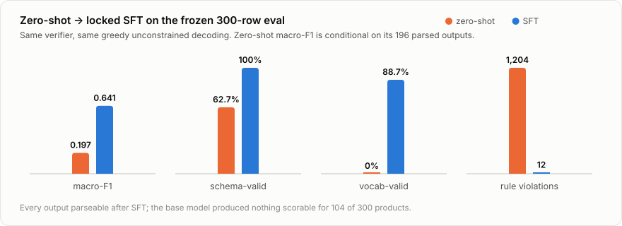
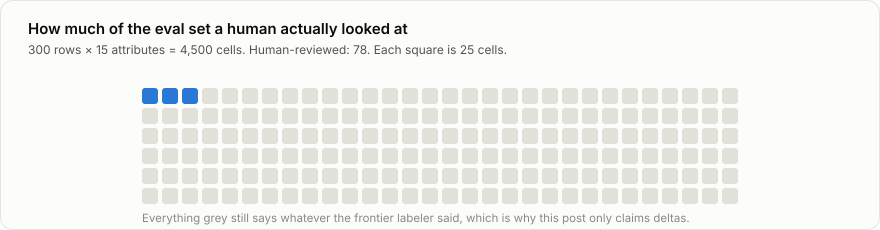
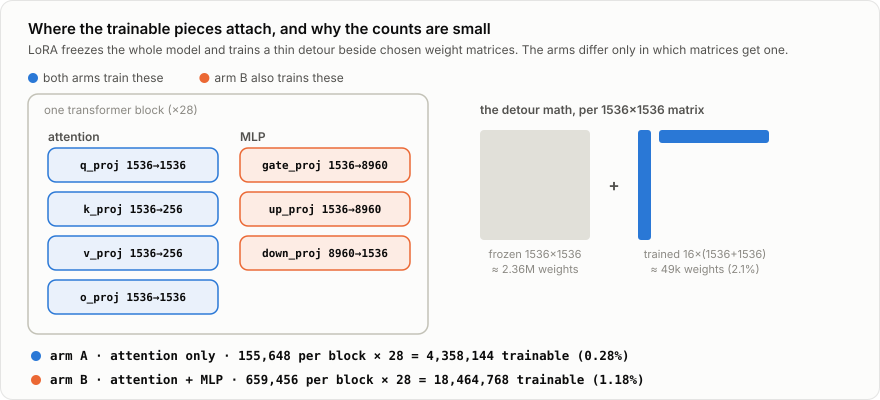
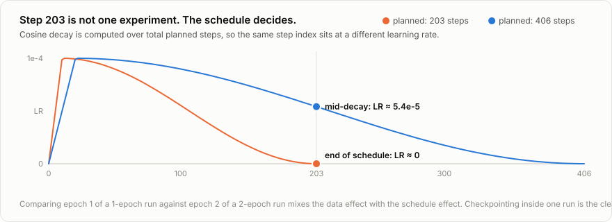
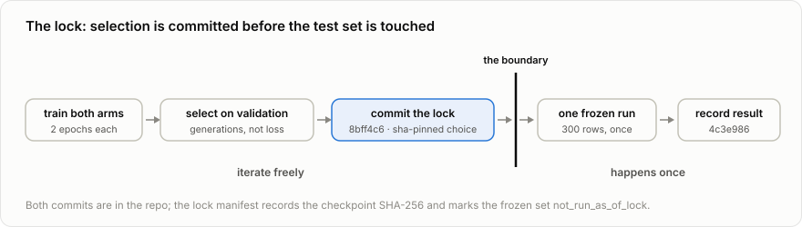

# An SFT baseline an RL result can stand on

*Fine-tuning Qwen2.5-1.5B to tag apparel catalogs: the full pipeline. Data,
weak labels, a leakage-proof split, two LoRA arms, checkpoint selection, a
pre-registered lock, and a one-shot frozen evaluation. Part 1 of a series on
building an RL product tagger where one verifier serves as both the reward
function and the production QA gate.*

<!--
  STATUS: draft v3, not published.
  Canonical home: personal site. Cross-post: HF blog with rel=canonical.
  All artifact links are repo-relative; they resolve once the repo is public.
  Figures: 5 SVGs in assets/, regenerate with: python blog/assets/make_figures.py
  Style rule: no em dashes anywhere, including figures.
-->

## What this is

I'm building a product tagger with reinforcement learning, and this post is
about everything that has to exist *before* the RL: the task contract, the
data, the supervised baseline, and the evaluation discipline that will make a
GRPO result mean something later. It's a complete walkthrough, every step in
the order it ran, with the configs, commands, and numbers, so you can follow
it, argue with it, or reproduce it.

The headline, up front:

| measure (frozen 300-row eval) | zero-shot Qwen2.5-1.5B | after LoRA-SFT |
|---|---:|---:|
| macro-F1 | 0.197 | **0.641** |
| schema-valid outputs | 62.7% | **100%** |
| fully vocabulary-valid outputs | 0.0% | **88.7%** |
| verifier rule violations | 1,204 | **12** |
| unscorable outputs | 104 / 300 | **0** |



Total training compute: about 4.4 cents on a rented RTX 3090. (Yes, an older
card. I already had it rented on vast.ai for another project, and this
workload is light enough that it never mattered: a 1.5B model with LoRA uses
a fifth of its 24 GB. A newer GPU would cost more per hour to shave minutes
off nine-minute runs.)

The numbers are not the interesting part, though. The interesting part is how
easy they would have been to get wrong. Several times, the obvious next step
would have quietly broken the experiment. Each section below flags one of
those moments: the tempting shortcut, why it lies, and what I did instead.

## Step 0: Define "correct" in code before touching a model

The task: given the text of an apparel listing, emit one JSON object with 15
controlled fields. Here is a real training example, exactly as the trainer
sees it. The input:

```text
Title: Organic Cotton Pull On Pant
Brand: NAADAM
Category: Woven Pants
Description: The Organic Cotton Pull On Pant is a warm-weather essential in
100% organic cotton — relaxed, full-length, and endlessly versatile. Throw
them on for errands, wear them to work, or pull them over your swimsuit; the
easy elastic waist makes every occasion feel effortless. Inseam: 30.5"
Tags: 100% cotton, Bottom, Bottoms, Cotton, cottoncollection, elastic,
full length, New Arrival, pant, pull on pants, summer, ...
```

And its target, the complete assistant turn, all 15 fields:

```json
{"closure": "pullover", "collar_type": null, "colour_primary": "unknown",
 "details": ["unknown"], "fit": "loose", "garment_category": "pants",
 "garment_length": "unknown", "material": "cotton", "neckline": null,
 "occasion": "casual", "pattern": "unknown", "silhouette": "unknown",
 "sleeve_length": null, "sleeve_style": null, "waistline": "unknown"}
```

Look at the three kinds of answer in that record, because the whole project
hangs on the distinction:

- `"cotton"`: a **value** from a closed vocabulary. Free text is not allowed.
  There are 156 permitted values across the 15 fields, period.
- `null`: the field **cannot apply**. Pants have no neckline or sleeve.
- `"unknown"`: the field could apply, but the listing **doesn't say**. This
  description never states a colour, so guessing one would be fabrication.

Collapsing `null` and `"unknown"` into one "empty" state would let a model
earn credit for calling a missing fact inapplicable. They are kept separate
everywhere: schema, labels, metrics. Abstention becomes a first-class
*action* in the RL phase, and an action needs a truthful state to act on.

Whether an output is correct is decided by a **verifier**, a plain Python
module that checks three things in order:

1. **Schema**: is it parseable JSON with the right keys and shapes?
2. **Vocabulary**: is every value drawn from the closed lists?
3. **Rules**: do the 34 cross-field constraints hold? (Examples: a sleeveless
   garment can't carry a `sleeve_style`; a `dress` needs a `garment_length`;
   a `solid` pattern can't coexist with `multicolour`.)

The same module is imported by the test suite, the evaluation harness, and,
in the next post, the GRPO reward function and the production QA gate. One
implementation, every consumer. That's the architecture bet of the whole
series: when the reward and the shipping gate are literally the same code,
"what we trained for" and "what we deploy behind" cannot drift apart.

## Step 1: Data and weak labels (and why you shouldn't trust them)

**Product text.** 3,600 apparel listings fetched from public Shopify
`/products.json` endpoints across dozens of stores: 49 brands, 297 raw
merchant category strings. The fetcher round-robins stores with per-pass
quotas (so no single store dominates), filters to apparel, and prunes
merchant tags that appear on essentially every product of a store, since a
ubiquitous tag carries zero signal. For the 14.9% of listings with an empty
description, the title, category, and tags carry the entire signal.

**Labels.** I was obviously not going to hand-label 54,000 cells (3,600
products × 15 fields). So the labels are **weak**: a frontier model
(`gpt-5.6-luna`, batch API) labeled every product five times under five
prompt variations, and the five runs were reconciled into consensus labels.
Cost: about $20. A slice of the conflicted cells was later cross-checked by
a second model family and by me on a phone-sized review tool. The honest
total:

> **Of the 4,500 cells in the frozen eval set (300 rows × 15 attributes),
> exactly 78 were reviewed by a human.** Everything else still says whatever
> the frontier model said.



So what can a score against these labels actually mean? Not real-world
accuracy. If my model scores high against labels another model wrote, that
mostly proves the two models agree. What a score *can* mean is progress:
when two checkpoints are graded on the same rows, by the same verifier,
under the same decoding settings, the difference between them is real even
though the absolute level is shaky. That is the rule for this entire post:
**every claim is a comparison, never an absolute.**

One more guard makes those comparisons trustworthy over time. The 300 eval
rows were frozen early: the file's SHA-256 checksum is committed to git and
tagged `eval-v1`, and the harness re-checks it before printing a single
number. If the answer key ever changes by one byte, every later evaluation
fails loudly instead of silently becoming incomparable with everything
measured before.

## Step 2: A train/validation split that variants can't leak through

The 3,600 weak rows needed a train/validation split for choosing training
duration. A uniform random split would have been quietly wrong, because
retail feeds are full of near-duplicates:

```text
Everyday Tote | Red (XL)
Everyday Tote | Black (M)
Everyday Tote | Navy (L)     ... 57 variants in one store
```

Same description, same category, same tags. Train on the red one, validate
on the black one, and validation measures *recognition of a sibling
product*, not generalization.

So the split operates on **product families**. The family key is the
normalized brand plus the title with variant text stripped: lowercase,
remove punctuation, cut everything after spaced separators (`" | "`,
`" / "`, `" - "`), drop trailing parenthetical sizes. Titles are compared
only within the same brand, so two brands can both sell a "Classic Tee"
without becoming one family.

Grouping this way collapses the 3,600 rows into 2,255 families, and the
shape of those families shows how much a random split would have leaked.
Most products are unique: 1,764 families contain a single row. But the other
491 families are variant clusters, and together they hold 1,836 rows. Half
the dataset is near-duplicates of the other half.

Each family then goes entirely into train or entirely into validation. The
first attempt at this split was thrown away before any training happened: it
looked fine overall but starved two categories, putting only 3.4% of bag
rows and 7.1% of shoe rows into validation against a 10% target. The final
split moves whole families while balancing every garment category to roughly
10% validation. Result: **3,240 training rows, 360 validation rows**.

The split is frozen in
[`data/splits/sft-v1.json`](../data/splits/sft-v1.json): the seed, the
grouping rule, every SKU's assignment, and a checksum of the source data.
The loader re-checks that checksum and refuses to run if the data changed.
Both LoRA arms trained from this exact file.

## Step 3: The training setup

**Prompt format.** Each example is a chat: a compact system message, the
listing text as the user turn, the JSON record as the assistant turn. TRL's
`SFTTrainer` detects this shape, applies Qwen's own chat template, and masks
the loss to completion tokens only, so the model learns to *write* the JSON,
not to predict the listing.

The system message, verbatim:

```text
You label clothing products from their listing text.

Answer with a single JSON object, one key per field:
closure, collar_type, colour_primary, details, fit, garment_category,
garment_length, material, neckline, occasion, pattern, silhouette,
sleeve_length, sleeve_style, waistline.

Rules:
- "details" is a list; every other field is a single value.
- Use "unknown" when the text does not say. Never guess.
- Use null when the field cannot apply to this kind of product.
- Output only the JSON object, nothing else.
```

Note what it does *not* contain: the 156 allowed values. The frontier
labeler got the full vocabulary spelled out (a ~1,900-token system prompt);
the 1.5B student gets ~150 tokens naming the keys and the three-state rule.
Learning the closed vocabulary **is the task**. Spelling it out in every
prompt would let the model read the answer's shape instead of learning it,
and would triple the cost of every step.

**Sequence budget.** How long can an example get? Measured with the actual
Qwen2.5 tokenizer over the whole corpus: the longest prompt is 585 tokens,
the longest target is 118, and the longest full example (prompt plus target)
is 833. The training ceiling is set to **896**, comfortably above the
longest example, so no training row is ever cut off mid-JSON. The lesson
that generalizes: measure with the real tokenizer. My earlier
guess-from-character-counts was off by up to 2×.

**LoRA in one paragraph.** Full fine-tuning would update all 1.5 billion
weights. LoRA freezes every one of them and bolts a small trainable detour
onto selected weight matrices. Take a matrix that maps 1,536 numbers in to
1,536 numbers out: the frozen original holds 1536 × 1536 ≈ 2.36M weights.
The detour is two thin strips: 1536 × 16 going down, 16 × 1536 coming back
up, about 49k trainable weights, roughly 2% of the original. The layer's
output is the frozen result plus the detour's result, so training can steer
the layer without touching it.

**The two arms.** Every one of Qwen's 28 transformer blocks has two halves.
Attention (four matrices: Q, K, V, output) moves information between words:
it decides *where to look*. The MLP (three matrices: gate, up, down)
transforms what was gathered: it stores *what things are*. The experiment
trains two variants that differ only in where the detours attach:

- **Arm A** puts detours on the four attention matrices.
- **Arm B** puts detours on all seven.

Same rank (16), same data, same split, same seed, same everything else, so
if arm B wins, the credit belongs to adapting the MLPs.



**Where the parameter counts come from.** A detour on a matrix with `d_in`
inputs and `d_out` outputs trains `16 × (d_in + d_out)` weights. Per block:

```text
arm A   q_proj 16×(1536+1536) = 49,152      arm B adds
        k_proj 16×(1536+256)  = 28,672      gate_proj 16×(1536+8960) = 167,936
        v_proj 16×(1536+256)  = 28,672      up_proj   16×(1536+8960) = 167,936
        o_proj 16×(1536+1536) = 49,152      down_proj 16×(8960+1536) = 167,936
        ─ per block             155,648     ─ per block   155,648 + 503,808
        × 28 blocks           4,358,144     × 28 blocks          18,464,768
```

The MLP matrices are wide (1536 in, 8960 out), so each MLP detour is ~168k,
and three of them quadruple the total. Arm A trains 0.28% of the model; arm
B trains 1.18%. Training printed both counts at startup and they matched
this hand math exactly, which is worth checking: a typo in `target_modules`
fails silently otherwise.

The core of the training script (Unsloth for the model path, TRL for the
trainer, [full file](../training/train_sft.py)):

```python
model, tokenizer = FastLanguageModel.from_pretrained(
    model_name="unsloth/Qwen2.5-1.5B-Instruct",
    max_seq_length=896,          # measured ceiling, see above
    load_in_4bit=False,          # bf16 base; 1.5B fits a 24 GB 3090 easily
)
model = FastLanguageModel.get_peft_model(
    model, r=16, lora_alpha=16, lora_dropout=0, bias="none",
    target_modules=target_modules(arm),      # the ONLY thing arms change
    use_gradient_checkpointing="unsloth",
    random_state=42,
)
config = SFTConfig(
    max_length=896, completion_only_loss=True, packing=False,
    per_device_train_batch_size=4, gradient_accumulation_steps=4,  # eff. 16
    learning_rate=1e-4, warmup_ratio=0.05, lr_scheduler_type="cosine",
    optim="adamw_torch_fused", num_train_epochs=2,
    eval_strategy="epoch", save_strategy="epoch",
    save_total_limit=2, save_only_model=True,   # disk: 5.3 GB free, total
    bf16=True, seed=42, data_seed=42,
)
```

**Environment**, pinned because "it worked on my box" isn't reproducible:
one RTX 3090 (24 GB, rented at $0.144/hr), CUDA 13.0, PyTorch 2.11.0,
Transformers 4.57.6, TRL 0.24.0, PEFT 0.19.1, Unsloth 2026.7.5.

**A smoke test before every real run.** Each arm first ran five optimizer
steps on 64 rows. That answers four cheap questions: did the adapters attach
to the right matrices (the printed trainable count matches the hand math),
do gradients flow and stay finite, does the validation pass run, does the
adapter save to disk. Five steps prove nothing about quality, and aren't
meant to. The point is that when the real run starts, the only thing left to
fail is the science.

## Step 4: Train, and decide how long to train

The plan for each arm: train one epoch, inspect, and continue to a second
epoch only if the evidence says so. A simple plan with two traps inside it.

### Epoch 1: the model learns the shell before the list

The attention arm trained one full epoch: 203 optimizer steps, four and a
half minutes, peak 4.75 GiB of GPU memory. Training loss fell from 0.52 to
about 0.06, and validation loss landed at 0.06 too.

Sounds nearly done. But loss can't be trusted as the judge here. Every
target starts with the same braces, quotes, and field names, so a model
earns a low token loss just by mastering the boilerplate. The loss will look
excellent whether or not the actual tags are right.

So the decision measure was different: take the saved adapter, have it
**generate** answers for all 360 validation products, and run the verifier
over what it wrote. Epoch 1's report card:

- macro-F1 **0.650**
- fully vocabulary-valid records: **67.9%**
- rule violations: **25**

Schema was already near-perfect (358 of 360 parsed). The model had mastered
the JSON shell but was still inventing values: `"woven"` for material,
`"patchwork"` for pattern. Reasonable English, not in the contract. Clear
verdict: the vocabulary still has room, keep training.

### The trap inside "just keep training"

The obvious move is to load the epoch-1 adapter and train one more epoch.
Two things break, one ordinary and one sneaky.

The ordinary one: the checkpoint was saved without optimizer state
(`save_only_model=True`, a disk decision; the box had 5.3 GB free in
total). "Resuming" from it would really be a fresh optimization that starts
warm.

The sneaky one is the learning-rate schedule. Cosine decay plans its descent
over the *total steps it expects to run*. A 1-epoch run plans 203 steps, so
by step 203 the learning rate has decayed to zero. A 2-epoch run plans 406,
so at step 203 it is only halfway down, still at about half its peak:



Same step number, different training state. Comparing "my 1-epoch run"
against "that run plus a bolted-on second epoch" would mix two effects that
can't be separated afterward: seeing the data twice, and following a
different learning-rate curve from the start.

The clean fix costs almost nothing: start over. One fresh 2-epoch run, same
base model, seed, and split, saving a checkpoint at step 203 on the way
through. Now step 203 and step 406 live inside the same run, the same
optimizer, the same schedule. The only difference between them is the second
pass over the data, which is exactly the question. Price of doing it right:
nine minutes, about two cents.

### Epoch 1 vs epoch 2, measured fairly

Both checkpoints of the fresh run generated answers for the same 360
validation products, identical settings (greedy decoding, 170-token cap):

| attention arm | step 203 | step 406 | change |
|---|---:|---:|---:|
| schema-valid records | 99.7% | 99.7% | flat |
| fully vocabulary-valid | 78.0% | **90.0%** | +43 records |
| rule violations | 19 | 15 | −4 |
| macro-F1 | 0.708 | **0.751** | +0.043 |

The second pass earned its keep exactly where epoch 1 was weak: 43 more
records fully inside the closed vocabulary. Per attribute, 12 of 15 scores
improved (`closure` most, 0.285 → 0.549), `waistline` was flat, and two
fields slipped by under 0.01. Averages don't get to hide that. Epoch 2
selected.

The combined arm then ran the identical protocol: smoke test, fresh 2-epoch
run, generation test at both checkpoints
(W&B: [`s0ar902g`](https://wandb.ai/rushabhsp95-vastraa/tagging-rl/runs/s0ar902g)
combined, [`iwsrgsn2`](https://wandb.ai/rushabhsp95-vastraa/tagging-rl/runs/iwsrgsn2)
attention). It also earned its second epoch: macro-F1 0.814 → 0.854,
vocabulary validity 92.5% → 94.4%, rule violations 15 → 10.

### Why every evaluation is greedy and unconstrained

Two decoding decisions hold for every number in this post. **Greedy**,
because checkpoint comparisons shouldn't carry sampling noise. And
**unconstrained**: no grammar, no JSON mode, the model writes free text and
the verifier judges it. Constrained decoding would make schema validity free
and unmeasurable, and format behavior is one of the things under study, here
and especially in the RL phase. A production deployment might well turn
constrained decoding on and buy 100% schema validity by construction. That's
a deployment choice; this is a measurement choice.

## Step 5: Pick the arm

Each arm now has one best checkpoint, chosen on validation generations. Side
by side:

| measure (360 validation SKUs) | attention-only | attention + MLP |
|---|---:|---:|
| macro-F1 | 0.751 | **0.854** |
| selective macro-F1 | 0.777 | **0.868** |
| vocabulary validity | 90.0% | **94.4%** |
| rule violations | 15 | **10** |
| trainable parameters | 4.36M | 18.46M |
| training wall time | 530 s | 572 s |
| peak reserved VRAM | 4.79 GiB | 5.00 GiB |

The combined arm won everywhere: higher macro-F1 on **all 15 attributes**,
more records inside the vocabulary, fewer rule violations. And the cost of
those 4.2× more trainable parameters was 42 seconds of wall time and 0.2 GiB
of memory. At this scale the ablation was nearly free to run and one-sided
in its answer.

*Where* arm B won is the interesting part. Its biggest gains were
silhouette, sleeve style, waistline, occasion, and garment length. What
those fields share: their values are facts the model has to know (which
words map to which allowed label), not context it can look up elsewhere in
the listing. That fits the textbook division of labor from Step 3: attention
decides where to look, MLPs store what things are, and a 156-value closed
vocabulary is exactly "what things are" knowledge. One task and one seed, so
treat this as a datapoint, not a law. But if your fine-tune has to memorize
a contract, giving LoRA the MLPs looks like money well spent.

So the SFT baseline is `runs/sft-combined-2epoch/checkpoint-406`.

## Step 6: Lock the choice, then evaluate exactly once

One thing remained: run the winner on the frozen 300. This is where quiet
self-deception normally happens. Evaluate a couple of candidates "just to
check", report the best, and the frozen set has silently become a validation
set.

So the selection was **pre-registered**. Before any frozen inference,
[`runs/sft-selection.json`](../runs/sft-selection.json) was committed with
status `locked_before_frozen_eval`, recording:

- the selected checkpoint path (`runs/sft-combined-2epoch/checkpoint-406`)
  and its adapter file's SHA-256 (`00ae54af…a051af`);
- the full LoRA config and both arms' validation evidence;
- the split manifest's hash, and the frozen set's own hash with the frozen
  set explicitly marked `not_run_as_of_lock`.

The git commit (`8bff4c6`) proves the choice predates the result.



The evaluation then ran once. Before generating: re-verify every identity in
the lock (adapter hash, split hash, frozen file hash, row count, all
`MATCH`; destination file confirmed absent). After generating: the
prediction file passed four integrity checks (exactly 300 records, 300
unique SKUs, exact set-equality with the gold SKUs, a raw string on every
record) and its own SHA-256 (`cae3dbd1…6ba4b`) went into the manifest. Those
checks close off the boring ways an eval flatters a model: partial runs,
duplicated easy rows, silently pre-parsed output.

## Step 7: The one-shot result, read honestly

| measure (frozen 300) | zero-shot | locked SFT | change |
|---|---:|---:|---:|
| macro-F1 | 0.197 | 0.641 | +0.444 |
| selective macro-F1 | 0.205 | 0.717 | +0.512 |
| schema validity | 62.7% | **100%** | +37.3 pts |
| fully vocabulary-valid | 0.0% | 88.7% | +88.7 pts |
| rule violations | 1,204 | 12 | −1,192 |
| unscorable outputs | 104 | 0 | −104 |

Three reading notes, because this table is easy to over-read.

**The zero-shot F1 is conditional.** The base model produced nothing
scorable for 104 of 300 products; its 0.197 is computed over the 196
survivors. The harness does not zero-fill failures, since that would turn
one format error into fifteen wrong answers. So the two F1 numbers alone
*understate* the gap: the validity columns are part of the result, not
garnish.

**The gain is not a handful of lucky rows.** A paired row bootstrap (5,000
replicates, same resampled rows for both models, seed `20260801`) puts SFT
at 0.641 [95% CI 0.626–0.671] and the paired improvement at +0.444
[+0.425–+0.496].

**The 100% schema validity is real generated behavior.** Longest completion:
117 tokens against a 170 cap; p95 was 114; zero outputs truncated. Nothing
was rescued by constrained decoding or post-processing.

The frozen score (0.641) sits well below the validation score (0.854). I'm
deliberately not attributing that gap to a single cause: eval-set label
composition, class support, and ordinary validation optimism all plausibly
contribute. Revealing performance your selection process never got to
optimize against is what a frozen set is *for*.

Per-attribute, every field improved over zero-shot. The strong ones: `fit`
0.950, `garment_category` 0.835, `material` 0.833. The weak tail: `closure`
0.405, `silhouette` 0.410, `waistline` 0.444, `details` 0.463. That tail is
the target list for error analysis and, later, reward shaping.

## Step 8: What SFT did not fix

My favorite failure. An Everlane maxi dress whose listing literally says
"surplice neckline". The model's answer:

```json
{"closure": "unknown", "collar_type": "none", "colour_primary": "black",
 "details": ["gather"], "fit": "unknown", "garment_category": "dress",
 "garment_length": "maxi", "material": "silk", "neckline": "supraprise",
 "occasion": "casual", "pattern": "floral", ...}
```

Structurally perfect. Category, length, material, colour, pattern all
correct. And `"supraprise"` is not a word: a phonetic near-miss of
*surplice* that no enum consumer will ever accept, sitting inside flawless
JSON. That is the residual failure class in one line: **semantically
plausible, contract-invalid.**

The inventory across the frozen 300: 34 records invented at least one
out-of-vocabulary value (`silhouette` 7, `neckline` 5, `colour_primary` 5;
things like `strap` as a closure, `cutout` as a neckline, `normal` as a
garment length); 12 cross-field rule violations across 11 records; and one
SKU that emits a vocabulary-word-salad preamble before its JSON at every
checkpoint of both arms.

SFT taught the shell and most of the vocabulary. It did not fully
internalize that every value comes from a closed list, and it has no
mechanism for relationships *between* fields. The verifier already catches
every one of these mechanically, which is exactly the shape of error a
verifier-based reward attacks. That's post 2.

## Reproduce this

Everything below assumes the repo cloned on a CUDA box with the pinned
environment (`uv sync`; exact versions above and in the
[brief](../W2_BLOG_BRIEF.md)).

```bash
# 0) sanity: the pack, verifier, and harness are testable offline
uv run python -m pytest tests/ -q

# 1) smoke-test an arm (5 steps, 64 rows: plumbing, not science)
PYTHONPATH=. python -m training.train_sft --arm combined --smoke

# 2) train both arms, 2 continuous epochs each (~9 min each on a 3090)
PYTHONPATH=. python -m training.train_sft --arm attention --epochs 2 \
  --output-dir runs/sft-attention-2epoch --report-to wandb
PYTHONPATH=. python -m training.train_sft --arm combined --epochs 2 \
  --output-dir runs/sft-combined-2epoch --report-to wandb

# 3) score any checkpoint's generations against the validation split
PYTHONPATH=. python -m evalharness.report \
  --gold data/train_weak.jsonl \
  --split-manifest data/splits/sft-v1.json --split-name validation \
  --pred runs/sft-combined-2epoch/validation-predictions.jsonl

# 4) frozen eval, only after committing your own selection lock
PYTHONPATH=. python -m training.predict \
  --model unsloth/Qwen2.5-1.5B-Instruct \
  --adapter runs/sft-combined-2epoch/checkpoint-406 \
  --input data/eval_300/eval.jsonl \
  --output runs/sft-combined-2epoch/frozen-eval-300-predictions.jsonl \
  --batch-size 8 --max-input-length 640 --max-new-tokens 170
PYTHONPATH=. python -m evalharness.report \
  --gold data/eval_300 \
  --pred runs/sft-combined-2epoch/frozen-eval-300-predictions.jsonl
```

Every table in this post recomputes from committed artifacts: raw
predictions and per-checkpoint metrics under [`runs/`](../runs/), the
[lock manifest](../runs/sft-selection.json), the
[split manifest](../data/splits/sft-v1.json), exported W&B histories, and
the [verifier](../verifier/) itself. The duration-ablation prediction files
were retrieved from the GPU host and verified against SHA-256 hashes
recorded *before* the transfer; the [brief](../W2_BLOG_BRIEF.md) documents
that chain of custody, plus every number this post didn't have room for.

## The bill

| item | cost |
|---|---:|
| weak labels (frontier batch API, 5 passes) | ~$20 |
| attention arm, 2 epochs | $0.021 |
| combined arm, 2 epochs | $0.023 |
| superseded standalone 1-epoch run | $0.011 |
| **all training compute in this post** | **< $0.06** |

The GPU is ~1/450th of the label bill. When a controlled rerun costs two
cents, "we couldn't afford the ablation" stops being a real excuse. The
binding constraints are label quality and experimental discipline, which is
the actual thesis of this post.

## Limitations

- **Weak gold labels.** 78 of 4,500 frozen cells human-reviewed. Every claim
  here is a delta under a fixed evaluator, not a production-accuracy claim.
- **Conditional zero-shot F1**, computed over its 196 parsed survivors.
- **One model size, one domain, one seed.** No claim that combined LoRA
  always beats attention-only; the bootstrap quantifies eval-row
  uncertainty, not training-run variance.
- **No constrained decoding**, deliberate for measurement; production would
  likely differ.
- **Duration-ablation metrics are regenerated** from preserved raw
  predictions (hash-verified), not training-time saves.

---

*Next in the series: the verifier stops being a report card and becomes the
reward. GRPO from this checkpoint, unconstrained decoding, and the
documented ways a 1.5B model finds to cheat a mechanical judge.*
